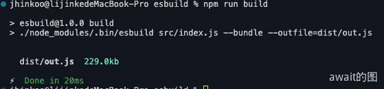
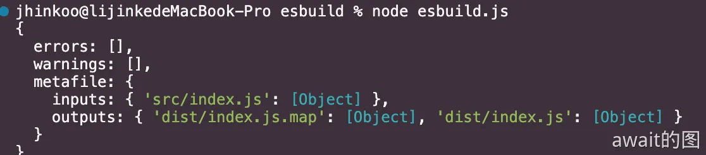
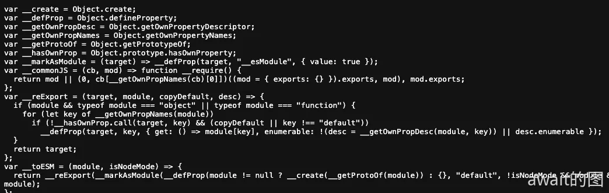
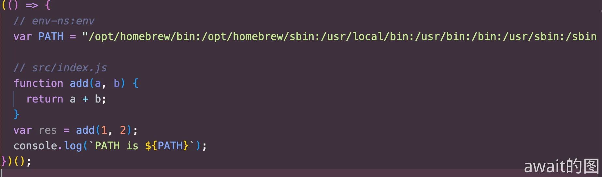

# Esbuild功能与插件开发
Esbuild作为Vite的双引擎之一，Esbuild能够在很多关键的阶段 **依赖预编译**，**TS语法构建**，**代码压缩** 让Vite获得了相当优异的性能。

## Esbuild为何性能高
Esbuild是基于Golang开发的一款工具，相比于传统的打包工具，主打的一手性能优势，它能达到这样的超高性能主要原因可以分为以下：
- **使用Golong开发**, 构建的逻辑代码直接被编译为原生的机器码，而不用像JS一样先把代码解析为字节码，然后转换为机器码，节省程序的运行时间。
- **多核并行**, 内部打包算法充分利用多核CPU优势，所有的步骤尽可能并行，这是得益于Go当中多线程共享内存的优势
- **从零造轮子**, 几乎没有使用第三方库，所有的大量逻辑自己编写，大到AST解析，小到字符串的操作，保证极致的代码性能。
- **高效的内存利用**, Esbuild中从头到尾尽可能去复用一份AST节点数据，而不用像JS打包工具中频繁地解析和传递AST数据，从而造成大量的浪费

## Esbuild的功能使用
Esbuild 对外暴露了一系列的API，主要包括**Build API**和**Transform API**
```text
 "esbuild": "^0.14.18"
npm install esbuild
```
### 打包
新`npm init`一个项目，安装一次`esbuild`
```text
npm i esbuild@0.14.18
```
新建一个`src/index.js`文件，并创建一些简单的代码：
```ts
// index.js
import {add} from 'lodash'

let result = add(10,10)

console.log(result)
```
设置`script`脚本，并进行打包命令的输入：
```json
 "scripts": {
    "build": "./node_modules/.bin/esbuild src/index.js --bundle --outfile=dist/out.js"
 },
```
这是一种命令行打包的方式，终端驶入`npm run build`即可进行打包

当然打包方式也有**代码方式**这一方式：**Build API** 和 **Transfrom API**

### Build API

**Build API**主要用于进行项目打包，包括`build`，`buildSync`，`serve`三类方法。

```js
const { build, buildSync, serve } = require("esbuild");

async function runBuild() {
  // 异步方法，返回一个 Promise
  const result = await build({
    // ----  如下是一些常见的配置  --- 
    // 当前项目根目录
    absWorkingDir: process.cwd(),
    // 入口文件列表，为一个数组
    entryPoints: ["./src/index.jsx"],
    // 打包产物目录
    outdir: "dist",
    // 是否需要打包，一般设为 true
    bundle: true,
    // 模块格式，包括`esm`、`commonjs`和`iife`
    format: "esm",
    // 需要排除打包的依赖列表
    external: [],
    // 是否开启自动拆包
    splitting: true,
    // 是否生成 SourceMap 文件
    sourcemap: true,
    // 是否生成打包的元信息文件
    metafile: true,
    // 是否进行代码压缩
    minify: false,
    // 是否开启 watch 模式，在 watch 模式下代码变动则会触发重新打包
    watch: false,
    // 是否将产物写入磁盘
    write: true,
    // Esbuild 内置了一系列的 loader，包括 base64、binary、css、dataurl、file、js(x)、ts(x)、text、json
    // 针对一些特殊的文件，调用不同的 loader 进行加载
    loader: {
      '.png': 'base64',
    }
  });
  console.log(result);
}

runBuild();
```
进行Esbuild打包之后，可以看到如下的结果

这个就是Esbuild打包的元信息，这对编写插件扩展Esbuild能力非常有用。

然后在dist目录中，发现打包产物和对应的SourceMap文件写入磁盘:


`buildSync`也是同理，只不过这是一个同步的API，它会导致两方面不良后果，一个方面会使Esbuild在构建时让当前线程阻塞，丧失**并发任务处理**的优势，另一个方面，Esbuild所有插件都不能使用任何异步操作，给**插件开发**增加了限制

除此之外，Esbuild提供了一个比较强大的API —— serve，这个API的特点如下：
- 开启serve模式后，将在指定端口上和目录上搭建一个**静态文件服务**，这个服务器用原生Go语言实现，性能比Nodejs更高。
- 类似webpack-dev-server，所有的产物文件都默认不会写到磁盘，而是放在内存中，通过请求服务来访问
- **每次请求**到来时，都会重新构建，永远返回新的产物

:::tip
值得注意的是，触发rebuild的条件并不是代码改动，而是新的请求到来
:::

```js
const { build, buildSync, serve } = require("esbuild");

function runBuild() {
  serve(
    {
      port: 8000,
      // 静态资源目录
      servedir: './dist'
    },
    {
      absWorkingDir: process.cwd(),
      entryPoints: ["./src/index.jsx"],
      bundle: true,
      format: "esm",
      splitting: true,
      sourcemap: true,
      ignoreAnnotations: true,
      metafile: true,
    }
  ).then((server) => {
    console.log("HTTP Server starts at port", server.port);
  });
}

runBuild();
```
后续每次在浏览器请求都会触发Esbuild重新构建，而每次构建都是一个增量构建的过程，耗时也会比首次构建少很多

此时打开**localhost:8000**这个站点，这就是Esbuild返回的打包产物


:::tip
Serve API只适合用于开发阶段，而不是生产阶段
:::

### Transform API
Esbuild还专门提供了单文件编译的能力，Vite底层实现也是采用`transform`这个异步的API来进行TS以及JSX这样的单文件转译的

## Esbuild插件开发
通过Esbuild插件可以扩展Esbuild原有的路径解析，模块加载等方面的能力，并且在Esbuild的构建过程中执行一系列自定义的逻辑。

`Esbuild`插件结构被设计成一个对象，里面有`name`和`setup`属性，`name`是插件的名称，`setup`是一个函数，其中入参是一个`build`对象，这个对象上挂载了一些钩子可以供自定义一些钩子函数的逻辑，这是一个`Esbuild`插件示例：

```js
let envPlugin = {
  name: 'env',
  setup(build) {
    build.onResolve({ filter: /^env$/ }, args => ({
      path: args.path,
      namespace: 'env-ns',
    }))

    build.onLoad({ filter: /.*/, namespace: 'env-ns' }, () => ({
      contents: JSON.stringify(process.env),
      loader: 'json',
    }))
  },
}

require('esbuild').build({
  entryPoints: ['src/index.jsx'],
  bundle: true,
  outfile: 'out.js',
  // 应用插件
  plugins: [envPlugin],
}).catch(() => process.exit(1))
```
使用插件之后的效果如下：
```js
// 应用 env 插件，构建时将会被替换成process.env对象
import { PATH } from 'env'

console.log(`PATH is ${PATH}`)
```


### 钩子函数的使用

**`onResolve`** 钩子和 **`onLoad`** 钩子

在Esbuild插件中，`onResolve`和`onLoad`是两个非常重要的钩子，分别控制路径解析和模块内容加载的过程

```js
// build 对象在上文的 setup 钩子已经引入，这里不再重复引入

build.onResolve({ filter: /^env$/ }, args => ({
  path: args.path,
  namespace: 'env-ns',
}));
build.onLoad({ filter: /.*/, namespace: 'env-ns' }, () => ({
  contents: JSON.stringify(process.env),
  loader: 'json',
}));
```
两个钩子函数都需要传入两个参数：`Options`和`Callback`

`Options`是一个对象，包含了`filter`和`namespace`两个属性，类型的定义如下：

```ts
interface Options {
  filter: RegExp;
  namespace?: string;
}
```
`filter`为必传参数，是一个正则表达式，所以决定要过滤出的特征文件，当然**这个正则表达式应该使用原生Go的正则实现**

`namespace` 为选填参数，一般在 `onResolve` 钩子中的回调参数返回 `namespace` 属性作为标识，在 `onLoad` 钩子中通过 `namespace` 将模块过滤出来。如上述插件示例就在 `onLoad` 钩子通过 `env-ns` 这个 `namespace` 标识过滤出了要处理的 `env` 模块

除了 Options 参数，还有一个回调函数`Callback`，它的类型会根据不同的钩子会有所不同。相比于 Options， Callback 函数入参和返回值的结构复杂得多，涉及了较多的属性

比如：在onResolve钩子中函数参数和返回值梳理如下：

```js
build.onResolve({ filter: /^env$/ }, (args: onResolveArgs): onResolveResult => {
  // 模块路径
  console.log(args.path)
  // 父模块路径
  console.log(args.importer)
  // namespace 标识
  console.log(args.namespace)
  // 基准路径
  console.log(args.resolveDir)
  // 导入方式，如 import、require
  console.log(args.kind)
  // 额外绑定的插件数据
  console.log(args.pluginData)
  
  return {
      // 错误信息
      errors: [],
      // 是否需要 external
      external: false;
      // namespace 标识
      namespace: 'env-ns';
      // 模块路径
      path: args.path,
      // 额外绑定的插件数据
      pluginData: null,
      // 插件名称
      pluginName: 'xxx',
      // 设置为 false，如果模块没有被用到，模块代码将会在产物中会删除。否则不会这么做
      sideEffects: false,
      // 添加一些路径后缀，如`?xxx`
      suffix: '?xxx',
      // 警告信息
      warnings: [],
      // 仅仅在 Esbuild 开启 watch 模式下生效
      // 告诉 Esbuild 需要额外监听哪些文件/目录的变化
      watchDirs: [],
      watchFiles: []
  }
}
```
其中`onLoad`钩子中的函数参数和返回值如下:
```js
build.onLoad({ filter: /.*/, namespace: 'env-ns' }, (args: OnLoadArgs): OnLoadResult => {
  // 模块路径
  console.log(args.path);
  // namespace 标识
  console.log(args.namespace);
  // 后缀信息
  console.log(args.suffix);
  // 额外的插件数据
  console.log(args.pluginData);
  
  return {
      // 模块具体内容
      contents: '省略内容',
      // 错误信息
      errors: [],
      // 指定 loader，如`js`、`ts`、`jsx`、`tsx`、`json`等等
      loader: 'json',
      // 额外的插件数据
      pluginData: null,
      // 插件名称
      pluginName: 'xxx',
      // 基准路径
      resolveDir: './dir',
      // 警告信息
      warnings: [],
      // 同上
      watchDirs: [],
      watchFiles: []
  }
});
```

当然还有一些其他的钩子，在 build 对象中，除了`onResolve`和`onLoad`，还有`onStart`和`onEnd`两个钩子用来在构建开启和结束时执行一些自定义的逻辑

```js
let examplePlugin = {
  name: 'example',
  setup(build) {
    build.onStart(() => {
      console.log('build started')
    });
    build.onEnd((buildResult) => {
      if (buildResult.errors.length) {
        return;
      }
      // 构建元信息
      // 获取元信息后做一些自定义的事情，比如生成 HTML
      console.log(buildResult.metafile)
    })
  },
}
```

:::tip
- onStart 的执行时机时在每次 build 的时候，包括触发`watch`或者`serve`模式下的重新构建
- onEnd 钩子中如果要拿到`metafile`，必须将Esbuild的构建配置中`metafile`属性设为`true`
:::