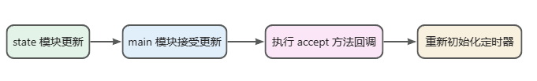

# HMR
HMR 即 **模块热替换** 或者 **模块热更新**

也就是将页面中发生变化的模块替换成新的模块

HMR 主要负责了两件事情 一个是**局部刷新**，另一个是**状态保存**

## import.meta.hot
Vite作为一个完整的构建工具，本身实现了一套HMR系统，这套系统基于原生的ESM规范来实现

可以观察HMR API的类型定义：
```typescript
interface ImportMeta {
  readonly hot?: {
    readonly data: any
    accept(): void
    accept(cb: (mod: any) => void): void
    accept(dep: string, cb: (mod: any) => void): void
    accept(deps: string[], cb: (mods: any[]) => void): void
    prune(cb: () => void): void
    dispose(cb: (data: any) => void): void
    decline(): void
    invalidate(): void
    on(event: string, cb: (...args: any[]) => void): void
  }
}
```
`import.meta`对象为现代浏览器原生的一个内置对象，Vite在这个对象上的`hot`属性中定义了一套完整的属性和方法，因此，在Vite中，可以通过`import.meta.hot`来访问关于HMR的这些属性和方法，比如`import.meta.hot.accpet()`

## 模块热更新 hot.accept
在`import.meta.hot`对象上有一个关键的方法`accept`，它决定了hmr的热更新边界。

它是用于**接收模块更新**的，一旦Vite接收了这个更新，当前模块就会被认为是HMR边界，Vite接收的更新如下:
- 自身模块的更新
- 某个子模块的更新
- 多个子模块的更新

### 接受自身更新
当模块接受自身更新时，则当前模块被认为是HMR边界。
```js
// 渲染函数 render.js
export const render = () => {
  const app = document.querySelector<HTMLDivElement>('#app')!
  app.innerHTML = `
    <h1>Hello Vite!</h1>
   <p target="_blank">This is hmr test.123 这是增加的文本</p>
  `
}
```
```js
// 加入hmr代码
// 条件守卫
 if (import.meta.hot) {
  import.meta.hot.accept((mod) => mod.render())
 }
```
`mport.meta.hot`对象只有在开发阶段才会被注入全局，生产环境下是访问不到的，而且加入条件判断之后，打包之后识别到if条件不成立，会自动将部分代码从打包产物中移除，来优化资源体积。

`accpet`接受一个回调函数作为参数，入参为Vite提供的更新后的模块内容，在回调中调用一次mod.render方法，那么在模块变动之后，每次重新渲染一遍内容。

事实上，也可以什么参数都不传，这样Vite只会把`render`模块的最新内容执行一遍，但`render`模块内部只声明了一个函数，因此直接调用`import.meta.hot.accept`并不会重新渲染页面。

### 接受依赖模块的更新
接着上文的例子，如果有一个`main`模块依赖`render`模块，hmr应该支持在`main`模块中对`render`模块的更新，此时hmr边界就是`main`模块了。
```js
// main.ts
import { render } from './render';
import './state';
render();
if (import.meta.hot) {
  import.meta.hot.accept('./render.ts', (newModule) => {
    newModule.render();
  })
}
```
这样的写法相当于告诉vite，监听了`render`模块的更新，当其内容发生更新时，把最新的内容传递，第二个参数中定义了模块变化后的回调函数，这里拿到了`render`模块最新的内容，执行渲染逻辑，让页面展示最新的内容。

### 接受多个子模块的更新
父模块可以接受多个子模块的更新，当其中任何一个子模块更新之后，父模块成为hmr的边界。
```js
// main.js
import { render } from './render';
import { initState } from './state';
render();
initState();
if (import.meta.hot) {
  import.meta.hot.accept(['./render.ts', './state.ts'], (modules) => {
    console.log(modules);
  })
}
```
此时改动两个模块的内容，可以发觉页面相应模块会更新，并且对其它的模块没有影响。

## 模块销毁 hot.dispose
模块更新，且旧模块需要销毁时需要进行一些事情。

比如在某个模块中存在一个`setInterval`这样的定时器，那么发生hmr更新时，应该及时的将旧的定时器给清理掉。

```js
let timer;
if (import.meta.hot) {
  import.meta.hot.dispose(() => {
    if (timer) {
      clearInterval(timer);
    }
  })
}

export function initState() {
  let count = 0;
  timer = setInterval(() => {
    let countEle = document.getElementById('count');
    countEle!.innerText =  ++count + '';
  }, 1000);
}
```
但是直接清除定时器，会发现状态又丢失了原因是因为，走了下面这一串逻辑



当热更新重新调用到`initState`方法时，此时新建的`initState`方法的确会初始化定时器，但同时也会初始化`count`变量，就是count从0开始计数了，此时页面所有状态都没刷新了。

## 状态存储 hot.data
hot.data属性可以用在不同的模块实例之间共享一些数据，使用上也比较简单，重构一下`state`模块
```js
let timer;
if (import.meta.hot) {
  // 初始化 count
  if (!import.meta.hot.data.count) {
    import.meta.hot.data.count = 0;
  }
  import.meta.hot.dispose(() => {
    if (timer) {
      clearInterval(timer);
    }
  })
}
export function initState() {
  const getAndIncCount = () => {
    const data = import.meta.hot?.data || {
      count: 0
    };
  	// 改变的是 hot.data上的共享数据
    data.count = data.count + 1;
    return data.count;
  };
  timer = setInterval(() => {
    let countEle = document.getElementById('count');
    countEle!.innerText =  getAndIncCount() + '';
  }, 1000);
}
```
使用`import.meta.hot.data`来记录count值，从而实现状态的保存，当热更新之后可以进行复用。