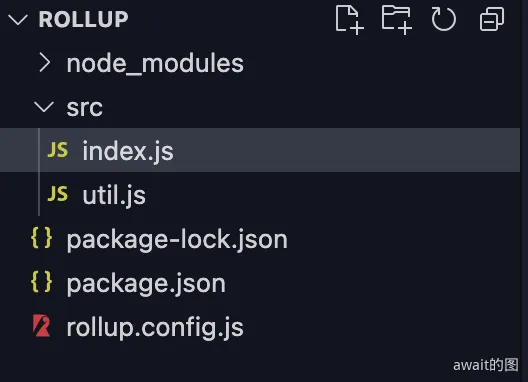

# Rollup打包
Rollup是一款基于 ES Module 模块规范实现的 JS 打包工具，同时也被用在了Vite的架构体系中

## Rollup 打包
首先使用`npm init -y`创建一个新项目，并且安装`rollup`依赖：
```text
npm i rollup
```

并且创建如下的目录结构:


并创建如下的文件内容：
```ts
// src/index.js
import { add } from "./util";
console.log(add(1, 2));

// src/util.js
export const add = (a, b) => a + b;

export const multi = (a, b) => a * b;
// rollup.config.js
// 以下注释是为了能使用 VSCode 的类型提示
/**
 * @type { import('rollup').RollupOptions }
 */
const buildOptions = {
  input: ["src/index.js"],
  output: {
    // 产物输出目录
    dir: "dist/es",
    // 产物格式
    format: "esm",
  },
};

export default buildOptions;
```
编写构建脚本如下：
```ts
// rollup 打包命令，`-c` 表示使用配置文件中的配置
"build":"rollup -c"
```
通过打包之后，可以看到打包之后的代码，并且发现在`util.js`中写的代码`multi`没有被打包进来，这是因为**Rollup**天生就具有Tree-Shaking的功能

:::tip
所谓 `Tree Shaking`(摇树)，也是计算机编译原理中**DCE(Dead Code Elimination，即消除无用代码)** 技术的一种实现。由于 ES 模块依赖关系是确定的，和运行时状态无关。因此 Rollup 可以在编译阶段分析出依赖关系，对 AST 语法树中没有使用到的节点进行删除，从而实现 Tree Shaking。
**（只有import才能使用Tree-Shaking，因为它是静态的！！！）**
:::

### 配置
**Rollup**可以通过修改配置文件中的各种选项来配置打包过程，比如：
- 多产物配置，Rollup可以同时打包出不同格式的产物给用户，比如`mjs`和`cjs`
```ts
// vite.config.js
const buildOptions = {
    input: ["src/index.js"],
    output: [
      {
        dir: "dist/es",
        format: "esm",
      },
      {
        dir:"dist/cjs",
        format:"cjs"
      }
    ]
  };
  
 export default buildOptions;
```
- 多入口配置，Rollup也可以从多个入口中进入去打包文件 
```ts
// rollup.config.js
/**
 * @type { import('rollup').RollupOptions }
 */
const buildIndexOptions = {
  input: ["src/index.js"],
  output: [
    // 省略 output 配置
  ],
};

/**
 * @type { import('rollup').RollupOptions }
 */
const buildUtilOptions = {
  input: ["src/util.js"],
  output: [
    // 省略 output 配置
  ],
};

export default [buildIndexOptions, buildUtilOptions];
```
- 自定义output
```js
output: {
  // 产物输出目录
  dir: path.resolve(__dirname, 'dist'),
  // 以下三个配置项都可以使用这些占位符:
  // 1. [name]: 去除文件后缀后的文件名
  // 2. [hash]: 根据文件名和文件内容生成的 hash 值
  // 3. [format]: 产物模块格式，如 es、cjs
  // 4. [extname]: 产物后缀名(带`.`)
  // 入口模块的输出文件名
  entryFileNames: `[name].js`,
  // 非入口模块(如动态 import)的输出文件名
  chunkFileNames: 'chunk-[hash].js',
  // 静态资源文件输出文件名
  assetFileNames: 'assets/[name]-[hash][extname]',
  // 产物输出格式，包括`amd`、`cjs`、`es`、`iife`、`umd`、`system`
  format: 'cjs',
  // 是否生成 sourcemap 文件
  sourcemap: true,
  // 如果是打包出 iife/umd 格式，需要对外暴露出一个全局变量，通过 name 配置变量名
  name: 'MyBundle',
  // 全局变量声明
  globals: {
    // 项目中可以直接用`$`代替`jquery`
    jquery: '$'
  }
}
```
- 依赖external
对于某些第三方包，可能已经经过打包了，就不必要继续进行打包了，就可以使用`external`进行外部化：
```js
{
  external: ['react', 'react-dom']
}
```

### API调用
**Rollup** 的配置文件结合`rollup -c`完成了 Rollup 的打包过程，但同时也提供了对应的JavaScript API来调用打包，主要分为`rollup.rollup`和`rollup.watch`两个API

首先是`rollup.rollup`，用来一次性地进行Rollup打包，可以创建build.js，内容如下：
```js
// build.js
const rollup = require("rollup");

// 常用 inputOptions 配置
const inputOptions = {
  input: "./src/index.js",
  external: [],
  plugins:[]
};

const outputOptionsList = [
  // 常用 outputOptions 配置
  {
    dir: 'dist/es',
    entryFileNames: `[name].[hash].js`,
    chunkFileNames: 'chunk-[hash].js',
    assetFileNames: 'assets/[name]-[hash][extname]',
    format: 'es',
    sourcemap: true,
    globals: {
      lodash: '_'
    }
  }
  // 省略其它的输出配置
];

async function build() {
  let bundle;
  let buildFailed = false;
  try {
    // 1. 调用 rollup.rollup 生成 bundle 对象
    bundle = await rollup.rollup(inputOptions);
    for (const outputOptions of outputOptionsList) {
      // 2. 拿到 bundle 对象，根据每一份输出配置，调用 generate 和 write 方法分别生成和写入产物
      const { output } = await bundle.generate(outputOptions);
      await bundle.write(outputOptions);
    }
  } catch (error) {
    buildFailed = true;
    console.error(error);
  }
  if (bundle) {
    // 最后调用 bundle.close 方法结束打包
    await bundle.close();
  }
  process.exit(buildFailed ? 1 : 0);
}

build();
```
主要的执行步骤如下：
- 通过`rollup.rollup`方法，传入`inputOptions`，生成 bundle 对象
- 调用 bundle 对象的 generate 和 write 方法，传入`outputOptions`，分别完成产物的生成和磁盘写入
- 最后调用 bundle 对象的 close 方法来结束打包

当然除了通过`rollup.rollup`完成一次性打包，也可以通过`rollup.watch`来完成`watch`模式下的打包，即每次源文件变动后自动进行重新打包，新建`watch.js`文件，内容如下：
```js
// watch.js
const rollup = require("rollup");

const watcher = rollup.watch({
  // 和 rollup 配置文件中的属性基本一致，只不过多了`watch`配置
  input: "./src/index.js",
  output: [
    {
      dir: "dist/es",
      format: "esm",
    },
    {
      dir: "dist/cjs",
      format: "cjs",
    },
  ],
  watch: {
    exclude: ["node_modules/**"],
    include: ["src/**"],
  },
});

// 监听 watch 各种事件
watcher.on("restart", () => {
  console.log("重新构建...");
});

watcher.on("change", (id) => {
  console.log("发生变动的模块id: ", id);
});

watcher.on("event", (e) => {
  if (e.code === "BUNDLE_END") {
    console.log("打包信息:", e);
  }
});
```
