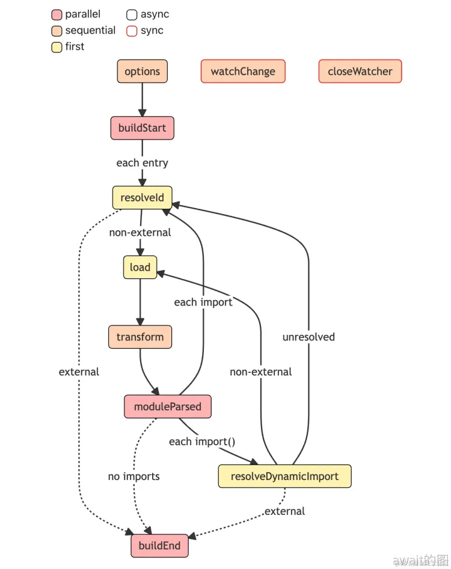
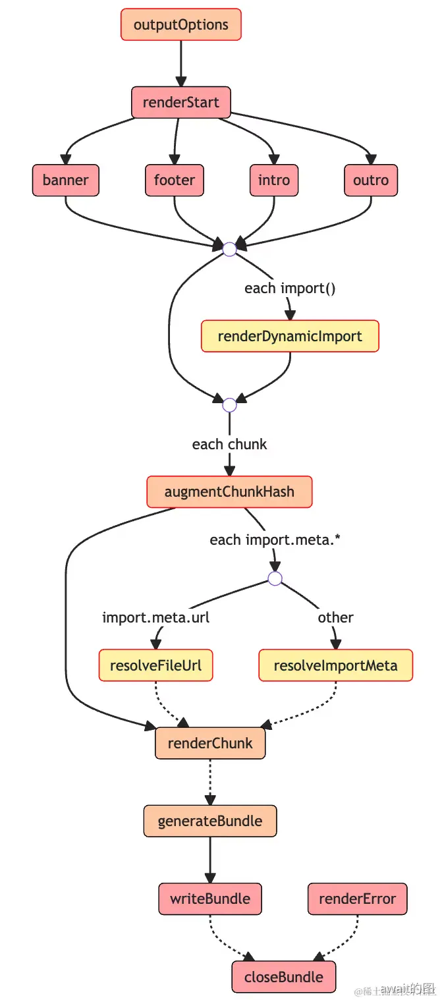
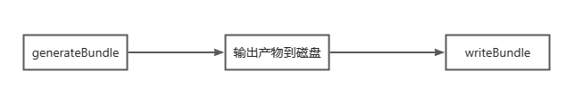

# Rollup构建
Rollup 的打包过程中，会定义一套完整的构建生命周期，从开始打包到产物输出，中途会经历一些**标志性的阶段**，并且会在不同阶段会自动执行对应的插件钩子函数（Hook）。

对于Rollup插件来讲，最重要的部分是钩子函数，一方面它定义了插件的执行逻辑，也就是“做什么”；另一方面也声明了插件的作用阶段，即“什么时候做”。

## 打包过程

在执行`rollup`命令之后，在cli中内部的主要逻辑简化如下：
```js
// Build 阶段
const bundle = await rollup.rollup(inputOptions);

// Output 阶段
await Promise.all(outputOptions.map(bundle.write));

// 构建结束
await bundle.close();
```

Rollup 内部主要经历了`Build`和`Output`这两大阶段

Build 阶段主要负责创建模块依赖图，初始化各个模块的AST以及模块之间的依赖关系

假设有这个例子：
```js
// src/index.js
import { a } from './module-a';
console.log(a);

// src/module-a.js
export const a = 1;
```
```js
const rollup = require('rollup');
const util = require('util');
async function build() {
  const bundle = await rollup.rollup({
    input: ['./src/index.js'],
  });
  // 打印rollup信息
  console.log(util.inspect(bundle));
}
build();
```
通过打包之后就可以看到这样的`bundle`对象信息
```js
{
  cache: {
    modules: [
      {
        ast: 'AST 节点信息，具体内容省略',
        code: 'export const a = 1;',
        dependencies: [],
        id: '/Users/code/rollup-demo/src/data.js',
        // 其它属性省略
      },
      {
        ast: 'AST 节点信息，具体内容省略',
        code: "import { a } from './data';\n\nconsole.log(a);",
        dependencies: [
          '/Users/code/rollup-demo/src/data.js'
        ],
        id: '/Users/code/rollup-demo/src/index.js',
        // 其它属性省略
      }
    ],
    plugins: {}
  },
  closed: false,
  // 挂载后续阶段会执行的方法
  close: [AsyncFunction: close],
  generate: [AsyncFunction: generate],
  write: [AsyncFunction: write]
}
```
从上面的信息中可以看出，目前经过 Build 阶段的 `bundle` 对象其实没有进行模块的打包，也就是说不会产生打包产物，这个对象的作用在于存储各个模块的内容以及依赖关系，同时暴露`generate`和`write`方法，以进入到后续的`Output`阶段，**write和 generate** 方法唯一区别在于前者打包完产物会写入磁盘，而后者不会。

所以，真正进行打包的过程会在`Output`阶段进行，也就是在write和generate方法中进行，因此，**对于一次完整的构建过程而言，Rollup会先进入到Build阶段，解析各个模块的内容以及依赖关系，然后进入到`Output`阶段，完成打包和输出的过程。**

```js
const rollup = require('rollup')
const util = require('util')

async function build(){
    // build 阶段
    const bundle = await rollup.rollup({
        input:['./src/index.js']
    })
    console.log(util.inspect(bundle))
    // output阶段
    const result = await bundle.generate({
        format:'es'
    })
    console.log(result,'result')
}

build()
```
得到的打印结果如下：
```js
{
  output: [
    {
      exports: [],
      facadeModuleId: '/Users/jhinkoo/Desktop/project/bundle-tool/rollup/src/index.js',
      isDynamicEntry: false,
      isEntry: true,
      isImplicitEntry: false,
      moduleIds: [Array],
      name: 'index',
      type: 'chunk',
      dynamicImports: [],
      fileName: 'index.js',
      implicitlyLoadedBefore: [],
      importedBindings: {},
      imports: [],
      modules: [Object: null prototype],
      referencedFiles: [],
      code: 'const add = (a, b) => a + b;\n' +
        '\n' +
        'let result = add(1,2);\n' +
        '\n' +
        'console.log(result);\n',
      map: null,
      preliminaryFileName: 'index.js',
      sourcemapFileName: null
    }
  ]
}
```

## 插件类别
实际上，插件的各种Hook可以根据上述的两个阶段分为两类：`Build Hook` 与 `Output Hook`
- `Build Hook` 即在 build 阶段执行的钩子函数，在这个阶段主要进行模块代码的转换，AST解析以及模块依赖的解析，这个阶段的Hokk对于代码的操作粒度实际上是**模块 单文件**级别的
- `Output Generation Hook` 主要进行代码的打包，对于代码而言，操作粒度一般为 `chunk` 级别的，也就是一个多个文件打包到一起的产物

除了根据构建阶段可以将Rollup插件进行分类，根据不同的Hook执行方式也会有不同的分类，主要包括`Async` `Sync` `Parallel` `Squential` `First` 这五种。不是说一个Hook就对应了其中一类，而是有可能是多类，不同的类型是可以互相叠加的，`Async / Await` 是可以搭配三种类型中的任意一种。

### Async & Sync
分别代表**异步**和**同步**的钩子函数，两者最大的区别在于同步钩子中不能有异步逻辑，而异步钩子里面运行有

### Parallel （并行）
这里指的是并行的钩子函数，如果有多个插件实现了这个钩子的逻辑，一旦有钩子函数是异步逻辑，则并发执行钩子函数，不会等待当前钩子完成（底层实现用的是`Promise.all`）

比如对于`Build`阶段的`buildStart`钩子，它的执行时机其实是在构建刚开始的时候，各个插件可以在这个钩子当中做一些状态初始化的操作，这一流程中插件之间的操作并不会相互依赖，也就是可以并发执行，从而提升构建性能。反之，对于需要依赖其他插件处理结果的情况就不适合用`Parallel`钩子了，比如`transform`

### Sequential（串行）
**Sequential** 指的是串行的钩子函数。这种Hook往往适用于插件之间处理结果相互依赖的情况，前一个插件Hook的返回值作为后续插件的入参，这种情况就需要等待前一个插件执行完Hook，获得其执行结果，然后才能进行下一个插件相应Hook的调用

### First
如果有多个插件实现了这个Hook，那么Hook将会依次运行，直到返回一个非null或非undefined的值为止。比较典型的是Hook是`resolveId`，一旦有插件的resolveId返回了一个路径，将执行后续插件的resolveId逻辑。

## Build工作流
每个方块代表一个Hook，边框的颜色表示`Async`和`Sync`类型，方块的填充颜色可以代表`Parallel` `Sequential`和`First`类型



- 1.首先是**异步串行钩子options**，对配置文件进行转换，得到处理之后的配置对象
- 2.然后是**异步并行钩子buildStart**，进行初始化然后，正式开始构建流程
- 3.**异步First钩子resolveId**，进行路径解析，从input配置指定的入口文件开始，如果配置了external的文件列表，这这个列表中的文件不参与后面的打包构建流程，直接输入到最后的**BuildEnd**
- 4.**异步First钩子load**，用于加载模块的内容
- 5.**异步串行钩子tranform**，执行所有的transform钩子来对模块内容进行自定义转换，比如babel转译
- 6.**异步并行钩子moduleParsed**，拿到了最后的模块内容，开始并行解析模块的内部内容，如果是普通的`import`语法，则返回到**resolvedId**钩子，如果是动态导入`import()`函数，则使用**resolveDynamicImport**去解析
- 7.所有的import都解析完毕了，Rollup执行**buildEnd**钩子，Build阶段结束

同时，在流程图的最上面，还有`watchChange`和`closeWatcher`这两个Hook，这里其实对应了rollup的`watch`模式。当你使用`rollup --watch`指令或者在配置文件配有`watch:true`属性时，代表开启了Rollup的`watch`打包模式，这个时候Rollup内部会初始化一个`watcher`对象，当文件内容发生变化时，`watcher`会自动触发watchChange钩子执行并对项目进行重新构建。在当前**打包过程结束**时，Rollup会自动清除watcher对象调用`closeWatcer`钩子。

## Output工作流


- 1.执行所有插件的`outputOptions`钩子函数，对`output`配置进行转换
- 2.执行`renderStart`，并发执行renderStart钩子，正式开始打包
- 3.并发执行所有插件的`banner` `footer` `info` `outro`钩子（底层用Promise.all 包裹所有的这四种钩子函数），这四个钩子的功能很简单，就是往打包产物的固定位置（头部和尾部）插入一些自定义的内容，比如协议声明内容，项目介绍等
- 4.从入口模块开始扫描，针对动态import语句进行`renderDynamicImport`钩子，来自定义动态import的内容
- 5.对每个即将生成的`chunk`，执行`augmentChunkHash`钩子，来决定是否更改chunk的哈希值，在`watch`模式下即可能会多次打包的场景下，这个钩子比较适用。
- 6.如果没有遇到`import.meta`语句，就进行下一步，否则：对于`import.meta.url`语句调用`resolveFileUrl`来自定义url的解析逻辑;对于其他`import.meta`属性，则调用`resolveImportMeta`来进行自定义的解析
- 7.接着Rollup会生成所有的chunk内容，针对每个chunk会依次调用插件的`renderChunk`方法进行自定义操作，也就是说，在这里就可以直接操作打包产物了
- 8.随后会调用`generateBundle`钩子，这个钩子的入参里面会包含所有的打包产物信息，包括`chunk`(打包后的问题)，`assets`(最终的静态资源文件)。可以在这里删除一些chunk或者assets，最终这些内容将不会作为产物输出，上文也提到了`rollup.rollup`方法会返回一个`bundle`对象，这个对象是包含`generate`和`write`两个方法，两个方法唯一的区别在于后者会将代码写入到磁盘中，同时触发`writeBundle`钩子，所以传入所有的打包产物信息，包括 chunk 和 asset ，和`generateBundle`钩子非常相似，不过需要值得注意的是，这个钩子执行的时候，产物已经输出了，而generateBundle执行的时候产物还没有输出，顺序如下图所示：



- 9.当bundle的clsoe方法被调用的时候，会触发`closeBundle`钩子，到这里Output阶段正式结束了，如果打包过程中任何阶段出现错误，会触发renderError钩子，然后执行closeBundle钩子结束打包