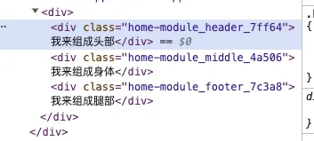
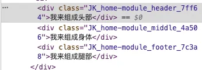
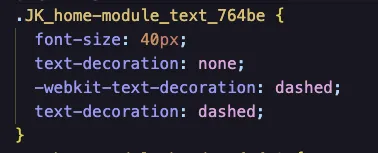
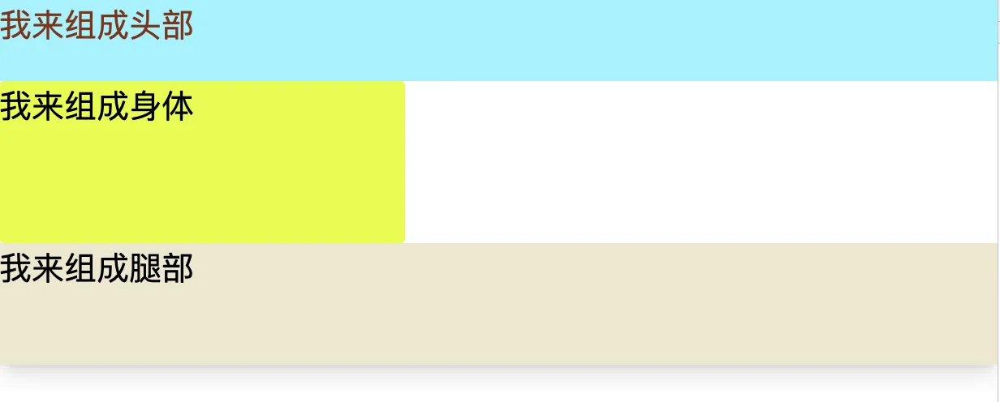

# Vite中的Css

对于纯原生CSS开发，不实用任何的CSS工程方案，时间一长，就会出现各种各样的问题。

- 开发体验差，原生CSS不支持选择器的嵌套
```css
// 选择器只能平铺，不能嵌套
.container .header .nav .title .text {
  color: blue;
}

.container .header .nav .box {
  color: blue;
  border: 1px solid grey;
}
```
- 样式污染问题。如果出现同样的类名，容易造成不同的样式相互覆盖和污染
```css
// a.css
.container {
  color: red;
}

// b.css
// 很有可能覆盖 a.css 的样式！
.container {
  color: blue;
}
```
- 浏览器兼容问题。问了兼容不同的浏览器，需要对一些属性（比如`transition`）加上不同的浏览器前缀，比如`-webkit-` `-moz- -ms-` `-o-`，这些意味着开发者需要针对同一个样式属性写很多冗余代码
- 打包后的**代码体积**问题，如果不用任何的CSS工程化方案，所有的CSS代码都会被打包到产物中，即使有部分样式并没有在代码中使用，导致产物体积过大

对于这些原生CSS的痛点，社区中也诞生了不少解决方案，一般来说有以下五种：
- **CSS预处理器**：这些方案各自定义了一套语法，让 CSS 也能使用嵌套规则，甚至能像编程语言一样定义变量、写条件判断和循环语句，大大增强了样式语言的灵活性，解决原生 CSS 的开发体验问题。
- **CSS Module**：能将 CSS 类名处理成哈希值，这样就可以避免同名的情况下样式污染的问题。
- **CSS 后处理器 PostCSS**，用来解析和处理CSS代码，可以实现的功能非常丰富，比如将 `px` 转换为 `rem`、根据目标浏览器情况自动加上类似于`--moz--`、`-o-`的属性前缀等等。
- **CSS原子化框架**，如`Tailwind CSS`，通过类名来指定样式，很大程度上简化了样式的写法，提高了样式开发效率主要提升了原生CSS的**开发体验**问题

这里着重介绍CSS预处理器, CSS Module , PostCSS ，CSS原子化框架

## CSS预处理器
Vite本身对CSS各种预处理器语言，比如`Sass/Scss`和`less`做了内置的支持。也就是说不经过任何的配置都可以直接使用各种CSS预处理器。

由于Vite底层会调用CSS预处理器的官方库进行编译，而Vite也为了实现按需加载，并没有内置这些工具库，所以还是需要用户进行安装：
```js
npm i sass -D
```
细节使用这里不再多提，但是

如果封装了一个全局文件
```css
/** variable.scss **/
$theme-color:red;
```
如果不想在每个页面中都写一遍导入的话，就像这样
```css
@import "../../variable.scss"
.header{
  color:$theme-color
}
```
那么可以进入Vite中做一些自定义配置，在配置文件中增加如下的内容即可：
```ts
// vite.config.ts
import { normalizePath } from 'vite';
// 如果类型报错，需要安装 @types/node: pnpm i @types/node -D
import path from 'path';

// 全局 scss 文件的路径
// 用 normalizePath 解决 window 下的路径问题
const variablePath = normalizePath(path.resolve('./src/variable.scss'));


export default defineConfig({
  // css 相关的配置
  css: {
    preprocessorOptions: {
      scss: {
        // additionalData 的内容会在每个 scss 文件的开头自动注入
        additionalData: `@import "${variablePath}";`
      }
    }
  }
})
```
之后就可以直接在文件中使用全局文件变量了

## CSS Modules
CSS Modules在 Vite 是一种开发即用的能力，Vite对后缀带有.module的样式文件自动应用CSS Modules。

这里直接编写了一个home.module.less的文件，然后引入App.vue，可以看到打印内容如下:

```css
.header {
  width: 100%;
  height: 100px;
  background-color: aqua;
}

.middle {
  width: 500px;
  height: 200px;
  background-color: yellow;
}

.footer {
  width: 100%;
  height: 150px;
  background-color: antiquewhite;
}

```
可以看见这些类名的名称都被处理成了哈希值的表现方式



同样，也可以在`config.vite.js`文件选项来配置CSS Modules 的功能，比如以下:
```js
export default defineConfig({
  resolve: {
    alias: {
      "@": path.resolve(__dirname, "/src"),
    },
  },
  css: {
    modules: {
      // 给类名前面加上JK
      generateScopedName: "JK_[name]_[local]_[hash:5]",
    }
  },
  plugins: [vue()],
});
```


## PostCss
一般来说可以通过`postcss.config.js`来配置postcss，不过`vite.config.js`配置文件中已经提供了PostCss的配置入口，所以可以在Vite配置文件中进行操作

现在使用`autoprefixer`来补充浏览器的样式前缀
```text
pnpm i autoprefixer -D
```
然后直接在Vite中去接入这个插件
```js
// vite.config.ts 增加如下的配置
import autoprefixer from 'autoprefixer';

export default {
  css: {
    // 进行 PostCSS 配置
    postcss: {
      plugins: [
        autoprefixer({
          // 指定目标浏览器
          overrideBrowserslist: ['Chrome > 40', 'ff > 31', 'ie 11']
        })
      ]
    }
  }
}
```
然后添加一个兼容性不是很好的css属性
```css
.text{
  text-decoration:dashed
}
```
通过build打包之后，可以看到样式都加上了前缀


由于CSS代码的AST解析能力，PostCss可以做很多事情，甚至能实现CSS预处理器语法和CSS Modules，社区中也有很多PostCss插件:
- [postcss-pxtorem](https://github.com/cuth/postcss-pxtorem):用来将px转换为rem单位，在适配移动端的场景下特别常见
- [postcss-preset-env](https://link.juejin.cn/?target=https%3A%2F%2Fgithub.com%2Fcsstools%2Fpostcss-preset-env):编写最新的css语法，不必担心兼容性问题，有了它就不需要使用`autoprefixer`
- [cssnano](https://github.com/cssnano/cssnano):主要用于压缩CSS代码，跟常规的代码压缩工具不一样，它能做得更加智能，比如一些公共样式的提取，复用，缩短一些常见的属性值

## CSS 原子化框架
在目前的社区中，CSS原子化框架主要包括`Tailwind CSS`和`Uno CSS`。Uno CSS 作为前者的替换方案，实现了按需生成CSS类名的功能，开发环境下的CSS产物体积也大大减少，速度比`Tailwind CSS v2`快20～100倍！这里主要讲解`Tailwind CSS`
- 安装`tailwindcss`及其必要依赖
```text
npm install -D tailwindcss postcss autoprefixer
```
:::tip
这里注意，由于使用的是Vite，而Vite自带了postcss，所以不用安装postcss，而且`vite.config.js`的postcss配置项会替换掉外界的`postcss.config.js`的内容。
:::
这里建议，将postcss相关的配置全部移到一个单独的文件中去，避免`vite.config.js`文件过于庞大，影响阅读性。

首先可以创建一个`tailwind.config.js`
```js
// tailwind.config.js
module.exports = {
  content: [
    "./index.html",
    "./src/**/*.{vue,js,ts,jsx,tsx}",
  ],
  theme: {
    extend: {},
  },
  plugins: [],
}
```
这个文件主要用于配置文件中添加所有模版文件的路径，这里包括了项目中的`index.html`和`src`目录下的所有文件

然后构建`postcss.config.js`的内容，这里直接引用前文的内容

```js
// postcss.config.js
import postcssPresetEnv from "postcss-preset-env";
import autoprefixer from "autoprefixer";
import cssnanoPlugin from "cssnano";
import tailwindcss from "tailwindcss";
import tailwindcssConfig from "./tailwind.config.js";

export default {
  plugins: [
    tailwindcss(tailwindcssConfig),
    autoprefixer({
      overrideBrowserslist: ["Chrome > 40", "ff > 31", "ie 11"],
    }),
    postcssPresetEnv(),
    cssnanoPlugin(),
  ],
};
```
最后在`vite.config.js`中导入
```js
import { defineConfig } from "vite";
import vue from "@vitejs/plugin-vue";
import path from "path";
import postcssConfig from "./postcss.config.js";

export default defineConfig({
  resolve: {
    alias: {
      "@": path.resolve(__dirname, "/src"),
    },
  },
  css: {
    postcss: postcssConfig,
  },
  plugins: [vue()],
});

```
在Vue文件中去使用
```vue
<script setup>
  import styles from "@/assets/css/home.module.less";
</script>

<template>
  <div>
    <!-- text-red-700 文字红色 -->
    <div :class="[styles.header, styles.text, 'text-red-700']">
      我来组成头部
    </div>
    <!-- rounded-md 中等圆角 -->
    <div :class="[styles.middle, 'rounded-md']">我来组成身体</div>
    <!-- shadow-xl 盒子阴影 -->
    <div :class="[styles.footer, 'shadow-xl']">我来组成腿部</div>
  </div>
</template>

<style scoped></style>
```
