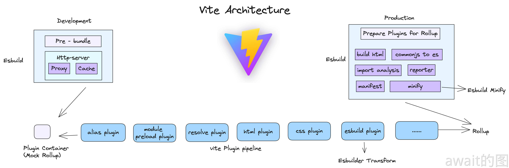
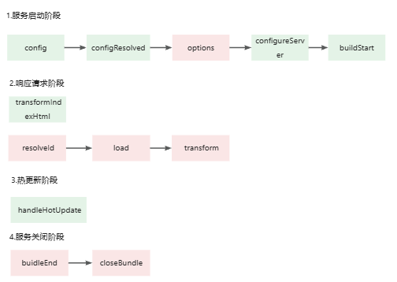
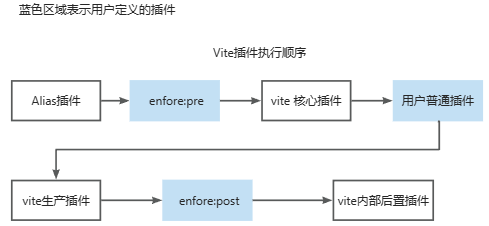

# Vite插件机制与开发
虽然Vite的插件机制是基于Rollup来设计的，但实际上Vite的插件机制也包含了自己特有的一部分，与Rollup的各个插件Hook并非完全兼容。

## Vite插件示例
Vite的插件结构与Rollup插件的结构类似，为一个`name`和各种插件Hook的对象

```js
{
  // 插件名称
  name:'vite-plugin-xxx',
  load(code){
    // 钩子逻辑
  }
}
```
:::tip
如果插件是一个npm包，在package.json中的包含名也推荐以vite-plugin开头
:::
```js
export function myVitePlugin(options){
    return {
        name: 'vite-plugin-my',
        load(id){
            console.log(id,'id')
            console.log(options,'options')
        }
    }
}
```
`id`拿到每个解析的文件路径，`options`可以通过闭包拿到外界传入的参数

## 插件的Hook
在构建过程中，要让Plugin在正确的时机触发，就必须要用到Hook，就好比Vue中组件的生命周期一样.

### 通用的Hook
Vite在**开发阶段**会模拟Rollup的行为


也就是上图中`Mock Rollup`这一部分的内容，其中Vite会调用一系列与Rollup兼容的钩子，这个钩子主要分为三大阶段：
- **服务器启动阶段：** `options`和`buildStart`钩子会在服务启动时调用
- **请求响应阶段：** 当浏览器发起请求时，Vite会在内部依次调用`resolveId`，`load`和`transform`钩子
- **服务器关闭阶段：** Vite会依次执行`buildEnd`和`closeBundle`钩子

除了以上的钩子，其他Rollup插件钩子均不会在Vite**开发阶段**调用。而在生产环境下，由于Vite直接使用Rollup，Vite插件中所有的钩子都会发生效果。

### 独有Hook
这些Hook只会在Vite中独有，并在Vite内部进行调用，而放到Rollup中会被直接忽略。

总的钩子如下：

```js
export function consoleVitePlugin(options){
    console.log(options)
    return {
        name:'vite-plugin-console',

        /** 获取vite中的配置文件配置，一般可以在这里做一些修改 **/
        config(config,{command}){
            if(command === 'build'){
                console.log('build环境下的配置',config)
                // 返回部分配置 会和 Vite已有配置发生深度合并
                return {
                    optimizeDeps:{
                        esbuildOptions:{
                            plugins:[]
                        }
                    }
                }
            }else{
                console.log('dev环境下的配置',config)
            }
        },

        /** configResolved 拿到最终的配置 **/
        configResolved(resolvedConfig){
            // 这个钩子函数里，一般用于记录配置信息，而不是直接修改配置
            console.log('build环境下的最终配置',resolvedConfig)
        },

        /** 只会在开发阶段会被调用 用于扩展Vite的DevServer **/
        configureServer(server){
            server.middlewares.use((req,res,next)=>{
                console.log('在Vite内置中间件之前执行')
            })

            return ()=>{
                server.middlewares.use((req,res,next)=>{
                    console.log('在Vite中间件之后执行')
                })
            }
        },

        /** transformIndexHtml 拿到原始的html内容后进行任意转换 **/
        transformIndexHtml(html){
            return html.replace(/<title>(.*?)<\/title>/,`<title>vite-plugins-demo</title>`)
        },

        /** handleHotUpdate 可以拿到热更新相关的上下文信息 **/
        async handleHotUpdate(ctx){
            // 需要热更新文件
            console.log(ctx.file)
            // 需要热更新的模块
            console.log(ctx.modules)
            // 时间戳
            console.log(ctx.timestamp)
            // Vite Dev Server 实例
            console.log(ctx.server)
            // 读取最新的文件内容
            console.log(await read())
        }
    }
}
```
以上就是Vite独有的五大Hook：
- `config`: 用来进一步修改配置
- `configResolved`：用来记录最终的配置信息
- `configureServer`：用于获取Vite Dev Server实例，添加中间件
- `transformIndexHtml`：用来转换HTML内容
- `handleHotUpdate`：用于进行热更新模块的过滤，或者进行自定义的热更新处理

### 插件执行顺序
Vite的插件执行顺序如下
```js
export function testVitePlugin(){
    return {
        name:'test-vite-plugin',
        // Vite 独有钩子
        config(config){
            console.log('config')
        },
        // vite 独有钩子
        configResolved(resolvedConfig){
            console.log('resolvedConfig')
        },
        // 通用钩子
        options(opts){
            console.log('options')
            return opts
        },
        // vite 独有钩子
        configureServer(server){
            console.log('configureServer')
            setTimeout(()=>{
                process.kill(process.pid,'SIGERM')
            },3000)
        },
        // 通用钩子
        buildStart(){
            console.log('buildStart')
        },
        // 通用钩子
        buildEnd(){
            console.log('buildEnd')
        },
        // 通用钩子
        closeBundle(){
            console.log('closeBundle')
        }
    }
}
```
绿色块代表Vite独有，红色块代表兼容rollup


- 服务启动阶段有：`config`,`configResolved`,`options`,`configureServer`,`buildStart`
- 请求响应阶段有：如果是`html`文件，仅执行`transformIndexHtml`钩子；对于非HTML文件，则依次执行`resolveId`,`load`和`transform`钩子
- 热更新阶段：执行`handleHotUpdate`钩子
- 服务关闭阶段：执行`buildEnd`和`closeBundle`钩子

### 插件应用位置
默认情况下Vite插件可以同时被用在开发环境和生产环境，可以通过`apply`属性来决定应用场景，比如
```js
apply(config, { command }) {
  // 只用于非 SSR 情况下的生产环境构建
  return command === 'build' && !config.build.ssr
}
```
在某个Hook阶段，内部有很多插件都在运行，那么可以通过`enforce`属性来规定构建的插件的执行顺序:
```js
{
  enfore:'pre' // 默认为normal , 可取值还有`pre`和`post`
}
```
Vite插件如下，蓝色方块表示用户的插件执行时机
