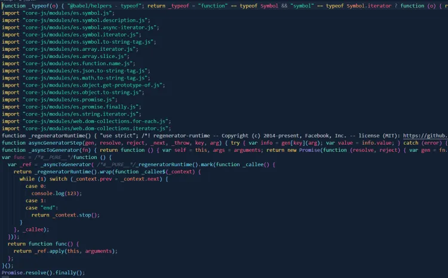
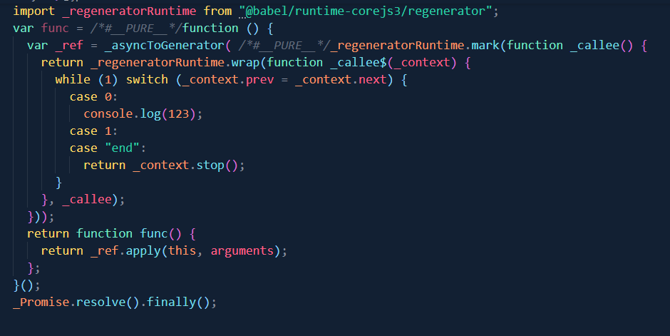
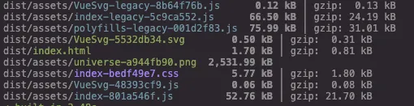
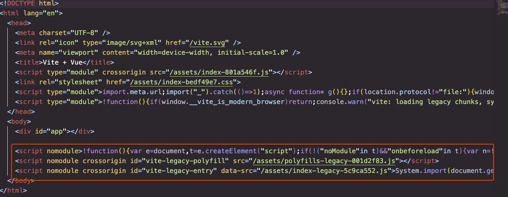
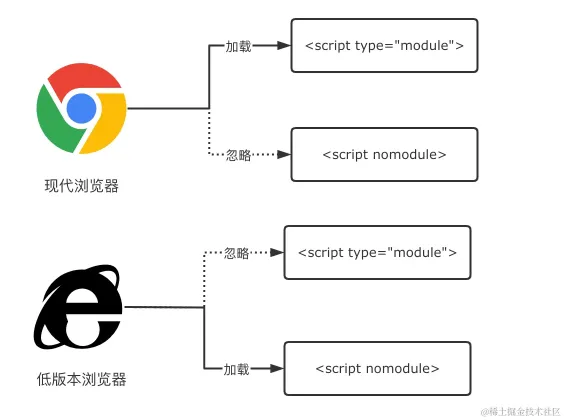
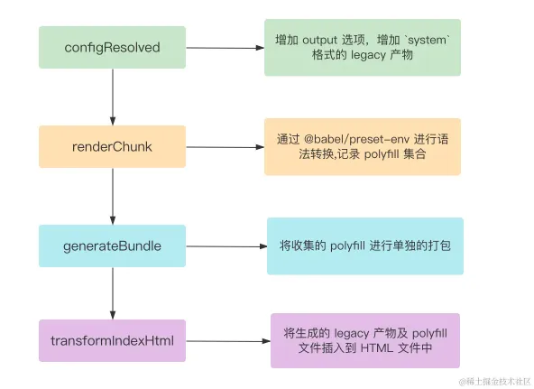
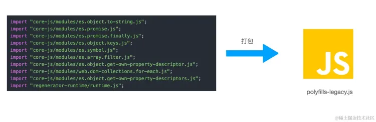

# 语法降级与Polyfill
通过Vite构建完全可以兼容各种低版本的浏览器，打包出既支持现代浏览器又支持旧版浏览器的产物

## 场景复现
当在线上遇到JS语法不兼容时，会导致代码直接报错，从而导致线上白屏事故的发生。

旧版浏览器语法兼容性错误主要包含两类：
- **语法降级问题**：有的浏览器不支持箭头函数，所以需要将其转换成`function(){}`语法，也就是可以通过旧的语法去实现新的API特性
- **Pollyfill缺失问题**：像`generate`和`Object.entries`方法的实现，可以保证产物正常使用API

这两类问题本质上是通过前端的编译工具链`Babel`以及JS的基础Polyfill库`core.js`和`regenerator-runrtime`来进行解决，不会和具体的构建工具所绑定，构建工具只需要考虑如何将这些底层基础设施接入到构建过程中去。

## 底层工具链
解决上面的两类语法兼容问题，主要用到两个方面的工具，分别包括：
- **编译时工具**：代表工具有`@babel/preset-env`和`@babel/plugin-transform-runtime`
- **运行时基础**：代表库包括`core-js`和`regeneretor-runtime`

**编译时工具**的作用是在代码编译阶段进行**语法降级**以及添加`polyfill`**代码的引用语句**。如:
```js
import "core-js/modules/es6.set.js"
```
由于这些工具只是编译阶段用到，运行时并不需要，所以需要将其放入`package.json`中的`devDependencies`中

**运行时基础库**是根据`ESMAScript`官方语言规范提供各种`Polyfill`实现代码，主要包括`core-js`和`regenerator-runtime`两个基础库，不过在babel中也会有一些上层的封装，包括：
- [@babel/polyfill](https://link.juejin.cn/?target=https%3A%2F%2Fbabeljs.io%2Fdocs%2Fen%2Fbabel-polyfill)
- [@babel/runtime](https://link.juejin.cn/?target=https%3A%2F%2Fbabeljs.io%2Fdocs%2Fen%2Fbabel-runtime)
- [@babel/runtime-corejs2](https://link.juejin.cn/?target=https%3A%2F%2Fbabeljs.io%2Fdocs%2Fen%2Fbabel-runtime-corejs2)
- [@babel/runtime-corejs3](https://link.juejin.cn/?target=https%3A%2F%2Fbabeljs.io%2Fdocs%2Fen%2Fbabel-runtime-corejs3)

这些库都是`core-js`和`regenerator-runtime`的不同版本的封装（`@babel/runtime`是一个特例，不包含`core-js`的`Polyfill`）。这些类库是项目运行时必须要使用到的，因此一定要放在`package.json`中的`dependencies`

## 实际使用
这里以一个例子来说明，创建一个文件夹并初始化项目
```text
mkdir babel-test
npm init -y
```
接下来可以安装一些必要的工具库：
```text
npm i @babel/cli @babel/core @babel/preset-env
```
这是各个依赖的作用：
-`@babel/cli`:为babel官方的脚手架工具
-`@babel/core`:babel的核心编译库
-`@babel/preset-env`:babel的预设工具集合，基本上是babel必须安装的库

接着在项目中创建`src`目录，并且在目录之下增加`index.js`文件
```js
// index.js
const func = async () => {
  console.log(123)
}

Promise.resolve().finally()
```
接下来创建`.babelrc.json`的babel配置文件，内容如下：
```json
{
    "presets": [
        [
            "@babel/preset-env",
            {   
                // 指定兼容的版本
                "targets":{
                    "ie":"11"
                },
                // 基础库core-js的版本，一般定为最新的大版本
                "corejs":3,
                // Polyfill注入策略,一般选择 usage 来进行按需导入
                "useBuiltIns":"usage",
                // 不将ES模块语法转换为其他模块语法
                "modules":false
            }
        ]
    ]
}
```
关于`targets`比较关键，它可以指定要兼容的浏览器版本，对于实际项目中一般会创建一个`.browserslistrc`文件来进行这样的声明：
```text
// 现代浏览器
last 2 versions and since 2018 and > 0.5%
// 兼容低版本 PC 浏览器
IE >= 11, > 0.5%, not dead
// 兼容低版本移动端浏览器
iOS >= 9, Android >= 4.4, last 2 versions, > 0.2%, not dead
```
执行编译命令
```text
npx babel src --out-dir dist
```
可以看到如下的产物：

:::tip
Polyfill 代码主要来自 corejs 和 regenerator-runtime，如果要运行起来，必须安装这个两个库
:::
最后总结一下，利用`@babel/preset-env`进行目标浏览器的降级和`Polyfill`注入，同时也要用到core-js和regenerator-runtime两个核心运行时库。

但是`@babel/preset-env`的方案存在一定的局限性：如果使用新特性，往往通过`core-js`往全局环境中添加Polyfill，如果是开发自己的应用没有问题，但是如果是第三方库，可能会出现**全局空间造成污染**这样的扶风县

### 更优的Polyfill注入方案：transform-runtime
`transform-runtime`就是为了解决`@babel/preset-env`这种局限

:::tip
`transfrom-runtime`方案可以作为`@babel/preset-env`中`useBuiltIns`配置的代替品，也就是说，一旦使用了`transfrom-runtime`方案，就应该把`useBuiltIns`属性设为`false`
:::

必须安装的依赖如下：
```text
pnpm i @babel/plugin-transform-runtime -D
pnpm i @babel/runtime-corejs3 -S
```
前者是编译时工具，用来转换语法和添加Polyfill，后者是运行时的基础库，封装了`core-js`和`regenerator-runtime`和各种语法转换用到的工具函数

:::tip
core-js 有三种产物，分别是`core-js`，`core-js-pure`和`core-js-bundle`。
`core-js`是一种全局Polyfill的做法，`@babel/preset-env`就是用的这种产物
`core-js-pure`是不会讲Polyfill注入到全局，可以按需引入，`@babel/runtime-corejs3`就是这种产物
:::
接下来需要修改一下`.babelrc.json`的配置
```json
{   "plugins":[
  [
    "@babel/plugin-transform-runtime",
    {
      "corejs":3
    }
  ]
],
  "presets": [
    [
      "@babel/preset-env",
      {   
        "targets":{
          "ie":"11"
        },
        "corejs":3,
        // 一定要关闭，这样可以避免 polyfill 的全局注入
        "useBuiltIns":false,
        "modules":false
      }
    ]
  ]
}
```
最后输入编译命令

可以很清楚的看到`transform-runtime`一方面能够在代码中使用**非全局版本**的Polyfill，这样就避免全局空间的污染

## Vite语法降级与Polyfill注入
Vite官方已经封装好了一个开箱即用的方案：`@vitejs/plugin-legacy`，可以基于它来解决项目语法的浏览器兼容问题。这个插件内部同样使用`@babel/preset-env`以及`core-js`等一系列基础库来进行语法降级和Polyfill注入

### 插件使用
```js
pnpm i @vitejs/plugin-legacy -D
```
直接在`vite.config.js`中使用
```js
// vite.config.ts
import legacy from '@vitejs/plugin-legacy';
import { defineConfig } from 'vite'

export default defineConfig({
  plugins: [
    // 省略其它插件
    legacy({
      // 设置目标浏览器，browserslist 配置语法
      targets: ['ie >= 11'],
    })
  ]
})

```
通过`target`指定目标浏览器，这个参数在插件内部会传递给`@babel/preset-env`

相比一般的打包过程，多出来了几个和`legacy`相关的文件，查看`index.html`中的文件中有以下内容


通过官方的`legacy`插件，Vite会分别打包出`Modern`模式和`Legacy`模式的产物，然后将两种产物插入同一个HTML中，`Modern` 产物被放到 `type="module"` 的 script 标签中，而`Legacy`产物则被放到带有`nomodule`中的script标签中

:::tip
Script标签上的nomodule属性来表明这个脚本不应该在支持ES模块的浏览器中执行
:::

这样产物便能够同时放到现代浏览器和不支持`type="module"`

### 插件执行原理
`legacy`插件是一个相对复杂度比较高的插件，下面是一张简化的流程图：


第一步，首先是`configResolved`钩子中调整了`output`属性，这样做的目的是让Vite底层使用打包引擎Rollup能另外打包一份`Legacy 模式`的产物，实现代码如下：

```js
const createLegacyOutput = (options = {}) => {
  return {
    ...options,
    // system 格式产物
    format: 'system',
    // 转换效果: index.[hash].js -> index-legacy.[hash].js
    entryFileNames: getLegacyOutputFileName(options.entryFileNames),
    chunkFileNames: getLegacyOutputFileName(options.chunkFileNames)
  }
}

const { rollupOptions } = config.build
const { output } = rollupOptions
if (Array.isArray(output)) {
  rollupOptions.output = [...output.map(createLegacyOutput), ...output]
} else {
  rollupOptions.output = [createLegacyOutput(output), output || {}]
}
```
在`renderChunk`阶段，插件会对Legacy模式产物进行语法转译和Polyfill收集，这里不会真正注入Polyfill，而不是仅仅只是收集`Polyfill`

```js
{
  renderChunk(raw, chunk, opts) {
    // 1. 使用 babel + @babel/preset-env 进行语法转换与 Polyfill 注入
    // 2. 由于此时已经打包后的 Chunk 已经生成
    //   这里需要去掉 babel 注入的 import 语句，并记录所需的 Polyfill
    // 3. 最后的 Polyfill 代码将会在 generateBundle 阶段生成
  }
}
```
接下来进入`generateChunk`钩子阶段，现在Vite会对之前收集到的`Polyfill`进行统一的打包，主要逻辑集中在于`buildPolyfillChunk`函数中

```js
// 打包 Polyfill 代码
async function buildPolyfillChunk(
  name,
  imports
  bundle,
  facadeToChunkMap,
  buildOptions,
  externalSystemJS
) {
  let { minify, assetsDir } = buildOptions
  minify = minify ? 'terser' : false
  // 调用 Vite 的 build API 进行打包
  const res = await build({
    // 根路径设置为插件所在目录
    // 由于插件的依赖包含`core-js`、`regenerator-runtime`这些运行时基础库
    // 因此这里 Vite 可以正常解析到基础 Polyfill 库的路径
    root: __dirname,
    write: false,
    // 这里的插件实现了一个虚拟模块
    // Vite 对于 polyfillId 会返回所有 Polyfill 的引入语句
    plugins: [polyfillsPlugin(imports, externalSystemJS)],
    build: {
      rollupOptions: {
        // 访问 polyfillId
        input: {
          // name 暂可视作`polyfills-legacy`
          // pofyfillId 为一个虚拟模块，经过插件处理后会拿到所有 Polyfill 的引入语句
          [name]: polyfillId
        },
      }
    }
  });
  // 拿到 polyfill 产物 chunk
  const _polyfillChunk = Array.isArray(res) ? res[0] : res
  if (!('output' in _polyfillChunk)) return
  const polyfillChunk = _polyfillChunk.output[0]
  // 后续做两件事情:
  // 1. 记录 polyfill chunk 的文件名，方便后续插入到 Modern 模式产物的 HTML 中；
  // 2. 在 bundle 对象上手动添加 polyfill 的 chunk，保证产物写到磁盘中
}

```
这个函数可以简单的理解为通过`vite build`对`renderChunk`中收集到polyfill代码进行打包，生成一个单独的chunk
