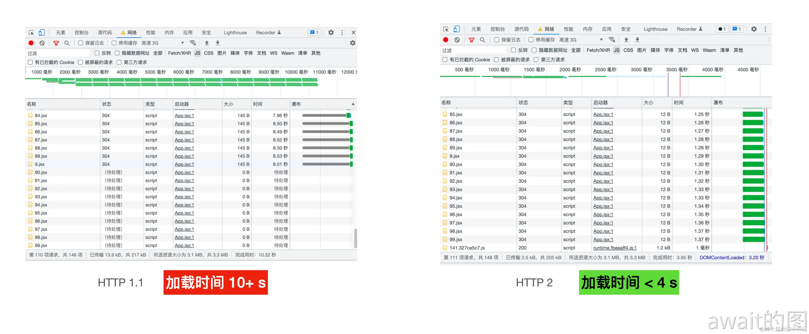
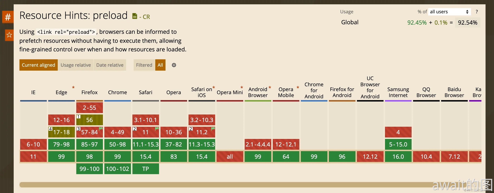

# Vite项目优化
在实际项目开发中，在项目的开发阶段，需要关注**开发体验**，而在项目上线到生产环境中时，更需要关注项目在线上的**运行时性能**。

对于项目的加载性能优化而言，常见的优化手段可以分为下面的三类：
- 网络优化：包括**HTTP2**,**DNS解析**,**Preload**,**Prefetch**
- 资源优化：包括**构建产物分析**，**资源压缩**，**产物拆包**，**按需加载**
- 预渲染优化：**SSR** **SSG**

## 网络优化
### http2
传统的HTTP1.1协议中，主要的性能缺陷在于 **队头阻塞** 和 **请求排队** 问题很容易成为网络层的性能瓶颈。而HTTP2的诞生就为了解决这些问题，主要实现了如下的能力：
- **多路复用**：将数据分为多个二进制帧，多个请求和响应数据帧在同一个TCP通道进行传输，解决了队头阻塞的问题，并且与此同时，在HTTP2协议之下，浏览器不再有同域下的并发请求数量的限制，因此请求排队也得到了解决
- **Server Push**：服务端推送能力，可以让某些资源提前到达浏览器，比如一个html请求，那么HTTP2可以同时将对应的js和css资源推送到浏览器

这里介绍一个`vite-plugin-mkcert`插件，这个插件只能在本地Dev Server上去开启HTTP2，暂时不能上线
```test
npm i vite-plugin-mkcert -D
```
然后在 Vite 配置中进行使用
```js
// vite.config.ts
import { defineConfig } from "vite";
import react from "@vitejs/plugin-react";
import mkcert from "vite-plugin-mkcert";

export default defineConfig({
  plugins: [react(), mkcert()],
  server: {
    // https 选项需要开启
    https: true,
  },
});
```
这里主要可以看一下，一旦升级到了HTTP2，性能方面的提升可以看出有很大的效果


对于线上项目来说，HTTP2对性能的提升非常可观，几乎可以说是一个必选项

### DNS预解析
浏览器在向跨域的服务器发送请求时，首先会进行 DNS 解析，将服务器域名解析为对应的 IP 地址。那么可以使用`dns-prefetch`技术将这个过程给提前，降低 DNS 解析的延迟时间，具体使用方式如下：

```html
<!-- href 为需要预解析的域名 -->
<link rel="dns-prefetch" href="https://fonts.googleapis.com/"> 
```
一般情况下，`dns-prefetch`会与`preconnect`搭配使用，前者用来解析 DNS，而后者用来会建立与服务器连接，建立TCP通道及进行TLS握手，进一步降低请求延迟。使用方式如下：
```html
<link rel="preconnect" href="https://fonts.gstatic.com/" crossorigin>
<link rel="dns-prefetch" href="https://fonts.gstatic.com/">
```
:::tip
对于preconnect的link标签一般需要加上 crorssorigin（跨域标识），否则对于一些字体资源来说会失效
:::

### Preload/Prefetch
对于一些网站重要资源，可以通过`preload`来进行预加载，即在资源到达之前就进行加载，而不是到的时候才进行加载，这样可以使资源更早地到达浏览器，具体使用方式如下：
```html
<link rel="preload" href="style.css" as="style">
<link rel="preload" href="main.js" as="script">
```
其中一半会在link中声明`href`和`as`属性，分别表示资源地址和资源类型。并且`preload`的兼容性也还可以，目前90%以上的浏览器已经支持:

与普通的script标签不同的是，对于原生ESM模块，浏览器提高了`modulepreload`来进行预加载：
```html
<link rel="modulepreload" href="/src/app.js" />
```
`modulepreload`的兼容性不太好，但是Vite可以通过配置来一键开启`modulepreload`的Polyfill，从而让所有支持原生ESM的浏览器都能使用这个特性，配置如下：
```js
// vite.config.ts
export default {
  build: {
    polyfillModulePreload: true
  }
}
```
当然`prefetch`也是一个比较常用的优化方式，它相当于会告诉浏览器空闲的时候去预加载其他页面的资源，比如对于A页面插入了这样的`link`标签
```js
<link rel="prefetch" href="https://B.com/index.js" as="script">
```
这样浏览器会在A页面加载完毕之后去加载B这个域名下的资源，如果用户跳转到了`B`页面，浏览器会直接去加载这个资源，从而提升`B`页面的加载速度，相比于Preload

## 资源优化
对于构建好的产物，一般会做一些压缩分包的产物优化

### javascript资源压缩
在Vite生产环境构建的过程中，JavaScript产物代码会进行自动压缩，相关的配置如下：
```js
// vite.config.ts
export default {
  build: {
    // 类型: boolean | 'esbuild' | 'terser'
    // 默认为 `esbuild`
    minify: 'esbuild',
    // 产物目标环境
    target: 'modules',
    // 如果 minify 为 terser，可以通过下面的参数配置具体行为
    // https://terser.org/docs/api-reference#minify-options
    terserOptions: {}
  }
}
```
需要注意的是`target`参数，也就是压缩产物的目标环境。Vite默认的参数是`modules`，即如下的 browserlist：
```ts
['es2019', 'edge88', 'firefox78', 'chrome87', 'safari13.1']
```
:::tip
对于代码压缩现在已经不能简单的停留在去除空行，混淆变量名这样的层面下了。为了达到极致的压缩效果，压缩器一般会根据浏览器的目标，会对代码进行语法层面的转换，比如这个例子：
:::
```ts
// 这是业务代码
info == null ? undefined : info.name
```
如果此时将`target`配置为`exnext`，也就是最新的JS语法，会发现压缩之后的代码变成了如下这样：
```ts
info?.name
```
但是一旦目标环境的设置不能覆盖所有的用户群体，那么在一些低端浏览器的情况下容易出现性能上的事故哦！！

### css压缩
一般不需要配置，Vite会使用Esbuild对CSS代码进行压缩
```ts
// vite.config.ts
export default {
  build: {
    // 设置 CSS 的目标环境
    cssTarget: ''
  }
}
```
如果需要兼容安卓微信的webview时，需要将`build.cssTarget`设置为`chrome61`，以防止vite将`rgba()`颜色转化为`#RGBA`十六进制符号的形式，出现样式问题。

### 图片压缩
图片资源一般是产物体积的大头，如果能有效压缩图片体积，那么对项目体积来说会得到很好的优化。而在Vite中一般使用`vite-plugin-imagemin`十六进制符号的形式，一般会在项目中导入图片之前使用`tinyPng`对图片进行压缩

### 产物拆包
Vite中内置了下面的拆包能力：
- CSS代码分割，用于实现一个chunk对应一个css文件
- 默认有一套拆包策略，将应用的代码和第三方库的代码分别打包成两份产物，并对动态 import 的模块单独打包成一个chunk

一般是通过`manualChunks`参数进行自定义配置
```ts
// vite.config.ts
{
  build {
    rollupOptions: {
      output: {
        // 1. 对象配置
        manualChunks: {
          // 将 React 相关库打包成单独的 chunk 中
          'react-vendor': ['react', 'react-dom'],
          // 将 Lodash 库的代码单独打包
          'lodash': ['lodash-es'],
          // 将组件库的代码打包
          'library': ['antd'],
        },
        // 2. 函数配置
          if (id.includes('antd') || id.includes('@arco-design/web-react')) {
            return 'library';
          }
          if (id.includes('lodash')) {
            return 'lodash';
          }
          if (id.includes('react')) {
            return 'react';
          }
      },
    }
  },
}
```
### 按需加载
除了一般的路由懒加载之外，在组件内部的逻辑内部也可以通过动态 import 的方式来延迟执行，进一步优化首屏的加载性能如下所示：
```ts
function App() {
  const computeFunc = async () => {
    // 延迟加载第三方库
    // 需要注意 Tree Shaking 问题
    // 如果直接引入包名，无法做到 Tree-Shaking，因此尽量导入具体的子路径
    const { default: merge } = await import("lodash-es/merge");
    const c = merge({ a: 1 }, { b: 2 });
    console.log(c);
  };
  return (
    <div className="App">
      <p>
        <button type="button" onClick={computeFunc}>
          Click me
        </button>
      </p>
    </div>
  );
}

export default App;
```