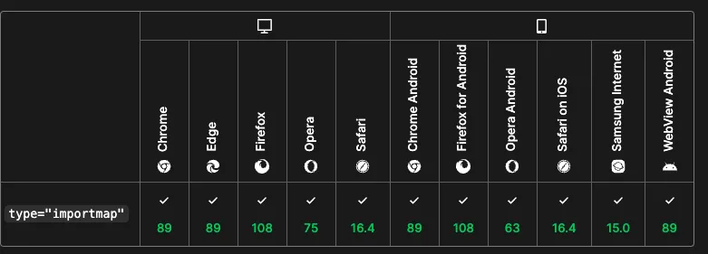

# ESM前端模块化的未来

从2002年AJAX诞生至今，前端经过了一系列的发展，各种标准和工具百花齐放。从Node.js诞生之后，前端先后出现了CommonJS AMD CMD UMD和ES Module等模块规范，底层规范的发展催生了一系列工具链的创新。

总体而言，业界经历了一系列**由规范，标准引领工程化改革**的过程。构建工具作为前端工程化的核心要素，与底层的前端模块化规范和标准息息相关。

## 无模块化标准阶段
早在模块化标准还没有诞生之前，前端已经存在一些产生模块化的开发手段了，比如**文件划分**，**命名空间**，**IIFE 私有作用域**。

### 文件划分
文件划分方式最原始的模块化实现，简单来说就是将应用的状态和逻辑分散到不同的文件中，然后通过Html中的script来引入。下面就是一个**文件划分**实现模块化的具体例子：
```js
// module-a.js
let data = "data"
```
```js
// module-b.js
function method(){
  console.log("execute method")
}
```
```html
// index.html
<!DOCTYPE html>
<html lang="en">
  <head>
    <meta charset="UTF-8" />
    <meta http-equiv="X-UA-Compatible" content="IE=edge" />
    <meta name="viewport" content="width=device-width, initial-scale=1.0" />
    <title>Document</title>
  </head>
  <body>
    <script src="./module-a.js"></script>
    <script src="./module-b.js"></script>
    <script>
      console.log(data);
      method();
    </script>
  </body>
</html>
```
从中可以看到`module-a`和`module-b`为两个不同的模块，通过两个`script`标签分别引入到Html中，这样做其实是有很多的风险
- 模块变量相当于在全局声明和定义，会有变量名冲突的问题
- 由于变量都在全局定义，很难知道某个变量到底属于哪些模块，调试也很困难
- 无法清晰地管理模块之间的依赖关系和加载顺序

### 命名空间
**命名空间**是模块化的另外一种实现手段，可以解决上述文件划分方式中全局变量定义所带来的一系列问题，比如：
```js
// module-a.js
window.moduleA = {
  data:"moduleA",
  method:function(){
    console.log("execute A's method")
  }
}
```
```js
// module-b.js
window.moduleB = {
  data:"moduleB",
  method:function(){
    console.log("execute B's method")
  }
}
```
```html
    <script src="./module-a.js"></script>
    <script src="./module-b.js"></script>
    <script>
      // 此时 window 上已经绑定了 moduleA 和 moduleB
      console.log(moduleA.data);
      moduleB.method();
    </script>
```
这样一来，每个变量都有自己专属的命名空间，虽然解决了某个变量到底是属于哪个模块，但是仍然没有解决引入模块顺序等等问题

### IIFE
相比于**命名空间**这样的模块化手段，**IIFE**实现的模块化安全性更高，对于模块作用域的区分更加彻底。

```js
// module-a.js
(function () {
  let data = "moduleA";

  function method() {
    console.log(data + "execute");
  }

  window.moduleA = {
    method: method,
  };
})();
```
```js
// module-b.js
(function () {
  let data = "moduleB";

  function method() {
    console.log(data + "execute");
  }

  window.moduleB = {
    method: method,
  };
})();
```
这样实现的好处在于，每个**IIFE**都会创建一个私有的作用域，在私有作用域中的变量外界是无法访问的，只有模块内部的·方法才能访问。

对于`module-a.js`中的模块来说，实际上只能在模块内部暴露出去的`method`函数才能通过闭包去访问，而在其它模块中无法直接去访问。这就是这个模块的私有成员功能，避免了外界的非法修改。

:::tip
在这个时期，无论是哪一种实现方案，都没有解决一个核心的问题**模块加载**。如果模块与模块之间存在依赖关系，一旦顺序不对，都会产生对应的Bug。
:::

## CommonJS规范
CommonJS是业界最早正式提出的JavaScript模块规范，常用于Node服务端，一般用于两个方面：
- 统一的模块化代码规范
- 实现自动加载模块的加载器（loader）
```js
// module-a.js
var data = "hello world";
function getData() {
  return data;
}
module.exports = {
  getData,
};

// index.js
const { getData } = require("./module-a.js");
console.log(getData());
```
代码中使用`require`来导入一个模块，用`module.exports`来导出一个模块。然后通过Node内部对应的loader来转译模块代码，最后模块代码都会被处理成
```js
(function (exports, require, module, __filename, __dirname) {
  // 执行模块代码
  // 返回 exports 对象
});
```
对于CommonJS而言，一方面它定义了一套完整的模块化代码规范，另一个方面Node.js为之实现了自动加载模块的`loader`，但实际上依然存在一些缺陷:
- 模块加载器由Node.js提供，以来了Node.js本身的功能实现。比如文件系统，CommonJS是无法直接放到浏览器中去执行的。
- CommonJS本身约定以同步的方式进行模块加载，这种加载机制放在服务端是没问题的，一来模块都在本地，不需要网络IO，二来只有服务启动时才会加载模块，而服务端启动后会一直运行，所以对于后续的服务性能并没有太大的影响。但是这种机制放在浏览器中就会出现大量的问题，它会产生同步的模块请求，浏览器等待响应返回后才能继续模块，也就是说，**模块请求会造成浏览器的JS解析过程的阻塞**，导致页面加载速度缓慢。

总之，CommonJS是一个不太适合在浏览器中运行的模块规范。

## ESM
`ES Module`是由ES官方提出的模块化规范，作为一个官方提出的规范，这个规范已经得到了现代浏览器的内置支持。在现代浏览器中，如果在HTML中加入含有`type="module"`属性的script标签，那么浏览器就会按照ES Module规范来进行依赖加载和模块解析，这也是Vite在开发阶段实现no-bundle的原因，由于模块加载的任务交给了浏览器，即使不打包也可以顺利运行模块代码

:::tip
Vite所倡导的no-bundle理念的真正含义：利用浏览器原生ES模块的支持，实现开发阶段的Dev Servere，进行模块的按需加载，**而不是先整体打包再进行加载**

当然no-bundle所影响的范围只限于业务代码，对于一些第三方代码vite做了依赖预构建

在Vite项目中，一个`import`语句即代表了一个HTTP请求，Vite Dev Server 会读取本地文件，返回浏览器可以解析的代码。当浏览器解析到新的import语句，又会发出新的请求。
:::

下面就是一个使用ES Module的实际例子：
- 浏览器中：
```js
// main.js
import { methodA } from "./module-a.js";
methodA();

//module-a.js
const methodA = () => {
  console.log("a");
};

export { methodA };
```
```html
<script type="module" src="./main.js"></script>
```
- Node中：
```json
// package.json
{
  "type": "module"
}
```
然后Node.js便会默认以ESM的规范解析模块.

同时，ES Module 作为 ECMAScript 官方提出的规范，经过五年多的发展，不仅得到了众多浏览器的原生支持，也在 Node.js 中得到了原生支持，是一个能够跨平台的模块规范。同时，它也是社区各种生态库的发展趋势，尤其是被如今大火的构建工具 Vite 所深度应用。可以说，ES Module 前景一片光明，成为前端大一统的模块标准指日可待。

## ESM进阶
### import map
在浏览器中可以使用包含`type=“module”`属性的`script`标签来加载ES模块，而模块路径主要包含三种：
- 绝对路径，如：`https://cdn.skypack.dev/react`
- 相对路径，如：`./module-a`
- `bare import`，直接写一个第三方包名，如`react`,`lodash`

对于前两种模块路径浏览器是原生支持的，而对于`bare import`，在Node.js中可以直接进行，因为Node.js解析算法会从项目中的`node_modules`找到第三方包的模块路径，但是放在浏览器中就无法直接进行了。

而现代浏览器内置的`import map`就是为了解决这个问题，用一个简单的例子来说明：

```html
<!DOCTYPE html>
<html lang="en">

<head>
  <meta charset="UTF-8">
  <meta http-equiv="X-UA-Compatible" content="IE=edge">
  <meta name="viewport" content="width=device-width, initial-scale=1.0">
  <title>Document</title>
</head>

<body>
  <div id="root"></div>
  <script type="importmap">
  // 这是一个映射表
  {
    "imports": {
      "react": "https://cdn.skypack.dev/react"
    }
  }
  </script>

  <script type="module">
    import React from 'react';
    console.log(React)
  </script>
</body>

</html>
```
在支持`import map`的浏览器中，在遇到`type="importmap"`的script标签时，浏览器会记录下第三方包的路径映射表，在遇到`bare import`时会根据这张表去远程拉取代码

`import map`的却点在于兼容性实在是一般般



对于兼容性问题，社区里面也有对应的包来解决：[es-module-shims](https://github.com/guybedford/es-module-shims)

这个包处理包含`import bare`之外，还聚合了各大ESM特性，其中包括但不限于：
- `dynamic import`。即动态导入
- `import.meta`和`import.meta.url`。当前模块的元信息，类似于NodeJS的`__dirname`,`__filename`
- `modulepreload`。在link标签上加入`rel="preload"`来进行资源预加载，即在浏览器解析HTML之前就开始加载资源，现在对于ESM也有对应的`modulepreload`来支持这个行为
- `JSON Modules`和`CSS Modules`，即通过下面的方式引入`json`和`css`：
```html
<script type="module">
// 获取 json 对象
import json from 'https://site.com/data.json' assert { type: 'json' };
// 获取 CSS Modules 对象
import sheet from 'https://site.com/sheet.css' assert { type: 'css' };
</script>
```
:::tip
**GPT4 是这么解释的:**
"bare import" 是一种 JavaScript 模块导入语法，通常在 ES6 模块或 Node.js 中使用。它指的是在 import 语句中直接使用模块名，而不是使用相对或绝对路径。

这种导入方式的工作原理取决于你的 JavaScript 运行环境。在 Node.js 中，当你使用 bare import，Node 会查找 node_modules 目录（或者其他在 NODE_PATH 环境变量中指定的目录）来找到对应的模块。

在浏览器中，原生的 ES6 模块不支持 bare import，必须使用相对或绝对 URL。但是，很多现代 JavaScript 构建工具，如 webpack、Rollup 或 Snowpack，都支持在浏览器中使用 bare import。这些工具在构建过程中会将 bare import 解析为实际的文件路径。

总的来说，bare import 是一个方便的方式来导入模块，但是它的行为会根据你的运行环境和使用的工具有所不同。
:::

### NodeJS包导入导出策略
在NodeJS中一般有两种方式可以使用原生的ES Module：
- 文件以`.mjs`结尾
- package.json中声明`type:"module"`

在Nodejs处理 ES Module 导入导出的时候，如果是处理 npm 包级别的情况，其中的细节比较复杂。

如果要导出一个包，分别是`main`和`exports`属性，这两个属性都来自于`package.json`，并且根据Node官方的resolve算法，`exports`的优先级比`main`更高，如果同时设置了这两个属性，那么exports的优先级会更高

`main`的使用比较简单，设置包的入口文件路径即可，如：
```js
"main":"./dist/index.js"
```
重点在于`exports`属性，它包含了多种导出形式：**默认导出**，**子路径导出**，**条件导出**，这些导出形式如下：
```json
// package.json
{
  "name": "package-a",
  "type": "module",
  "exports": {
    // 默认导出，使用方式: import a from 'package-a'
    ".": "./dist/index.js",
    // 子路径导出，使用方式: import d from 'package-a/dist'
    "./dist": "./dist/index.js",
    "./dist/*": "./dist/*", // 这里可以使用 `*` 导出目录下所有的文件
    // 条件导出，区分 ESM 和 CommonJS 引入的情况
    "./main": {
      "import": "./main.js",
      "require": "./main.cjs"
    },
  }
}

```
对于**条件导出**这种情况，可以定义为嵌套条件导出，如：
```json
{
  "exports": {
    {
      ".": {
       "node": {
         "import": "./main.js",
         "require": "./main.cjs"
        }     
      }
    }
  },
}
```
- `import`:用于 import 方式导入的情况，如`import("package-a")`
- `require`: 用于 require 方式导入的情况，如`require("package-a")`
- `default`:兜底方案，如果前面的条件都没命中，则使用 default 导出的路径

如果要导入相关的包，也就是在`package.json`中的`imports`字段，一般是这样声明的:
```json
{
  "imports": {
    // key 一般以 # 开头
    // 也可以直接赋值为一个字符串: "#dep": "lodash-es"
    "#dep": {
      "node": "lodash-es",
      "default": "./dep-polyfill.js"
    },
  },
  "dependencies": {
    "lodash-es": "^4.17.21"
  }
}
```
这样就可以直接在自己的包下面使用`import`的语句：
```js
// index.js
import { cloneDeep } from "#dep";

const obj = { a: 1 };

// { a: 1 }
console.log(cloneDeep(obj));
```
NodeJS在执行的时候会将`#dep`定位到`lodash-es`这个第三方包，当然，也可以将其定位到某个内部文件。这样相当于实现了 **路径别名** 的功能，不过与构建工具中的`alias`功能不同的在于，"imports" 中声明的别名必须全量匹配，否则Node.js会直接报错