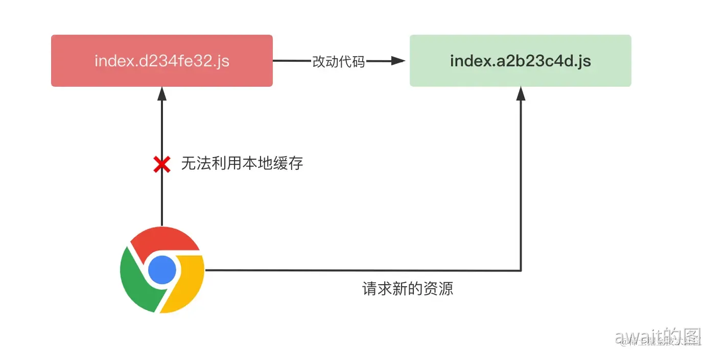
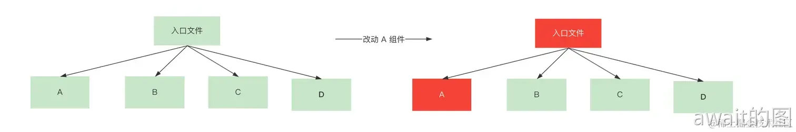

# 代码分割
在生产环境下，为了提高页面加载性能，构建工具一般将项目的代码打包（bundle）到一起，这样上线之后只需要请求少量的JS文件，大大减少了HTTP请求数量。
- bundle: 指的是整体的打包产物，包含JS和各种静态资源
- chunk: 指的是打包后的JS产物，是bundle的子集
- vender: 是指第三方包的打包产物，是一种特殊的chunk

## 代码分割解决了什么问题？
在传统的单chunk打包模式下，当项目代码越来越大时，最后会导致浏览器下载一个巨大的文件，从页面加载性能的角度来说，主要会导致两个问题：
- 无法做到**按需加载**，即使是当前页面不需要的代码也会进行加载
- 线上**缓存复用率**低下，改动一行代码会导致整个bundle产物缓存失效

### 按需加载
一般而言，一个前端页面中的 JS 代码可以分为两个部分:`Initital Chunk` 和 `Async Chunk`，前者指页面首屏所需要的 JS 代码，而后者当前页面并不一定需要，一个典型的例子就是 路由组件，与当前路由无关的组件并不用加载。而项目被打包成单 `bundle` 之后，无论是`Initial Chunk`还是`Async Chunk`，都会打包进同一个产物，也就是说，浏览器加载产物代码的时候，会将两者一起加载，导致许多冗余的加载过程，从而影响页面性能。而通过`Code Splitting`我们可以将按需加载的代码拆分出单独的 `chunk`，这样应用在首屏加载时只需要加载`Initial Chunk`即可，避免了冗余的加载过程，使页面性能得到提升。

### 缓存复用率
对于线上站点来说，服务端一般在响应资源时加上一些HTTP响应头，最常见的响应头之一就是`cache-control`，它可以指定浏览器的**强缓存**，比如设置如下：
```html
cache-control: max-age=31536000
```
这样表示资源过期时间为一年，在过期之前访问相同的**资源url**，浏览器直接利用本地缓存，并不用给服务端发送请求，这就降低了页面加载的网络开销。不过，在单chunk打包模式下，一旦有一行代码的变动，整个chunk的url地址都会变化：



由于构建工具一般会根据产物的内容生产hash，一旦内容发生改变导致整个chunk产物的强缓存失效，所以单chunk打包模式下的缓存命中率极低，基本为0。

相反，经过代码分割之后，代码的改动只会影响部分的chunk哈希改动



这样b c d三个产物的url没有发生变化，从而使浏览器复用本地的缓存策略，提升线上应用的加载性能。

## Vite的分割
Vite的默认拆包的优势体现在于实现了CSS代码分割与业务代码，第三方库代码，动态import模块代码三者的分离，但是缺点比较明显，第三方库的打包产物容易变得比较臃肿，当一个打包文件超过**500KB**以上，Vite就会发出警告，希望使用Rollup中的拆包API`manualChunks`

## 自定义拆包策略
针对更加细粒度的拆包，Vite底层的打包引擎Rollup提供了`manualChunks`，让开发者进行自定义拆包策略，它属于Vite配置的一部分，示例如下：
```js
export default {
	build:{
    rollupOptions:{
      output:{
        manualChunks:{}
      }
    }
  }
}
```
`manualChunks`主要有两者配置形式，可以配置为一个对象或者一个函数
```js
{
  build: {
    rollupOptions: {
      output: {
        // manualChunks 配置
        manualChunks: {
          // 将 React 相关库打包成单独的 chunk 中
          'react-vendor': ['react', 'react-dom'],
          // 将 Lodash 库的代码单独打包
          'lodash': ['lodash-es'],
          // 将组件库的代码打包
          'library': ['antd', '@arco-design/web-react'],
        },
      },
    }
  },
}
```
这样第三方库的大文件被拆分为了更小的chunk，这样第三方包在更新的时候，也只会更新其中一个chunk的url，更不是去全量更新，从而提升了第三方包产物的缓存命中率，每个chunk可能还是过大，可以考虑gzip来进行压缩。