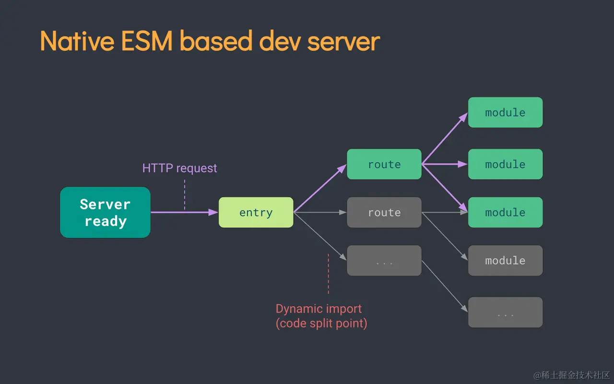
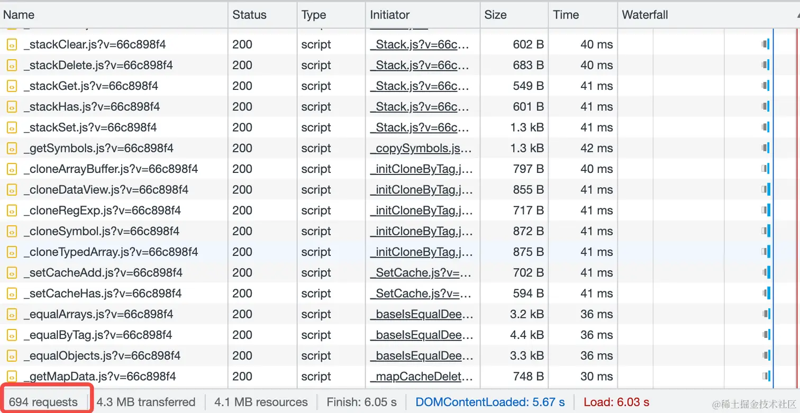
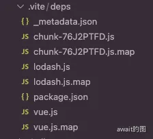
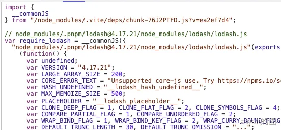
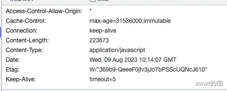

# 依赖预构建
Vite是一个提倡`no-bundle`的构建工具，相对于webpack，它能做到开发时的模块按需编译，而不是先打包后再加载。

对于模块代码来说，其实应该分为两个部分，一部分是源代码，也就是业务代码，另一部分是第三方依赖的代码，即`node_modules`中的代码。所谓的`no-bundle`是对于源代码而言，对于第三方依赖而言，Vite依然选择bundle(打包)，并且使用速度极快的打包器Esbuild来完成这个过程，达到秒级的依赖编译速度。

## 为什么需要依赖预构建？
不使用依赖预构建，会有哪些问题？

首先 Vite 是基于浏览器原生ES模块规范实现的Dev Server，不论是应用代码，还是第三方依赖的代码，理应符合 ESM 规范才能正常运行

但是，但是，现在的很多第三方库没有这个标准，所以CommonJS格式的代码在Vite中必须转换成ESM格式的产物，否则无法直接运行。

再转换代码格式这一步，就需要使用预构建去做转换

另外还有一个重要的问题，就是**请求瀑布流问题**，比如知名的`lodash-es`库本身是有ES版本产物的，可以在Vite中直接运行。但实际上，它在加载时会发出特别多的请求，导致页前加载的前几秒几乎都处于卡顿状态

之所以会出现这样的问题，就是因为代码中调用了`debounce`方法，而这个方法同时又依赖了很多工具函数导致的

每个`import`都会触发一次新的文件请求，因此在这种 **依赖层级深 涉及模块数量多** 的情况下会触发成百上千个网络请求，巨大的请求量加上Chrome对同一个域名下只能同时支持6个HTTP并发请求限制，在进行**依赖预先构建后**，`lodash-es`这个库的代码被打包成为一个文件，这样请求的数量会骤然减少，页面加载也快了很多

总而言之，在依赖预构建阶段，Vite做了这么两件事情：
- 将其他格式的产物转换为ESM格式，使其在浏览器通过`<script type="module"><script>`的方式正常加载
- 打包第三方库的代码，将各个第三方库分散的文件合并在一起，减少HTTP请求数量，避免页面加载性能劣化

这两件事情全部由性能优异的Esbuild (底层golang实现) 开发完成，而不是传统的Webpack/Rollup，所以不会有很明显的打包性能问题，反而是Vite项目启动飞快的核心原因

## 强制缓存
在进行依赖预构建之后，可以在`node_modules`中的`.vite`的`deps`中查看到被缓存构建的产物被放在其中

可以看见第三方包的引入路径被重写了

对于依赖的请求结果，其实上是设置强缓存了

缓存过期时间被设置为了一年，表示缓存过期前浏览器对vite的预构建产物的请求不会经过Vite Dev Server，而是直接使用缓存结果