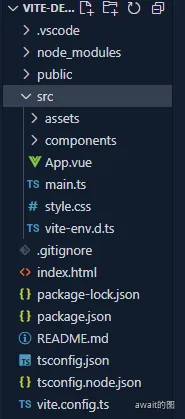
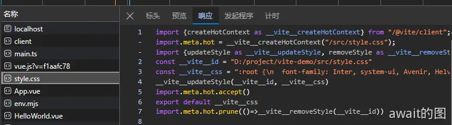

# 初识Vite项目
## 项目结构
当使用`npm create vite`创建好一个vue项目之后，可以得到这样的一个项目结构

值得注意的是，在项目根目录中有一个`index.html`文件，这个文件十分关键，因为 Vite 默认会把项目根目录下的`index.html`作为入口文件。也就是说，当访问项目启动之后的地址的时候，Vite 的 Dev Server 会自动返回这个 HTML 文件的内容。

```html
<!doctype html>
<html lang="en">
  <head>
    <meta charset="UTF-8" />
    <link rel="icon" type="image/svg+xml" href="/vite.svg" />
    <meta name="viewport" content="width=device-width, initial-scale=1.0" />
    <title>Vite + Vue + TS</title>
  </head>
  <body>
    <div id="app"></div>
    <script type="module" src="/src/main.ts"></script>
  </body>
</html>
```
由于现代浏览器原生支持了 ES 模块规范，因此原生的 ES 语法也可以直接放到浏览器中执行，只需要在 `script` 标签中声明 `type="module"` 即可。比如上面的 `script` 标签就声明了 `type="module"`，同时 src 指向了`/src/main.ts`文件，此时相当于请求了`http://localhost:5174/src/main.ts`这个资源，Vite 的 Dev Server 此时会接受到这个请求，然后读取对应的文件内容，进行一定的中间处理，最后将处理的结果返回给浏览器。

再来看一下`mian.ts`中的内容：
```ts
import { createApp } from 'vue'
import './style.css'
import App from './App.vue'

createApp(App).mount('#app')
```
这里需要注意的是，浏览器其实也并不认识css语法，但是却可以直接 import css 文件

这里主要就是在于 **Vite Dev Server** 做了”中间处理“，再读到`main.ts`之后，Vite去对文件的内容再次进行了编译，其实是可以看到编译之后的结果的：



在Vite项目中，**一个import 语句即代表一个 HTTP 请求。**上述两个语句则分别代表了两个不同的请求，Vite Dev Server 会读取本地文件，返回浏览器可以解析的代码。当浏览器解析到新的 import 语句，又会发出新的请求，以此类推，直到所有的资源都加载完成。

现在，应该知道了 Vite 所倡导的`no-bundle`理念的真正含义: **利用浏览器原生 ES 模块的支持，实现开发阶段的 Dev Server，进行模块的按需加载**，而不是**先整体打包再进行加载。**相比 Webpack 这种必须打包再加载的传统构建模式，Vite 在开发阶段省略了繁琐且耗时的打包过程，这也是它为什么快的一个重要原因。

## 配置文件
一般情况下，可以通过修改配置文件去完成对Vite的日常配置，可以查找到项目中的`vite.config.ts`配置文件，内部配置代码如下：
```js
import { defineConfig } from 'vite'
import vue from '@vitejs/plugin-vue'

// https://vitejs.dev/config/
export default defineConfig({
  plugins: [vue()],
})
```
可以看到配置文件中默认在 plugins 数组中配置了官方的 vue 插件，来提供 Vue 项目编译和热更新的功能。

如果想要修改入口文件`index.html`位置，也可以这么做：

```js
// vite.config.ts
import { defineConfig } from 'vite'
// 引入 path 包注意两点:
// 1. 为避免类型报错，你需要通过 `pnpm i @types/node -D` 安装类型
// 2. tsconfig.node.json 中设置 `allowSyntheticDefaultImports: true`，以允许下面的 default 导入方式
import path from 'path'
import react from '@vitejs/plugin-react'

export default defineConfig({
  // 手动指定项目根目录位置
  root: path.join(__dirname, 'src')
  plugins: [vue()]
})

```
上面这种情况一般发生在`index.html`放在了项目中的`src`之下

## 生产环境构建
在生产环境中，Vite会基于Rollup来进行打包，并且采取一系列的打包优化手段，从`package.json`中可以看到:
```js
  "scripts": {
    "dev": "vite",
    "build": "vue-tsc && vite build",
    "preview": "vite preview"
  },
```
在`vite build`之前会执行`tsc`命令，`tsc`作为TypeScript的官方编译命令，可以用于编译TypeScript代码并且进行类型检查，这里是用来打包之前对项目的类型做进一步检查，可以从项目`tsconfig.json`中有这样一句配置：
```js
{
  "compilerOptions": {
    // 省略其他配置
    // 1. noEmit 表示只做类型检查，而不会输出产物文件
    // 2. 这行配置与 tsc --noEmit 命令等效
    "noEmit": true,
  },
}
```
虽然 Vite 提供了开箱即用的 TypeScript 以及 JSX 的编译能力，但实际上底层并没有实现 TypeScript 的类型校验系统，因此需要借助 `tsc` 来完成类型校验(在 Vue 项目中使用`vue-tsc` 这个工具来完成)，在打包前提早暴露出类型相关的问题，保证代码的健壮性。