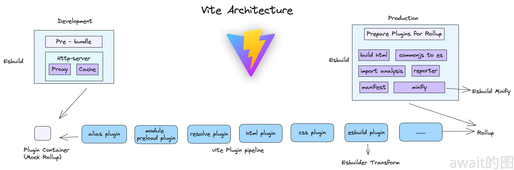

# 双引擎架构
Vite的底层深度使用了两个架构引擎：**Esbuild**和**Rollup**

## 架构图


可以看出Vite不仅仅是开发阶段使用Esbuild和在生产环境使用Rollup这样的简单概念

## Esbuild
**Esbuild**是Vite的高性能的得力助手，在很多**关键的构建阶段**让Vite获得了非常不错的性能优异，如果使用传统的打包器/编译器完成，开发体验会下降一大截。

### Esbuild作为Bundle工具
Esbuild首先被用在了开发阶段的依赖预构建阶段

一般来说，`node_modules`依赖的大小要么几百MB甚至上GB，会远超项目源代码，如果这些依赖直接选择在Vite中去使用，会出现一系列的问题，主要是ESM格式的兼容性问题和海量请求的问题，另外，还需要在应用启动前进行**打包并且转换为ESM格式**

Vite之前使用Rollup来做这件事情，但是Esbuild的性能确实太强大了,后面选择了使用Esbuild


当然哈,Esbuild也有一些小缺点，这里可以说一下：
- 不支持降级到`ES5`的代码，意味着在低端浏览器会跑不起来
- 不支持`const enum`等语法，意味着单独使用这些语法在esbuild中会直接抛错
- 不提供操作打包产物的接口，像Rollup中灵活处理打包产物的能力（如renderChunk钩子），在Esbuild中完全没有
- 不支持自定义Code Splitting 策略。传统的 Webpack 和 Rollup 都提供了自定义拆包策略的API，而Esbuild并未提供，从而降级了拆包优化的灵活性

:::tip
虽然 Esbuild 拥有这些局限性，依然不妨碍 Vite 在**开发阶段**使用它成功启动项目并获得极致的**性能提升**，生产环境处于稳定性考虑当然是采用功能更加丰富，生态更加成熟的Rollup作为依赖打包工具。
:::

### Esbuild用于文件编译
在依赖预构建阶段，Esbuild作为Bundler的角色存在。而在 TS/JS 单文件编译上面，Vite也使用过Esbuild进行语法转译，也就是将 Esbuild 作为 Transformer 来用、


Esbuild 转译 TS 或者 JSX 的能力通过 Vite 插件提供，这个 Vite 插件在开发环境和生产环境都会执行

:::tip
Vite已经将Esbuild的Transformer能力用到了生产环境。而且，对于低端浏览器场景，Vite仍然可以做到语法和Polyfill安全
:::

这部分能力用于替换原先的 Babel 或者 TSC 的功能，因为Babel和TSC实在是太慢了,实在比不过Esbuild

Esbuild Transformer能带来巨大的性能提升，但其自身也有局限性，最大的局限性在于TS中的类型检查问题。这是因为Esbuild并没有实现TS的类型系统，在编译TS文件时仅仅只是抹掉了类型相关的代码，暂时没有能力实现类型检查。

所以一般在vite创建的默认工程脚本中，`vite build`之前会执行一下`tsc`命令

要解决类型问题，更推荐使用TS的编辑器插件。然后在开发阶段就能把问题早点暴露出来。

### Esbuild 用于代码压缩

:::tip
Vite从2.6版本开始，就官宣默认使用Esbuild来进行生产环境的代码压缩，包括JS代码和CSS代码
:::

在生产环境中Esbuild压缩器通过插件的形式融入到了Rollup的打包流的过程中：


一样的，追求速度，因为Esbuild的压缩效率非常之高。

传统的方式是使用Terser这种JS开发的压缩器来实现，在Webpack或者Rollup中作为一个Plugin来完成代码打包后的压缩混淆工作，而且Terser比较慢，其原因在于：
- 压缩这项工作涉及到了大量的AST操作，并且在传统的构建流程中，AST在各个工具之间无法共享，比如Terser就无法与Babel共享一个AST，造成了很多重复解析的过程。在 Esbuild 打包的过程会有几个关键环节，TS/JS 编译、模块打包、代码压缩，这几个环节在 Esbuild 都能够达到 AST 的复用，而在 webpack 中就做不到，因为各个环节设计的工具不一样，AST 标准也不一样。
- JS本身是属于解释性和即时编译的语言，对于压缩这种CPU密集型的工作，其性能是远远比不上Golang这种语言的（Esbuild的底层是Golang实现的）

可以看到像echarts这样大型库的压缩性能测试项目：


### 总结
Vite将Esbuild作为自己的性能利器，将Esbuild各个垂直方向的能力Bundler Transformer Minifier 利用的淋漓尽致，给Vite的高性能提供了有利的保证

## Rollup
Rollup是作用于Vite用作生产环境打包的核心工具，也直接决定了Vite的插件机制设计。

### 生产环境Bundle
虽然ESM已经得到了众多浏览器的原生支持，但生产环境做到完全no-bundle也不行，会有网络性能问题。为了在生产环境中也去得到优秀的产物性能，Vite默认选择在生产环境中利用Rollup打包，基于Rollup本身成熟的打包能力进行扩展和优化

- CSS代码分割。如果某个异步模块中引入了一些CSS代码，Vite会自动将这些CSS抽离出来生产成一个单独的文件，提高线上产物的缓存复用率。不用Esbuild，是因为Esbuild没有提供自定义分割代码的能力
- 自动预加载。Vite会自动为入口chunk的依赖自动生成预加载标签`<link rel="modulepreload">` 比如

```html
<head>
  <!-- 省略其它内容 -->
  <!-- 入口 chunk -->
  <script type="module" crossorigin src="/assets/index.250e0340.js"></script>
  <!--  自动预加载入口 chunk 所依赖的 chunk-->
  <link rel="modulepreload" href="/assets/vendor.293dca09.js">
</head>
```
这种适当的预加载的做法会让浏览器提前下载好资源，从而优化页面的性能。

- 异步Chunk加载优化。在异步引入的Chunk中，通常会有一些共有的模块，如现在有两个异步引入的Chunk:A和B，而且两者有一个公共依赖C，如下图


一般情况下，Rollup打包之后，会先请求A，然后浏览器在加载A的过程中才去决定请求和加载C，但Vite在进行优化之后，请求A的同时会自动预加载C,通过优化Rollup产物依赖加载方式节省了不必要的网络开销，也就是**不必要的网络延迟**

### 兼容插件机制
无论是开发还是生产阶段，Vite都根植于Rollup的插件进制和生态


在开发阶段，Vite自己实现了一个`Plugin Container`，来模拟Rollup调度各个Vite的插件的执行逻辑，可以说
:::tip
Vite的插件写法都是完全兼容Rollup的，因此在生产环境中将所有的Vite插件传入Rollup是没问题的，但反过来说，Rollup插件却不一定能够完全兼容Vite
:::