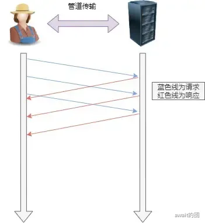

# 应用层

## 域名系统DNS
DNS（Domain Name System）是因特网使用的命名系统，用来把域名转换为IP地址。

从理论上讲，整个互联网可以只是用一个域名服务器，然而一旦这个域名服务器崩了，那么整个网络就会瘫痪了。

所以互联网的域名系统被设计为了一个联机分布式数据库系统。DNS使大多数名字都在本地进行解析（resolve），仅仅使用少量解析需要在因特网上通信。

域名系统的过程的简单概括：当某一个应用进程需要把主机名解析为IP地址时，这个应用进程就调用解析程序，并称为DNS的一个客户，把待解析的域名放在DNS请求报文中，以UDP用户数据报方式发给本地域名服务器。本地域名服务器在查找域名后，把对应的IP地址放在回答报文中返回。应用经常获得目的主机的IP地址后即可进行通信。

:::tip
如果本地域名服务器不能回答这个请求，则此域名服务器就暂时称为DNS中的另一个客户，并向其他域名服务器发出查询请求。这种过程直到找到能够回答请求的域名服务器为止
:::

## 域名服务器
互联网上的DNS域名服务器也是按照层次来进行安排的。每一个域名服务器都只对域名体系种的一部分进行管辖：


根据这些域名服务器所起到的作用，只需要把域名服务器划分为以下四种不同的类型：**根域名服务器** **顶级域名服务器** **权限域名服务器** **本地域名服务器**

### 根域名服务器
根域名服务器是最高层次的域名服务器，所有根域名服务器都知道所有顶级域名服务器的域名和IP地址。

不管是哪个本地域名服务器，只要自己无法解析，首先要求于根域名服务器。假定所有根域名服务器都瘫痪了，那么整个DNS系统就无法工作。

:::tip
互联网上一共有13个不同IP地址的根域名服务器，它们的名字是用一个英文字母命名，从a一直到m。这些根域名服务器相应的域名分别为`a.rootservers.net`，`...`，`m.rootservers.net`
:::

### 顶级域名服务器
这些域名服务器负责管理在该顶级域名服务器注册的所有二级域名。当收到DNS查询时，就会给出相应的回答

### 权限域名服务器
这就是前面已经讲过的负责一个区的域名服务器。当一个权限域名服务器还不能给出最后的查询回答时，就会告诉发出查询请求DNS客户，下一步应当找哪一个权限域名服务器

### 本地域名服务器
本地域名服务器并不属于上图的域名结构，但是它对于域名系统来说是非常重要的。当一个主机发出DNS查询请求时，这个查询请求报文就发松给本地域名服务器。

本地域名服务器离用户较近，一般不超过几个路由器的距离。

:::tip
为了提高域名服务器的可靠性，DNS域名服务器都把数据复制到几个域名服务器来保存，其中的一个是主域名服务器，其他的是辅助域名服务器。这样保证出现故障时有备用服务器。
:::

## 域名解析过程
### 递归查询
主机向本地域名服务器的查询采用递归查询。

递归查询就是：如果主机所询问的本地域名服务器不知道被查询域名的IP地址，那么本地域名服务器就以DNS客户的身份，向其他根域名服务器继续发出查询请求报文（**即替该主机继续查询**），而不是让该主机自己进行下一步的查询。因此，递归查询返回的查询结果或者所要查询的IP地址，或者报错，表示无法查询到所需的IP地址。

### 迭代查询
本地域名服务器向根域名服务器的查询通常是采用迭代查询。

迭代查询的特点是：当根域名服务器收到本地域名服务器发出的迭代查询请求报文时，要么给出所查询的IP地址，要么告诉本地域名服务器：**下一步应当向哪一个域名服务器进行查询。**

然后让本地域名服务器进行后续的查询：
- 根域名服务器通常把自己知道的顶级域名服务器的IP地址告诉本地域名服务器，让本地域名服务器再向顶级域名服务器查询
- 顶级域名服务器在收到本地域名服务器的查询请求后，要么给出所要查询的IP地址，要么告诉本地域名服务器下一步应当向哪一个域名服务器进行查询

最后知道了所要解析的域名的IP地址，然后把这个结果返回给所查询的主句：

:::tip
当然，本地域名服务器也可以采用递归查询，这取决于最初的查询请求报文的设置是要求使用哪一种查询方式。
:::


为了提高DNS查询效率，并减轻根域名服务器的负荷的减少互联网的DNS查询报文数量，在域名服务器中广泛地使用了高速缓存，**有时也称为高速缓存域名服务器。**高速缓存用来存放最近查询过的域名以及从何处获得域名映射信息的记录。

## HTTP协议
HTTP是超文本传输协议，是用于在两点之间进行超文本传输的协议

### HTTP状态码
HTTP状态码来表示本次HTTP传输的结果状态

以下是一些常见的状态码列表和解释
|编码|含义|
|------|------|
|200 OK|表示一起正常，只要是非`HEAD`请求，服务器返回的响应头都会有body数据|
|204 No Content|表示一起正常，只要是非HEAD请求，服务器返回的响应头都会有body数据|
|206 Partial Content|是其中的一部分，也是服务器处理成功的状态|
|301 Move Parmanently|表示永久重定向，说明请求的资源已经不在了，需要该用新的URL再次访问|
|302 Found|表示临时重定向，说明请求的资源还在，但暂时需要用另一个URL来访问|
|304 Not Modified|304 Not Modified	表示资源为修改，重定向已存在的缓冲文件，也称为缓存重定向，用于协商缓存|
|400 Bad Request|表示客户端发送的请求报文存在错误，一般来说是参数发错了～|
|403|表示服务器禁止客户端来访问资源，并不是客户端的请求出错了|
|404|表示请求的资源在服务器上找不到，或者不存在了|
|500|服务器发生内部错误|
|501|表示客户端请求的功能还不支持，类似“即将开业，敬请期待”的意思|
|502|通常是服务器作为网关或代理时返回的错误码，表示服务器自身工作正常，访问后端服务器发生了错误|
|503|表示服务器当前很忙，暂时无法响应客户端，类似“网络服务很忙，稍后重试”|

### GET请求与POST请求的区别
根据RFC规范，**GET的语义时从服务器获取指定的资源**，这个资源可以是静态的文本，页面，图片视频等。GET请求的参数位置一般写在URL中，URL规定只能支持ASCII，所以GET请求的参数只允许ASCII字符，并且浏览器会URL的长度有限制（HTTP协议本身没有对URL做限制）

而**POST的语义上根据请求负荷（报文body）对指定的资源做出处理**，具体的处理方式视资源类型而不同。POST请求携带数据的位置一般是写在报文body中，body中的数据可以是任意格式的数据，只要客户端与服务端协商好，而且浏览器不会对body大小做限制。

:::tip
对于post来说，浏览器认为这不是一个简单请求，在浏览器会在发出真正请求之前，先发出**预检请求**，检查当前请求是否符合服务器的cors配置，如果符合，则再发出真正的请求，否则直接返回跨域报错。**如果预检请求通过了，在一定时间内重复请求是不用再次发起预检请求了**。
:::

## HTTP版本
到目前为止，HTTP的常见版本有 HTTP/1.1，HTTPS，HTTP/2.0，HTTP/3.0，不同版本的HTTP特性是不一样的。

### HTTP/1.1
其实 HTTP/1.1 是由 HTTP/2.0 演变过来的，主要有这些性能上的改进：
- 使用长链接的方式改善了 HTTP/1.0 短连接造成的性能开销
- 支持管道（pipeline）网络传输，只要第一个请求发出去了，不必等其回来，就可以发第二个请求出去，减少了整体的响应时间

接下来从HTTP/1.1的优点，缺点，性能三个方面介绍这个协议

#### HTTP/1.1优点
HTTP/1.1 最突出的优点就是**简单，灵活和易于扩展，应用广泛并跨平台**
- 简单：HTTP报文格式就是`header + body`，头部信息也是`key-value`简单文本的形式
- 易于扩展：HTTP协议里的各类请求方法，URL/URI，状态码，头字段等每个组成要求都没有被固定死，都允许开发人员自定义和扩充。比如HTTP由于随工作在应用层，所以它的**下层可以随意变化**：HTTPS就是HTTP与TCP层之间增加了SSL/TLS安全传输层。
- 先天的跨平台优势

#### HTTP/1.1缺点
HTTP不好的地方在于它的无状态和明文传输
- 无状态：无状态准确来说不是完全的缺点，它也存在优点，因为服务器不会去记忆HTTP的状态，所以不需要额外的资源来记录状态信息，所以减轻了服务器的负担；它的缺点在于由于它的无状态，当业务需求需要用户信息时，需要额外的操作来满足：Cookie + Session
- 明文传输：明文传输，导致Wrieshark这样可以抓包来直接肉眼查看。这导致不安全的因素，内容可能被窃听

#### HTTP/1.1的性能
HTTP/1.1的性能还是相当不错的，它增加了下面三点主要内容：

**[长连接]**：
早期HTTP/1.0性能上有一个很大的问题：那就是每一次请求都要新建一次TCP连接，而且是串行请求。为了解决这个TCP连接问题，HTTP/1.1提出了**长连接**的通信方式，也就是持久连接。


持久连接的特点在于：只要任意一端没有明确提出断开连接，则保持TCP连接状态，当然某个HTTP长连接超过一定时间没有任何数据交互，服务端就会主动断开这个连接

开启长连接会在请求和响应的报文头中显示:`Connection:keep-alive`

:::tip
早期设计为短连接的原因在于：早期的浏览器模式一般用于浏览一些信息，当网页内容加载完毕之后，用户可能需要花费几分钟甚至更多的时间去浏览网页的内容，此时完全没有必要继续维持底层连接。当用户访问其他网页时，再创建新的链接即可。然后新的浏览器模式下，文本内容和资源巨增，如果每请求一个资源，就创建一个链接然后关闭，代价确实太大了。
:::

**[管道网络传输]**：HTTP/1.1采用了长连接的方式，使得管道（pipeline）网络传输成为了可能。

即可在同一个TCP连接里面，客户端可以发起多个请求，只要第一个请求发出去了，不必等待其回来，就可以发第二个请求出去，可以**减少整体的响应时间**。



当然**服务器也必须按照接收请求的顺序发送这些管道化请求的响应**。如果服务端在处理A请求时耗时比较长，那么后续的请求处理都会被阻塞住，这就是“队头阻塞”。

**[队头阻塞]**：请求-应答 的模式会造成 HTTP 的性能问题：因为当顺序发送的请求序列中的一个请求因为某种原因被阻塞时，在后面排队的所有请求也一同被阻塞了，会招致客户端一直请求不到数据


#### HTTP/1.1优化
根据HTTP/1.1的基本设计思路，那么可以向下面三个点来对HTTP/1.1进行优化：
- 尽量避免发送HTTP请求
- 在需要发送HTTP请求时，考虑减少请求次数
- 减少服务器的HTTP响应的数据大小

**[避免发送HTTP请求]**:对于一些具有重复性的HTTP请求，比如每次请求得到的数据都是一样的，那么就可以对“请求-响应”的数据都缓存在本地，那么下次就直接读取本地的数据，不必再通过网络获取服务器的响应了，那么这就和浏览器的缓存策略有关了，具体可以参考 [浏览器缓存](https://www.yuque.com/await-6vbwx/cy7rpt/mrkl0of4hiep2t4m) 这篇文章

**[减少HTTP请求次数]**：第一方面，可以减少重定向次数：服务器上的有一个资源可能由于迁移，维护等原因从 url1 移到 url2 ，而客户端不知情，他还是请求url1，此时服务器不能粗暴地返回错误，而是通过**302**响应吗和**Location**头部，通知客户端该资源已经迁移到了url2上了，于是客户端需要再发送url2请求来获取服务器的资源。

那么就要多次发起HTTP请求，每一次的HTTP请求都需要经过网络，这会导致网络性能降低。

另外服务端着一方往往不只有一台服务器，比如源服务器上一级上代理服务器，然后代理服务器才与客户端通信，这是重定向就会导致客户端与代理服务器之间需要2次消息传递：


如果重定向的工作由代理服务器完成，那么就能减少HTTP请求次数：


第二方面，可以合并请求，最经典的例子就是CSS的精灵图，也可以将图片的二进制数据base64编码之后嵌入html文件中并跟随发送，这样就减少了请求图片的次数。或者借助打包工具将多个小的js文件打包成体积更大的文件。

第三方面，延迟发送请求，按需获取就是这一思路，比如分页加载图片时，下一页的图片不必要第一时间加载出来。

**[减小HTTP请求数据]**：第一方面，可以考虑无损压缩，比如gizp，客户端支持的压缩算法，会在HTTP请求中通过头部中的`Accept-Encoding`字段告诉服务器
```js
Accept-Encoding: gzip, deflate, br
```
服务器收到之后，会选择一个服务器支持的或者合适的压缩算法，然后使用此压缩算法对响应资源进行压缩，最后通过响应头部中`Content-Encoding`字段告诉客户端该资源使用的压缩算法:
```js
Content-Encoding: gzip
```
:::tip
gzip的压缩效率相比Google推出的Brotli算法还是差点意思，如果可以推荐服务器选择压缩效率更高的br的压缩算法
:::
第二方面，可以对一图片资源考虑有损压缩

### HTTPS
#### HTTPS 与 HTTP 区别
- HTTP是超文本传输协议，信息是明文传输，存在安全风险的问题。HTTPS则解决HTTP不安全的缺陷，在TCP和HTTP网络层之间加入了SSL/TLS安全协议，使得报文能够加密传输
- HTTP连接建立相对简单，TCP三次握手之后便可进行HTTP的报文传输。而HTTPS在TCP三次握手之后，还需要建立SSL/TLS握手过程，才可以进行加密报文传输
- 两者的默认端口不一样，HTTP默认端口号是80，HTTPS默认端口号是443
- HTTPS协议需要向CA（证书权威机构）申请数字证书，来保证服务器的身份是可靠可信的

#### HTTPS的优势

由于HTTP是明文传输的，所以安全上存在一些风险。

而HTTPS在HTTP与TCP层之间加入了`SSL/TLS`协议来解决这些风险：
- **信息加密**：交互的信息被加密 ---- 混合加密实现
- **校验机制**：无法篡改通信内容，只有篡改了就不能正常显示 ---- 摘要算法 + 数字签名
- **身份证书**：证明你访问的服务器是你想访问的服务器 ---- 数字证书

**[混合加密]**：HTTPS采用了对称加密和非对称加密的结合的【混合加密】方式
- 在通信建立前采用非对称加密的方式来交换对称加密的公钥
- 在通信过程中全部采用对称加密的公钥的方式来加密明文数据
之所以采用[混合加密]的方式的原因在于：
- 对称加密只使用一个密钥，运算速度很快，密钥必须保密，无法做到安全的密钥交换
- 非对称加密使用两个密钥：公钥和私钥，公钥可以任意分发但是私钥必需保密，解决了密钥交换问题但是速度较慢


**[摘要算法 + 数字签名]**
为了保证传输的内容不被篡改，需要对内容计算出一个**哈希值**，然后同内容一起传输给对方。

对方收到之后，先是对内容也计算出一个**哈希值**，然后跟发送方发送的**哈希值**做一个比较，如果**哈希值**相同，说明内容没有被篡改，否则就可以判断出内容已经被篡改了。


:::tip
通过哈希算法可以确保内容不会被篡改，**但是并不能保证【内容 + 哈希值】不会被中间人替换，因为缺少对客户端收到的消息是否来源于服务端的证明**
:::
为了避免这种情况，计算机里会用**非对称加密算法**来解决，共有两个密钥：
- 一个是公钥，这个是可以公开给所有人的
- 一个是私钥，这个必须由本人管理，不可泄露
这个两个密钥是可以**双向加解密**的，比如可以用公钥加密内容，然后私钥解密；也可以用私钥加密内容，公钥解密，流程不同，意味着目的上也有不同：
- **公钥加密，私钥解密**。这个目的是为了保证内容传输的安全
- **私钥加密，公钥解密**。这个是为了保证消息不会被冒充

一般情况下，都不会使用非对称加密来加密实际的传输内容，因为非对称加密的计算是比较消耗性能的。

所以非对称加密的用途主要还是在于**通过【私钥加密，公钥解密】的方式，来对确认的消息的安全性**，这也是数字签名算法的底层逻辑，不过私钥加密的内容不是内容本身，而是**对内容的哈希值加密**

私钥由服务端保管，然后服务端会向客户端颁发对应的公钥。

**[数字证书]**
通过上文可以知道：
- 可以通过哈希算法来确认内容的安全性
- 通过数字签名来保证消息的来源可靠性

但还缺了一步，那就是公钥被第三方拦截了并进行了伪造，那么客户端发送的消息用了盗版公钥进行加密，而服务端的私钥解密不了，但第三方却能成功解密

在计算机世界里，有一个权威机构CA（数字证书认证机构，CA就是网络世界里的公安局，公证中心），将服务器公钥放在数字证书中，只要证书可信，那么公钥也是完全可信的。


具体的做法如下图一样：
- 1. 服务器把自己的公钥注册到CA
- 2. CA用自己的私钥将服务器的公钥数字签名并颁发数字证书
- 3. 客户端拿到服务器的数字证书证书之后，使用CA的公钥确认服务器的数字证书是否具有真实性
- 4. 确认可靠后，从数字证书获取服务器公钥后，使用它对报文进行加密后发送
- 5. 服务器用私钥对报文解密即可

#### HTTPS的连接建立
SSL/TLS协议的基本流程：
- 客户端向服务器端索要并验证服务器的公钥
- 双方协商来产生【会话密钥】
- 双方采用【会话密钥】进行加密通信

TLS的【握手阶段】涉及到了**四次**通信，使用不同的密钥交换算法：


---
TLS协议建立的详细流程如下：

**[ClientHello]：**

首先由客户端向服务器端发起加密通信请求，也就是`ClientHello`请求，在这一步客户端主要向服务器发送以下一些信息：
- 客户端支持的TLS协议版本
- 客户端生产的随机数`Client Random`，后面用于生成会话密钥的条件之一
- 客户端支持的密码套件列表，如RSA加密算法


**[ServerHello]**
服务器收到客户端请求后，向客户端发出响应，也就是`ServerHello`。服务器返回的内容有如下：
- 确认TLS协议版本，如果浏览器不支持，则关闭加密通信
- 服务器生产的随机数`Server Random`，也是后面用于生成会话密钥的条件之一
- 确认的密码套件列表，如RSA加密算法
- 服务器的数字证书


**[客户端响应]:**

客户端收到服务器响应之后，首先需要通过浏览器或者操作系统中的CA公钥，确认服务器的数字证书的真实性。

如果证书中没有问题，客户端会从证书中拿到服务器的公钥，然后使用它来进行加密报文，向服务器发送下面这些信息：
- 一个随机数`pre-master key`。该随机数会被服务器公钥加密
- 加密通信算法改变通知，表示随后的信息都会用“会话密钥”加密通信
- 客户端握手结束通知，表示客户端的握手阶段已经结束。这一项同时把之前所有内容的发生的数据做个摘要，用来给服务端校验

此时服务器和客户端有了这三个随机数（`Client Random`，`Server Random`，`pre-master Key`），接着就用双方协商好的加密算法，各自生成本次通信的“会话密钥”

**[服务器最后响应]:**

服务器收到客户端的第三个随机数`pre-master key`之后，通过协商的加密算法，计算出本次通信的“会话密钥”，最后，向客户端发送最后的信息：
- 加密通信算法改变通知，表示随后的信息都将用“会话密钥”加密通信
- 服务器握手结束通知，表示服务器的握手阶段已经结束。这一项同时把之前所有内容的发生的数据做个摘要，再用会话密钥加密，用来给客户端校验。

#### 题外话
**[https一定安全吗？]**

假如客户端通过浏览器向服务端发起HTTPS请求时，被中间人拦住了，然后中间人拿到请求向服务端建立连接并转发这些请求，这样中间人相当于能够在中间完全监听到这个传输过程。

假如客户端通过浏览器向服务端发起HTTPS请求时，被中间人拦住了，然后中间人拿到请求向服务端建立连接并转发这些请求，这样中间人相当于能够在中间完全监听到这个传输过程。

但是一般来说，想要发生这种场景时有前提的，用户必须点击了接收了中间人服务器的证书，一般来说中间人会发生自己伪造的证书给浏览器，而这个伪造的证书能够被浏览器识别为非法的，于是会提示证书有问题


**其实不能说https不安全，而是自己操作导致的（就好比你把密钥全部主动发给别人，也不能怪协议不安全吧💦）**

---

**[为什么抓包工具可以抓到HTTPS的数据吗？]**

其实原理和中间人差不多，但是这种抓包工具会有自己的安全证书

### HTTP2

首先，需要知道HTTP/1.1还存在什么缺点：
- 请求/响应头部（Header）未经压缩就发送，首部信息越多延迟越大。只能压缩`Body`的部分
- 发送冗长的首部。每次互相发送相同的首部造成的浪费较多
- 并发连接有限：谷歌浏览器的最大并发连接数是6个，而且每一个连接都要经过TCP握手
- 服务器是按请求的顺序响应的，如果服务器响应慢，会导致客户端一直请求不到数据，也就是队头阻塞
- 没有请求优先级控制
- 请求只能从客户端开始做起，服务器只能被动响应

而HTTP是基于HTTPS，所以本身安全性有一定的保障，并且HTTP/2相比于HTTP/1.1性能上也有一定的改进:
- 头部压缩
- 二进制格式
- 并发传输
- 服务器主动推送资源

#### 头部压缩
HTTP/2会压缩头部，如果同时发出了多个请求，它们的头是一样或者是相似的，那么协议会**消除重复的部分**。这就是`HPACK`算法：在客户端和服务端同时维护一张头信息表，所有字段都会存入这个表，生成一个索引号，以后就不发送同样字段了，只需要更加简短的索引号，这样就提高速度了。

表中的`Index`表示索引（Key）,`Header Value`表示索引对应的Value，`Header Name`表示字段的名字，比如Index为2代表 GET，Index为8代表状态码200。

:::tip
静态表：对常见得key-value做了归类，比如`status:200`,`method:GET`

动态表：对于请求中出现的重复字段和内容进行动态的记录，前提是必须同一个连接上，重复传输完全相同的HTTP头部
:::

#### 二进制分帧
HTTP/2 不再像 HTTP/1.1 里的纯文本形式的报文，而是全面采用了二进制格式，头信息和数据体都是二进制，并且都被统称为frame：**头信息帧（Headers Frame）和数据帧（Data Frame）**


虽然对阅读不太友好，但是对于计算机来说非常友好，不需要将报文转成二进制了，而是直接解析报文，增加了数据传输的效率。

比如状态码200，在HTTP/1.1是用"2""0""0"三个字符（二进制：00110010 00110000 001100000）来进行表示的


#### 并发传输
HTTP/1.1 的实现是基于请求-响应模型的。同一个连接中，HTTP完成一个事务，才能去处理下一个事务，也就是说在发出请求等待响应的过程中，是没办法做其他事情的，如果响应迟迟不来，那么后续的无法请求，造成了**队头阻塞**的问题。

而HTTP/2引出了Stream概念，多个Stream复用在一条TCP连接上。


1个TCP连接包含多个Stream，Stream 里可以包含1个或多个Message，Message对应HTTP/1中的请求和响应，由HTTP头部和包体构成。Message里包含一条或者多个Frame，Frame是HTTP/2最小的单位，以二进制压缩格式存放在HTTP/1中的内容

可以得出一个结论：多个Stream跑在一条TCP连接上，同一个HTTP请求与响应是跑在同一个Stream中，HTTP消息可以由多个Frame构成，一个Frame可以由多个TCP报文构成

:::tip
针对不同的HTTP请求用独一无二的Stream ID来区分，接收端可以通过Stream ID有序组装成HTTP消息，不同的Stream的帧是可以乱序发送的，因此可以并发不同的Stream，也就是HTTP/2可以并行交错地发送请求和响应
:::


如上图，服务端**并行交错地**发送了两个响应：Stream 1 和 Stream3，这两个 Stream 都是跑在一个TCP连接上，客户端收到之后，会根据相同的Stream ID 有序组装成HTTP消息。

HTTP/2通过Stream实现的并发，比HTTP/1.1实现的并发要厉害得多，**因为当HTTP/2实现100个并发Stream时，只需要建立一次TCP连接，而HTTP/1.1需要建立100个TCP连接。**

#### 服务器推送
HTTP/2在一定程度上改善了传统的【请求-应答】工作模式，服务端不再是被动地响应，可以**主动**向客户端发送消息

客户端和服务端双方**都可以建立Stream**，Stream ID 也是有区别的，客户端建立的 Stream 必须是奇数号，而服务器建立的Stream必须是偶数号

比如下图，Stream 1是客户端向服务端请求的资源，属于客户端建立的 Stream，所以该 Stream 的 ID 是奇数；Stream 2 和 Stream 4 都是服务端主动向客户端推送的资源，属于服务端建立的 Stream , 所以这两个Stream ID是偶数


再比如，客户端通过HTTP/1.1请求从服务器那获取到了HTML文件，而HTML可能还需要依赖CSS来渲染页面，这时客户端还要再发起获取CSS文件的请求，需要两次消息往返，如图：


这样服务器可以主动推送一些文件，减少了消息传递的次数

#### 缺点
HTTP/2是基于TCP协议来传输数据的，TCP是字节流协议，TCP层必须保证收到的字节数据是完整且连续的，这一内核才会将缓冲区里的数据返回给HTTP应用，那么当【前一个字节数据】没有到达时，后收到的字节数据只能放在缓冲区里，只要等到这一个1字节数据到达时，HTTP/2应用层才能从内核种拿到数据，**这就形成了HTTP/2队头阻塞问题。**


一旦丢包发生，一个TCP连接种的**所有的HTTP请求都必须等待这个丢了的包被重传回来。**

### HTTP/3.0
通过前文可以知道HTTP/1.1和HTTP/2都存在队头阻塞的问题：
- HTTP/1.1是HTTP协议层面上的队头阻塞：虽然解决了请求的队头阻塞，但是**没有解决响应的队头阻塞**，因为服务端需要按顺序响应收到的请求，如果服务端处理某个请求消耗的时间较长，那么只能等响应完这个请求之后，才能处理下一个请求，这属于HTTP层的队头阻塞
- HTTP/2是TCP协议层面上的队头阻塞：虽然通过多个请求复用一个TCP连接解决了HTTP的队头阻塞，但是**一旦发生丢包，就会阻塞往所有的HTTP请求**

HTTP/2的队头阻塞根本原因是TCP协议，所以**HTTP/3直接切换TCP协议为UDP！**


UDP 发送是不管顺序，也不管丢包的，所以不会出现像 HTTP/2 队头阻塞的问题。大家都知道 UDP 是不可靠传输的，但基于 UDP 的 **QUIC** 协议 可以实现类似 TCP 的可靠性传输。

QUIC协议有这么三个特点：
- 无队头阻塞
- 更快的连接建立
- 连接迁移

#### 无队头阻塞
QUIC协议也有类似HTTP/2 Stream与多路复用的概念，也是可以在同一条连接上并发传输多个Stream，Stream可以认为就是一条HTTP请求

QUIC协议有自己的一套机制可以保证传输的可靠性。**当某个Stream发生丢包时，只会阻塞这个流，其他Stream不受影响。**

所以QUIC连接上的多个Stream之间并没有依赖，都是独立的，某个流发生丢包了，只会影响该流，其他流不受影响，而丢包的流必须等待QUIC重传丢失的包，才会将数据交给HTTP/3


#### 更快的连接建立
在HTTP/1和HTTP/2协议种，由于TCP和TLS层是分层的，所以必须先TCP握手之后才能TLS握手

HTTP/3在传输数据前虽然需要QUIC协议握手，但是这个握手过程只需要1RTT，握手的目的是为了确认双方的**连接ID**，连接迁移就是基于连接ID来实现的

但是HTTP/3的QUIC协议并不是与TLS分层，而是QUIC内部包含了TLS，他在自己的帧种可以携带TLS信息，那么也就在1个RTT中完成建立连接与密钥协商


#### 连接迁移
TCP连接中，传输协议基于HTTP协议，通过四元组（源IP，源端口，目的IP，目的端口）来确定了一条TCP连接。
:::tip
当移动设备的网络从4G切换到WIFI时，就会意味着IP地址变化了，那么就必须要断开连接，然后重新建立连接。

而建立连接的过程包含TCP三次握手，TLS四次握手的时延，以及TCP慢启动的减速过程，给用户的感觉就是网络突然卡顿了一下，因此连接的迁移成本很高
:::
而 QUIC 协议没有用四元组的方式来“绑定”连接，而是通过**连接 ID** 来标记通信的两个端点，客户端和服务器可以各自选择一组 ID 来标记自己，因此即使移动设备的网络变化后，导致 IP 地址变化了，只要仍保有上下文信息（比如连接 ID、TLS 密钥等），就可以“无缝”地复用原连接，消除重连的成本，没有丝毫卡顿感，达到了**连接迁移**的功能。

所以，QUIC是一个在UDP之上的 **伪**TCP + TLS + HTTP/2 的多路复用的协议