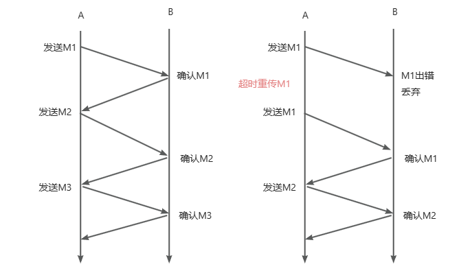

# 运输层
## 运输层的通信
运输层的通信实际上是一个主机的进程和另一个主机的进程进行交换数据。

另外运输层还有一个很重要的功能就是：**复用**和**分用**
- 复用：发送方不同的应用进程在加上适当的首部之后都可以使用运输层协议来传输数据
- 分用：运输层负责剥去报文的首部后能够把这些数据正确交付给应用进程

运输层还要对收到的报文进行一定的纠错检测

## 运输层的两个协议
运输层的两个经典协议为：
- 用户数据报协议UDP （User Datagram Protocol）
- 传输控制协议TCP （Transmission Control Protocol）

UDP在传送数据之前不需要建立连接。远地主机的运输层收到UDP报文，也不需要给出确认。

TCP提供面向连接的服务。在传送数据之前必须先建立连接，数据传送结束之后需要释放连接。TCP由于要提供可靠的服务，所以会在确认，流量控制，计时器，连接的管理上增加一些开销。

两者在计算机系统中的一些使用场景：

| 应用层协议 | 传输层协议 | 
|-------|-------|
| DNS  | UDP |
| DHCP | UDP |
| HTTP| TCP | 
| FTP | TCP |  
| SMTP | TCP |

## 运输层的端口
单个计算机中的进程是用进程标识符（一个不太大的整数）来标识的。网络中使用的计算机的操作系统种类很多，而不同的操作系统又使用的是不同格式的进程标识符。

为了使运行不同操作系统的计算机的应用进程能够互相通信，就必须使用统一的方法对TCP/IP体系的应用进程进行标志。进程使可以动态创建和撤销的，所以不能让进程作为通信的终点。

那么就需要使用端口号，只需要将报文交给目的主机的某一个合适的目的端口，剩下的工作让协议来做即可。

软件端口是应用层的各自协议进程与运输实体进行层间交互的一种地址。

而两个计算机的进程需要通信，就需要知道目的主机的IP地址和目标进程的端口号。常见的端口号：

| FTP | HTTPS | DNS | HTTP | 
|-------|-------|-------|-------|
| 21  | 443 | 53  | 80 |

## 用户数据报协议 UDP
### 概述
UDP在IP数据报服务之上增加了很少的功能，主要就是**复用**，**分用** 以及 **差错纠错** 的功能。
- UDP是无连接的，即发送数据之前不需要建立连接，所以少了开销和发送数据之前的时延
- UDP使用尽最大努力的交付，即不保证可靠交付
- UDP是面向报文的。UDP面向应用层交下来的报文，在添加UDP首部之后就交付给IP层，即一次发送一个报文。对于IP层交付上来的报文，除去首部之后就交付给上层应用层进程。
- UDP没有拥塞控制，就算是网络发送拥塞了，不会降低发送报文的速率
- UDP可以一对一，一对多，多对一，多对多的通信
- 头部开销很小，只有8个字节

### 头部报文

## 传输控制协议 TCP
### 概述
- TCP是面向连接的运输层协议，发送数据之前必须建立TCP连接
- 每一条TCP连接只能有两个端点，每一条连接只能是点对点的（一对一）
- TCP保证连接传送的数据，无差错，不丢失，不重复，按序到达
- 面向字节流，虽然应用程序和TCP的交互是一次一个数据块，但TCP把应用程序交下来的数据看成仅仅是一连串的无结构的字节流。TCP并不知道传送字节流的含义，但是它需要在字节流层面上做一些限制和处理。

### TCP头部报文

- 源端口和目的端口 ：各占2个字节，可以和IP报文中的ip信息组成套接字
- 序号：整个要传送的字节流的起始序号必须在连接建立时设置。首部中的序号字段值指的是本报文段所发送的数据的第一个字节的序号。
- 确认号：期望收到对方下一个报文段的第一个数据字节的序号。若确认号 = N，则表明序号N-1为止的所有数据都已经正确收到了
- URG：置1，表示高优先级的数据。比如，已经发送了很长的一个程序要在远地的主机上运行。后来出现了问题，用户从键盘发出中断命令。如果不使用紧急数据，那么这段信息被放在了缓存末尾，这样在所有数据都处理完了才发送过去，浪费了很多时间
- ACK：置1，表示确认号字段有效。在连接建立之后，所有传送的报文都必须置为1。
- RST：置1，表明TCP连接出现了错误，必须释放连接，然后重新建立运输连接。还可以用来拒绝一个非法的报文或拒绝打开一个连接
- SYN：置1，表明这是一个连接请求或连接接收报文。当SYN=1而ACK=0时，表明这是一个请求连接报文
- FIN：置1，表明报文段的发送方的数据已经发送完毕，并且要求释放运输连接

## TCP连接
### 可靠传输的工作原理
#### 停止等待 自动重传ARQ
“停止等待”意味着每发送完一个分组就停止发送，等待对方的确认。在收到确认之后再发送下一个分组。

在无差错的情况下，B收到M1就需要向A发送确认。A收到确认之后才能发送下一个M2。

在出现差错的情况下，B直接将出现错误的M1丢弃，并且不发送应答。那么A在一段时候后发现没收到确认就认为M1没有到达，就重发上一个分组。这就是超时重传的原理，要实现这种超时重传，需要在发送分组后就新增一个超时计时器来进行计时。

:::tip
- A在发送完一个分组之后，必须保留副本，直到确认收来。
- 分组与确认分组必须有编号，来明确是哪一个分组收到了确认，哪一个分组没收到确认。
- 超时计时器设置的时间必要比数据在分组传输的平均往返时间更长一些。
:::

还有一些特殊情况，就是发生了确认丢失和确认迟到:

在确认丢失的情况下，接收方会收到重复的M1报文，那么就丢弃这个M1，然后发送确认报文给A，不然A又会认为没有传送到M1,一直发M1。

在确认迟到的情况下，接收方也会收到重复的报文，直接丢弃，并且发送确认报文。而发送方也会收到重复的确认报文，直接丢。

可以明显看出，这种方式十分简单，但是信道的利用率太低了，为了提高传输效率，发送方可以不使用低效率的停止等待协议，而是采用流水线传输。流水线传输模式下，发送方连续发送多个分组。

#### 滑动窗口实现连续ARQ
滑动窗口以字节为单位。

假如A收到B的确认报文，其中窗口是20（字节），确认号是31（表明期望收到的下一个序号是31，30以前的数据都已经收到了）

A的发送窗口意义是：**理论上可以连续把窗口内的数据都发送出去。凡是已经发送出的数据，在没有收到确认之前都必须暂时保留，因为存在超时重传的可能。**

滑动窗口的位置由窗口前沿和后沿的位置共同确定：
- 后沿要么不动（没收到确认）要么前移（收到确认了）
- 前沿要么不动（收到确认了，但是对方的窗口缩小了，正好不动，或者没有收到确认对方的窗口大小也不变），要么前移

:::danger 注意!
发送窗口前沿也有可能后移。这是因为对方通知的窗口变小了，TCP标准强烈不要求这么做，因为很可能发送方在收到这个通知以前已经发送了窗口中的许多数据，现在又要缩小，不让发送这些数据，可能存在错误。
:::

从这个图可以看出来，描述一个窗口的状态需要3个指针p1，p2，p3。
- p3 - p1 = A的发送窗口
- p2 - p1 = 已发送但尚未收到确认的字节数
- p3 - p2 = 允许发送但尚未发送的字节数，被称为可用窗口

在某种情况下p2与p3会发生重合。这说明发送窗口的序号都被用完了，但没有收到确认，导致A的可用窗口为0。而B的确认报文可能延迟了，或者丢失了。A为了保证可靠传输，必须认为B没有收到这些数据，超时后重发这部分数据，如果新的一次情况下，确认号落到了滑动窗口中，那么p3就可以向前移动了，并发送新的数据。

需要强调以下几点：
- 虽然发送窗口是根据接收方窗口来进行设置的，但是同一时刻，A的发送窗口并不总是和B的接收窗口一样大，除了网络要经历一定的滞后，而且发送方必须根据网络的拥塞情况来调整窗口大小
- TCP通常对不安序到达的数据临时存放在窗口中，等到字节流中所缺少的字节收到之后，再交付给上层的应用程序
- 接收方必须有累积确认的功能。接收方可以在合适的时候发送确认，可以在自己有数据的时候发送时携带上确认信息
:::info
发送窗口的大小 = Math.min(接收方窗口大小，拥塞控制窗口大小)
:::

#### 滑动窗口与缓存
发送方的应用进程把字节流写入TCP的发送缓存，接受方的应用进程从TCP的接收缓存中读取字节流。

缓存要大于滑动窗口的大小。窗口只是缓存的一部分。

发送缓存的存储职责：
- 发送应用程序传送给发送方TCP准备发送的数据
- TCP已发送出但尚未收到确认的数据

接收缓存的存储职责：
- 按序到达的，但没有被接收应用程序读取的数据
- 没有按序到达的数据

#### 选择确认SACK
如果收到的报文段没有差错，只是没有按序号到达，中间只是缺少一部分序号的数据，那么可以通过选择**确认SACK**来设法只传送缺少的数据而不重传已经正确到达接收方的数据？

假如发送过来序号是1~1000，下一次的数据是1501~3000。也就是说收到了不连续的两个字节块，没收到1101~1500。

只要有这些字节块的边界信息，就可以完成整个效果。TCP的首部没有哪个字段能够提供上述这些字节块的边界信息。

如果要使用选择确认SACK，那么在建立TCP连接时，就要在TCP首部的选项中加上“允许SACK”的选项。而且需要双方先协定好，如果使用选择确认，那么原来首部中的“确认号字段”的用法仍然不变。只是以后再TCP报文段的首部中都增加了SACK选项，以便报告收到的不连续的字节块的边界。

### TCP流量控制
流量控制就是让发送方的发送速率不要太快，要让接收方来得及接收。

TCP依然通过滑动窗口实现流量控制。

假设一开始，B告诉A的接收窗口为400

在最后一次B向A发送0窗口报文之后，B的接收缓存又有了一些存储空间。于是B向A发送了rwnd = 400的报文段。然而这个报文段在传送过程中丢失了。A却一直等待收到B发送的非零窗口的通知，而B也一直等待A发送的数据，如果没有其它措施，这种相互等待的死锁局面会一直持续下去。

所以TCP为每一个连接设有一个持续计时器。只要TCP连接的一方收到了0窗口通知，就启动持续计时器。若计时器设置的时间到期，就会发送一个0窗口探测报文段。

### TCP的拥塞控制
拥塞：在某段时间内，若对网络种某一资源的需求超过了该资源所能提供的可用部分，网络性能就要变坏。

拥塞控制和流量控制的区别：
- 拥塞控制是防止过多的数据涌入到网络中，这是一种全局性过程，要涉及到所有的主机，路由器，以及降低网络传输性能有关的所有因素。
- 流量控制：点对点的通信量控制，这是一个端到端的问题。

实现拥塞控制的方法主要是：**慢开始**，**拥塞避免**，**快重传**，**快恢复**。

假定：
- 数据是单方向传送，而另一个方向只传送确认
- 接收方总是有足够大的缓存空间，因而发送窗口的大小由网络的拥塞程度来决定

#### 慢开始
发送方需要维持一个叫做拥塞窗口cwnd的状态变量。

这个变量需要取决于网络的拥塞程度来进行动态的变化。发送方让自己的发送窗口等于拥塞窗口，如果在考虑到接收方的接收能力，那么发送窗口还可能小于拥塞窗口。

控制拥塞窗口的原则是：**只要网络没有出现拥塞，拥塞窗口就再增大一些，以便于把更多的分组发送出去。但只要网络出现拥塞，拥塞窗口就减小一些，以减少注入到网络中的分组数。**

:::tip
发送方如何知道网络发生了拥塞？当网络发生拥塞时，路由器就要丢包了。因此发送方没有按时收到应当达到的确认报文，就可以猜测网络可能出现了拥塞。现在通信线路的传输质量都很好，因传输出差错而丢弃分组的概率是很小的。
:::

当主机开始发送数据时，如果立即把大量数据字节注入到网络，那么就有可能引起网络拥塞，最好的方式是先探测一下，由小到达的增加拥塞控制窗口的大小，比如：
- 发送方先设置cwnd = 1，发送保温之后收到M1确认
- 发送方将cwnd = 2，收到M1，M2确认，每收到一个确认报文，就+1窗口大小。
- 发送方将cwnd = 4 , ...
- 发送方将cwnd = 8 , ...
- ...

可以看出慢开始的**慢**并不是指cwnd的增长速度慢，而是指TCP开始发送报文段时先设置cwnd=1，这样比照大的cwnd一下子把报文段注入到网络中要**慢得多**。

#### 拥塞避免
为了防止拥塞窗口cwnd增长过大引起网络拥塞，还需要设置一个慢开始门限ssthresh。其用法如下：
- 当cwnd < ssthresh，使用慢开始算法
- 当cwnd > ssthresh，使用拥塞避免算法
- 当cwnd = ssthresh，都可以使用

拥塞避免算法的思路就是让拥塞窗口缓慢增大，即每经过一个往返时间RTT就把发送发的窗口进行加算，加1(加法增大)，而不是加倍。

:::tip
无论在慢开始阶段还是拥塞避免阶段，只要判断出了拥塞状态，**就要把ssthresh设置为当出现拥塞时的 cwnd/2(乘法减小)，然后把cwnd置1，重新开始执行慢开始算法。**
这样做的目的在于要迅速减少主机发送到网络中的分组数量，使得发生网络拥塞的路由器有足够时间把队列中积压的分组处理完成。
:::

#### 快重传
如果发送方设置的超时计时器时限已到但没有收到确认，那么很有可能是网络出现了拥塞，使得报文段在网络中的某处被丢失。在这种情况下，TCP马上把拥塞窗口cwnd减小到1，并执行慢开始算法，同时将ssthresh减半。**这是不使用快重传的情况。**

快重传算法首先要求接收方每收到一个失序的报文就立即发送重复确认报文，而不是等待自己发送消息的时候携带上。

如图：

接收方收到M1和M2之后发出了确认。现在假定接收方没有收到M3后接收到了M4，那么接收方应该马上发送M2的重复确认报文。

根据前文的可靠传输原理，接收方其实本来可以什么都不做，因为存在超时计时器，当然也可以在适当时机发送一次对M2的确认（消息携带上）。

但根据快重传的算法规定：接收方需要立马发送M2的重复确认，当发送方发送M4,M5,M6时，会连续收到三个M2的重复确认，此时就没必要等待M3过期了，而是马上重发M3。

:::tip
由于发送方能尽早重传未被确认的报文段，因此采用快重传之后可以使整个网络的吞吐量提高约20%
:::

#### 快恢复
快恢复是配合快重传一起使用的，其过程主要有下面两个要点：
- 当发送方连续收到三个重复确认时，就执行乘法减小的算法，把ssthresh减半，这是预防网络出现拥塞
- 由于发送方现在认为网络可能不存在拥塞（如果网络发生了严重的拥塞，甚至不会一连有好几个报文段连续到达接收方）。因此和慢开始不同的是，不会把cwnd设置为1，而是直接等于减半的ssthresh，然后执行拥塞避免的算法，也就是加法增大

## TCP的连接管理
### TCP的三次握手
假设A运行的是TCP客户程序，而B运行TCP服务器程序。最初两端的TCP进程都处于CLOSED状态，A主动打开连接，而B被动打开连接。

- B的TCP服务器进程先创建传输控制块 TCB，准备接收客户进程的连接请求。然后服务器进程就处于LISTEN状态，等待客户端的连接请求。
:::tip
TCB 传输控制块存储了每一个连接中的一些重要信息，如：TCP连接表，发送和接收缓存的指针，重传队列的指针，当前发送和接收的序号...
:::
- A的TCP客户也是首先创建传输控制模块TCB，然后向B发出连接请求报文段，此时首部中的同步位SYN置1，同时随机选择一个初始序号sqe=x。TCP规定，SYN报文不能携带数据，还需要消耗一个序号。此时A进入同步已发送状态(同步已发送)
- B收到连接请求报文之后，向A发送确认。在确认报文段中把SYN和ACK置1，确认号为ack = x + 1，同时也要为自己选择一个初始序号seq = y。这个报文也不能携带数据，同时需要消耗序号。此时B进入SYN-RCVD状态
- TCP客户进程收到B的确认后，还要向B给出确认。确认报文段的ACK置1，确认号ack = y +1，而自己的序号seq = x + 1。ACK报文可以携带数据。但如果不携带数据则不消耗序号，下一个报文数据报文段的序号仍是seq = x + 1。此时进入TCP已建立阶段

**question?: 为什么最后一次还要发送一次确认呢？**

主要是为了防止已失效的连接请求报文段突然传送回了B，因而产生错误。

“已失效的连接请求报文段”：A发出连接请求，但连接请求报文丢弃而未收到确认。于是A再重传一次连接请求。后来收到了确认，建立连接，释放连接...。但实际上第一次丢弃的报文并未丢弃只是延迟了，在网络中的某处停留了一段时间。导致在连接释放后，有打中了B。如果是两次握手，直接就建立连接了。但是由于B会在第三次握手时返回一个确认报文，此时A接收这个确认报文，发现自己并没有发出新的建立连接请求，因此不理会这个确认报文，避免了一次错误的请求连接

### TCP的四次挥手
数据传输结束之后，通信的双方都可以释放连接。

- A的应用进程先向其TCP发出连接释放报文段，并停止再发送数据，主动关闭TCP连接。A把连接释放报文段首部的终止控制位FIN置1，其序号seq = u，它等于前面已传送过的数据的最后一个字节的序号+1。这时A进入FIN-WAIT-1（终止等待1）状态，等待B的确认。TCP规定，FIN报文段即使不携带数据，它也消耗掉一个序号
- B收到连接释放报文段之后立即发出确认，确认号是ack = u + 1，而这个报文段自己的序号是v，等于B前面已传送过的数据的最后一个字节的序号加1。然后B就进入CLOSE-WAIT(关闭等待)状态。然后TCP服务器进程通知高层应用进程，因此现在TCP处于半关闭状态了（A到B的通道关闭了），即A已经没有数据要发送了，但B若发送数据，A仍要接收（B到A的通道关闭了）。
- A收到B的确认报文之后，就进入FIN-WAIT-2（终止等待2）状态了，等待B发出的连接释放报文。
- 如果B已经没有要向A发送的数据，其进程就通知TCP释放连接。这时B的序号为w，B还需要重复上次已发送过的确认号ack = u + 1。这时B就进入LAST-ACK状态，等待A的确认
- A在收到B的连接释放报文段之后，必须对此发出确认。在确认报文段中把ACK置1，确认号ack = w + 1，而自己的序号是seq = u + 1，因为TCP标准发送FIN报文序号消耗一个序号。然后进入到TIME-WAIT时间等待状态，此时TCP连接还未真正断开，必须经过时间的等待计时器设置的时间2MSL之后才能断开。
:::tip
MSL：最长报文段寿命
:::

**为什么在A在TIME-WAIT状态必须等待2MSL的时间呢？**
- 为了保证A发送的最后一个ACK报文段能够到达B。如果最后一个报文不能到达，那么还有2MSL时间内可能回收到B再次发来的FIN报文段，此时重置2MSL计时器。否则A直接关闭，就收不到再次发来的FIN报文段，而此时A完全关闭，那么B就一直等待确认报文，导致不能以正常的姿态进入CLOSED状态
- A在发送完最后一个ACK报文段之后，在再经过时间2MSL，就可以使本链接持续的时间内所产生的所有报文段都从网络中消失了。这样就使得下一个新的连接中不会出现这种旧的报文来干扰双方。

:::tip
除此之外，TCP其实还有一个保活计时器（keepalive timer），客户已主动与服务器建立TCP连接。但后来客户端的主机突然出现故障。显然服务器以后就不能再收到客户发来的数据。因此应当由措施使服务器不再白白等待下去。这就是使用保活计时器。服务器每收到一个客户的数据，就重新设置保活计时器，时间的设置通常是两小时。若一连发送10个探测报文段之后无客户的响应，就认为客户端出故障，那么关闭这个连接。
:::