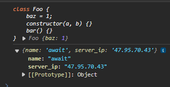

# Class
一句话概括，**class就是构造函数的语法糖**，就像 `async/await` 是 Promise 的语法糖一样。

可以这么证明：
```js
class Foo {
    baz = 1;
    constructor(a, b) {}
    bar() {}
}

typeof Foo // "function"
Foo.name // "Foo"
Foo.length // 2
```
关注函数的`prototype`属性，它关系到`instanceof`是否可以正常工作，打印结果如下：

可以看到 bar 函数出现在了原型对象上，而baz却没有。很容易理解，原型上的方法和属性可以在不同的实例之间复用，而局部数据却只能实例独享的。

class能实现的所有能力，普通函数几乎都能实现，比如支持的super，static块，static属性，私有属性，extend继承等等特性，涉及到原型链查找，闭包等诸多细节，模拟起来并不是简单。

观察一个完整的父子关系的Class的基本结构：
```js
class Parent {
    name = '';
    static home = 'beijing';
    constructor(name) {
        this.name = name;
    }
    
    say() {
        console.log(`I am ${this.name}.`);
    }
}

class Child extends Parent {
    age = 5;
    static type = 'kid';
    constructor(name) {
        // 继承Parent的name调用
        super(name);
    }
    
    say() {
        // 调用Parent的say方法
        super.say();
        console.log(`And I am ${this.age} years old.`);
    }
    
    jump() {
        console.log(`I like jumping.`);
    }
}
```
这不是Class语法的全部能力，但已经覆盖了绝大部分的场景，上面的代码总体体现了下面的这几个功能:
- 构造函数
- 类成员
- 继承，包括成员属性，成员函数，super
- 类**静态**成员

接下来以上面的代码作为基本例子，实现**翻译**成普通的function语法

## 模拟构造函数
无论是function语法还是class语法，最终都应该用new操作符来创建对象实例。

手写一个`createInstance`函数
```js
function createInstance(Constructor,...args){}
```
首先，手写的构造函数 Constructor 必须确定满足构造函数的定义。函数对象如果存在一个叫做`[[Construct]]`的内部方法，存在则代表它可以作为构造函数。显然异步函数，生成器函数就是没有`[[Construct]]`。

一般对象的`[[Constructor]]`方法实现大致如下所示：
- 创建一个对象P，使其原型链指向 Constructor.prototype
- 生成一个上下文，有两个变量关系绑定需要关注，第一个是this的指向问题，需要指向刚刚创建出来的实例p，第二个是`new.target`，需要指向Constructor
- 执行Constructor的代码，如果返回一个对象（非基本类型），那么就作为构造函数的结果，否则将P作为构造函数的结果。

用代码实现如下：
```js
function createInstance(Constructor, ...args) {
    // 绑定实例的原型为构造器的原型
    const p = Object.create(Constructor.prototype);
    // 绑定this指向
    const result = Constructor.apply(p, args);
    // 确定返回值
    if (result && typeof result === 'object') {
        return result;
    }
    
    return p;
}

```
这里无法实现`new.target`。对于这个`new.target`，并不能理解成一个对象的属性，它是一种新的语法，**只能在函数中使用**，用于判断当前函数是否是通过`new`来调用的。可以强制一个函数必须是构造函数，可以这么写：
```js
function Foo(){
    if(!new.target) throw new Error('Foo必须当作构造函数来使用！')
}

Foo() // error
```
另一个需要注意的，普通函数作为构造函数，返回的不一定是这个函数的实例，取决于里面的 return 的值类型。
```js
function Foo() {
    return [1];
}

new Foo(); // [1]
```
:::tip
即便是class语法也不能避免，它的 constructor 里面也可以return语句
:::
```js
class Foo{
    constructor(a,b){
        this.a = a
        this.b = b
        // 返回的是string类型
        return 'test'
    }
}

const foo = new Foo('a','b')

console.log(foo) // Foo {a:'a', b:'b'}
```
```js
class Foo{
    constructor(a,b){
        this.a = a
        this.b = b
        // 返回的是引用类型
        return ['test']
    }
}

const foo = new Foo('a','b')

console.log(foo) // ['test']
```

## 模拟类成员
类成员是不是函数类型，关系到了实现的原理上的不同，会有一定的差异。

函数通过`this/super`来和对象进行交流，属于实例之间可复用的过程；而非函数则属于对象自身的资产，不能在实例之间共享。

这也就造成了两种属性被存储位置的不同，函数应该定义在原型中，也就是`Constructor.prototype`上，非函数要定义在对象自身上。

这个原理，以上面的Parent为例，其say函数可以这样定义：
```js
Parent.prototype.say = function () {
    console.log(`I am ${this.name}.`);
};
```
这样的定义方法是非常不严格的，因为在`Class`生成的方法虽然在原型上，但是不能被`for...in`给遍历出来：
```js
class Foo{
    constructor(a,b){
        this.a = a
        this.b = b
    }
    say(){
        console.log('say')
    }
}

const foo = new Foo('a','b')

for(let key in foo){
    console.log('key: ' + key)
    console.log('value: ' + foo[key])
}
// a -- 'a'
// b -- 'b'
```
这是被规范严格不允许的，所以需要`Object.defineProperty`来在原型上进行定义：
```js
Object.defineProperty(Parent.prototype, 'say', {
    value: function () {
        console.log(`I am ${this.name}.`);
    },
    // 不可枚举
    enumerable: false,
    writable: true,
    configurable: true,
});
```
而且`class`语法中的属性声明应该就是defineProperty的方式，比如：
```js
function Parent(name) {
    Object.defineProperty(this, "name", {
        enumerable: true,
        configurable: true,
        writable: true,
        value: ''
    });

    this.name = name;
}
```
:::tip
不同于函数成员，非函数成员应该可以被枚举的，毕竟它属于对象而非原型。
:::

## 模拟类继承
在 Child 的构造函数中，首先必须调用super并传参数，这里的 super 毫无疑问就是父类 Parent，于是第一步：
```js
function Child(name) {
    Parent.call(this, name);
}
```
假设Child由`new`调用，并没有展开为`createInstance`，因此this首先就被创建了，并且在Parent中被定义了一个name自有属性。

然后Child还有一个自己的 age 属性：
```js
function Child(name) {
    Parent.call(this, name);
    
    Object.defineProperty(this, "age", {
        enumerable: true,
        configurable: true,
        writable: true,
        value: 5
    });
}
```
到达这一步，Child构造函数的使命已经达成，需要解决的，实现继承Parent上的函数属性，必须满足：
```js
childInstance.__proto__.__proto__... === Parent.prototype // true
```
由于知道`new`有如下的效果：
```js
childInstance.__proto__ === Child.prototype // true
```
于是可以推到出
```js
Child.prototye.__proto__... === Parent.prototype // true
Child.prototye instanceof Parent === true
```
在声明Child函数的时候，已经自带了一个Child.prototype对象，里面只有一个constructor不可枚举属性指向Child

那么可以得到这个逻辑：
```js
Child.prototype = Object.create(Parent.prototype, {
    constructor: {
        value: Child,
        enumerable: false,
        writable: true,
        configurable: true,
    },
});
```
在Child中有一个jump函数和一个调用了父类同名函数的say函数。作为函数，都应该出现在 Child.prototype 中，于是 Child.prototype 的最终定义可以写作:
```js
Child.prototype = Object.create(Parent.prototype, {
    constructor: {
        value: Child,
        enumerable: false,
        writable: true,
        configurable: true,
    },
    say: {
        enumerable: false,
        configurable: true,
        writable: true,
        value: function () {
            // 由 super.say() 翻译而来
            Parent.prototype.say.call(this);
            console.log(`And I am ${this.age} years old.`);
        }
    },
    jump: {
        enumerable: false,
        configurable: true,
        writable: true,
        value: function () {
            console.log("I like jumping.");
        }
    },
});
```
这里的简单实现，可以看出继承关系**本质上沿着原型链继承的只是函数，其他属性都是定义在当前对象上的，和原型链无关。**

## 类静态
静态成员是属于类本身的，在实例之间共享，或者可以说根本就是一个全局变量
```js
Parent.home = "beijing";
Child.type = "kid";
```
按照继承的规则，在Child也应该可以访问到home，可以用原型链来解决：
```js
Object.setPrototypeOf(Child, Parent);
```