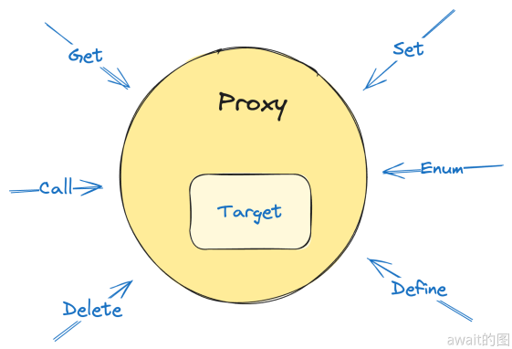

# Proxy
**Proxy** 是ES6 新增的功能。它主要用于拦截并定义对象的各种操作，比如属性的读取，赋值，枚举，删除，甚至函数调用。

Proxy 会提供一种非常强大和灵活的方式来操作和控制对象的行为。

其基本语法：
```js
let proxy = new Proxy(target, handler);
```
target 是目标对象

handler是一个包含了一组捕获器（**也被称为trap**）的对象。捕获器是一个包含了一些预定义方法的对象，这些方法可以拦截并修改对象的操作。
:::tip
target 和 handler 任一只要不是对象，上诉代码就会抛出 TypeError，所以不要将数字，字符串，布尔等基本数据类型变量当作被代理的对象。
:::

handler 是 Proxy 的看门狗，他覆盖了绝大多数可以对对象操作的途径，比如删除一个对象的某个属性，可以捕捉到这个行为，并且选择拒绝。



## handler分解
handler 就是一个普通的对象，它的以下函数属性是会被使用的：
- defineProperty
- deleteProperty
- get
- set
- getOwnPropertyDescriptor
- getPrototypeOf
- setPrototypeOf
- has
- ownKeys
- apply
- construct
- isExtensible
- preventExtensions

以简单的`Set`为例子，它可以拦截对象的“写”操作：
```js
const origin = {
    name: 'Mike',
};

const proxy = new Proxy(origin, {
    set(target, key, value) {
       if ('name' === key) return false;
       // 利用反射来设置属性，而且正好Reflect API返回布尔值的设计可以在Proxy中使用
       return Reflect.set(target, key, value);
    }
});

proxy.name = 'Jim'; // failed

console.log(proxy.name); // "Mike"

proxy.age = 16; // success

console.log(proxy.age); // 16
```
这里实现了一个锁定`name`属性的小功能，但不妨碍对其它属性的赋值。

### getPrototypeOf
当使用`Object.getPrototypeOf`或者`Reflect.getPrototypeOf`获取一个对象的原型时，就会调用这个方法。

并且可以利用它来改写`instanceof`的行为：
```js
const proxy = new Proxy(origin, {
    getPrototypeOf() {
       return Number.prototype; // 不允许返回除了对象和null之外的其他类型
    }
});

console.log(proxy instanceof Number); // true
```
:::tip
getPrototypeOf 还有一条另外的法则：**如果目标对象不可扩展（non-extensible），那么 getPrototypeOf 必须返回目标的对象原型。**
:::

比如：
```js
const origin = {
    name: 'Mike'
};

Object.preventExtensions(origin)

const proxy = new Proxy(origin, {
    getPrototypeOf() {
        return Number.prototype;
    }
});

proxy instanceof Number 
// ❌ TypeError: 'getPrototypeOf' on proxy: proxy target is non-extensible
// but the trap did not return its actual prototype
```
不可扩展的对象就是不能修改原型，ECMA 规范定义了一种叫做不变量`Invariants`的概念。不变量说一种特殊的规则或属性，无法发生什么事情都不会改变，即便是Proxy也需要遵守。

### setPrototypeOf
`setPrototypeOf`自然是作用于`Object.setPrototypeOf`和`Reflect.setPrototypeOf`。
其布尔返回值反映了操作的结果，因此返回值必须是布尔值就是第一条不变量。
:::tip
另一条不变量和 getPrototypeOf 呼应的，即 **如果目标对象不可扩展，除非参数等于目标对象的原型，否则 setPrototypeOf 必须返回 false**
:::
比如：
```js
const origin = {
    name: 'Mike'
};

Object.preventExtensions(origin)

const proxy = new Proxy(origin, {
    setPrototypeOf(V) {
        return true;
    }
});

Reflect.setPrototypeOf(proxy, Reflect.getPrototypeOf(origin)); // true

Reflect.setPrototypeOf(proxy, null); 
// ❌ TypeError: 'setPrototypeOf' on proxy: trap returned truish 
// for setting a new prototype on the non-extensible proxy target
```
### isExtensible
`isExtensible`作用于`Object.isExtensible`和`Reflect.isExtensible`，返回对象是否可扩展。

这个值必须和目标对象的一样，否则返回错误。

```js
const origin = {
    name: 'Mike'
};

const proxy = new Proxy(origin, {
    isExtensible() {
        return false;
    }
});

Reflect.isExtensible(proxy); 
// ❌ TypeError: 'isExtensible' on proxy: trap result does not reflect extensibility of proxy target (which is 'true')
```
### preventExtensions
`preventExtensions`作用于`Object.preventExtensions`和`Reflect.preventExtensions`，返回阻止可扩展是否成功。

第一条不变量也是它返回布尔值。第二条不变量是**只有在isExtensible返回false的时候，preventExtensions才能返回true**
```js
const proxy = new Proxy(origin, {
    isExtensible() {
        return true;
    },
    preventExtensions() {
        return true;
    }
});

Reflect.preventExtensions(proxy); 
// ❌ TypeError: 'preventExtensions' on proxy: trap returned truish but the proxy target is extensible
```
如果`preventExtensions`想返回 false，那么此时对`isExtensible`却没有要求，返回true和false都可以。

获取对象的某个属性值可以使用中括号，也可以用`Reflect.get`
```js
foo[property]
Reflect.get(foo,property)
```
这种操作会顺着原型链向上查找，也有可能遇到存取器属性而抛出错误。

get的签名是这样的：
```js
const proxy = new Proxy(orgin,{
    get(target,key,receiver){
        return Reflect.get(target,key,receiver)
    }
})

// key是字符串或者Symbol类型
```
通过get，可以任意的篡改对象的属性值，也可以伪造出不存在的属性。比如为了防止调用到不存在的函数导致报错，可以这样修改：
```js
const proxy = new Proxy(origin, {
    get(target, p, receiver) {
        if ('string' === typeof p && p.startsWith('on')) {
            if (/...not exist/) {
                return function() {
                    console.warn(`${p} does not exist.`)
                };
            }
        }
        return Reflect.get(target, p, receiver);
    },
});
```
get也有两条不变量的守则：
- **如果目标对象有不可配置且不可写的属性a，那么代理对象在用get取值a时必须返回和目标对象的相同值。**
- **如果目标对象的属性a是不配配置的，并且缺少get的存取类型，那么代理在用get的取值时a必须返回undefined**
```js
const origin = Object.create(Object.prototype, {
    name: {
        value: 'Mike',
        configurable: false,
        writable: false,
    }
});

const proxy = new Proxy(origin, {
    get(target, p, receiver) {
        if ('name' === p) {
            return 'Kate';
        }
        return Reflect.get(target, p, receiver);
    }
});

proxy.name; // ❌ TypeError: 'get' on proxy: property 'name' is a read-only and non-configurable data property on the proxy target but the proxy did not return its actual value (expected 'Mike' but got 'Kate')

```
```js
const origin = Object.create(Object.prototype, {
    name: {
        set() {},
        configurable: false,
        writable: false,
    }
});

const proxy = new Proxy(origin, {
    get(target, p, receiver) {
        if ('name' === p) {
            return 'Kate';
        }
        return Reflect.get(target, p, receiver);
    }
});

proxy.name; // ❌ TypeError: Invalid property descriptor. Cannot both specify accessors and a value or writable attribute, #<Object>
```
### set
它作用于中括号和`Reflect.set`。同时也有类似的不变量:
- **如果目标对象有不可配置且不可写的属性a，那么代理对象就不能用set给a设置不同的值；**
- **如果目标对象的属性a是不可配置的，且缺少set的存取类型，那么代理在用set设值a时必须返回false；**
```js
const origin = Object.create(Object.prototype, {
    name: {
        value: 'Mike',
        configurable: false,
        writable: false,
    }
});

const proxy = new Proxy(origin, {
    set(target, p, receiver) {
        if ('name' === p) {
            return true;
        }
        return Reflect.set(target, p, receiver);
    }
});

proxy.name = 'Mike'; // ✅ 
```
注意点在于，不可以设置不同的值，但是可以赋相同的值，所以这样不可以：
```js
proxy.name = 'Kate'; // ❌ TypeError: 'set' on proxy: trap returned truish for property 'name' which exists in the proxy target as a non-configurable and non-writable data property with a different value
```
### deleteProperty
当使用`delete`操作符或者`Reflect.deleteProperty`时，会调用这个函数，得到的是是否成功删除布尔值。
他的不变量是：
- **如果目标对象上的属性a是不可配置的，那么不可以返回true**
- **如果目标对象是不可扩展的且存在属性a，那么不可以返回true**

第一条的合理性是显然的，不可配置所以不能删除。但是关于第二条，如果Proxy上的name被成功”删除“了，但是proxy又是不可扩展的，检查发现name仍然存在，那么就可以假设name又被增加上来了，显然这是违反了不可扩展的特性。
```js
const origin = Object.create(Object.prototype, {
    name: {
        value: 'Mike',
        configurable: true,
        writable: false,
        enumerable: true
    }
});

Reflect.preventExtensions(origin);

const proxy = new Proxy(origin, {
    deleteProperty(target, p, receiver) {
        if ('name' === p) {
            return true;
        }
        return Reflect.set(target, p, receiver);
    }
});

delete proxy.name;

console.log(proxy.hasOwnProperty('name')); // true

```
### ownKeys
对象中会有一个内部的`[[OwnPropertyKeys]]`属性，记录了全部的key，而且只有`Reflect.ownKeys`会获取到它完整的值。而proxy中的handler的ownKeys就发挥了这个作用。

它的不变量要求其实比较复杂：
- **必须是一个列表，可以是数组或类数组，如Arguments**
- **不能含有重复的值**
- **成员必须是字符串或Symbol**
- **必须包含目标对象的全部不可配置属性**
- **如果目标对象不可扩展，那么就必须且只能包括目标对象的全部属性**
这里没对顺序做出要求。

第4条不可以配置的属性意味着不可删除（缺失）：
```js
const origin = Object.create(Object.prototype, {
    name: {
        value: 'Mike',
        configurable: false,
        writable: false,
        enumerable: true
    },
    age: {
        value: 16,
        configurable: true,
        writable: false,
        enumerable: true
    }
});

const proxy = new Proxy(origin, {
    ownKeys() {
        return ['age'];
    }
});

Object.keys(proxy); // ❌ TypeError: 'ownKeys' on proxy: trap result did not include 'name'
```
第五条：不可扩展的对象，既不能多出属性，也不能少出属性
```js
const origin = Object.create(Object.prototype, {
    name: {
        value: 'Mike',
        configurable: true,
        writable: false,
        enumerable: true
    },
});

Reflect.preventExtensions(origin);

const proxy = new Proxy(origin, {
    ownKeys() {
        return ['age'];
    }
});

Object.keys(proxy); // ❌ TypeError: 'ownKeys' on proxy: trap result did not include 'name'

```

### has
`has`映射的是对象内部中的`[[HasProperty]]`属性，在包括`Reflect.has`,`in`等很多场景中都有被调用，而且它并不在意属性必须要是自身的：
它的不变量为：
- **如果目标对象中的不可配置属性，不可以报告为不存在**
- **如果目标对象不可扩展，对于其属性不可报告为不存在**

### apply与contrust
`apply`和`construct`仅对目标对象是函数的情况才有效，否则会抛出错误。

## Proxy的用武之地
Proxy一般用于构建可响应式数据的改造。V2是基于`defineProperty`的，它的弊端在于无法捕获新增家的属性，必须主动调用`$set`通知Vue进行更新。而且V2也无法响应数组的下标操作。

这里简单模拟一下V3的实现：

声明一个Vue类，它有一个data参数：
```js
class Vue {
    constructor(options) {
        this.options = Object.assign({
            data: {},
        }, options);
    }
    
    updateDOM() {}
}
```
在类实例的上下文中，声明一个可供操作的data，它必然是一个Proxy对象：
```js
class Vue {
    get data() {
        if (this.#data) return this.#data;
        
        this.#data = new Proxy(this.options.data, {
            defineProperty: (target, p, desc) => {
                const ret = Reflect.defineProperty(target, p, desc);
                this.updateDOM();
                return ret;
            },
            set: (target, p, v) => {
                const ret = Reflect.set(target, p, v);
                this.updateDOM();
                return ret;
            },
            deleteProperty: (target, p) => {
                const ret = Reflect.deleteProperty(target, p);
                this.updateDOM();
                return ret;
            },
        });
        
        return this.#data;
    }
}

```