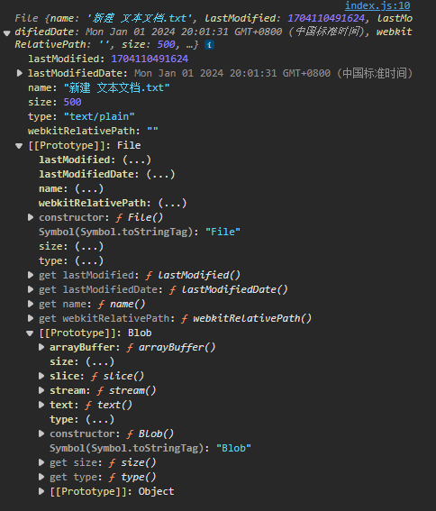
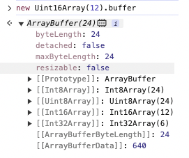
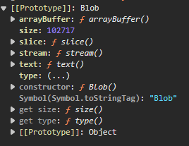

# 二进制数据
非文本的内容处理，可以统称为二进制处理，这里的二进制代表就是数字，不一定非要是二进制表示形式。

JavaScript 长期作为浏览器端的语言，常常与文本打交道，再加上过去的浏览器限制，很少有能力去处理非文本数据。

现在，Node.js，File API，Canvas，WebSocket 等技术已经足够成熟了，使得 JavaScript 处理和传输二进制数据变得越来越普遍。

## 在浏览器端读取二进制文件
现在的ECMAScript拥有了File API，不但可以完成在浏览器的文件读取，如果使用得当，直接处理完然后再下载给用户也是完全可行的，其中就需要涉及这种二进制数据了。

现代浏览器输入本地文件的方式基本上靠**拖放**和**文件选择器**这两种，比如：
```html
<script>
  function onChanged(e) {
    const file = e.files[0];
    console.log(file);
  }
</script>

<input type="file" onchange="javascript:onChanged(this)"/>
```
`files`数一个数组，在默认的条件下，就只有一个元素，这个元素的类型是`File`。这个类型包含了即时可访问的属性，比如大小，文件名，MIME类型，最后修改时间等等。



如果业务对文件后缀名，大小存在限制，就可以在这个位置进行拦截。

然后使用`FileReader`来对文件完成读取：
```js
const fr = new FileReader();

fr.addEventListener('error', () => {});
fr.addEventListener('abort', () => {
  console.error(fr.error);
});
fr.addEventListener('load', () => {
  console.log(fr.result);
});

fr.readAsArrayBuffer(file);
```
关键点在于`readAsArrayBuffer`。然后`FileReader`另外有两个方法：`readAsText`和`readAsDataURL`，分别是将文件读取为 Text指定的编码方式 和 *data:image/bmp;base64* 这样的 base64 格式，base64可以直接赋值给img标签的src属性，通常作为上传图片时的本地预览。

`ArrayBuffer`是一种结构化的数据。MDN上描述为**用来表示通用的，固定长度的原始二进制数据缓冲区**。

可以理解它就是一段连续的内存，至于这段内存代表了什么数据，就需要取决于读写的方式了。`ArrayBuffer`其实是不能直接读写数据的，所以需要`TypedArray`来转换。
```js
const arr = new Uint8Array(fr.result);

console.log(arr[0].toString(16));
console.log(arr[1].toString(16));
```
可以看出，`TypedArray`可以把一个`ArrayBuffer`作为构造参数，相当于复用了这段内存，读写方式取决于`TypedArray`的具体类型。如果是`Int8Array`，那么就是按照有符号单字节的整数来读写，如果是`Float32Array`，那么就按照每次4个字节的浮点数来读写。

如果`ArrayBuffer`的长度不满足`TypedArray`的单位读写，就会报错:
```js
const ab = new ArrayBuffer(7);
new Float32Array(ab); 
// ❌ byte length of Float32Array should be a multiple of 4
```
从数学角度来看，如果`ArrayBuffer`的长度是8的倍数，那么似乎可以兼容任意的`TypedArray`了。事实上，每一个`TypedArray`都对应了一个`ArrayBuffer`，可以通过`buffer`来访问到：



使用`TypedArray`有一个巨大的限制，就是只能按照固定的尺寸和格式来进行读写。在读取二进制文件的场景下，往往不同尺寸的数据是混在一起的，前面度的是Int8，后面很有可能就要读Float32了，所以这种场景需要更加灵活的`DataView`来使用。

`DataView`是规范中定义的结构化数据的一种，相比于`TypedArray`，它可以在任意时刻灵活选用不同的格式来进行读写：
```js
const dv = new DataView(fr.result)
console.log(dv.getInt8(0).toString(16));
console.log(dv.getInt8(1).toString(16));
```
`DataView`相比`TypedArray`还有一个很大的优势，就是字节序。比如一个2字节的数字D8E2，在存储的实现，应该存储成D8-E2，还是存在E2-D8?

前者被称为大字节序，后者被称为小字节序。字节序影响到读取二进制多字节数字的方式，也会影响到网络传输，不同平台的字节序是不相同的，网络传输一般选择大字节序。

而`DataView`读写时可以指定字节序：
```js
dv.getUint16(0,truEe) // little endian
dv.setUint16(0,0xD8E2,false) // big endian
```
## File 与 Blob
File对象的原型链上存在一个类型`Blob`。


File本质上是Blob的子类，增加了文件名，修改时间等属性，而MIME类型以及大小都是定义在父类Blob上的。

所以严格来说，`FileReader`的`readAsArrayBuffer`的参数是Blob而不是File。可以看到Blob自带`ArrayBuffer`，`text`等方法，可以绕过FileReader，而且这两个方法都返回的是Promise的：

```js
const ab = await file.arrayBuffer()
const text = await file.text()
```
在`Blob`上还有更多的属性，比如`slice`方法可以做文件切片，取其中的一段，基本上能节省内存。再比如，更新一些的`stream`方法可以用`Stream API`来实现边读边解析，在处理大体积文件时几乎是一个标准的优化方法。

`Blob`作`为二进制数据的容器方面，可以发挥一些作用，比如绘制图片：
```js
async function onChanged(e){
    const file = e.files[0]
    let canvas = document.getElementById('canvas')
    let ctx = canvas.getContext('2d')
    const bitMap = await createImageBitmap(file)
    ctx.drawImage(bitMap,0,0)
}
```
`createImageBitmap`是一个全局函数，基本可以根据Blob来创建`ImageBitMap`，从而渲染到画布上。

当画布完成绘制之后，做完个人的改动，就又可以异步的转换为Blob：
```js
canvas.toBlob(blob => {
  
})
```
拿到Blob之后，就可以考虑提供给用户的下载了，或者上传到服务器上。

最后分享一张JS中二进制对象相关操作的总结图：
