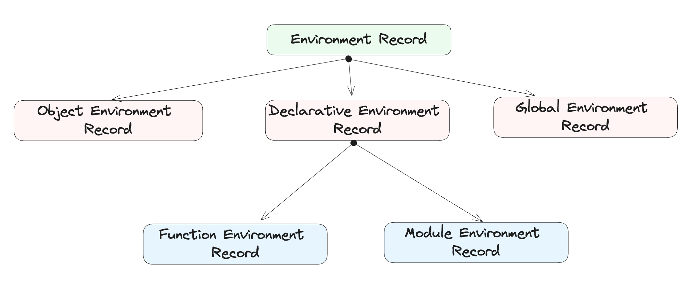

# 作用域 

早年间有一种说法叫做 “JavaScript 没有作用域”，当然这是一种夸张的讲法，其表达的意思应该是：JavaScript 没有块级作用域。

比如下面这样的代码是可以工作的：
```js
{ var foo = "Hello"; }
console.log(foo) // "Hello"

for (var i = 0; i < 10; i++);
console.log(i) // 10
```
大括号和 for 语句并没有束缚住变量的作用范围。

在现代的 JavaScript 执行环境中，基本已经没有了这样的困扰，“没有块级作用域”也不再适用于 JavaScript。

## 变量的可访问性原理
作用域，或者称之为“上下文”，是变量被承载的容器。

在最新的 ECMAScript 规范中，定义了一个叫做环境记录`（Environment Record）`的抽象概念，可理解为就是作用域。

从 `Record` 这种词我们就能联想到它是用来记录变量的。这里的变量不仅仅包括 var 声明的变量，还包括 `const`、`let`、`class`、`function`、`with`、`catch` 等声明的变量或参数。一旦这些语句被执行，那么就会创建一个新的 **Environment Record**。

Environment Record是抽象的，它有三个子类，分别是：
- `Declaretive Environment Record`
- `Object Environment Record`
- `Global Environment Record`，浏览器中指globalThis，Node.js中指global

其中`Declaretive Environment Record`还有两个子类：
- `Function Environment Record` —— function
- `Module Environment Record` —— module

因此，目前官方规范中定义的这几种作用域的关系是：


并且，每一个 Environment Record 都有一个 `OuterEnv`属性，它指向另一个 Environment Record 实例。从这一点上可以看出来，**作用域是有上下层级关系的，所有作用域都应该可以组成一个树形结构**，这和平时的编码认知其实是一致的。
```js
var foo = 1; // Env3

function onload() {
    var bar = 2; // Env2
    return function callback() {
        var baz = 3; // Env1
        return foo + bar + baz;
    };
}
```
从上面的代码片段中，至少可以定义三个作用域：Env1，Env2，Env3。当去计算`foo + bar + baz`的时候，需要依次**从下向上**搜索作用域内是否有对应的变量声明。
- 首先，在 Env1 中查找 foo，不存在，向上在 Env2 中查找，也不存在，继续向上，直到在 Env3 中找到，取其值；
- 其次，在 Env1 中查找 bar，不存在，向上在 Env2 中找到，取其值；
- 最后，在 Env1 中找到 baz，取其值。

这三个作用域的关系：Env1 的 OuterEnv 是 Env2，Env2 的 OuterEnv 是 Env3，这一条关系链称为**作用域链**。

不同类型的 Environment Record，其 `OuterEnv` 类型是受限的。比如，**Global Environment Record** 的 OuterEnv 总是 `null`，而 **Module Environment Record** 的 OuterEnv 总是 **Global Environment Record**。

举个例子：
```js
// index.js
var foo = 1;

function onload() {
    var bar = 2;
    import("./dynamic.js");
}
```
```js
// dynamic.js
var baz = 3;
console.log(foo + bar + baz);
```
dynamic.js 所在的作用域，是一个**Module Environment Record**，由于其`OuterEnv`是**Global Environment Record**，因此它可以访问到foo变量，但是访问不到bar变量，于是在console.log会报错。

除了主动声明变量，还经常会使用到`this`

## this
`this`通常与对象相关，在对象上调用一个函数，这个函数内部的`this`通常就指向这个对象:
```js
const dog = {
    name:'spark',
    bark:function(){
        return this.name
    }
}
console.log(dog.bark()) // "spark"
```
this是按如下具体工作的：

ECMAScript 规定，在Environment Record的抽象定义上，有一个函数叫做`HasThisBinding()`，不同的子类对此函数的实现不同。

当你的代码在执行过程中遇到`this`的时候，具体的计算规则是这样的：
- 设 env 等于当前的 `Environment Record`
- 设 exist 等于 `env.HasThisBinding()` 返回值
- 如果 exist 等于 true, 则返回`env.GetThisBinding()`，终止
- 赋值 env 等于 `env.OuterEnv`，跳到步骤2继续执行

:::tip
    GetThisBinding() 下面会提到
:::
这个过程就是一个向上递归遍历的过程，哪一级的 Environment Record 有`ThisBinding`，就返回它，非常类似于**作用域链**。

这个算法不会死循环，因为 Environment Record 结构的最顶层是一个 Global Environment Record，它一定有`ThisBinding`，每个 Environment Record 都会有对应的标准。

### Declarative Environment Record
Declarative Environment Record 的 `HasThisBinding()`始终返回false，因此像下面这样的代码，this其实指向的上一层 Environment Record，即`globalThis`对象：
```html
<script>
{
    console.log(this);
}
</script>

```

### Function Environment Record
Function Environment Record 是 Declarative Environment Record 的子类，并设计有额外的属性或函数。

ECMAScript规定，如果函数是箭头函数=>，那么`HasThisBinding()`返回false，否则返回true。

```html
<script>
    const person = {
        say: () => {
            console.log(this);
        }
    };

    console.log(person.say()); // window
</script>
```
虽然函数`say`是在`person`对象上调用的，但是this并不指向`person`。即便使用`Function.prototype.bind/call/apply`函数尝试修改this也不行；

```js
person.say.call("Hello"); // window
person.say.apply("Hello", []); // window
person.say.bind("Hello")(); // window
```

### Global Environment Record
Global Environment Record 也有自己专属的属性和函数，它的`HasThisBinding()`始终返回true，因此在全局环境下，this是有值的，浏览器下是`window/globalThis`，Node.js环境下是`global`
```html
<script>
console.log(this); // window
</script>
```
```sh
$ node -e "console.log(this)"  # global
```
### Module Environment Record
 Module Environment Record，它也是 Declarative Environment Record 的子类，提供了 `GetThisBinding()` 函数。

 Module Environment Record 的 `HasThisBinding()` 始终返回 true，但是 `GetThisBinding()` 却始终返回 undefined，这样的效果就是：**在 ES Modules 里面的全局 this 始终是 undefined**。

 ```js
 // index.js
import("./lib.js");

// lib.js
console.log(this); // undefined
 ```
 这样的设计能够避免一些潜在的歧义，比如下面这段代码在顶层上下文中运行：
 ```js
 function foo() {
    console.log(this);
}

foo();
 ```
 如果不是ES Modules，那么 this 指向将取决于是否是`strict`模式：
 - strict 模式下，this为`undefined`
 - 非 strict 模式下，this为`window/globalThis`

 ES Modules 环境避免了这种歧义，this 始终是 undefined，不会意外地修改到全局的数据
 ::: tip
 忽略对 Obeject Environment Record 的讨论，它代表的 with 是不建议使用的
 :::

 ## 变量提升 与 TDZ
 在 ES6 之前，我们只能用 `var` 来声明变量，我还记得有一条不成文的规矩是：**应该把所有 var 语句提到当前作用域的最前面**。

 之所以要这样做，是因为 var 声明的变量具有提升的效果，也就是我们可以在声明之前访问到它，只不过值肯定是 **undefined**。

 ```js
console.log(foo); // undefined
var foo = "hello";
```
var 声明的变量也确实呼应了前面对于 “JavaScript 没有块级作用域”的特征，一个大括号根本无法阻止 var 的作用范围：
```js
{
    var foo = 100;
}

console.log(foo); // 100
```
甚至是`try...catch`和`for`语句。

为了解决这个问题，ES6 引入了 let 和 const 关键字来声明具有块级作用域的变量，它们的区别就是一个的值可变，一个不可变。

相反的是`let`与`const`不能进行提升

如果在let声明之前使用变量，则会出发未初始化异常：
```js
console.log(foo); // ❌ Uncaught ReferenceError: Cannot access 'foo' before initialization
let foo = 100;
```
**TDZ**全称Temporal Dead Zone，即**暂行性死区**。

可以具体看它们的定义：

**var** : A var statement declares variables that are scoped to the running execution context's VariableEnvironment. `Var variables are created when their containing Environment Record is instantiated and are initialized to undefined when created.` Within the scope of any VariableEnvironment a common BindingIdentifier may appear in more than one VariableDeclaration but those declarations collectively define only one variable. A variable defined by a VariableDeclaration with an Initializer is assigned the value of its Initializer's AssignmentExpression when the VariableDeclaration is executed, not when the variable is created.

**let/const** : let and const declarations define variables that are scoped to the running execution context's LexicalEnvironment. `The variables are created when their containing Environment Record is instantiated but may not be accessed in any way until the variable's LexicalBinding is evaluated.` A variable defined by a LexicalBinding with an Initializer is assigned the value of its Initializer's AssignmentExpression when the LexicalBinding is evaluated, not when the variable is created. If a LexicalBinding in a let declaration does not have an Initializer the variable is assigned the value undefined when the LexicalBinding is evaluated.

它们之间最关键的区别在于第二句话体现上：**var声明的变量在 Environment Record 初始化的时候就被赋值为 undefined ，而 let/const 是直到词法绑定 `LexicalBinding` 被执行才可以被访问。**

词法绑定可以简单的理解为：就是 let/const 所在的那一句代码。不到这一句，都不可以访问变量。


