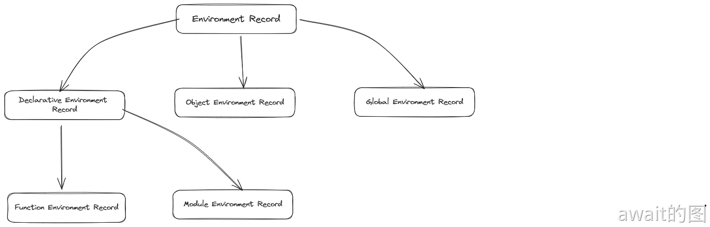
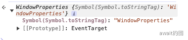
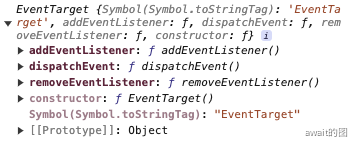

# 全局对象
全局对象是一类特殊的对象，它在任何JavaScript代码的执行之前就已经创建了，并且不提供任何方法去创建第二个实例。全局对象的作用很多，比如去承载各种各样的其他“全局”内置对象，也是不同模块之间交流数据的最简单粗暴的渠道。

## 全局对象的基本理解
每个`Enviroment Record`都有一个`[[OuterEnv]]`指针，指向其父环境，最终可以上溯到一个`Global Environment Record`。当代码执行到需要访问一个变量的时候，实际上就是从当前`Environment Record`一路向上寻找哪一个“绑定”了这个名称的变量，这就相当于访问到了，如果没找到就会抛出一个`ReferenceError`。

这个过程的规范叫做`ResolveBinding(name[,env])`，其本质是在调用`GetIdentifierReference(env,name)`，它的逻辑非常简单，就是一个递归性的遍历。


`HasBinding`和`GetBindingValue`是每一个`Environment Record`都拥有的方法，并且都可以重载。



事实上，`Declarative Environment Record`，`Object Environment Record`和`Gloabl Environment Record` 都有各自的`HasBinding`和`GetBindingValue`实现。

对于`Gloabl Environment Record`的实现，需要特别注意它的4个独特的属性：
- **[[ObjectRecord]]**
- **[[DeclarativeRecord]]**
- **[[GlobalThisValue]]**
- **[[VarNames]]**

其中`[[DeclarativeRecord]]`是一个`Declarative Environment Record`，它包含了在全局环境中的以const，let，class等方式声明的变量。

而`Object Environment Record`通过对象结构容纳了大部分的全局数据。

`Object Environment Record`有两个特殊的属性，分别是`[[IsWithEnvironment]]`和`[[BindingObject]]`。对于全局环境的`[[ObjectRecord]]`来说，`[[BindingObject]]`指的就是**全局对象**。

在ECMAScript规范中，有这么一个规矩：**先查询`[[DeclarativeRecord]]`，再查询`[[ObjectRecord]]`**。于是可以推断出下面的结果。

```js
window.foo = 1

let foo = 2

console.log(foo) //2
```
:::tip var 和 const let 的区别
通过const，let，class 等方式声明的变量，只会影响到`[[DeclarativeRecord]]`。但通过var，function等方式定义的就完全不同。会涉及到`CreateGloablBinding`和`CreateGlobalFunctionBinding`这两个方法。
:::

## 全局对象下的属性
全局对象下有一系列的属性，包括`globalThis`,`NaN`,`Infinity`,`undefined`,`eval`,`isFinite`,`isNaN`,`parseInt`,`parseFloat`,`decodeURI/encodeURI`,`decodeURIComponent/encodeURIComponent`,`JSON`,`Math`,`Reflect`,`Error`,`Array`,`String`,`Number`,`Boolean`,`Object`,`Function`,`RegExp`,`Symbol`,`Date`,`Map`,`Set`,`Promise`,`Proxy`,`Int8Array`等等。

这些结构的一个无例外的特征就是，它们都是完全不可枚举的`(non-enumerable)`，因此默认情况下`Object.keys(window)`是绝对找不到这些属性名的。

其中有一个属性叫做`gloablThis`，这是ES2020才引入的，按照规范，在任何运行环境下，访问全局对象都应该使用`globalThis`。

虽然在浏览器环境中，window一直是全局对象的代名词，可以使用`window.foo`或者`window["foo"]`来访问全局属性。**但实际上Window这个词本身实际就是指全局对象下的属性名**，即`window.window`，准确的表述应该是`globalThis.window`。类似的还有`self`。即全局对象的某些属性指向了自己，形成了环，**所以window是不可以被JSON序列化的**。

浏览器在全局对象下定义了起码几百个额外的全局属性，如图：
[!image](./assets/window%E5%B1%9E%E6%80%A7.png)

这样以来，像`addEventListener`，`onerror`，`getComputedStyle`等这些属性。完全其实可以不加上window，一般为了规范来说最好还是加上

```js
addEventListener('load',()=>{})

onerror(function(){})

getComputedStyle(dom,null)
```

在NodeJS的环境中，以`gloabl`作为全局对象的代名词，而且现在`global === globalThis`，有时候看到很多即兼容浏览器又能兼容NodeJS的代码，需要来回的判断window和global才能取到全局对象。

global的额外属性要少很多，大概有这些：
```js
[
  'global',
  'clearInterval',
  'clearTimeout',
  'setInterval',
  'setTimeout',
  'queueMicrotask',
  'performance',
  'clearImmediate',
  'setImmediate'
]
```
但是，在NodeJS中的代码中的var，function的声明并不会干预到全局对象：
```js
var foo = 99;
console.log(global.foo) // undefined
```
而且`this`也不会指向全局对象
```js
this === global // false
```

## Window的原型关系
可以知道，window 和 Window 都是可以直接引用的全局对象属性，并且“一定”满足`window instanceof Window === true`。

```js
Reflect.getOwnPropertyDescriptor(globalThis, 'window')
// {
//     configurable: false
//     enumerable: true
//     get: ƒ window()
//     set: undefined
// }
Reflect.getOwnPropertyDescriptor(globalThis, 'Window')
// {
//     configurable: true
//     enumerable: false
//     value: ƒ Window()
//     writable: true
// }
```
window是一个**不可配置，不可更改**的属性，时刻保证它的安全。但是Window就不那么严格了，不但是可以配置的，而且可写，所以是可以写出这样的“恶意”代码：
```js
global.Window = function Window() {
    return window;
};

new Window(); // success

window instanceof Window; // false
```
所以，**Window 是可篡改的**。

对于window对象的原型链，可以通过`Reflect.getPrototypeOf`，或者非标准的`__proto__`：

```js
const winProto = Reflect.getPrototypeOf(window)
Reflect.ownKeys(winProto) 
//['TEMPORARY', 'PERSISTENT', 'constructor', Symbol(Symbol.toStringTag)]
```
继续往上爬：
```js
const winProtoProto = winProto.__proto__
```
可以看到如下的打印：


这个`WindowProperties`类型的对象，但它却没有 constructor，可能是随着某个函数的创建而创建的，大概像这样：
```js
const windowProperties = {
    [Symbol.toStringTag]: "WindowProperties"
};

Reflect.setPrototypeOf(winProto, windowProperties);
```
继续向上，可以看到一个叫做`EventTarget`的对象，并且有一些和事件相关的API：`addEventListner`，`removeEventListener`，`dispatchEvent`。



EventTarget 也是一个公开的API。可以说，**浏览器中所有实现了相关事件接口的对象，原型链上都能追溯到EventTarget，除了 Window 之外，还包括 Document，各种 HTMLElement，XMLHttpRequest 等等。**

事件派发机制在前端是一种非常常见的编程范式，可以认为是**Pub-Sub**。通常会引入第三方库来实现，比如 *eventemitter3*, *mitt* 等等。

有个小技巧就是，不用引入任何第三方库，直接用原生的`EventTarget`就可以了，而且非常适合Node.js环境。

```js
class MyEventBus extends EventTarget{}
```
如果嫌API名字冗长，可以换成on，off，emit
```js
class MyEventBus {
    #et = new EventTarget();
    
    on(...args) {
        this.#et.addEventListener(...args);
    }
    
    off(...args) {
        this.#et.removeEventListener(...args);
    }
    
    emit(...args) {
        this.#et.dispatchEvent(...args);
    }
}
```

然后 EventTarget 再向上就到顶了，即 **EventTarget.prototype.proto === Object.prototype**。可以看到如下原型链结构：

