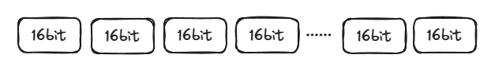

# 字符串
字符串是平时业务需求中最经常碰到的东西，多多少少会遇到这些需求：
- 限制输入框中的内容长度，保证在具体的位置能够显示得下
- 拼接服务端得数据为一个阅读良好的提示语，并展现给用户，比如“您的训练次数还剩xxx次”
- 在固定格式中舍去一部分信息，保留剩余的内容，比如在身份证号中获取生日信息

这些基础操作如果不注意，也会产生一些错误的结果，现在来滤清字符串的进阶知识

## 基本结构
字符串——**以“字符”为基本单位的有序序列**，但是这个字符并不是直观意义上的一个文字符号，比如英文字母“A”,汉字“中”，或者是标点符号“.”，而是一个叫做 码元Code Unit 的东西，占据16bit，即2byte空间。



无论什么数据，在计算机内容中都是二进制的数字表示的，因此一个码元就是一个16位无符号整数，最大的是0xFFFF。这个数字是需要映射成可见的，有意义的文字符号，这个映射关系本来是由字符集 Unicode 来负责的，比如数字65映射为大写英文字母“A”,数字 0x4E2D映射为汉字“中”。但是，通常来说一个字符的 Unicode 编码值不适合用来直接存储和传输，原因包括：

- 纠错问题，即便错了一二进制位，就会变成另外一个合法的字符
- 前导问题，一个字符的编码值可能是另一个字符的前面一部分

因此，Unicode 编码值会通过算法再次编码成另一个数字来进行存储和传输。这个过程就叫做**字符编码**，通常见到的字符编码比如GBK，UTF-8等。

编码过程虽然会浪费一部分空间，但是拥有了一定的纠错能力，并且规避了前导问题。

而JavaScript的码元就是经过字符编码后的整数，只不过这个编码不是叫做`UTF-16`的编码方案，而`UTF-16`编码之后只可能是2byte或4byte的

**而一个Unicode字符在JavaScript字符串中可能占据1个码元，也有可能占据2个**

这就导致获取一些字符串长度的时候会出现问题。

## 获取长度
```js
"我是中国人".length //5
```
可以看出这句话有5个码元，就是10个字节。

一个字符串最多包含2的53次方-1个码元，这也是 JavaScript 所能表示的最大整数，即`Number.MAX_SAFE_INTEGER`。

经常会遇到通过length来推算文本在页面上的显示宽度。由于英文字母，标点符号和汉字的显示宽度明显不一样，因此也可以判断字符是否是汉字，如果是的话算作两个英文字母的宽度。（但是世界上有各种各样的语言，宽度各不相同，这个方法也不靠谱）

因此，**还得是依赖CSS去解决宽度问题**

```js
"😀".length //2
```
这个例子就是一个字符占2个码元的例子。

然而有的特殊的emoji表情可能会占到7个码元。这是因为Emoji的一个“修饰序列”的功能造成的：在一个基础的Emoji编码后面，添加修饰符的编码，中间用0x200D来分隔，从而产生一系列的码元。

修饰序列和双码元字符共同作用，使得字符串对于字符位置的操作更加敏感，如果读取位置不正确，很有可能会读到无意义的字符碎片。

## 字符串截取
截取字符串可以分为**截取单个字符串**和**截取片段**，JavaScript中的字符串也是不可变的，任何看似修改其内容的操作，无一例外都是拷贝返回新的字符串实例。
```js
var str = "我在工作"
str[1] = "不"
console.log(str) //“我在工作”
```
但在strict模式下，上面的代码会抛出错误。

## 截取字符
先来看截取单个字符，如果把字符串看作一个字符数组的话，那么一个下标就能唯一定位一个字符。
```js
"12345"[1] // "2"
```
同时还有 charAt 和 at 方法

- **数组下标** 如果参数在`[0, lenth - 1]`之外的，返回undefined
- **charAt 函数** 如果参数在`[0, length - 1]`之外的，返回的是空字符串
- **at 函数**，如果序号是负数，则会加上字符串的 length 作为新的符号，如果新的序号也不在有效范围内，则会返回undefined

```js
"𠯿a"[2]        // "a"
"𠯿a".charAt(2) // "a"
"𠯿a".at(2)     // "a"

Array.from("𠯿a")[0] // "𠯿"
[..."𠯿a"][0]        // "𠯿"

Array.from("🧑🏾🎓a")[0] // "🧑"
[..."🧑🏾🎓a"][0]        // "🧑"
```
## 截取片段
ECMA262 提供了两个推荐使用的字符串截取函数：**substring** 和 **slice**，使用方式很类似，容易混淆。

它们的参数都是`[startIndex,endIndex]`，注意是半开区间，区别在于：
- substring 会允许 endIndex < startIndex，会自动交换这两个值，而slice不允许，会返回空字符串
```js
"12345".substring(3,2) //"3"
"12345".slice(3,2) // ""
```

- substring 的参数如果是负数，会当作0处理，slice对负数会加上字符串长度
```js
"12345".substring(-2,-1) // ""
"12345".slice(-2,-1) // "4"
```
同理，也会收到双码元和Emoji的修饰符序列的影响
```js
"🧑🏾🎓a".substring(0, 2) // "🧑"
"🧑🏾🎓a".slice(0, 2)     // "🧑"
"🧑🏾🎓a".substring(7)    // "a"
"🧑🏾🎓a".slice(7)        // "a"

"今天天气晴朗🧑🏾🎓！".slice(0, 9)  // "今天天气晴朗🧑\uD83C"
"今天天气晴朗🧑🏾🎓！".slice(0, 10) // "今天天气晴朗🧑🏾"
```