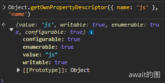

# 对象的基本结构
在ECMAScript规范的定义中，对象代表属性的集合，可以理解为`key-value`结构的数据容器。

## 属性结构
属性的结构并非一个简单的`key-value`，因为属性本身还有属性，比如是否只读，是否可删除，是否可遍历。

在ES5之后，定义了6种属性的参数
- [[Value]]
- [[Writable]]
- [[Get]]
- [[Set]]
- [[Enumerable]]
- [[Configurable]]

这几种参数并非允许同时存在，其中[[Enumerable]]和[[Configurable]]可以一直都在，而 [[Value]]+[[Writable]] 与 [[Get]] + [[Set]] 这两对之间是互斥的。

这其实说明对属性成员有两种格式定义：**数据属性** 和 **存储器属性**

| 类型 | 结构 |
|-------|-------|
| 数据属性 | [[Enumerable]] [[Configurable]] [[Value]] [[Writable]] |
| 存取器属性 | [[Enumerable]] [[Configurable]] [[Get]] [[Set]] |

从功能上讲，**存取器属性是数据属性的超集**，数据属性能实现的，存取器属性也能够实现，比如存取器属性种不定义 **[[Set]]** 就相当于数据属性种 **[[Writable]]**设为false，意思是只读。
通过`Object.getOwnPropertyDescriptor`可以取出属性描述符
```js
Object.getOwnPropertyDescriptor({ name: 'js' }, 'name')
```


可以看见只有4个属性，正好证实了之前说的对立关系。而且都是**数据属性**，以大括号声明的对象，其属性都是数据形式的，如果定义成**存取器属性**，那么就需要用到`Object.defineProperty`或者`Object.defineProperties`。
```js
var obj = {};

let _internal_name = null;

Object.defineProperty(obj, 'name', {
    set(n) {
        _internal_name = n;
    },
    get() {
        return _internal_name;
    },
    configurable: true,
    enumerable: true,
});
```
## 使用属性描述符
如果属性希望在被访问的时候，动态输出取值，那么毫无疑问，存取器属性是唯一选项。除此之外，两者几乎一致，包括在其余参数的定义上。

先来看看两者共用的参数enumerable和configurable的作用：

### enumerable
`enumerable`代表是否可以枚举，也就是是否能被`for...in`遍历出来。常见的有数组的所有方法：concat filter map reduce 这些都是遍历不出来的，还有字符串的 length 属性等等

直接通过字面量赋值对象，默认`enumerable`是可枚举的

如果使用`Object.defineProperty`来赋值对象，就必须明确设置`enumerable = true`才可以开启枚举性，否则默认是false:

```js
const obj = {};

Object.defineProperty(obj, 'name', {
    value: 'foo'
});

Object.getOwnPropertyDescriptor(obj, 'name').enumerable; // false
```
### configurable
`configurable` 参数代表是否可以配置，这个逻辑很复杂，如果值为 false，那么：
- 不允许删除此属性
- 不允许在数据属性和存取器属性之间变换
- 不允许修改描述符的其他参数（不包括修改value，以及把 writable 设为 false）
- 不允许修改 enumerable 的值
- 不允许修改 set/get 的值
- 不允许修改 writable 从 false 改为 true

通过可以修改value，可以看出 **configurable 并不是为了完全封锁对象，要不然也不会允许对 value 的修改，它只是想保证对象结构和表达的稳定性，那么把一个对象从可写修改为只读，并不会破坏这种稳定性。**

可以验证一下这个规则：
```js
const obj = {};

Object.defineProperties(obj, {
  // name 为数据属性
  name: {
    value: "foo",
    writable: false,
    enumerable: true,
    configurable: false,
  },
  // age 为存取器属性
  age: {
    get() {},
    set() {},
    enumerable: true,
    configurable: false,
  },
});

// 删除属性
delete obj.name; // ❌ Uncaught TypeError: Cannot delete property 'name' of #<Object>

// 变换属性结构
Object.defineProperty(obj, "name", { // ❌ Uncaught TypeError: Cannot redefine property: name
  get() {
    return "foo";
  },
  enumerable: true,
  configurable: false,
});

// 修改 enumerable
Object.defineProperty(obj, "name", { // ❌ Uncaught TypeError: Cannot redefine property: name
  enumerable: false,
});

// 修改 set/set
Object.defineProperty(obj, "age", { // ❌ Uncaught TypeError: Cannot redefine property: age
  set() {},
  get() {},
});

// 修改 writable=true
Object.defineProperty(obj, "name", { // ❌ Uncaught TypeError: Cannot redefine property: name
  writable: true,
});

```

### writable
数据属性的`writable`会阻止对`value`的修改，**即使是修改前后的值一样也不可以**，`writable`阻止的是行为，而不是结果。但是`value`依然可以通过`defineProperty`来改变取值，这超过了`writable`的控制范围：

```js
const obj = {};

Object.defineProperty(obj, 'name', {
    value: 'foo',
    writable: false,
    enumerable: true,
    configurable: true,
});

// 重新定义 value
Object.defineProperty(obj, 'name', {
    value: 'bar',
});
```

## 原型链与对象继承
打印一个空对象，可以看到他的[[prototype]]属性。


这里的[[Prototype]]指向的是`Object.prototype`

要获取[[Prototype]]属性，可以使用`Object.getPrototypeOf()`函数：

```js
Object.getPrototypeOf({}) === Object.prototype // true
```
当然也可以通过`__proto__`达到一样的效果

原型的作用就在于：**当我们在一个对象上访问属性的时候，如果本身没有这个属性，那么就会尝试在其 [[Prototype]] 对象上寻找，如果还是没找到，就继续向上查找 [[Prototype]]，一直会找到 Object.prototype 为止，因为它的 [[Prototype]] 等于 null** 。

这种向上遍历的关系就变成了原型链
```js
var a = { name: "a", age: 10, gender: "female" };
var b = {
  name: "b",
  age: 15,
  gender: "male",
  getGender() {
    return this.gender;
  },
};
var c = {
  name: "c",
  age: 20,
  getAge() {
    return this.age;
  },
};
var d = {
  getName() {
    return this.name;
  },
};

// a => b => c => d => null
a.__proto__ = b;
b.__proto__ = c;
c.__proto__ = d;
d.__proto__ = null;

console.log(a.getName(), a.getAge(), a.getGender()); // a 10 female
console.log(b.getName(), b.getAge(), b.getGender()); // b 15 male
console.log(c.getName(), c.getAge()); // c 20
```
说到原型链，下面这图可以说是万恶之源：
