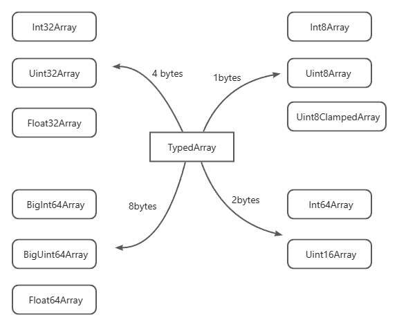

# 索引集合 键值集合
## 索引集合
数组是对象的一种，只不过它以连续的非负整数来当作key，这种结构叫做 **索引集合**。

:::tip
在C++语言中，索引往往意味着内存是连续的，但是JavaScript却不太一定，取决于引擎的实现，ECMAScript没有作出规定，实际往往是根据其大小的不同，引擎会决定使用连续内存还是链表。
:::

EMCAScript中内置的索引集合并非只有Array这一种，还有一类叫做TypedArray结构，这也可以被称之为广义上的数组，但是它们是用来存储数字的。

之所以叫做“它们”，这是因为`TypedArray`代表了一系列的具体类型：**Int8Array**、**Uint8Array**、**Uint8ClampedArray**、**Int16Array**、**Uint16Array**、**Int32Array**、**Uint32Array**、**BigInt64Array**、**BigUint64Array**、**Float32Array**、**Float64Array**。



以 Int8Array为例，它就只能存储8位有符号的整数，取值范围是`-128～127`。每一种TypedArray上都有一个`BYTES_PER_ELEMENT`常量属性，代表里面每个数字占据的字节数：
```js
Int8Array.BYTES_PER_ELEMENT // 1
Int16Array.BYTES_PER_ELEMENT // 2
Int32Array.BYTES_PER_ELEMENT // 4
BigInt64Array.BYTES_PER_ELEMENT // 8
```
**TypedArray** 绝大多数方法都和Array上通用的。比如fill，every，find，slice，indexOf 等。但它和Array存在本质上的区别：**TypedArray 的大小是不可变的**。无论是用from，of，还是构造函数，一旦创建，它的容纳空间就固定了。因此也就没有 **push，shift，pop，unshift** 方法。

## 键值集合
键值集合的key通常不再是数字，可以是字符串，也可以是其他的类型。而对象本身就是一种键值结构，只不过其key只能是String或者Symbol。

Es6中比较新的键值集合就是Map，Set，WeakMap，WeakSet。

### Map
Map的使用比较简单，主要有这么几点限制：
- 只能以 String 或者 Symbol 作为 key
- 遍历需要考虑到属性的可遍历性，原型链等因素
- 计数需要先遍历，成本较高

Map可以使用任意类型数据来作为key，甚至是undefined，null:
```JS
const map = new Map();

map.set({}, 1);
map.set(1, 1);
map.set(true, 1);
map.set(undefined, 1);
map.set(null, 1);
```
显然Key是不可以重复的，这里判断是否重复使用的是内部叫做`SameValueZero`的方法，这就是`Array.prototype.includes`的算法，也就是相比`===`多出来一个区分NaN的能力，但仍然不区分`+0`和`-0`：

```js
map.set(NaN, 1)
map.get(NaN) // 1

map.set(+0, 1)
map.get(-0) // 1
```
创建 Map 的时候可以预设数据：
```js
new Map([['a', 1], ['b', 2]]) // Map(2) {'a'=>1, 'b'=>2}
```
构造参数常常是一个二维数组，形式是`[[key,value],[key,value]...]`。但本质上这个参数是一个迭代器，每一项都是至少包括两个成员的**类数组**，因此上面也可以如此实现：
```js
function* ini() {
    yield { 0: 'a', 1: '1'}; // 类数组
    yield ['b', 2];
}

new Map(ini());
```
Map 内部的数据的计数可以直接访问其`size`属性。Map的多种遍历操作，都不会依赖于`size`
`Map.prototype.keys` 用于遍历其所有键，并返回一个迭代器
```js
for (const key of map.keys()) {}
```
相应的，`Map.prototype.values`也可以遍历其所有的值：
```js
for (const key of map.values()) {}
```
用`Map.prototype.entries`键值可以一并遍历
```js
for (const [key, value] of map.entries()) {}
```
但实际上用起来，都没必要。因为Map的原型上本身就定义好了`[Symbol.iterator]`，所以Map自身就是一个迭代器，等价于`Map.prototype.entries`。
```js
for (const [key, value] of map) {}
```
注意⚠️，由于Map没有提供`toJSON`方法，但其数据也不存在于实例对象的属性上，因此Map被序列化成JSON时只能得到一个空对象：
```js
JSON.stringify(map) // {}
```
:::tip
如果直接序列化不行，那么把数据取出来自己遍历转换也是可行的，但是必须要处理好各种不被JSON支持的数据类型，比如对象类型的key。
:::
Map的原型对象上定义了`[Symbol.toString]`属性，值为**Map**，根据隐式类型规则，在不严格的条件下，可以判断一个变量是否是Map类型：
```js
Object.prototype.toString.call(map) === '[object Map]'

// 或者

String(map) === '[object Map]'
```
### Set
Set 相比于 Map 而言，就以自身为key进行存储，因此不可存储重复数据，天然带有去重的能力。

Set 判断数据相同与否和 Map 一样都是采用的`SameValueZero`方法

创建一个 Set 只能使用构造函数，也可以传入预设的成员：
```js
const set = new Set([+0, NaN, Symbol.for('x')]);

set.has(NaN); // true
set.has(-0); // true
set.has(Symbol.for('x')); // true
```
其构造参数本质上也是一个迭代器，因此字符串也可以直接被破解
```js
const set = new Set("abc");

set.has('a'); // true
set.has('b'); // true
set.has('c'); // true
```
在遍历方面，ECMAScript 故意将 Set 的 API 设计得和Map一模一样。只不过，由于 Set 的 key-value 同值的特性，遍历 keys 和 values 是等价的
```js
// 以下三者等价
for (const val of set.keys()) {}
for (const val of set.values()) {}
for (const val of set) {}
```
### WeakMap 与 WeakSet
有的编程语言需要去主动清理内存，比如C/C++，有些则具备自动功能，俗称`GC`，即**Garbage Collection**，垃圾回收。

垃圾回收有各种各样的策略，其中最简单的一条就是做应用计数。当引用变为0了，数据就变成一种游离的状态，无法再被回收使用，自然就要回收。

但是，很多代码的写法会造成变量始终被引用，无法被及时清理，比如这种：
```js
const pool = new Set();

function createRequest() {
    function request() {
        
    }
    
    pool.add(request);
    
    return request;
}

const fetch = createRequest();
```
无论 fetch 有没有真的被业务使用，它始终存在于pool集合里，导致一定程度上的内存泄漏。

而`weakMap`与`weakSet`提供了这样一种**弱引用**的能力，也就是说，数据放到它们上不会被算作一次计数。一旦数据被回收，集合中的也被回收了。

这样的特性，让它们的行为变得较为特殊 —— **它们都不可以被遍历**。
- WeakMap 只有 delete，get，has，set 四个方法
- WeakSet 只有 add，delete，has 三个方法

一旦运行遍历，就有可能发生遍历过程中数据被意外回收的尴尬。

对于那种可有可无的数据，丢失也不影响主要的业务逻辑的，考虑到性能，就可以使用它们。

由于Primitive 类型不涉及到引用，所以`WeakMap`与`WeakSet`只支持对象类型，下面这些情况都是不允许的

```js
weakMap.set("x", 1);
weakMap.set(1, 1);
weakMap.set(true, 1);
weakMap.set(undefined, 1);
weakMap.set(null, 1);

weakSet.add("x");
weakSet.add(1);
weakSet.add(true);
weakSet.add(undefined);
weakSet.add(null);
```