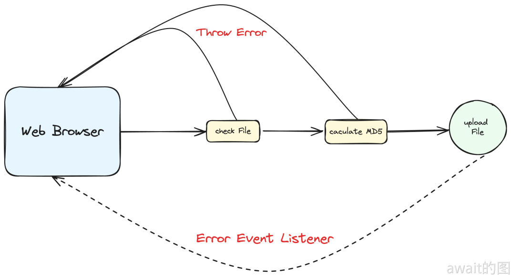

# 错误处理
## 错误类型与结构
在 JavaScript 中抛出的错误可以分成两类，**解释错误** 和 **运行时错误**。

解释错误会发生在 JavaScript 代码解释的过程中发生的，典型的就是语法错误 **SyntaxError** ; 而运行时错误则显然是在运行期间抛出的错误，比如 **throw** 出的错误。

在具体的对象实现上，首先是基础类`Error`，它既可以直接构造对象，也可以用来继承实现自己的错误类。

并且Err现在支持一个新的聚合参数 option , 目前只有里面的 **cause** 字段能被使用：

```js
const err = new Error('test error', {
    cause: otherError,
});
```
**cause** 可以代表这个错误是由哪个其它错误引起的，比如定义了一个自定义错误叫做 ParseError，只要 parse 函数错误就抛出这个异常，但是错误的异常具体原因可能会存在很多种，就可以使用 **cause** 来关联起来:
```js
err.cause
// 可以补充到错误日志中，增加判断和诊断错误的信息量
```
:::tip
cause 字段目前只有比较新的浏览器才支持，但无所谓因为旧版本会忽略多余的参数
:::
Error的另一个特性就是不需要通过new来创造出错误对象。以下两种写法是完全等价的：
```js
new Error()
Error()
```
因此，如果创建 Error 对象始终去省略操作符号 new，鉴于节省代码量的考虑是完全可以的。

这一特性还适用于所有 ECMAScript 定义的内置错误类型，至于自定义错误类不一定能这么写。至少考 class 方式的实现是完全不可以的。

Error 对象上最常见的两个属性是 **name** 和 **message**，特别是 message 承载了主要信息量。事实上，这两个属性本来是定义在原型对象`Error.prototype`上的，只是在创建`Error`对象时，也会在对象本身上创建一个 message 属性，它和 cause 一样，是**不可枚举**的。

```js
Object.getOwnPropertyDescriptor(new Error('test'),'message')
// {
//  value: 'test',
//  writable: true,
//  enumerable: false,
//  configurable: true
//}
```
而`name`并不会在对象本身上定义，还是取的原型对象上的值。因此，**不要去试图解构 Error 对象**，因此什么都取不到：

```js
console.log({ ...new Error('test') }) // {}
```
`name`用于标识Error的类型，定义了几种Error的子类，包括`EvalError`，`RangeError`，`ReferenceError`，`SyntaxError`，`TypeError`，和`URIError`。
- `EvalError` 自从 ES5 开始就不再被使用了，`eval`函数就不多评价了
- `RangeError` 都是在数字不合法范围内时抛出的，典型案例：
```js
// Number.prototype.toExponential 参数小于0或者大于100
(5).toExponential(101)
// Number.prototype.toFixed 参数小于0或者大于100
(5).toFixed(101)
// Number.prototype.toPrecision 参数小于1或者大于100
(5).toPrecision(101)
// Number.prototype.toString 参数不是2-36的数
(5).toString(37)
// Date.prototype.toISOString 时间戳为无穷
new Date(Infinity).toISOString()
// String.fromCodePoint 参数不是0-0x10FFFF之间的正整数
String.fromCodePoint(1.2)
```
- `ReferenceError` 的异常都是出在变量引用上
```js
// 找不到变量
a + b
// TDZ
a + 1
let a = 0;
```
- `SynataxError` 不多解释，经典的语法错误
- `TypeError` 常常用于类型方面的错误，例如：
```js
// 修改const
const a = 0;
a = 1;
// 不用 new 创建 Map、Set
Map();
Set();
// Symbol.toPrimitive 返回非 Primitive 类型
const obj = { [Symbol.toPrimitive]() { return {}; } };
`${obj}`
```
自己的编写的代码也可以常常使用TypeError，比如检验发现参数或者指令不符合预期的类型
- `URIError`会在`encodeURIComponent`，`encodeURI`，`decodeURIComponent`，`decodeURI`这 4 个函数中抛出，一般是遭遇到了不合法的数据

## 聚合错误
在ES2021引入了Error的一个新的子类：`AggregateError`。功能和它的名字一样，可以将多个错误聚合在一起，目前只有`Promise.any`会抛出这个错误类型，当然可以手动创建的一个实例：

和之前的Error后代不同，`AggregateError`在构造参数上存在明显的变化：
```js
new AggregateError([
    error1,
    error2
], 'test message');
```
在常规参数（ message 和 options.cause ）的前面，`AggregrateError`需要一个容纳一个或多个Error对象的迭代器。所以，这个参数可以不是数组，甚至其中每个成员也可以不是Error类型，cause也是如此。
:::tip
不过，AggregateError 对象在自身上定义errors属性时还会是一个数组类型，并不是直接引用的构造参数对象。
:::
当`Promise.any`参数中所有的 Promise 都被 rejected 后，就可以得到一个`AggregateError`：
```js
Promise.any([
    Promise.reject(1),
    Promise.reject(2),
    Promise.reject(3),
]).catch(err => {
    console.log(err); // [AggregateError: All promises were rejected]
    console.log(err.errors); // [ 1, 2, 3 ]
});
```
虽然新的浏览器才支持`Promise.any`和`AggregateError`，但是core-js提供了相应的polyfill，不用担心。

## 错误捕获
常规的错误捕获手段自然就是`try...catch...finally`，而且适用于`await`这一的异步代码。但在写 TypeScript 的时候，对`catch`参数的声明推荐类型`unknown`:
```js
try {
 // ...
} catch(err: unknown) {}
```
这是因为JavaScript中抛出的也可以不是Error的实例，任意类型都可以：
```js
throw "Fake Exception";
```
所以在`catch`的时候自然也不一定知道是什么类型，用`unknown`会保险。鉴于语义化和处理上的方便，推荐始终 **throw Error 类型的对象**，而不是其它。

在异步执行流中，错误处理也有很多额外的处理方式，比如Node中喜欢使用的`error callback`，现在Node.js仍然有大量的API

```js
import fs from 'fs';

fs.readFile('./song.mp3', (err, data) => {

});
```
它的特点在于 err 为空时，data 才有意义。弊端也比较明显，一旦这个 callback 函数意外地抛出了异常，往往都是没有被捕获的。

随着异步编程模式发展到 Promise 后，链式调用 `then/catch` 就成了必备的异常处理手段。一般是有以下两种写法：

```js
doSomething().then(handleResult, handleException);
doSomething().then(handleResult).catch(handleException);
```
:::tip
强烈推荐使用第二种方式，因为如果 handleResult的代码块 不小心也抛出了异常，那么第二种依然可以捕获到错误，而第一种是不可以的。
:::

未处理的 Promise 异常会"冒泡"到全局。在 Node.js 环境，可以通过监听`process`的事件来捕获这种异常：
```js
process.on('unhandledRejection', (reason, promise) => {
    console.log(reason);
});
```
这种做法应该是每个生产环境中的应用程序都必须做的。对应的浏览器环境应该是：
```js
window.addEventListener('unhandledrejection', (reason, promise) => {
    console.log(reason);
});
```
有的异步任务如果希望可以直接忽略错误，可以写成这个样子：
```js
doSomething().catch(e => e)
```
抛出到全局的错误，Error也会。比如Node.js的uncaughtException：
```js
process.on('uncaughtException', (err, origin) => {});
```
或者浏览器上的：
```js
window.addEventlistener('error', (err) => {});
```
一般来说业务上做线上页面异常监控这样的事情，无论是直接用的现成的打点SDK，还是自定义实现，都是以上这些原理来实现的。

## 实际开发情况
如果在实际开发一个应用程序，就需要去处理好多种错误的捕获方式。可以根据实际的情况来变通，尽量遵守以下的原则：
- 如果编写的是一个被调用的模块，比如**SDK**，那么：**调用的函数执行后就能得到结果的，异步的就返回Promise，该函数可以直接抛出异常。如果模块是持续运行的，那么就需要设计为通过事件报告异常。**
- 如果编写的是面向用户的终端程序，比如网页：**在用户交互入口处捕获错误并给用户以反馈，函数调用链路上尽量少用或者不用捕获异常。**

比如在做图片上传，首先要选择本地图片，然后去做文件合法性的校验，文件md5计算等等，最后上传到服务器上。这之中的每一个环节都有可能发生错误：


文件校验和计算md5这两个环节，一般都是在一个执行流中的，也就是上一个环节的输出就是下一个环节的输入。只要执行流结束，就可以里面拿到结果。也正是它们是“串行”的，一处异常就会导致整个任务失败。

这种情况推荐在执行过程的入口处加上一次try...catch，各个环节自身都不加异常捕获，也尽量不要有任何的默认值，把最真实的情况返回给用户方。

在这个`try...catch`里，可以根据错误信息的不同，采取不同的措施。那么对于图像上传这个阶段，由于它的耗时更长，而且逻辑比较内聚，常常被设计为多个操作的入口API，那么推荐可以用事件的方式来报告错误。