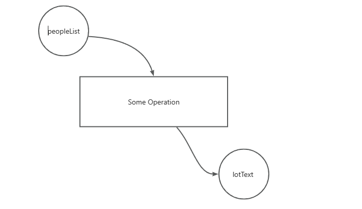
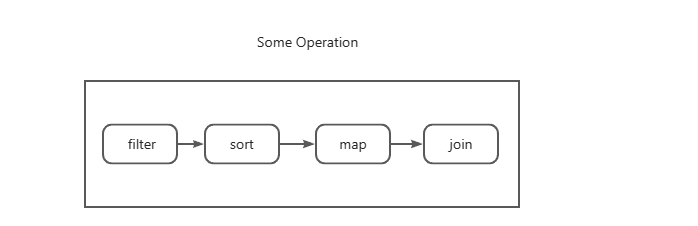

# 函数式编程
在JS世界中，最常见的为以下三种范式是需要进行了解的：
- 命令式编程
- 面向对象编程 OOP
- 函数式编程 FP

纵观前端的学习之路，入门前端的第一步接触到的基本就是命令式编程，随着JS知识的渐进，就会接触到基本的“模拟继承”“原型与原型链”这些面向对象的概念，但什么是函数式编程，其实还是很神秘和未知的，很大部分函数式编程的概念都是在不断工作中去总结出来的。

## 命令式 vs 函数式
命令式编程关注的是一系列具体的执行步骤，当你想要使用一段命令式的代码来达到某个目的，你需要一步一步地告诉计算机应该“怎样做”。

而函数式上需要更多的去思考这样的问题：**需要提供什么样的输入 想要什么样的输出。**

从一个例子上来出发：

假如现在有这样的需求，现在有一系列员工的信息数据源。对于年龄大于25的员工做生涯指导，需要拉出一张满足条件的员工信息清单，清单中的每一条信息用逗号隔开，并按照年龄升序展示。

如果按照命令式来编程，分三步走：
- 对列表进行排序
- 筛选出＞25的员工列表
- 遍历打印这些信息
```js
const peopleList = [
  {
    name: 'John Lee',
    age: 24,
    career: 'engineer'
  },
  {
    name: 'Bob Chen',
    age: 22,
    career: 'engineer'
  },
  {
    name: 'Lucy Liu',
    age: 28,
    career: 'PM'
  },
  {
    name: 'Jack Zhang',
    age: 26,
    career: 'PM'
  },
  {
    name: 'Yan Xiu',
    age: 30,
    career: 'engineer'
  }
]

const len = peopleList.length

for(let i=0;i<len;i++) {
  for(let j=0;j<len-1;j++) {
    if(peopleList[j].age > peopleList[j+1].age) {
      [peopleList[j], peopleList[j+1]] = [peopleList[j+1], peopleList[j]]
    }
  }
}

let logText = ''
for(let i=0; i<len; i++) {
  const person = peopleList[i]
  if( person.age >= 24 ) {
    const perLogText = `${person.name}'s age is ${person.age}`
    if(i!==len-1) {
      logText += `${perLogText},`
    } else {
      logText += perLogText
    }
  }
}

console.log(logText)
```
如果用函数式编程，代码就会编程这样：
```js
// 定义筛选逻辑
const ageBiggerThan24 = (person)=> person.age >= 24

// 定义排序逻辑
const smallAgeFirst = (a, b) => {
  return a.age - b.age
}

// 定义信息提取逻辑
const generateLogText = (person)=>{
  const perLogText = `${person.name}'s age is ${person.age}`
  return perLogText
}

const logText = peopleList.filter(ageBiggerThan24)
                      .sort(smallAgeFirst)
                      .map(generateLogText)
                      .join(',')

console.log(logText)
```
这段代码在执行结果上和命令式代码其实是一样的，但是内容和可读性上有了很大的提升。不需要了解每个函数内部做了什么，仅仅通过函数名就推断出来这个调用链做了哪些事情。

而且将过滤24岁员工 年龄排序 打印数据 都抽成了一个个函数，可以用复用到其他地方。

在命令式代码中，比大小排序字符串处理这样的逻辑，就像是“流水账”，执行完也就没了，相同的逻辑以后只能靠复制粘贴。

如果想的比较浅的话，会感觉到**函数式编程**无非是调用了几个数组方法，但不可否认的是**数组方法确实是非常重要的函数式编程工具**。

如果考虑较深的话，其实表达了一种与命令式截然不同的思想：**以“输入”和“输出”为轴心来组织代码块。**



中间的`Some Operation`对于我们来说是一个黑盒，但这个黑盒可以通过进一步分析数据得出变换来明确出黑盒中的函数组合。


对于流水线中的每一个步骤、每一个函数调用，**我们仍然不必去关注其内部的执行细节，只需要关注函数的输入与输出。**

每一个函数都是一个逻辑块，每一个逻辑块都代表着一次变换，在函数式编程的代码组织下，关注点不再是具体的逻辑实现，而是对**变换**的组合。

## 函数式 vs 面向对象
**函数式编程通过使用函数来将值和行为转换成抽象单元，接着用于构建软件系统。**

在面向对象的思想中，当遇到一个问题时，往往是将解决问题的方案分解成多个角色。这些拥有各种功能的角色通过组合聚集合并成一个更大的角色。

**面向对象将问题分解为多个名词**

比如：现在要将一个md文件转换为Html上的Dom元素，那么通过面向对象的思想，那么整个程序类似于：
```js
class mdCreator(mdFile){
  //...
  generateMd(){
    
  }
  //...
}

class transformer(){
  //...
  mdToHtml(md){
    // 对md实例进行操作
  }
  //...
}

class htmlCreator(){
  
  // 生产dom元素
  generateDom(html){
    // ...
  }
}

let md = mdCreator.generateMd(mdFile)
let html = transformer.mdToHtml(md)
let doms = html.generatorDom(html)
```
可以看到在一个面向对象系统的内部，对象间的交互会引起各种各个对象内部状态的变化，而整个系统的状态转变则是由许许多多小的，细微的状态变化混合来形成的。这些相互关联的状态变化形成了一个概念上的“变化网”。

一旦一处发生变化，可能导致一些对象实例的属性和行为也发生变化。

**相反，函数式编程是将相同的问题分解为“动词”**

而函数式系统则努力减少可见的状态修改（实践中，函数式编程不以消除状态为改变为主要目的，而是将任何已知系统中的突变的出现尽量压缩到最小的区域里去）

函数本身类比于对象，就具有很好的封装性（这是因为JS支持闭包），确定抽象行为，并为其构建函数（抽象父类），利用已有的函数来构建更加复杂的抽象行为（对象继承），并且通过将现有的函数传给其他的函数来构建成更加复杂的抽象（对象组合）


:::tip
实际上，函数式编程可以看为是对命令式编程的一个封装，对于再小的逻辑块都可以抽成一个函数，只去考虑输入和输出。但是没必要把一段复杂的逻辑抽成无数个小的函数，灵活的业务情况需要灵活的去组织代码。
:::