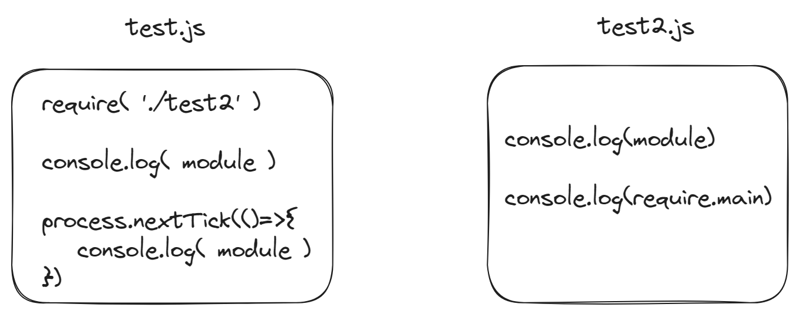

# CJS和ESM
模块化主要还是为了解决这么两个问题：
- 模块必须是密闭空间，所有与外界沟通交互的事物都必须有明确的意图
- 模块是为了将大型应用程序切割为独立维护的小事物，更加容易被使用和维护

## CJS
CommonJS的最初的主要目的是为除浏览器环境之外的JavaScript环境建立模块生态系统的公约。

在CommonJS的官网，有这么一句口号：*JavaScript : not just for browsers any more!*

在一个符合 CommonJS 的模块中，必需包含三个选项：
- `require`函数：接收参数为模块标识符，其返回值就是其所引用的外部模块所暴露的API
- 模块上下文：`require`函数，`exports`对象，`module`对象
- 模块标识符：就是一个字符串，用来传给`require`函数

a simple example:
```js
// math.js
exports.add = function() {
    var sum = 0, i = 0, args = arguments, l = args.length;
    while (i < l) {
        sum += args[i++];
    }
    return sum;
};

// increment.js
var add = require('math').add;
exports.increment = function(val) {
    return add(val, 1);
};

// program.js
var inc = require('increment').increment;
var a = 1;
inc(a); // 2

module.id == "program";

```
:::tip
CommonJS 是运行时做的模块加载和运行，它可以在代码执行一半的时候以动态的方式加载，这种方法在一些静态分析的时候会造成阻碍。
:::

## ESM
ESM直接通过`import`与`export`语法来导入和导出模块。

语法也非常简单：
```js
// export.js
export default function () {
  console.log('foo');
}

// import.js
import foo from 'export';
foo(); // 'foo'

```
:::tip
ESM则是在模块顶部以语法的形式加载模块，完全可以做静态分析
:::

## NodeJS的CJS
在NodeJS中，一个文件就被视为一个“模块”，在一个模块中，可以直接使用这些变量：
- `require`函数
- `exports`对象
- `module`对象
- `__dirname`模块所在目录名
- `__filename`模块的文件名
- `require.main`入口文件的所映射的`Module`实例

而且NodeJS的module对象下还挂载了一个module.exports对象，其初始值指向的就是上面的exports对象。而真正的导出是module.exports，并不是exports。当两者指向相同的时候，可以使用exports.foo = bar。但如果更改了引用地址重新指定了module.exports，就导致两者的指向就出现不同，就会导致出现问题：
```js
module.exports = {  // 更换了引用地址
  foo: 'bar',
};

exports.hello = 'world';  // 作废了

```
`exports`是`module.exports`的一个引用，开始时它指向一个空对象。当你使用 `exports` 导出一个值时，它实际上是将该值添加到 `module.exports` 中。

上文提到`require.main`是入口文件所引射的`Module`对象。需要知道的是，在NodeJS中每一个CJS模块都最终会被加载成一个`Module`类的实例，被放在NodeJS内部的内存中。

来看这个例子：
```js
// test2.js
console.log(module);
console.log(require.main);

// test.js
require('./test2');
console.log(module);
process.nextTick(() => {
    console.log(module);
});

// 这段代码中存在四次有关“Module”实例的输出
```

- 第一次发生在`test2.js`自身的第一行`module`：
这会打印`test2.js`本身:
```js
Module {
  id: '/foo/test2.js',
  path: '/foo',
  exports: {},
  filename: '/foo/test2.js',
  loaded: false, // 此时，test2.js模块自身代码还没执行完
  children: [],
  paths: [
    '/foo/node_modules',
    '/node_modules'
  ]
}
```
- 第二次将会执行`test2.js`的`require.main`语句：

可以看出，主模块正在执行`require('./test2.js')`这一行代码，自身也没有加载完，`loaded`自然还是`false`。而它对比`test2.js`的`Module`实例又多了`children`元素，里面的`Module`实例就是`test2.js`的`Module`实例。这其实说明了两个文件的依赖关系实际上是在运行的时候才生成的。
```js
Module {
  id: '.',
  path: '/foo',
  exports: {},
  filename: '/foo/test.js',
  loaded: false,
  children: [
    Module {
      id: '/foo/test2.js',
      path: '/foo',
      exports: {},
      filename: '/foo/test2.js',
      loaded: false,
      children: [],
      paths: [Array]
    }
  ],
  paths: [
    '/foo/node_modules',
    '/node_modules'
  ]
}

```
- 第三次输出是由`test.js`输出的自身本身，这个对象等同于`test2.js`的`require.main`，所以和第二次输出的内容基本上就是一致的:
```js
Module {
  id: '.',
  path: '/foo',
  exports: {},
  filename: '/foo/test.js',
  loaded: false,
  children: [
    Module {
      id: '/foo/test2.js',
      path: '/foo',
      exports: {},
      filename: '/foo/test2.js',
      loaded: true, // 唯一的不同在这里：test2.js已经加载完毕了,loaded为True
      children: [],
      paths: [Array]
    }
  ],
  paths: [
    '/foo/node_modules',
    '/node_modules'
  ]
}
```
- 第四次输出，是执行`process.nextTick()`，将回调函数进去，供给下一个Tick执行。至此，`test.js`模块也加载完成了，后面进入事件循环了，过了一个Tick之后，NodeJS执行`process.nextTick`回调。
```js
Module {
  id: '.',
  path: '/foo',
  exports: {},
  filename: '/foo/test.js',
  loaded: true, // test.js已经加载完毕了,loaded为True
  children: [
    Module {
      id: '/foo/test2.js',
      path: '/foo',
      exports: {},
      filename: '/foo/test2.js',
      loaded: true, // test2.js已经加载完毕了,loaded为True
      children: [],
      paths: [Array]
    }
  ],
  paths: [
    '/foo/node_modules',
    '/node_modules'
  ]
}
```
## NodeJS的ESM
当NodeJS拿到一个`import ... 'foo'`的时候，还是需要决定从哪怎么加载一个模块。V8只是实现了语法上面的解析，具体加载代码等操作还是需要各运行时自行适配。

## NodeJS对文件的识别
通常一个`*.mjs`会被认为是ESM

通常一个`*.cjs`会被认为是CJS

如果是`*.js`会被认为，则需要看它离最近的父`package.json`文件中的`type`字段，用于判断`*.js`文件是ESM还是CJS模块。如果`type`值为`module`，则其`*.js`会被认为是ESM，若其值为`commonjs`或者不该存在的值，就认为`*.js`为CommonJS模块。

ESM可以通过`import`加载CommonJS模块，但是反过来是不行的，也就说CommonJS模块是无法通过`require()`来加载ECMAScript module的。这里涉及到的本质问题是**模块加载的异同步**问题。

CommonJS的`require`机制是完全同步的，而ESM的`import`机制则是异步的。

`import`是异步的，那么在内部通过同步的方式模拟一个`require`流程是完全没问题的，但是反过来很难做，一个同步的东西无法很正常加载异步内容的。
:::tip
但是这不意味着无法加载ESM，可以在CommonJS中使用动态载入语法`import()`函数
:::

## CJS模块的本质
其实CJS模块实际上是对原来的代码进行了首尾包装，从而形成的闭包，才有的`__dirname`，`__filename`这些内容。

前文说到，一个CommonJS在一个模块中，本质上是一个`Module`实例，实例中包含标识符`id`，`module`，`exports`等。实际上，它是一个函数的执行结果。

简单来说，CommonJS模块就是一个`module`对象，内含`exports`。那么NodeJS在加载模块`requrie()`时，内部就会预先声明这个对象，不严谨的表示就是这样：
```js
const module = {
  exports: {},
};
```
然后，NodeJS在内部将目标模块的代码前后都加上一段代码，使之变成一个函数，这个函数长这个样子：
```js
(function (exports, require, module, __filename, __dirname) {
  // 实际模块代码
});
```
也就是说，如果自定义了这么一个模块，其代码是:
```js
module.exports = {
  hello: 'world',
};

// 可以看到这个首尾包装的函数，被传入了exports require module __filename __dirname
(function (exports, require, module, __filename, __dirname) {
  module.exports = {
    hello: 'world',
  };
});
```

下一步，就是NodeJS在`require()`内部执行这个函数，假设这个函数叫做`compiledWrapper`，那么大概就是如下执行的：
```js
const module = {
  exports: {},
};

const result = compiledWrapper(module.exports,
                               <针对新模块的 `require` 函数>,
                               module,
                               <解析出来的文件名>,
                               <解析出来的目录名>);
```
上面的步骤执行下来后，`module`被传入之前准备好的函数，模块代码里面做了将其`exports`值赋为`{hello:'world'}`对象的操作。一套操作之后，最先定义好的`module`对象就在用户模块代码中被赋值了。

**所以，CommonJS模块本质就是一个exports对象传入被编译的模块函数中执行挂载操作得到的终态。**