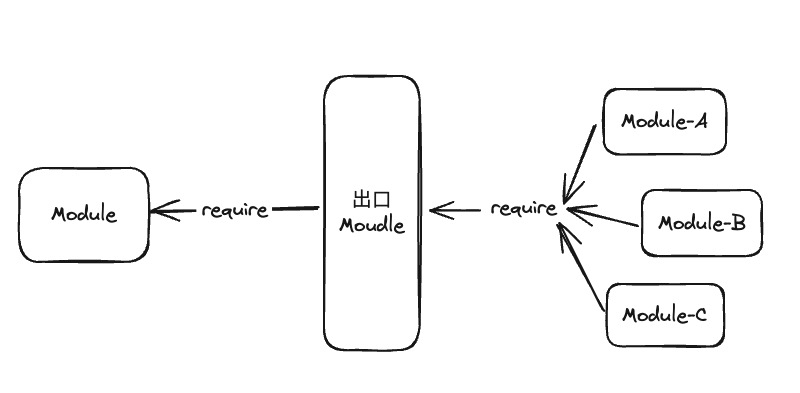
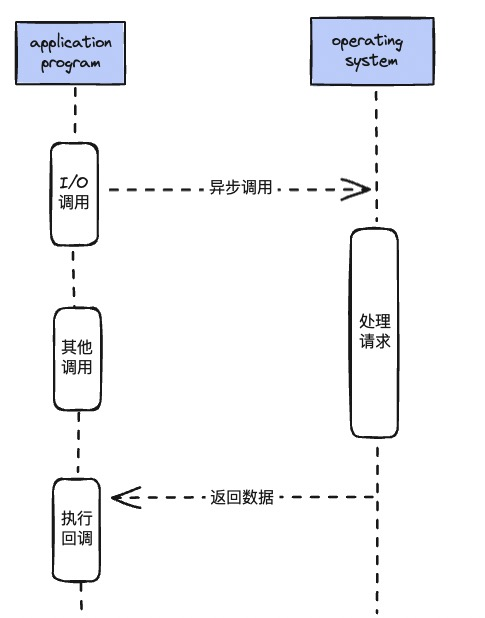

# 深入浅出NodeJS
这篇笔记主要是来源于我读的《深入浅出Node.js》一书中的记录的知识点📝

我非常推荐你去读一下原书，会对自己的成长特别大。

我在这本书里面基本理清了Node背后的运行机制和工作原理，其中关于异步方面的代码设计非常优秀，我借鉴了其中的 **中间件** 思想，去设计了工作中的图片列表组件（虽然说组件是Web端的，但是其中的设计思想是共同的😛）

[我推荐给你的深入浅出Node.js原版pdf](https://blog.songqingbo.cn/pdf/nodejs/%E6%B7%B1%E5%85%A5%E6%B5%85%E5%87%BANode.js.pdf)

::: tip 温馨提示
呃呃，这本书内容有点多，这个pdf加载会比较慢，我会选择打开网站后去倒杯咖啡🥄
:::

👌我们走起

---

## 为什么ESM可以import引入CJS模块，而CJS反过来不行？
这里的本质问题是因为**模块加载的同异步机制问题**。CommonJS的`require`机制是机制是完全同步的，而ESM的`import`机制规则是完全异步的。

`import`是异步的，那么在内部去通过同步的方式模拟一个`require`流程是可以实现的，但是反过来却不好弄，一个同步的东西是很难加载异步内容的，至少无法通过比较正统的方式解决。

虽然CommonJS无法通过`require`去加载一个ESM，但不意味着它就完全不能加载ESM，实际上CommonJS支持`import()`函数。所以仍然是可以通过`import()`函数来加载一个ESM

虽然`import * as mod from 'xxx'`的语法中看起来像是同步的，其实在引擎内部帮助处理了异步的部分。然而在`import()`函数中，异步依然需要自己处理，它的返回值是一个`Promise`

```js
import('xxx').then(mode => {
  // ...
})
```

---

## NodeJS引入模块时，发生了什么？

在Node中引入模块，实际上是需要经历如下3个步骤：
- 路径分析
- 文件定位
- 编译执行
在完全理解Node的模块引入机制之前，你必须了解**两件关键的事情：**

**第一件事：** 在Node中，模块被分为两类，一类是Node提供的模块，称为核心模块。另一类是用户编写的模块，称为文件模块。

核心模块，在Node源代码的编译过程中，就编译进了二进制执行文件。在Node启动时，部分核心模块就被直接加载进了内存中去，所以这类核心模块在被引入时，文件定位和编译执行这两步其实直接被跳过了，并且在路径分析中被优先判断。所以它的加载速度是最快的。

文件模块，是运行时动态加载的，需要经过完整的 路径分析，文件定义，编译执行 过程。所以速度较核心模块慢。

**第二件事**：和前端浏览器一样，Node也会有缓存机制来提升性能，Node对于引入过的模块都会进行缓存，从而减少二次引入带来的开销，与前端浏览器不同的是，浏览器缓存的是静态脚本文件，而Node缓存的是编译和执行之后的对象。不论是核心模块还是文件模块，`require`方法对于相同的模块的二次加载一律采用缓存优先的方式，并且这是最高级优先级的，当然核心模块的缓存检查 优先于 文件模块的缓存检查。

### 路径分析
`require`接受标识符来定义要引入的模块，但标识符号的形式不同，模块的查找和定位都有不同程度上的差异。

模块标识符在Node中主要分为以下几类：
- 核心模块，如 http，fs，path 模块
- . 或 .. 开头的相对路径文件模块
- 以 / 开始的绝对路径文件模块
- 非路径形式的文件模块，如自定义的 connect 模块

**核心模块**
核心模块的加载仅次于缓存加载，如果试图加载一个与核心模块标识符相同的自定义模块，那么会失败。假如自己编写了一个http用户模块，想要加载成功，必须选择一个不同的标识符或换用路径的方式加载。由于二机制执行代码已经被Node编译了，所以加载速度最快

**路径形式存在的文件模块**
require方法会将路径转换为真实的路径，并以真实路径作为索引，将编译执行后的结果放入到缓存中，以便于二次加载时更快，由于路径指明了具体的文件位置，所以加载速度慢于核心模块

**自定义模块**
自定义模块指的是非核心模块，也不是路径形式的标识符，比如`const express = require('express')`。
它是一种特殊的文件模块，可能是一个文件或者包的形式。这类模块的查找是最费时的，也是所有方式中最慢的一种。

因为它要Node去通过标识符去生成模块路径，而模块路径的生成规则如下：
- 当前文件目录下的node_modules目录
- 父目录下的node_modules目录
- 父目录的父目录下的node_modules目录
- 路径沿上递归，直到根目录下的node_modules目录

它的生成方式与JS中的原型链或作用链的查找方式十分类似。Node会在加载过程中，逐个尝试模块路径中的路径，直到找到目标文件位置。

### 文件定位
在文件定位过程中，Node还进行了包括文件扩展名的分析，目录和包的处理

**文件扩展名解析**
`require`在分析标识符的过程中，会出现标识符中不包含文件扩展名的情况。这种情况下，Node会按照 .js .json .node 的顺序去补充扩展名，进行以此尝试。

在尝试过程中，需要调用fs模块同步阻塞式地判断文件是否存在。

:::tip 提升性能的小技巧
因为Node是单线程的，如果是 .node 和 .json 文件，在传递require的标识符中带上扩展名，会加快一点速度。
:::

**目录分析和包**
在分析标识符的过程中，`require()`通过分析文件扩展名之后，可能没有查找到对应的文件，但是却得到了一个目录，此时Node会将目录当作一个包处理。

这个过程中，Node在当前目录下查找`package.json`，通过`JSON.parse()`解析出包的描述对象，从中取出main属性来制定文件名进行定位。如果main指定的文件名错误，或者根本就没有`package.json`文件，Node将 index 当作默认文件名，然后依次查找`index.js`，`index.json`，`index.node`。如果还没找到直接报错。

### 解析编译
在Node中，每个文件模块都是一个对象，它的定义如下
```js
function Module(id,parent){
  this.id = id;
  this.exports = {};
  this.parent = parent;
  if(parent && parent.children){
    parent.children.push(this)
  }
  this.filename = null;
  this.loaded = false;
  this.children = [];
}
```
编译和执行是引入文件模块的最后一个阶段，对于不同的文件扩展名，其载入方法也不同，这里具体拿js文件做解释😘。

对于js文件，通过fs模块同步读取文件后进行编译执行。每一个编译成功的模块都会将其文件路径作为索引缓存在`Module._cache`对象上，用来提高二次引入的性能。

在编译过程中，Node对获取的js文件内容进行**头尾函数**包装，一个正常的JS文件内容会被包装为如下的样子：

```js
let exports = module.exports // 这个很重要哦
(function(exports, require, module, __filename, __dirname){
  var math = require('math')
  exports.area = function (radius){
    return Math.PI * radius * radius;
  }
})
```
这样每个模块文件之间都进行了作用域隔离，当前模块对象的`exports` `require` `module`以及在文件定位中得到的完整路径文件路径和文件目录`__filename`和`__dirname`作为参数传入这个函数中。

这就是为什么这些变量并没有定义在每个模块文件中，却能直接使用的原因。在执行之后，模块的exports属性返回给了调用方。exports属性上的任何一个方法和属性都可以被外部调用到。

也是为什么存在exports的情况下，还存在module.exports，理想情况下，只要赋值给exports上的属性即可。

:::warning 不要直接复制给exprots
这样赋值会切断exports对module.exports的引用关系，最后导致失败
:::
```js
exports = function () {
  // 错误的做法
}
```
## NPM与包的关系
Node组织了自身的核心模块，也使得第三方文件模块可以有序地编写和使用。但是在第三方模块中，模块和模块之间依然是散落的，相互之间不能之间引用。而在模块之外，包和NPM则是将模块联系起来的一种机制。

Node对模块规范的实现，一定程度上解决了变量依赖，依赖关系等代码组织性问题。包的出现，则是在模块的基础上进一步组织了JS代码。



CommonJS的包规范和定义其实非常简单，它由包结构和包描述文件两部分组成，前者用于组织包中的各种文件，后者描述包的相关信息。

### 包结构
一个完全符合CommonJS规范的包目录应该包含如下这些文件
- package.json : 包描述文件
- bin : 用于存放可执行二进制文件的目录
- lib：用于存放JavaScript代码的目录
- doc : 用于存放文档的目录
- test : 用于存放单元测试用例的代码

### 包描述文件
包描述文件就是`package.json`文件，这里介绍一下必需常见的字段：
- name 包名。包名必须是唯一的，以免对外公布时产生重名冲突的误解
- description 包简介
- version 版本号
- keywords 关键词数组 NPM中主要用用户可以快速找到你编写的包
- dependencies 使用当前包所需要依赖的包列表，NPM会通过这个熟悉帮助自动加载依赖的包
- scripts 脚本说明对象，它主要被包管理器用来安装，编译，测试和卸载包，就像如下
```js
"script":{
  "install":"install.js",
  "uninstall":"uninstall.js",
  "build":"build.js",
  "doc":"make-doc.js",
  "test":"test.js"
}
```
- author 包作作者
- bin 一些包作者希望包可以作为命令行工具使用。**配置好bin字段后，通过npm install package_name -g命令可以将脚本添加到执行路径，之后可以在命令行中直接执行。通过-g命令安装的模块包称为全局模式，比如npm install express -g安装express后，就可以在命令行中使用express命令了**
- main 模块引用方法`require`在引入包时，会优先检查这个字段，并将其作为包中其余模块的入口。如果不存在，就像前面说过，它会·查找包目录下的`index.js` `index.node` `index.json`这些文件
- devDependencies 一些模块只在开发时需要依赖。

### NPM
CommonJS包规范是理论，而NPM是其中一种实践。对于Node而言，NPM帮助完成了第三方模块的发布，安装和依赖。借助NPM，Node与第三方模块之间形成了很好的一个生态系统。

## 企业内部搭建一个本地NPM仓库
在企业内部应用中使用NPM与开源社区中的使用由一定差别。企业的限制在于，一方面需要享受到模块开发带来的低耦合和项目组织上的好处，另一方面也要考虑到模块保密性的问题。

为了同时能够享受到NPM上的包，同时对自己的包进行保密和限制，就需要搭建本地npm仓库了。

企业的npm仓库的好处在于，局部npm仓库可以选择不同步官方源仓库中的包。对于企业内部而言，私有的可重用模块可以打包到局域NPM仓库中，这样可以保持更新的中心化，不至于让各个小项目各自维护相同功能的模块，杜绝通过复制粘贴实现代码共享的行为。

## Node为什么选择异步I/O
Node使用异步I/O主要从**用户体验**和**资源分配**这两个方面来考虑的

### 用户体验
在前端通过异步可以消除掉UI阻塞的现象。在Node服务中，假如一个资源来自于两个不同位置的数据的返回，第一个资源需要M毫秒的耗时，第二个资源需要N毫秒的耗时。如果采用同步的方式，代码大致如下：
```
// 消费时间M
getData('from_db', result=>{})
// 消费时间N
getData('from_remote_api', result=>{})
```
那么消耗的时间为`M+N`

如果采用异步的方式，第一个资源的获取并不影响第二个资源，第二个资源的请求开始并不依赖第一个资源的结束。如此，就可以享受到并发的优势:
```
getData('from_db', result=>{
  // 消费时间M
})
getData('from_remote_api', result=>{
  // 消费时间N
})
```
那么消耗的时间为`max(M,N)`，那么随着应用复杂性的增加，同步的方式将会爆炸，只有让后端能够快速响应资源，才能让前端更有体验。

### 资源分配
在资源的层面异步I/O也有很强的必要性。

如果在业务场景中存在一组互不相关的任务需要完成，主流的方法是：
- 单线程串行依次完成
- 多线程并行完成

多线程的代价在于创建线程和执行期线程上下文切换的开销较大，如果在很复杂的业务中，多线程编程需要面临锁，状态同步等问题，但多线程在多核CPU上能够有效提升CPU同步的问题。

而串行执行的缺点在于性能，任意一个耗时任务都会导致后续执行代码被阻塞，导致服务资源不能被很好的利用。

所以Node在两者之间给出了一个好的方案：利用单线程原理避免多线程的锁，状态同步问题。利用异步原理任务阻塞，更好的利用资源。

这样可以力求在单线程上将资源分配的更高效。同时Node，为了弥补单线程无法利用多核CPU的缺点，Node也提供了类似前端浏览器中的Web Workers的子进程，该子进程可以通过工作进程高效地利用CPU和I/O。

