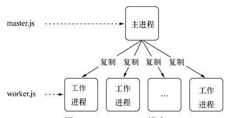
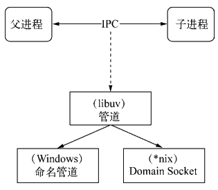

# 深入浅出NodeJS
这篇笔记主要是来源于我读的《深入浅出Node.js》一书中的记录的知识点📝

我非常推荐你去读一下原书，会对自己的成长特别大。

我在这本书里面基本理清了Node背后的运行机制和工作原理，其中关于异步方面的代码设计非常优秀，我借鉴了其中的 **中间件** 思想，去设计了工作中的图片列表组件（虽然说组件是Web端的，但是其中的设计思想是共同的😛）

[我推荐给你的深入浅出Node.js原版pdf](https://blog.songqingbo.cn/pdf/nodejs/%E6%B7%B1%E5%85%A5%E6%B5%85%E5%87%BANode.js.pdf)

::: tip 温馨提示
呃呃，这本书内容有点多，这个pdf加载会比较慢，我会选择打开网站后去倒杯咖啡🥄
:::

👌我们走起

## 简述一下Node特点
了解Node之前，需要好好清楚Node相较于其它语言的一些特别的点。
### 异步IO
在Node中绝大多数的操作都是以异步的方式去进行调用，Node的底层构建了很多的异步I/O的API，从文件读取到网络请求等。这样的意义在于，在Node中，可以非常自然的进行并行I/O操作。每个调用之间不需要等待前面的I/O调用结束。可以在编程模型上极大地提升效率，比如
```js
fs.readFile('/path1',function(){
    // 文件1读取完成
})

fs.readFile('/path2',function(){
    // 文件2读取完成
})
```
对于同步I/O来说，它们的耗时任务是两个任务的耗时之和。但是对于异步来说，就是取决于耗时最慢的那一个。
### 事件机制与回调函数
通过事件和回调函数，配合异步I/O，将事件发生点暴露给业务逻辑。就比如给读取文件绑定一个读取后的事件，在文件读取完毕之后，只需要关心文件读完后你需要执行的业务逻辑就可以了。

事件的编程方式具有轻量级，松耦合，关注业务点这些优点。但是事件与事件之间是独立的，如果在多个异步任务下，想要两个不同的事件进行协作就需要一些额外的操作了。

同时可以看到Node中到处都是回调函数，这主要是还是因为JavaScript语言可以将函数作为参数传递给方法进行调用，自然而然就成为了一种接受异步调用返回结果的最好的方式，但是问题在于，代码编写顺序和执行顺序没有关系，如果习惯了同步编程，由于穿插了异步方法和回调函数，那么在流程控制方面就需要多思考如何编写了。

### 单线程
Node的单线程最大好处在于**不用考虑像多线程编程那样去处处在意状态同步的问题，没有锁这种概念，也没有线程上下文交换所带来的性能上的开销。**

但是单线程也有一定的缺点：
- 无法利用多核CPU
- 错误会引起整个应用退出
- 大量计算占用CPU导致无法继续调用异步IO

像在浏览器的渲染主线程一样，大量的JS计算会阻塞UI的渲染，但是可以通过Web Workers来创建其它工作线程完成计算任务。

在Node中，如果占满了CPU计算，也会导致完成异步I/O的回调函数没得到及时的执行。Node也有*child_process*。通过将计算分发到各个子进程中，将大量的计算给分解掉，然后再通过进程之间的事件消息来传递结果，可以很好地保持应用模型的简单和依赖。

## CommonJS的模块规范
CommonJS对模块的定义十分简单，主要还是分为模块引用，模块定义和模块标识这3个地方。

### 模块引用
```js
var math = require('math')
```
在CJS中，使用`require`方法来接受模块标识，以此引入一个模块的API到当前的上下文中。

### 模块定义
上下文中提供了`exports`对象用于导出当前模块的方法或者变量，并且它是唯一的出口。

在模块中，还存在一个module对象，它代表模块自身，而exports是module的属性。在Node里，一个文件就是一个模块，将方法挂载到exports对象上作为属性即可定义出导出的方式：

```js
exports.add = function(){
  //...
}
```

### 模块标识
标识就是传递给`require()`方法的参数，它必须是符合小驼峰命名的字符串，或者以.，..开头的相对路径，或者绝对路径。它可以没有文件名后缀.js。


## 为什么ESM可以import引入CJS模块，而CJS反过来不行？
这里的本质问题是因为**模块加载的同异步机制问题**。CommonJS的`require`机制是机制是完全同步的，而ESM的`import`机制规则是完全异步的。

`import`是异步的，那么在内部去通过同步的方式模拟一个`require`流程是可以实现的，但是反过来却不好弄，一个同步的东西是很难加载异步内容的，至少无法通过比较正统的方式解决。

虽然CommonJS无法通过`require`去加载一个ESM，但不意味着它就完全不能加载ESM，实际上CommonJS支持`import()`函数。所以仍然是可以通过`import()`函数来加载一个ESM

虽然`import * as mod from 'xxx'`的语法中看起来像是同步的，其实在引擎内部帮助处理了异步的部分。然而在`import()`函数中，异步依然需要自己处理，它的返回值是一个`Promise`

```js
import('xxx').then(mode => {
  // ...
})
```

## NodeJS引入模块时，发生了什么？

在Node中引入模块，实际上是需要经历如下3个步骤：
- 路径分析
- 文件定位
- 编译执行

在完全理解Node的模块引入机制之前，你必须了解**两件关键的事情：**

**第一件事：** 在Node中，模块被分为两类，一类是Node提供的模块，称为核心模块。另一类是用户编写的模块，称为文件模块。

核心模块，在Node源代码的编译过程中，就编译进了二进制执行文件。在Node启动时，部分核心模块就被直接加载进了内存中去，所以这类核心模块在被引入时，文件定位和编译执行这两步其实直接被跳过了，并且在路径分析中被优先判断。所以它的加载速度是最快的。

文件模块，是运行时动态加载的，需要经过完整的 路径分析👉文件定义👉编译执行 过程。所以速度较核心模块慢。


**第二件事**：和前端浏览器一样，Node也会有缓存机制来提升性能，Node对于引入过的模块都会进行缓存，从而减少二次引入带来的开销，与前端浏览器不同的是，**浏览器缓存的是静态脚本文件**，而**Node缓存的是编译和执行之后的对象**。不论是核心模块还是文件模块，`require`方法对于相同的模块的二次加载一律采用缓存优先的方式，并且这是最高级优先级的。
:::tip
当然核心模块的缓存检查 优先于 文件模块的缓存检查。
:::
### 路径分析
`require`接受标识符来定义要引入的模块，但标识符号的形式不同，模块的查找和定位都有不同程度上的差异。

模块标识符在Node中主要分为以下几类：
- 核心模块，如 http，fs，path 模块
- . 或 .. 开头的相对路径文件模块
- 以 / 开始的绝对路径文件模块
- 非路径形式的文件模块，如自定义的 connect 模块

**核心模块**
核心模块的加载仅次于缓存加载，如果试图加载一个与核心模块标识符相同的自定义模块，那么会失败。假如自己编写了一个http用户模块，想要加载成功，必须选择一个不同的标识符或换用路径的方式加载。由于二机制执行代码已经被Node编译了，所以加载速度最快

**路径形式存在的文件模块**
require方法会将路径转换为真实的路径，并以真实路径作为索引，将编译执行后的结果放入到缓存中，以便于二次加载时更快，由于路径指明了具体的文件位置，所以加载速度慢于核心模块

**自定义模块**
自定义模块指的是非核心模块，也不是路径形式的标识符，比如`const express = require('express')`。
它是一种特殊的文件模块，可能是一个文件或者包的形式。这类模块的查找是最费时的，也是所有方式中最慢的一种。

因为它要Node去通过标识符去生成模块路径，而模块路径的生成规则如下：
- 当前文件目录下的node_modules目录
- 父目录下的node_modules目录
- 父目录的父目录下的node_modules目录
- 路径沿上递归，直到根目录下的node_modules目录

它的生成方式与JS中的原型链或作用链的查找方式十分类似。Node会在加载过程中，逐个尝试模块路径中的路径，直到找到目标文件位置。

### 文件定位
在文件定位过程中，Node还进行了包括文件扩展名的分析，目录和包的处理

**文件扩展名解析**
`require`在分析标识符的过程中，会出现标识符中不包含文件扩展名的情况。这种情况下，Node会按照 .js .json .node 的顺序去补充扩展名，进行以此尝试。

在尝试过程中，需要调用fs模块同步阻塞式地判断文件是否存在。

:::tip 提升性能的小技巧
因为Node是单线程的，如果是 .node 和 .json 文件，在传递require的标识符中带上扩展名，会加快一点速度。
:::

**目录分析和包**
在分析标识符的过程中，`require()`通过分析文件扩展名之后，可能没有查找到对应的文件，但是却得到了一个目录，此时Node会将目录当作一个包处理。

这个过程中，Node在当前目录下查找`package.json`，通过`JSON.parse()`解析出包的描述对象，从中取出main属性来制定文件名进行定位。如果main指定的文件名错误，或者根本就没有`package.json`文件，Node将 index 当作默认文件名，然后依次查找`index.js`，`index.json`，`index.node`。如果还没找到直接报错。


### 解析编译
在Node中，每个文件模块都是一个对象，它的定义如下
```js
function Module(id,parent){
  this.id = id;
  this.exports = {};
  this.parent = parent;
  if(parent && parent.children){
    parent.children.push(this)
  }
  this.filename = null;
  this.loaded = false;
  this.children = [];
}
```
编译和执行是引入文件模块的最后一个阶段，对于不同的文件扩展名，其载入方法也不同，这里具体拿js文件做解释😘。

对于js文件，通过fs模块同步读取文件后进行编译执行。每一个编译成功的模块都会将其文件路径作为索引缓存在`Module._cache`对象上，用来提高二次引入的性能。

在编译过程中，Node对获取的js文件内容进行**头尾函数**包装，一个正常的JS文件内容会被包装为如下的样子：

```js
let exports = module.exports // 这个很重要哦
(function(exports, require, module, __filename, __dirname){
  var math = require('math')
  exports.area = function (radius){
    return Math.PI * radius * radius;
  }
})
```
这样每个模块文件之间都进行了作用域隔离，当前模块对象的`exports` `require` `module`以及在文件定位中得到的完整路径文件路径和文件目录`__filename`和`__dirname`作为参数传入这个函数中。

这就是为什么这些变量并没有定义在每个模块文件中，却能直接使用的原因。在执行之后，模块的exports属性返回给了调用方。exports属性上的任何一个方法和属性都可以被外部调用到。

也是为什么存在exports的情况下，还存在module.exports，理想情况下，只要赋值给exports上的属性即可。

:::warning 不要直接复制给exprots
这样赋值会切断exports对module.exports的引用关系，最后导致失败
:::
```js
exports = function () {
  // 错误的做法
}
```

## 核心模块为什么快？
因为大部分核心模块要么全部被C/C++编写，要么通过C/C++模块完成主要核心，由JavaScript实现封装。这样的话综合了脚本语言开发速度快，而静态语言编译性能快。在进行文件编译时候，这些核心模块可以很快编译为二进制文件加载到内存中，不需要经过上面的**路径解析**，**文件定位**，**编译**的过程了

## NPM与包的关系
Node组织了自身的核心模块，也使得第三方文件模块可以有序地编写和使用。但是在第三方模块中，模块和模块之间依然是散落的，相互之间不能之间引用。而在模块之外，包和NPM则是将模块联系起来的一种机制。

Node对模块规范的实现，一定程度上解决了变量依赖，依赖关系等代码组织性问题。包的出现，则是在模块的基础上进一步组织了JS代码。


CommonJS的包规范和定义其实非常简单，它由包结构和包描述文件两部分组成，前者用于组织包中的各种文件，后者描述包的相关信息。

### 包结构
一个完全符合CommonJS规范的包目录应该包含如下这些文件
- package.json : 包描述文件
- bin : 用于存放可执行二进制文件的目录
- lib：用于存放JavaScript代码的目录
- doc : 用于存放文档的目录
- test : 用于存放单元测试用例的代码

### 包描述文件
包描述文件就是`package.json`文件，这里介绍一下必需常见的字段：
- name 包名。包名必须是唯一的，以免对外公布时产生重名冲突的误解
- description 包简介
- version 版本号
- keywords 关键词数组 NPM中主要用用户可以快速找到你编写的包
- dependencies 使用当前包所需要依赖的包列表，NPM会通过这个熟悉帮助自动加载依赖的包
- scripts 脚本说明对象，它主要被包管理器用来安装，编译，测试和卸载包，就像如下
```js
"script":{
  "install":"install.js",
  "uninstall":"uninstall.js",
  "build":"build.js",
  "doc":"make-doc.js",
  "test":"test.js"
}
```
- author 包作作者
- bin 一些包作者希望包可以作为命令行工具使用。**配置好bin字段后，通过npm install package_name -g命令可以将脚本添加到执行路径，之后可以在命令行中直接执行。通过-g命令安装的模块包称为全局模式，比如npm install express -g安装express后，就可以在命令行中使用express命令了**
- main 模块引用方法`require`在引入包时，会优先检查这个字段，并将其作为包中其余模块的入口。如果不存在，就像前面说过，它会·查找包目录下的`index.js` `index.node` `index.json`这些文件
- devDependencies 一些模块只在开发时需要依赖。

### NPM
CommonJS包规范是理论，而NPM是其中一种实践。对于Node而言，NPM帮助完成了第三方模块的发布，安装和依赖。借助NPM，Node与第三方模块之间形成了很好的一个生态系统。

## 企业内部NPM仓库
在企业内部应用中使用NPM与开源社区中的使用由一定差别。企业的限制在于，一方面需要享受到模块开发带来的低耦合和项目组织上的好处，另一方面也要考虑到模块保密性的问题。

为了同时能够享受到NPM上的包，同时对自己的包进行保密和限制，就需要搭建本地npm仓库了。

企业的npm仓库的好处在于，局部npm仓库可以选择不同步官方源仓库中的包。对于企业内部而言，私有的可重用模块可以打包到局域NPM仓库中，这样可以保持更新的中心化，不至于让各个小项目各自维护相同功能的模块，杜绝通过复制粘贴实现代码共享的行为。

## Node为什么选择异步I/O
Node使用异步I/O主要从**用户体验**和**资源分配**这两个方面来考虑的

### 用户体验
因为Node是单线程的。在Node服务中，假如一个资源来自于两个不同位置的数据的返回，第一个资源需要M毫秒的耗时，第二个资源需要N毫秒的耗时。如果采用同步的方式，代码大致如下：
```
// 消费时间M
getData('from_db', result=>{})
// 消费时间N
getData('from_remote_api', result=>{})
```
那么消耗的时间为`M+N`

如果采用异步的方式，第一个资源的获取并不影响第二个资源，第二个资源的请求开始并不依赖第一个资源的结束。如此，就可以享受到并发的优势:
```
getData('from_db', result=>{
  // 消费时间M
})
getData('from_remote_api', result=>{
  // 消费时间N
})
```
那么消耗的时间为`max(M,N)`，那么随着应用复杂性的增加，同步的方式将会爆炸，只有让后端能够快速响应资源，才能让前端更有体验。

### 资源分配
在资源的层面异步I/O也有很强的必要性。

如果在业务场景中存在一组互不相关的任务需要完成，主流的方法是：
- 单线程串行依次完成
- 多线程并行完成

如果创建线程的开销远小于并行执行，那么多线程依然是首选的。多线程的代价在于创建线程和执行期线程上下文切换的开销较大，如果在很复杂的业务中，多线程编程需要面临锁，状态同步等问题，但多线程在多核CPU上能够有效提升CPU同步的问题。

而串行执行的缺点在于性能，任意一个耗时任务都会导致后续执行代码被阻塞，导致服务资源不能被很好的利用。

所以Node在两者之间给出了一个好的方案：利用单线程原理避免多线程的锁，状态同步问题。利用异步原理任务阻塞，更好的利用资源。

这样可以力求在单线程上将资源分配的更高效。同时Node，为了弥补单线程无法利用多核CPU的缺点，Node也提供了类似前端浏览器中的Web Workers的子进程，该子进程可以通过工作进程高效地利用CPU和I/O。


## Node如何实现异步I/O
完成整个完整的异步I/O环节主要依靠以下四个方面:
- 事件循环
- 观察者
- 请求对象
- 执行回调

### 事件循环
在Node进程启动时，实际上会创建一个类似于`while(true)`的循环，每次执行循环体都可以被看成一次**Tick**，每个**Tick**的过程就是查看是否有事件待处理，如果有，就需要取出事件和相关的回调函数。如果存在相关联的回调函数，就执行它们，然后进入下一个循环。

### 观察者
在每个Tick中，需要观察者来判断事件是否需要处理。

每个事件循环中有一个或多个观察者，而判断是否有事件要处理的过程就是向这些观察者查询是否要处理的事件。**前端的浏览器也有类似的机制，事件可能来自用户的点击或者加载某些文件时产生，这些产生都有对应的观察者，比如`addEventListener`**，在Node里面，事件主要来自于网络请求，文件I/O等等，这些事件就对应了观察者有文件I/O观察者，网络I/O观察者等。

事件循环本身是一个典型的 *生产者/消费者* 模型。异步I/O，网络请求等则是事件的生产者，源源不断的为Node提供不同类型的事件，这些事件被传递到对应的观察者里去，事件循环就从观察者那里取出事件来进行处理。

### 请求对象
对于Node的异步I/O的调用而言,回调函数不由开发者来调用。而是由系统等待到时机之后在执行调用，中间有个过程，也就是JavaScript发起调用到内核执行完I/O操作的过渡过程中，存在一种名为**请求对象**的产物。

比如调用`fs.open(path,flags,mode,callback)`时，当调用到底层的Node的内建模块时，会创建一个请求对象，**其中JavaScript层传入的参数和当前callback都被封装到这个请求对象上**。

这个对象包装完毕时，就被推入到底层的线程池去等待，由于当前I/O操作在线程池中等待执行，不管是否阻塞I/O，反正不会影响到后续的JavaScript线程的执行了，从而达到了异步的目的。

### 执行回调
在每次Tick中，事件循环的I/O观察者，都会去检查底层的线程池是否有执行完的请求，如果存在会将请求对象加入到观察者的队列中，然后将其当作事件处理，然后把请求对象上的回调函数取出来执行就行了。


## process.nextTick
在不完全了解`process.nextTick`之前，不少人会为了立即执行一个异步任务，通过`setTimeout`来达到这种效果：
```js
setTimeout(function(){
  // ...todo
},0)
```
:::tip
其实调用`setTimeout`这样的定时器，会被插入到定时器观察者内部的一个红黑树中。每次Tick执行时，会从该红黑树中迭代取出定时器对象，检查是否超过定时时间，如果超过就形成了一个事件，它的回调函数就会立即执行
:::
所以可以看到，**定时器的问题在于它不是真正意义上精确**。采用定时器需要动用红黑树，创建定时器对象和迭代等操作比较浪费性能。

所以更加推荐使用`process.nextTick`方法的操作相对比较轻量。

每次调用`process.nextTick`就只会将回调函数放入到队列中，在下一轮的Tick取出执行。定时器中采用红黑树的操作事件复杂度为O(N)，而nextTick的时间复杂度为O(1)。所以process.nextTick更加高效是毋庸置疑的。

## Node的异步编程的优势和缺点有哪些？
### 优势
Node带来的最大的特性莫过于基于事件驱动的非阻塞I/O模式，非阻塞I/O可以使CPU和I/O并不互相依赖对等。 让资源得到更好的利用。对于网络应用而言，并行带来的 想象空间更大，延展而开的是分布式和云。并行使得各个单点之间能够更有效地组织起来。


如果采用传统的同步I/O模型，分布式计算中性能的折扣将会是非常明显的。

利用事件循环的方式，JavaScript线程就像一个分配任务和处理结果的监控者，而I/O池中各个线程都是执行者，两者是互不依赖的，所以可以保持整体的高效率。

### 缺点

#### 异常处理
`try/catch`处理异常时对于异步编程而言并不是那么适用。 异步I/O的实现主要包含两个阶段： 提交请求和处理结果。这两个阶段中间有事件循环的调度，两者彼此不关联。异步方法则通常在 第一个阶段提交请求后立即返回，因为异常并不一定发生在这个阶段  ，这导致`try/catch`并不能捕获回调函数中报出的异常。

```js
var async = callback => process.nextTick(callback)

try{
  async(callback)
}catch(e){
  // todo...
}
```
调用async()方法后，callback被存放起来，直到下一个事件循环（Tick）才会取出来执行。 尝试对异步方法进行try/catch操作只能捕获当次事件循环内的异常 。

因此Node在处理异常时，形成了一种约定，将异常作为回调函数的第一个参数返回。

```js
fs.writeFile(str,err=>{
  //...
})
```
同时在编写自己的异步方法时，也要尽量去遵循这一些原则
- 原则一：必须执行调用者传入的回调函数
- 原则二：正确传递回异常拱调用者判断

#### 函数嵌套过深
在前端开发中，DOM事件相对而言不会存在互相依赖 或需要多个事件一起协作的场景，较少存在异步多级依赖的情况。下面的代码为彼此独立的DOM 事件绑定
```js
$(selector).click(function (event) { 
 // TODO
}); 
$(selector).change(function (event) { 
 // TODO
}); 
```
对于Node来说，事务中多个异步调用的场景可以说是比比皆是
```js
fs.readdir(path.join(__dirname, '..'), function (err, files) { 
 	files.forEach(function (filename, index) { 
 	fs.readFile(filename, 'utf8', function (err, file) { 
 	// TODO
 	}); 
 }); 
}); 
```
这种做法在结果上来看是没有什么问题的，问题在于没有利用好异步I/O带来的并行优势。
:::info
甚至有人说过 **因为嵌套的深度，未来里最难看的代码一定要从Node中诞生**
:::

#### 代码阻塞
Node中没有`sleep()`这样的功能去实现真正的代码阻塞。而`setTimeout`和`setInterval`虽然能够实现延时，但是并不能组织后续代码的持续执行。

如果要实现代码阻塞应该这么来写
```js
var start = new Date()
while(new Date() - start < 1000){
  // ...
}
```
这段代码写的真是烂透了，完全破坏了事件循环的调度，而且Node单线程的原因，CPU资源会完全用户服务这段代码，导致其他请求暂时不会得到响应。

## 异步编程常见解决方案
现在异步编程的主要解决方案有如下几种：
- 事件发布/订阅模式
- Promsie/Deffered 模式
- 流程控制库

### 事件发布/订阅模式
 Node自身提供的events模块（http://nodejs.org/docs/latest/api/events.html）是发布/订阅模式的 一个简单实现 ，它具有 addListener/on() 、 once() 、 removeListener() 、 removeAllListeners()和emit()等基本的事件监听模式的方法实现。事件发布/订阅模式的操作极 其简单，示例代码如下：  
 ```js
 // 订阅
emitter.on("event1", function (message) { 
 console.log(message); 
}); 
// 发布
emitter.emit('event1', "I am message!"); 
 ```
 事件发布/订阅模式可以实现一个事件与多 个回调函数的关联，这些回调函数又称为事件侦听器。通过emit()发布事件后，消息会立即传递 给当前事件的所有侦听器执行。侦听器可以很灵活地添加和删除，使得事件和具体处理逻辑之间 可以很轻松地关联和解耦。

 事件侦听器模式也是一种钩子（hook）机制，利用钩子导出内部数据或 状态给外部的调用者。Node中的很多对象大多具有黑盒的特点，功能点较少，如果不通过事件钩 子的形式，我们就无法获取对象在运行期间的中间值或内部状态。这种通过事件钩子的方式，可 以使编程者不用关注组件是如何启动和执行的，只需关注在需要的事件点上即可 。

 比如经典的http场景:
 ```js
 var options = { 
 host: 'www.google.com', 
 port: 80, 
 path: '/upload', 
 method: 'POST' 
}; 
var req = http.request(options, function (res) { 
 console.log('STATUS: ' + res.statusCode); 
 console.log('HEADERS: ' + JSON.stringify(res.headers)); 
 res.setEncoding('utf8'); 
 res.on('data', function (chunk) { 
 console.log('BODY: ' + chunk); 
 }); 
 res.on('end', function () { 
 // TODO 
 }); 
}); 
req.on('error', function (e) { 
 console.log('problem with request: ' + e.message); 
}); 
// write data to request body 
req.write('data\n'); 
req.write('data\n')
 ```
 在这段代码中，程序员只需要将视线放到`error``data``end`这些业务事件点上即可。

除此之外，**事件发布/订阅模式**还可以解决一些额外的问题：

#### 利用事件队列解决雪崩问题
在事件订阅/发布模式中，通常也有一个once()方法，通过它添加的侦听器只能执行一次，在 执行之后就会将它与事件的关联移除。这个特性常常可以帮助我们过滤一些重复性的事件响应。

 在计算机中，缓存由于存放在内存中，访问速度十分快，常常用于加速数据访问，让绝大多 数的请求不必重复去做一些低效的数据读取。所谓雪崩问题，就是在高访问量、大并发量的情况 下缓存失效的情景，此时大量的请求同时涌入数据库中，数据库无法同时承受如此大的查询请求， 进而往前影响到网站整体的响应速度  

 假如有一条查询数据库的查询语句:

 ```js
 var select = function (callback) { 
 db.select("SQL", function (results) { 
 callback(results); 
 }); 
}; 
 ```
 如果站点刚好启动，这时缓存中是不存在数据的，而且如果访问量巨大，同一句sql会被发送到数据库反复查询，导致服务整体性能，改进方案就是添加一个状态锁
 ```js
 var status = "ready"; 
var select = function (callback) { 
   if (status === "ready") { 
     status = "pending"; 
     db.select("SQL", function (results) { 
       status = "ready"; 
       callback(results); 
     }); 
   } 
}; 
 ```
 在这种情况下，连续地多次调用`select`时，只有第一次调用是生效的，后续的`select`都是没有数据服务的
 ```js
 var proxy = new events.EventEmitter(); 
  var status = "ready"; 
  var select = function (callback) { 
     proxy.once("selected", callback); 
     if (status === "ready") { 
     status = "pending"; 
     db.select("SQL", function (results) { 
       proxy.emit("selected", results); 
       status = "ready"; 
     }); 
   } 
}; 
 ```
 利用了once()方法，将所有请求的回调都压入事件队列中，利用其执行一次就会将 监视器移除的特点，保证每一个回调只会被执行一次。对于相同的SQL语句，保证在同一个查询 开始到结束的过程中永远只有一次。**SQL在进行查询时，新到来的相同调用只需在队列中等待数 据就绪即可，一旦查询结束，得到的结果可以被这些调用共同使用**。这种方式能节省重复的数据 库调用产生的开销。由于Node单线程执行的原因，此处无须担心状态同步问题。  

 #### 多异步之间的协作方案
 一般而言，事件与侦听器的关系是一对多，但在异步编程中，也会出现事件 与侦听器的关系是多对一的情况，也就是说一个业务逻辑可能依赖两个通过回调或事件传递的结果。

  假设现在有这么一个业务，假设渲染页面需要**模板读取**，**数据读取**，**本地化资源**读取三个条件为前提，如果用串行的方式来执行，那么就享受不了异步I/O带来的性能提升。

  那么就需要借助一个第三方函数和第三方变量来处理异步协作的结果，把这个用于检测 次数的变量叫做哨兵变量，偏函数可以处理哨兵变量和第三方函数的关系了。

  相关代码如下：
  ```js
  var after = function (times, callback) { 
   // 哨兵变量
   var count = 0, results = {}; 
   return function (key, value) { 
     results[key] = value; 
     count++; 
     if (count === times) { 
       callback(results); 
     } 
   }; 
}; 

var emitter = new events.Emitter(); 
var done = after(times, render); 
emitter.on("done", done); 
// 也可以绑其他函数
emitter.on("done", other); 
fs.readFile(template_path, "utf8", function (err, template) { 
 emitter.emit("done", "template", template); 
}); 
db.query(sql, function (err, data) { 
 emitter.emit("done", "data", data); 
}); 
l10n.get(function (err, resources) { 
 emitter.emit("done", "resources", resources); 
});
  ```
  ### Promise/Deferred 模式
  Promise/A 提议对单个异步操作做出了一些抽象的定义：
  - Promise操作只会处在3种状态的一种：未完成态、完成态和失败态。 
  - Promise的状态只会出现从未完成态向完成态或失败态转化，不能逆反。完成态和失败态 不能互相转化。  
  - Promise的状态一旦转化，将不能被更改。  


其中 Deferred主要是用于内部， 用于维护异步模型的状态；Promise则作用于外部，通过then()方法暴露给外部以添加自定义逻辑。 Promise和Deferred的整体关系  

其实就是浏览器端的promise规范了，这里不过多解释了~

### 流程控制
流程控制是一种非模式化的应用，不规范，但是非常灵活。

#### 尾触发和Next
这类方法需要手工调用，才能持续后续的调用，这类方法叫做尾触发，常见的关键词是next，相关代码如下：
```js
var app = connect(); 
// Middleware
app.use(connect.staticCache()); 
app.use(connect.static(__dirname + '/public')); 
app.use(connect.cookieParser()); 
app.use(connect.session()); 
app.use(connect.query()); 
app.use(connect.bodyParser()); 
app.use(connect.csrf()); 
app.listen(3001); 
```
这是express中常见的一种调用方式，每个中间价传递请求对象，响应对象和尾触发函数，通过队列形成一个处理流：

可以看到，用户可以通过调用`next`方法去进入到下一个函数中，而`app.use`就可以把中间件放入到队列中。
```js
app.use = function(route,fn){
  // some code
  this.stack.push({ route, handle : fn })
  return this
}
```
可以看到`stack`属性是其服务器内部的属性，用于维护中间件队列，通过`use`方法将中间件放入到队列中，其中`next`方法较为复杂，但核心原理就是取出队列中的中间件并执行，同时传入当前方法来实现递归调用，达到持续触发的目的：
```js
function next(err){
 layer = stack[index++]
 layer.handle(req,res,next) 
}
```
尽管中间件这种尾触发模式并不是要求每个中间件方法都是异步的，但是如果每个步骤都采用异步来完成，实际上只是串行化的处理，没办法通过执行并行的异步调用来提升业务的处理效率，流式处理可以将一些串行的逻辑扁平化，但是并行逻辑处理还是需要搭配事件或者**Promise**完成，这样业务在纵向和横向都能各自清楚。

## Node如何做异步并发控制
异步编程方法里，解决问题都要保持异步的性能优势，提升编程体验。

在Node中，可以十分方便的利用异步发起并发调用，可以轻松的发起100次异步调用，如果并发量过大，会将下层服务器给吃光，如果对文件系统进行大量并发调用，操作系统的文件描述符数量将会被瞬间用光，然后抛出错误Error : `EMFILE, too many open files`

所以，同步I/O 因为每个I/O都是彼此阻塞的，在循环体中，总是一个接着一个调用，不会出现消耗文件描述符太多的问题，但同时性能有瓶颈，但是异步I/O也需要给底层资源给予一定的过载保护。

其基本的解决思路如下：
- 通过一个队列来控制并发量
- 如果当前活跃(指调用发起但未执行的回调)的异步调用量小于限定值，从队列中取出
- 如果当前活跃调用达到限定值，调用暂时存放在队列中
- 每个异步调用结束的时候，从队列中取出新的异步调用执行

### 基本实现
实现一个`bagpipe`类，暴露一个`push`方法和full事件，示例代码如下：
```js
var Bagpipe = require('bagpipe');
// 设定最大并发数为10
var bagpipe = new Bagpipe(10);
for (var i = 0; i < 100; i++) {
   bagpipe.push(async, function () {
   	// 异步回调执行
   });
}
bagpipe.on('full', function (length) {
 console.warn('底层系统处理不能及时完成，队列拥堵，目前队列长度为:' + length);
}); 
```
其中`push`方法依然是通过函数变换的方式得到的，其核心实现如下：
```js
      class asyncLimiter {
        constructor(requests, size) {
          this.requests = requests;
          this.size = size;
          this.limits = [];
          this.nextReqIndex = size - 1;
        }
        play() {
          this.limits = this.requests.slice(0, this.size);
          this.limits.forEach((req) => this.promiserReq(req));
        }
        promiserReq(request) {
          return new Promise((resolve, reject) => {
            if (request) {
              request().finally(() => {
                this.limits.splice(this.limits.indexOf(request), 1);
                if (this.limits.length <= this.size) {
                  this.nextReqIndex++;
                  if (this.requests[this.nextReqIndex]) {
                    this.limits.push(
                      this.promiserReq(this.requests[this.nextReqIndex])
                    );
                  }
                }
              });
            }
          });
        }
      }
```
甚至也可以继续往下进行扩展：
### 拒绝模式
事实上需要考虑一些深度使用的方式。

对于大量的异步调用，也需要分场景进行区分， 因为涉及并发控制，必然会造成部分调用需要进行等待。如果调用有实时方面的需求，那么需要 快速返回，因为等到方法被真正执行时，可能已经超过了等待时间，即使返回了数据，也没有意 义了。这种场景下需要快速失败，让调用方尽早返回，而不用浪费不必要的等待时间

在拒绝模式下，如果等待的调用队列也满了之后，新来的调用就直接返给它一个队列太忙的 拒绝异常。
### 超时控制
造成队列拥塞的主要原因是异步调用耗时太久，调用产生的速度远远高于执行的速度。为了防 止某些异步调用使用了太多的时间，我们需要设置一个时间基线，将那些执行时间太久的异步调用 清理出活跃队列，让排队中的异步调用尽快执行。否则在拒绝模式下，会有太多的调用因为某个执 行得慢，导致得到拒绝异常。相对而言，这种场景下得到拒绝异常显得比较无辜。为了公平地对待 在实时需求场景下的每个调用，必须要控制每个调用的执行时间，将那些害群之马踢出队伍。 为此，bagpipe也提供了超时控制。超时控制是为异步调用设置一个时间阈值，如果异步调用 没有在规定时间内完成，我们先执行用户传入的回调函数，让用户得到一个超时异常，以尽早返 回。然后让下一个等待队列中的调用执行。

## V8的内存限制
Node由于基于V8引擎，导致在使用内存时需要小心翼翼，只能使用部分的内存（64位系统下只有1.4GB，32位下只有0.7GB）。正是由于这样的限制，导致Node不敢直接操作大内存对象，比如无法将一个2GB的文件读入内存中进行操作

## v8的对象分配
在Node环境中，当在代码中声明变量并且进行赋值时，所使用的对象内存就分配到堆上，如果已申请的堆空间内存不够分配新的对象，就需要将继续申请堆内存，直到堆的大小超过V8的限制为止。
```js
process.memoryUsage()
// { rss:14958592
//		heapTotal:7195904 // 当前申请到的内存
// 		heapUsed:2821496  // 当前已使用的内存空间
// }
```
V8限制堆的大小，表层原因是V8最初就为了浏览器设计，一般网页内存用不了太大的内存，而深层原因是V8的垃圾回收机制的限制。

:::tip
在一次1.5GB的垃圾回收堆内存为例，V8做一次小的垃圾回收需要50ms以上，做一次非增量式的垃圾回收甚至要1s以上
:::

当然V8引擎也可以打开这个限制来使用更多的内存，只需要在node启动的时候传递`--max-old-space-size`或`--max-new-space-size`来调整内存限制的大小。但是一旦生效就不能改了。

## V8的垃圾回收机制
V8的垃圾回收机制主要基于分代式垃圾回收机制

### 内存分代
V8主要将内存分为新生代和老生代两代。新生代中的对象为存活时间较短的对象，老生代中的对象为存活时间较长或常驻内存的对象。


V8堆的整体大小就是新生代所用内存空间加上老生代的内存空间

### 新生代的复制清除算法
在清除算法中，主要使用的是Cheny算法，这是一种采用复制方式实现的垃圾回收算法。

复制算法将堆内存一分为二，把这些空间称为 ***semispace（半空间）***，这些只有一个处于使用中，另一个处于闲置状态。处于使用状态的空间称为 ***From*** 空间，处于闲置状态的空间称为 ***To*** 空间。

分配对象时，先是在From空间中进行分配。当开始进行垃圾回收时，会检查From空间中的存活对象，这 些存活对象将被复制到To空间中，而非存活对象占用的空间将会被释放。完成复制后，From空间和To空间的角色发生对换。


简而言之，在垃圾回收的过程中，就是通过将存活对象在两个 semispace空间之间进行复制。 复制算法的缺点是只能使用堆内存中的一半，这是由划分空间和复制机制所决定的。但复制算法只复制存活的对象，如果对于生命周期短的场景存活对象只占少部分，它在时间效率上就有优异的表现。

由于**复制算法是典型的牺牲空间换取时间的算法**，所以无法大规模地应用到所有的垃圾回收中。这种算法非常适合用于新生代中，因为新生代中的对象生命周期较短。

当一个对象经过多次复制依然存活时，就被认为是生命周期较长的对象，就完成了晋升。这种较长生命周期的对象随后会被移动到老生代中，采用新的算法进行管理。

一个新生代对象想要完成晋升主要有两个条件：
- **这个对象是否已经经过清除算法的计算了？** 如果经过了一次，那么该对象晋升为老生代空间
- **To空间的使用是否超过25%？** 如果超过25%了，那么对象晋升为老生代对象，设置为25%是因为占比过高的话可能会影响到后续的内存分配了

### 老生代的标记清除 - 整理算法
这种算法会在标记阶段遍历堆中的所有对象，并标记活着的对象，在清除阶段，清除没有被标记的对象。活的对象在新生代中较少，死亡对象在老生代中也较少，所以两种算法的结合是最高效的。

下面的黑色部分为死亡对象


但是标记清除算法可能会造成内存空间不连续问题

这种内存碎片会对后续的内存分配造成问题，因为很可能出现需要分配一个大对象的情况，这时所有的碎片空间都无法完成此次分配，就会提前触发垃圾回收，而这次回收是浪费的。

随后就是标记整理阶段，在标记之后，进行整理阶段，将活着的对象往一端进行移动，移动完成之后直接清理掉边界外的内存

如下图，白色代表着存活对象，黑色为死亡对象，灰色会间隙空间


### 三种算法的对比图


### 增量标记
为了避免出现JavaScript应用逻辑与垃圾回收器看到的不一致，在进行垃圾回收机制的逻辑时，应该把应用逻辑给暂停掉。

如果只是对新生代进行一次小的垃圾回收，就算是暂停应用逻辑也没什么关系。但是对于老生代进行对象的标记，清理，整理的动作就比较费时，此时进行暂停会严重影响应用层面的逻辑执行。

为了降低老生代回收带来的停顿时间，V8从标记阶段入手，将原本要一口气的暂停完成的动作改为增量标记，也就是拆分为许多小“步进”，每做完一“步进” 就让JavaScript应用逻辑执行一小会儿，垃圾回收与应用逻辑交替执行直到标记阶段完成。


## 操作大内存应用
在Node中，不可避免会存在一些大文件的场景。由于Node的内存限制，需要使用Node提供的 ***stream*** 模块来处理大文件。

stream继承自EventEmitter，具备基本的自定义事件功能，同时抽象出标准的事件和方法。

Node中的大多数模块都有stream的应用，比如fs的**createReadStream**和**createWriteStream**方法来创建文件的可读流和可写流。
```js
var reader = fs.createReadStream('in.txt');
var writer = fs.createWriteStream('out.txt');
reader.pipe(writer)
```

## 什么是Buffer
在Node中，由于需要处理网络协议，操作数据库，处理图片，接受文件上传等，而且在网络流和文件操作中，还需要处理大量的二进制数据，就需要Buffer对象来进行处理。

Buffer对象形似数组，它的元素为16进制的两位数，为0-255的值。

对于一个只初始化大小的Buffer对象，取内部的任意值会得到一个**随机值**
```js
var buf = new Buffer(100)
buf[10] // 取得0-255的随机值
```
同时还有一些特殊的赋值，也会被特殊处理：
- 如果赋值小于0，那么这个值 +256
- 如果赋值大于0，那么这个值 -256
- 如果这个值是小数，那么只保留整数部分
```js
buf[20] = -100
// buf[20] 156
buf[21] = 300
// buf[21] 44
buf[22] = 3.1415
// buf[22] 3
```

## Buffer的内存分配
Buffer是一个典型的JavaScript和C++结合的模块，它把关键的性能部分交给C++去实现，将非性能相关的部分用JavaScript去实现。


Buffer对象内存不分配在V8的堆内存中，而是Node在C++层面上实现内存的申请的。因为处理大量的字节数据不能采用需要一点内存就申请内存的方式，因为会造成的大量申请操作会给操作系统造成压力。所以Node的内存使用上应用C++层面申请内存，在JS中分配内存的策略。

为了高效使用申请来的内存，Node采用了slab分配机制。slab是一种动态内存管理机制，slab是一块申请好的固定大小的内存区域，它有以下3种状态：
- full ： 完全分配
- partial : 部分分配
- empty : 暂未分配

Node以8kb的大小来判断Buffer是大对象还是小对象

### 小对象的分配

如果指定的Buffer的大小少于8KB，Node将会按照小对象的方式进行分配。Buffer的分配过程中主要使用一个局部变量pool作为中间处理对象，处于分配对象的slab单元都指向这个Pool。
```js
var pool 
function allocPool(){
  pool = new SlowBuffer(Buffer.poolSize)
  pool.used = 0
}
```

构造出的新slab处于一个empty状态：


当构造一个小的Buffer对象`new Buffer(1024)`时，将会先去检查pool对象，如果pool没有被创建，将会创建一个新的slab单元指向它:


这个时候slab的状态变为partial。当继续创建一个Buffer对象时，构造过程中将会判断这个slab的剩余空间是否足够。如果足够，就使用剩余空间，并更新slab的分配状态。下面的代码创建了一个新的Buffer对象，会引起一次slab分配：`new Buffer(3000)`


:::tip
由于同一个slab可能分配给多个Buffer对象使用，只有这些小Buffer对象在作用域释放并都可以回收时，slab的8KB空间才会被回收。尽管创建了1个字节的Buffer对象，但是如果不释放它，实际可能是8KB的内存没有被释放。
:::

### 大对象的分配
如果需要超过8kb的Buffer对象，将会直接分配一个SlowBuffer对象作为slab单元，这个slab单元将会被这个大Buffer对象独占。
```js
// Big buffer , just alloc one
this.parent = new SlowBuffer(this.length)
this.offset = 0
```
这里的SlowBuffer类是在C++中定义的，虽然引用Buffer模块可以访问到它，但是不要直接操作它，而是用Buffer替代。这些Buffer对象都是JS层面的，能够被V8的垃圾回收标记回收。但是其内部的parent属性指向的SlowBuffer对象却来自于Node自身C++中的定义，是C++层面上的对象，所用的内存不在V8的堆中。

:::tip
简而言之，真正的内存是在Node的C++层面提供的，JavaScript层面上只是使用它。当进行小而频繁的Buffer操作时，采用slab的机制进行预先申请和事后分配，使得JavaScript到操作系统之间减少很多的内存申请方面的系统调用。对于大块的Buffer而言，直接由C++层面提供的内存，而无需细腻的分配操作。
:::

## Buffer的读取与乱码
Buffer在使用场景中，通常是以一段一段的方式传输。比如：
```js
var fs = require('fs')

var fs = fs.createReadStream('test.md')
var data = '';
rs.on("data",chunk => {
  data += chunk
})
rs.on("end",()=>console.log(data)
```
这样做的问题在于，如果输入流中有宽字节编码时，问题就会暴露出来，有时会出现乱码符号，这是因为`data += chunk`实际上的操作为：`data = data.toString() + chunk.toString()`。但对于宽字节的中文，就会出现这样的问题，这是因为**中文字在`buf.toString()`默认为UTF-8为编码，中文字在这个编码模式下占3个字节，所以可能出现在流式读取之后，这abc三个字节，被截取成了a和bc字节，导致这样b 和 bc都被显示成了乱码。**

:::tip
为了解决这个问题，可以给读写流设置编码方式setEncoding()，这样会在读写流对象的内部设置一个**decoder**对象，比如`fs.setEncoding('utf-8')`。

其实现原理为：在得到编码之后，可以知道宽字节符字符串在UTF-8编码下是以3个字节的方式存储的，所以会把a字节保留在**decoder**的实例内部，在第二次write的时候，会将a字节和下面开头的bc字节合在一起，从而解决乱码问题。
:::

## Cookie
### 基本概念
HTTP是一个无状态的协议，现实中的业务却是需要一定的状态的，否则无法区分用户之间的身份。Cookie就是用来标记一个用户的。

Cookie的处理在于：
- 服务器向客户端发送Cookie
- 浏览器将Cookie保存
- 之后每次浏览器都会将Cookie发向服务器

而告知客户端的方式是通过响应报文实现的，响应的Cookie的值在于Set-Cookie字段中。它的格式与请求中的格式不太相同，规范中对它的定义如下：

`Set-Cookie:name=value;Path=/;Expires=Sun,23-Apr-23 09:01:35 GMT;Domain=.domain.com;`

- Path表示Cookie影响到的路径，当前访问的路径不满足匹配时，浏览器不会发送这个Cookie
- Expires和Max-Age是用来告知浏览器Cookie何时过期。如果设置了过期时间，浏览器将会把Cookie内容写入到磁盘中并进行保存，下次打开浏览器依旧有效
- HttpOnly告知浏览器不允许通过脚本`document.cookie`中进行访问和更改
- Secure当Secure值为true时，在Http中是无效的，在Https中才有效

客户端收到这个带Set-Cookie的响应后，在之后的请求时会在Cookie字段中带上这个值

### 使用场景
广告和在线统计领域是最为依赖Cookie的，通过嵌入第三方的广告或者统计脚本，将Cookie和当前页面绑定，这样就可以标识用户，得到用户的浏览行为，广告商就可以定向投放广告了，虽然这种行为看起来很极端，但从Cookie的原理来说，它只能做到标识，而不能做任何具有破坏性的事情，如果依然担心自己的站点和用户被记录下行为，那就不要挂任何第三方的脚本。

### 缺点
Cookie对性能有一定的影响。一旦服务器端向客户端发送了设置Cookie的意图，除非Cookie过期，否则客户端每次请求都会发送这些Cookie到服务器端，一旦设置的Cookie过多，将会导致报头较大。大多数的Cookie并不需要每次都用上，因为这会造成带宽的部分浪费。

更严重的情况是，如果在域名的根节点设置Cookie，几乎所有子路径下的请求都会带上这些Cookie。

并且Cookie在前后端都有被修改的风险

## Session
Cookie的问题在于可以在前端进行修改，导致数据容易被篡改和伪造，Session应运而生，由于Session数据只保留在服务器端，客户端无法修改，这样数据就有一定的保障，数据也无须在协议中每次都被传递。

主要解决的问题在于，需要将每个客户和服务器中的数据一一对应起来，一般有两种实现方式。

### 基于Cookie来实现用户和数据的映射
虽然所有的数据都放在Cookie中不可取的，将令牌放在Cookie中也是可取的。因为令牌一旦被篡改，就丢失了映射关系，也无法修改服务器存在的数据，并且Session的有效期通常较短，一般是设置为20分钟，如果在20分钟内客户端和服务器端没有交互产生，服务器端就会将数据删除。由于数据过期时间较短，且在服务器端存储数据，因此安全性相对较高。

一旦服务器端启用了Session，它就约定一个键值作为Session的口令，这个值理论上是随意约定的，比如比如Connect默认采用`connect_uid`，一旦服务器检查到用户请求Cookie中没有携带该值，它就会为之生成一个值，这个值是唯一而不重复的值，并且设定超时时间

```js
var sessions = {};
var key = 'session_id';
var EXPIRES = 20 * 60 * 1000;
var generate = function () {
   var session = {};
   session.id = (new Date()).getTime() + Math.random();
   session.cookie = {
   expire: (new Date()).getTime() + EXPIRES
   };
   sessions[session.id] = session;
   return session;
}; 
```
每个请求到来时，检查Cookie中的口令与服务器端的数据，如果过期就需要重新生成。还需要在响应给客户端设置新的值，以便于下次请求时能够对应服务器端的数据。

这样在session中保存的数据比直接在Cookie中保存数据要安全得多。这种实现方案依赖Cookie实现，而且也是目前大多数Web应用的方案，如果客户端禁止使用Cookie，那么大多数网站将无法实现登录操作。

### 通过查询字符串来实现浏览器和服务器端数据的对应
有的服务器在客户端禁用Cookie时，会采用这种方案实现退化。

这个原理是检查请求的查询字符串，如果没有值，就会先生成新的带值的URL，如下所示：
```js
var getURL = function(_url, key, value){
  var obj = url.parse(_url, true); 
 	obj.query[key] = value; 
 	return url.format(obj); 
}
```
然后形成跳转，让客户端重新发起请求
```js
function (req, res) { 
   var redirect = function (url) { 
   res.setHeader('Location', url); 
   res.writeHead(302); 
   res.end(); 
   }; 
   var id = req.query[key]; 
   if (!id) { 
     var session = generate(); 
     redirect(getURL(req.url, key, session.id)); 
   } else { 
     var session = sessions[id]; 
     if (session) { 
       if (session.cookie.expire > (new Date()).getTime()) { 
           // 更新超时时间
           session.cookie.expire = (new Date()).getTime() + EXPIRES; 
           req.session = session; 
           handle(req, res); 
       } else { 
           // 超时了，删除旧的数据，并重新生成
           delete sessions[id]; 
           var session = generate(); 
           redirect(getURL(req.url, key, session.id)); 
      	 } 
       } else { 
         // 如果session过期或口令不对，重新生成session 
         var session = generate(); 
         redirect(getURL(req.url, key, session.id)); 
     } 
   }
}
```
用户访问`http://localhost/pathname`时，如果服务器端发现查询字符串中不带session_id参数， 就会将用户跳转到`http://localhost/pathname?session_id=12344567`这样一个类似的地址。如果浏览 器收到302状态码和Location报头，就会重新发起新的请求，如下所示  
```text
< HTTP/1.1 302 Moved Temporarily 
< Location: /pathname?session_id=12344567 
```
可以看出这个方案的风险太大了。**还有一种比较有趣的处理Session的方式是利用HTTP请求头中的ETag。**

### Session 与内存
如果直接将Session数据存在变量sessions中，那么它位于内存中，这样会带来两个问题：
- 如果用户增多，很可能就接触到了内存限制的上限，并且内存中的数据量加大，必然会引起垃圾回收的频繁扫描，引起性能问题 
- 用户请求的连接将可能随意分配到各个进程中，Node的进程与进程之间是不能直接共享内存的，用户的Session可能会引起错乱。

为了解决这种问题，常用的方案是将Session集中化，将原本可能分散在多个进程中的数据统一转移到集中的数据存储中，目前常用的工具是**Redis**。

### Session 安全
无论是通过Cookie，还是查询字符串的实现方式，Session 的口令依然保存在客户端，这里会存在口令被盗用的风险

如果Web应用的用户足够多，甚至自行设计的随机算法的一些口令值都会有理论命中的风险。

最简单有效的一种方法就是提高伪造成本：将口令进行私钥加密。客户端可以伪造口令值，但是由于不知道私钥值，签名信息很难伪造。只需要在响应时将口令和签名进行对比，如果签名非法，立即将数据过期：
```ts
// 将值通过私钥签名，由.分割原值和签名
var sign = function (val, secret) {
 return val + '.' + crypto
 .createHmac('sha256', secret)
 .update(val)
 .digest('base64')
 .replace(/\=+$/, '');
}; 

// 在响应时，设置session值到Cookie中或者跳转URL中
var val = sign(req.sessionID, secret);
res.setHeader('Set-Cookie', cookie.serialize(key, val)); 

// 取出口令部分进行签名，对比用户提交的值
var unsign = function (val, secret) {
 var str = val.slice(0, val.lastIndexOf('.'));
 return sign(str, secret) == val ? str : false;
}; 
```
这种方案已经足够好了，但是窃取者仍有一些途径获取到了真实的口令和签名，那么他依然可以进行伪装。应对这种情况，可以将客户端的某些独有信息（用户IP）作为独有的信息与口令作为原始值进行签名，一旦窃取者不在原始的客户端上进行访问，就会让签名失败。

## 数据上传
在业务中，还需要处理一些数据，比如表单提交，文件提交，JSON上传，XML上传等。
|文件格式|Content-Type|
|------|------|
|表单数据|application/x-www-form-urlencoded|
|JSON|application/json|
|xml|application/xml|
|附件|multipart/form-data|

## MVC
MVC模型的主要思想是将业务逻辑按照职责分离，主要分为以下几种：
- 控制器 Controller，一组行为的集合
- 模型 Model，数据相关的操作和封装
- 视图 View，视图渲染
这是目前最为经典的分层模式，大致而言，工作模式如下：
- 路由解析，根据URL去找到对应的控制器行为
- 行为调用相关模型，进行数据操作
- 数据操作结束后，调用视图和相关数据对页面进行渲染，输出到客户端

通过URL做路由映射，主要有两个分支实现，一种是通过手工关联映射，一种是自然关联映射。

### 手工映射
手工关联引射，会有一个对应的路由文件来将URL映射到对应的控制器。


手工映射除了需要手工配置路由外较为原始外，它对URL的要求十分灵活，几乎没有格式上的限制。

假设有如下的URL格式，都能自由映射
```js
/user/setting
/setting/user
```
假设已经拥有一个处理设置用户信息的控制器
```js
exports.setting = function(req,res){
  //todo...
}
```
再添加一个映射的方法就行，假设这个方法名为`use`
```js
var routes = []
var use = function(path,action){
  routes.push([path,action])
}
```
在入口程序中判断URL，然后执行对应的逻辑，就可以完成基本的路由映射过程
```js
function (req, res) {
   var pathname = url.parse(req.url).pathname;
   for (var i = 0; i < routes.length; i++) {
     var route = routes[i];
     if (pathname === route[0]) {
       var action = route[1];
       action(req, res);
       return;
     }
   }
   // 处理404请求
   handle404(req, res);
} 
```
手工映射灵活处就在这里，可以将两个路径都映射到相同的业务逻辑
```js
use('/user/setting', exports.setting);
use('/setting/user', exports.setting); 
```
### 自然映射
手工映射的优点在于路径可以很灵活，但是如果项目变大，路由映射的数量也会变多。

而自然映射则通过按一种约定的方式自然而然地实现路由，而不用去维护路由映射。

它将如下路径进行了划分处理`/controller/action/param1/param2/param3`

假设以`/user/settinf/12/1987`为例，就会按照约定去找controllers目录下的user文件，将其require出来后，调用这个文件模块的setting方法，而其余的值作为参数直接传递给这个方法。
```js
function (req, res) {
 var pathname = url.parse(req.url).pathname;
 var paths = pathname.split('/');
 var controller = paths[1] || 'index';
 var action = paths[2] || 'index';
 var args = paths.slice(3);
 var module; 
 try {
 		// require的缓存机制使得只有第一次是阻塞的
 		module = require('./controllers/' + controller);
 } catch (ex) {
	 handle500(req, res);
 	 return;
 }
 var method = module[action]
 if (method) {
 	method.apply(null, [req, res].concat(args));
 } else {
 	handle500(req, res);
 }
} 
```
## RESTful
REST的全称是**Representational State Transfer**，意思是表现层状态转化。

它的设计原理是要将服务器端提供的内容实体看作一个资源，并表现在HTTP请求方法上

```
POST /user/jacksontian
DELETE /user/jacksontian
PUT /user/jacksontian
GET /user/jacksontian
```
在RESTful设计中，资源的具体格式由请求报头中的Accept字段和服务器端的支持请求来决定。如果客户端同时接受JSON和XML格式的响应，那它的字段是 `Accept: application/json,application/xml`

靠谱的服务器端也会告知客户端返回的资源是什么格式`Content-Type:application/json`

所以RESTful的设计原则就是：通过URL设计资源，请求方法定义资源的操作，通过Accept决定资源的表现形式。

## 中间件设计
从HTTP请求到具体业务逻辑之间，其实有很多的细节要处理 。

Node的http 模块提供了应用层协议网络的封装，对具体业务并没有支持，在业务逻辑之下，必须有开发框架 对业务提供支持。

这就需要通过中间件的形式搭建开发框架，这个开发框架用来组织各个中间件。 对于Web应用的各种基础功能，我们通过中间件来完成，每个中间件处理掉相对简单的逻辑，最终汇成强大的基础框架。

:::tip
从获取一个请求，需要经过许多细节性处理：解析query，声明路由，解析Cookie等等...
:::

中间件必要的上下文也就是请求对象和响应对象 ：并且提供一种机制，在当前中间件处理完成 后，通知下一个中间件执行 ，依然通过**尾触发**来实现

基本形式如下：
```js
var middleware = function(req, res, next){
  next()
}
```


通过框架支持，可以将所有所有的基础功能支持串联起来，如下所示：
`app.use('/user/:username', querystring, cookie, session, function(req,res){//todo})`

这里的`querystring`,`cookie`,`session`中间件基本上就是负责解析参数 解析cookie 存session这样的操作
```js
const querystring = function(req,res,next){
  //...
  next()
}

const cookie = function(req,res,next){
  //...
  next()
}

app.use = function(path){
  const handle = {
    path:pathRegexp(path),
    stack:Array.prototype.slice.call(arguments,1)
  }
  routes.all.push(handle)
}
```
`use`方法将中间件都存进了stack数组中保存，等待匹配后触发执行。

一旦匹配成功，中间件具体如何调动都交给了`handle()`方法处理，该方法封装后，递归性地执行数组中的中间件，每个中间件执行完成后，按照约定调用传入的`next`方法来触发下一个中间价的执行，直到最后的业务逻辑
```js
var handle = function (req, res, stack) { 
   var next = function () { 
     // 从stack数组中取出中间件并执行
     var middleware = stack.shift(); 
      if (middleware) { 
         // 传入next()函数自身，使中间件能够执行结束后递归
         middleware(req, res, next); 
      } 
   }; 
   // 启动执行
   next(); 
}; 
```
通过中间件强大的组织能力，可以发现业务逻辑其实是在最后才执行的。为了用户体验，应该尽早执行业务逻辑，把响应返回给终端用户。需要从两个点去优化：

- 编写高效的中间件
不要再中间件内部去做很耗时的任务，导致`next`的调用被后放了。需要知道一旦中间件被匹配了，那么每个请求都会被该中间件执行一次。优化方法有：缓存一些计算的结果，避免不必要的操作，比如HTTP报文解析，对于GET方法就是不被需要的

- 合适使用路由
在一堆高效的中间件，并不意味着这些中间件每个都该使用，合理的路由应该不让一些中间件来参与请求处理。假设一个静态文件的中间件，它会对请求进行判断，如果磁盘上存在对应文件，就响应对应的静态文件，否则就交给下游的中间件来处理：
```js
var staticFile = function (req, res, next) {
   var pathname = url.parse(req.url).pathname;
     fs.readFile(path.join(ROOT, pathname), function (err, file) {
     if (err) {
       return next();
     }
     res.writeHead(200);
     res.end(file);
   });
}; 

app.use(staticFile)
```
这样导致所有路由下的url都会进行判断来匹配文件，需要优化的是提升匹配成功率，那么就不能使用默认的/路径来进行匹配了，给它添加一个更好的路由路径才是比较好的选择：
```js
app.use('/public',staticFile)
```
## Node怎么开启多进程？
面对单进程单线程对多核使用不足的问题，前人的经验是启动多进程即可。每个进程利用一个CPU以此来实现CPU的利用。

Node提供了`child_process`模块，并提供`child_process.fork()`函数来实现进程的复制。如此：
```js
// worker.js
var http = require('http')
http.createServer(function (req, res) {
   res.writeHead(200, {'Content-Type': 'text/plain'});
   res.end('Hello World\n');
}).listen(Math.round((1 + Math.random()) * 1000), '127.0.0.1'); 
// 通过node worker.js启动它，将会侦听1000～2000之间的随机端口
```
```js
// master.js
var fork = require('child_process').fork;
var cpus = require('os').cpus();
for (var i = 0; i < cpus.length; i++) {
 fork('./worker.js');
} 
```
这就是很著名的Master-Worker模式。

主进程不负责具体的业务处理，而是负责调度或管理工作进程，保证稳定。工作进程负责具体的业务处理。

## Node有哪些创建子进程的方式？都有什么区别？
`child_process`模块给予Node可以随意创建子进程的能力。主要提供了以下四种方法：
- spawn()：启动一个子进程来执行命令
- exec()：启动一个子进程来执行命令。并且有一个回调函数来获知子进程的情况。
- execFile()：启动一个子进程来执行可执行文件。并且有一个回调函数来获知子进程的情况。
- fork()：启动一个子进程来执行可执行文件。

|类型|回调|进程类型|执行类型|可设置超时|
|------|------|------|------|------|
|spawn|❌|任意|命令|❌|
|exec|🆗|任意|命令|🆗|
|execFile|🆗|任意|命令|🆗|
|fork|❌|Node|JavaScript文件|❌|
在代码中会如此体现：
```js
var cp = require('child_process');
cp.spawn('node', ['worker.js']);
cp.exec('node worker.js', function (err, stdout, stderr) {
 // some code
});
cp.execFile('worker.js', function (err, stdout, stderr) {
 // some code
});
cp.fork('./worker.js'); 
```

## Node进程间如何通信？
通过子进程对象的`send`来向子进程传递内容，通过`message`事件实现收听子进程发来的消息。
```js
// parent.js
var cp = require('child_process');
var n = cp.fork(__dirname + '/sub.js');
n.on('message', function (m) {
 console.log('PARENT got message:', m);
});
n.send({hello: 'world'}); 
```

```js
// sub.js
process.on('message', function (m) {
 console.log('CHILD got message:', m);
});
process.send({foo: 'bar'}); 
```

## 什么是IPC通道？
IPC的全称是Inter-Process Communication，即进程间通信。

IPC通道具体由libuv提供，在windows下由命名管道实现，*nix系统则采用Unix Domain Socket实现。表现在应用层上的进程间通信只有简单的message事件和send()方法，接口十分简洁和消息化。


父进程在实际创建子进程之前，会创建IPC通道并监听它，然后才真正创建出子进程，并通过环境变量（NODE_CHANNEL_FD）告诉子进程这个IPC通道的文件描述符。子进程在启动的过程中，根据文件描述符去连接这个已存在的IPC通道。


建立连接之后的父子进程就可以自由地通信了。由于IPC通道是用命名管道或 Domain Socket 创建的，它们与网络socket的行为比较类似，属于双向通信。

:::tip
只用启动的子进程是Node进程时，子进程才会根据环境变量去连接IPC通道，对于其他类型的子进程则无法实现进程间通信，除非其他进程也按约定去连接这个已经创建好的IPC通道。
:::

## 多个进程能监听一个端口吗？
答案是不能。

如果让服务都监听到同一个端口，会抛出一个错误：`Error:list EADDRINUSE at errnoException`。

这时只有一个工作进程能够监听到该端口上，其余的进程在监听的过程中都抛出了**EADDRINUSE**异常，这是端口被占用的情况，新的进程就不能继续监听该端口了。

通常的做法是是让每个进程监听不同的端口，其中主进程监听主端口80，主进程对外接收所有的网络请求，再将这些请求分别代理到不同的端口进程上。

通过代理，可以避免端口不能重复监听的问题，甚至可以在代理进程上做适当的负载均衡，使得每个进程可以较为均衡地执行任务。由于进程每接收到一个连接，将会用掉一个文件的描述符，因此代理方案中客户端连接到代理进程，代理进程连接到工作进程的过程就要消耗两个文件描述符。

## 句柄实现多个进程监听一个端口
通过句柄来传递资源是比较好的方法。

前文提到`send`方法其实可以传递一个句柄过去，**句柄可以用来标识一个服务端的socket对象，一个客户端socket对象，一个UDP套接字，一个管道等**。
```js
// 主进程
var child = require('child_process').fork('child.js');
var server = require('net').createServer();

server.on('connection', function (socket) {
 socket.end('handled by parent\n');
});

server.listen(1337, function () {
 // 直接将server传递给子进程
 child.send('server', server);
 // 传递之后关闭主进程的服务的监听
 server.close()
}); 
```
```js
// 子进程
process.on('message', function (m, server) {
   if (m === 'server') {
     server.on('connection', function (socket) {
       socket.end('handled by child\n');
     });
   }
}); 
```


## 传递句柄究竟传递了什么？
其实句柄发送，并没有将真正的服务器对象发送给了子进程，首先需要知道目前子进程对象**send()**方法可以发送的句柄类型包括：
- net.Socket  TCP套接字
- net.Server   TCP服务器
- net.Native   C++层面的TCP套接字或IPC管道
- dragm.Socket UDP套接字
- dragm.Native  C++层面的UDP套接字

send方法在将消息发送到IPC管道前，将消息组装成两个对象，一个参数是handle，一个是message。message的参数如下：
```js
{
  cmd: 'NODE_HANDLE',
  type:'net.Server',
  msg:message
}
```
发送到 IPC 管道中的实际上是要发送的句柄文件描述符，文件描述符实际上是一个整数值。这个message对象在写入到IPC管道时也会通过**JSON.stringfy()**进行序列化，所以发送到IPC管道中的信息都是字符串，send方法能发送消息和句柄并不意味着它能发送任意的对象。

连接了IPC通道的子进程可以读取到父进程的消息，将字符串通过JSON.parse()解析还原为对象后，才触发message事件将消息体传递给应用层使用。

如果`message.cmd === NODE_HANDLE`，那么它将取出message.type的值和文件描述符一起还原出一个对应的对象。

已发送的TCP服务器句柄为例，子进程收到消息后的还原过程如：
```js
function(message, handle, emit) {
   var self = this;
   var server = new net.Server();
   server.listen(handle, function() {
     emit(server);
   });
} 
```
如上，子进程根据message.type创建对应的TCP服务器对象，然后监听到文件描述符上，由于文件描述符号都相同，所以监听相同端口不会引起异常。

多个应用监听相同端口时，文件描述符同一时间只能被某个进程所用。换言之就是网络请求 向服务器端发送时，只有一个幸运的进程能够抢到连接，也就是说只有它能为这个请求进行服务。 这些进程服务是抢占式的。