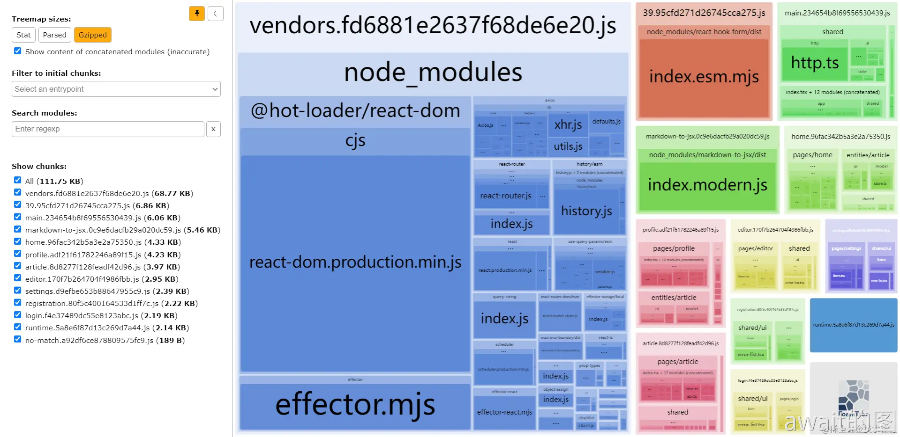
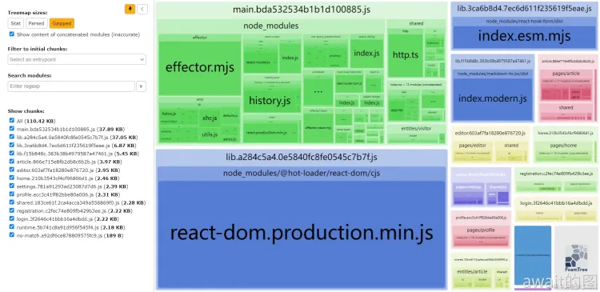
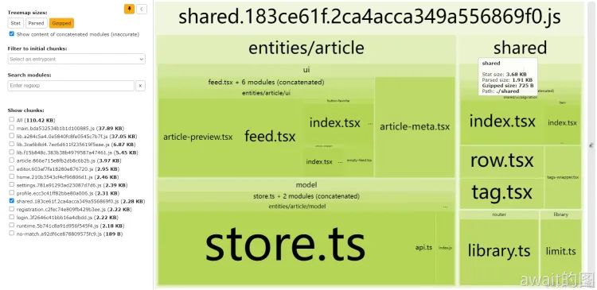

# Code Split
代码分割是前端优化中最常用的手段之一，几乎所有的配置都围绕着`vendors`,`common`这类的代码分割方案，但是这种方案比较传统，近几年出现了一些新的代码分割的最佳时间 —— **细粒度代码分割**，这篇文章主要讲述这种优化方案。

主要结合着`Webpack@5`这类的打包工具来进行讲解

## 代码分割原理与配置
代码分割是利用现代前端打包构建工具的能力，将单个产物文件主动拆分为多个文件，从而提高缓存命中率来提升用户的体验优化

以`Webpack@5`为例，代码分割的配置项主要有：

### Chunk
值类型：`String | function(chunks)=>boolean`
:::tip
区块（Chunk）是Webpack的概念，主要有三种产生途径：
- 每个入口`entry`对应一个区块
- Dynamic Import，即`import('module-path')`语法引入的模块，会生成独立的chunk
- 代码分割会产生新的区块

在打包产物中，每个区块通常会对应一个独立的文件
:::

`chunks`的值有以下4种：
- `'async'`：分割出的新区块只允许包含动态加载的区块
- `'initial'`:分割出的新区块只允许包含**非**动态加载的区块
- `'all'`:分割出的新区块可以包含动态加载的和**非**动态加载的区块
- `function`:配置一个函数，接收目标区块的数据作为参数，返回Boolean值，表示目标是否能被纳入分割出的新区块，例如

```js
module.exports = {
  optimization: {
    splitChunks: { 
      chunks(chunk) {
        // 分割出的新区块排除 name 为 `excluded-chunk` 的区块
        return chunk.name !== 'excluded-chunk';
        // 前文提到，Lazy Load经常不生效的原因kennel就是被splitChunks.chunks配置干扰了
      },
    },
  },
};
```
### minSize
值类型：`Number`

minSize的功能在于指定分割产生的新区块的最小体积，单位为字节（byte），小于`minSize`字节的新区块，将不会被创建，也就不会产生对应的打包产物文件。

`minSize`和`maxSize`衡量的都是组成区块的 **未压缩前的源码体积** ，不一定等于构建产物文件的体积。

未压缩前的源码体积可以参考`webpack-bundle-analyzer-plugin`中的`stat`体积，打包产物文件的体积则是`parsed`体积

配置示例如下：
```js
module.exports = {
  optimization: {
    splitChunks: {
       // 如果新区块未压缩前源码体积小于 100 KB，
       // 将不会被创建，也就不会产生独立的构建产物文件。
       minSize: 1024 * 1024 * 0.1, // 100 KB
     },
   },
 };
```
### maxSize
值类型：`Number`

maxSize的功能和minSize的功能正好相反，指定新区块的最大体积，单位为字节，大于`maxSize`字节的新区块，将被拆分为多个更小的新区块。

```js
module.exports = {
  optimization: {
    splitChunks: {
       // 如果新区块未压缩前源码体积大于 1 MB，
       // 新区块将会被拆分为多个体积较小的区块，
       // 相应的产生多个构建产物文件。
       maxSize: 1024 * 1024 * 1, // 1 MB
     },
   },
 };
```

### minChunks
值类型：`Number`

功能为指定模块最少被多个区块共同引用，才能被纳入分割出的新区域

for example，如下3个文件及其代码：
```js
// common-module.js
export n = 1

// a.js
import { n } from 'common-module.js'

// b.js
import { n } from 'common-module.js'

/* 这段代码中common-module.js被a.js和b.js两个区块同时引入 */
```
当在 Webpack 配置中指定`splitChunk.minChunks`值时：
- 为2时，common-module.js将会被纳入分割出的新区块
- 为3时，common-module.js将不会被纳入分割出的新区块
示例：

```js
    module.exports = {
      optimization: {
        splitChunks: {
          minChunks: 2, 
         },
       },
     };
```

### maxInitialRequests
值类型：`Number`

功能：指定最多可以拆分为多少个**同步**加载的新区块，常用于和`maxAsyncRequests`配合，从而控制代码分割产生的最大文件数量：
```js
module.exports = {
  //...
  optimization: {
    splitChunks: {
      maxInitialRequests: 20,
     },
   },
 };
```
### maxAsyncRequets
值类型：`Number`
功能：指定最多可以分割出多少个**异步**加载（即动态加载`import()`）的新区块，常用于和`maxInitialRequests`配合控制代码分割产生的最大文件数量
```js
module.exports = {
  optimization: {
    splitChunks: {
      maxAsyncRequests: 10,
     },
   },
 };
```
### name
值类型：`String | Boolean | function(module,chunks,cacheGroupKey) => string`

功能：指定分割出的区块名，区块名说Webpack运行时内部用来区分不同区块的id

区块名不一定等于打包产物的文件名，当没有指定`cacheGroup.filename`时，区块名才会被用作产物文件名。

推荐使用`cacheGroup[i]`配置**相同**的`name`，会使这些区块被合并，最终会被打包进同一产物文件中。相反，对多个区块配置**不同**的`name`，会使这些区块各自独立，最终产生多个独立的产物文件。

示例：
```js
module.exports = {
  optimization: {
    splitChunks: {
      name(module, chunks, cacheGroupKey) {
        const moduleFileName = module
              .identifier()
              .split('/')
              .reduceRight((item) => item);
        const allChunksNames = 
          chunks.map((item) => item.name).join('~');
        return `${cacheGroupKey}-${allChunksNames}-${moduleFileName}`
        }
     },
   },
 };
```
### cacheGroup
功能：指定有独立配置的区块，既可以继承上述`splitChunks`配置，也可以指定专属当前区块的独立配置。

可以理解为继承自`splitChunks`的**子类**，一方面继承了父类`splitChunks`分割区块的能力和配置属性，另一方面也有自己的私有属性。

示例：
```js
module.exports = {
  optimization: {
    splitChunks: {
      cacheGroups: {
        // 指定一个独立的 vendor 区块分组，
        // 包含独立的内容（test）
        // 有指定的名称（name）
        // 可以包含动态加载和非动态加载的区块（chunks: 'all'）
        vendor: {
          test: /[\/]node_modules[\/]/,
          name: 'vendors',
          chunks: 'all',
        },
      },
     },
   },
 };

```
:::tip
注意：不同属性的**优先级**有所不同，当多个属性冲突时，会按照优先级生效。

例如：当同时设置`maxSize:10000`导致新区块被拆分的数量大于`maxInitialRequest:5`时，`maxSize`会使`maxInitialRquest`失效，使最终的初始化请求数量大于指定的5个

属性优先级时：`minSize`>`maxSize`>`maxInitialRequest/maxAsyncRequests`
:::

上述的配置都可以声明在`optimization.splitChunks`,作用于**所有**`cacheGroup[name]`。

而下文的这些配置项则**只能**声明在`optimiaztion.splitChunks.cacheGroup[i]`中

### cacheGroup\[name\].test
值类型：`Regex | String | function(module, {chunkGraph,moduleGraph}) => boolean`
指定当前缓存组`cacheGroup`区块包含模块的匹配规则
- 正则表达式：用于对模块文件的**绝对路径**，调用`regExp.test(modulePath)`方法，判断当前缓存组区块是否包含目标模块文件
- 函数：接收`(module,{chunkGraph, moduleGraph})`作为参数，返回布尔值表示当前缓存组区块是否包含了目标模块文件
- 字符串：用于对模块文件的**绝对路径**，调用`modulePath.startsWith(str)`方法，判断当前缓存组区块是否包含目标模块文件

示例：
```js
splitChunks: {
  cacheGroups: {
    svgGroup: {
      test(module) {
        const path = require('path');
        return module.resource?.endsWith('.svg')
      },
    },
    vendors: {
      test: /[\/]node_modules[\/]/,
    },
    lodash: {
      test: 'lodash',
    },
}

```
### cacheGroup\[name\].priority
指定当前缓存组区块的优先级，当一个模块文件满足多个缓存组区块的匹配规则（`.test`属性）时，最终会将模块文件分割进`priority`值更大的哪个缓存组区块。

```js
splitChunks: {
  cacheGroups: {
    vendors: {
      test: /[\/]node_modules[\/]/,
        priority: 1,
        },
        vendorsVIP: {
        test: /[\/]node_modules[\/]/,
          // 因为 vendorsVIP 的 priority 为 2，
          // 大于 vendors 的 1，且两者匹配规则相同，
          // 所以打包产物文件将只有 vendorsVIP.js，
          // 不会有vendors.js
          priority: 2,
          },
}
```
### cacheGroup\[name\].filename
指定区域块对应打包产物文件的文件名，支持：
- 使用`[contenthash]`等文件名替换符
- 指定文件类型，即文件的后缀名

值类型：`String|Boolean|function(pathData,assetInfo)=>string`

```js
splitChunks: {
  cacheGroups: {
      vendor: {
        test: /[\/]node_modules[\/]/,
        filename: 'vendor.[chunkhash].js',
        chunks: 'all',
      },
  },
}
```
### cacheGroup\[name\].enforce
指定是否忽略`maxSize`，`minSize`，`maxAsyncRequests`，`maxInitialRquests`等配置项的限制，强制生成当前缓存组对应的区块。

例如，缓存组匹配规则匹配到代码的体积小于`minSize`，默认将不会产生对应区块。但如果对缓存组指定`enforce:true`，就会忽略`minSize`的限制，仍然分割出体积小于`minSize`的区块。

```js
splitChunks: {
  cacheGroups: {
    minSize: 20000,
    vendors: {
      test: /[\/]node_modules[\/]/,
      enforce: true,
    },
}
```
### 默认的`splitChunks`配置
其实，`Webpack`有一套**默认**的`splitChunks`配置如下所示：
```js
    // ...
    const NODE_MODULES_REGEXP = /[\/]node_modules[\/]/i;

    if (splitChunks) {
        A(splitChunks, "defaultSizeTypes", () =>
                css ? ["javascript", "css", "unknown"] : ["javascript", "unknown"]
        );
        D(splitChunks, "hidePathInfo", production);
        D(splitChunks, "chunks", "async");
        D(splitChunks, "usedExports", optimization.usedExports === true);
        D(splitChunks, "minChunks", 1);
        /*可以看到procution环境和development环境的配置项有区别的*/
        F(splitChunks, "minSize", () => (production ? 20000 : 10000));
        F(splitChunks, "minRemainingSize", () => (development ? 0 : undefined));
        F(splitChunks, "enforceSizeThreshold", () => (production ? 50000 : 30000));
        F(splitChunks, "maxAsyncRequests", () => (production ? 30 : Infinity));
        F(splitChunks, "maxInitialRequests", () => (production ? 30 : Infinity));
        D(splitChunks, "automaticNameDelimiter", "-");
        const cacheGroups =
                /** @type {NonNullable<OptimizationSplitChunksOptions["cacheGroups"]>} */
                (splitChunks.cacheGroups);
        F(cacheGroups, "default", () => ({
                idHint: "",
                reuseExistingChunk: true,
                minChunks: 2,
                priority: -20
        }));
        F(cacheGroups, "defaultVendors", () => ({
                idHint: "vendors",
                reuseExistingChunk: true,
                test: NODE_MODULES_REGEXP,
                priority: -10
        }));
    }
```
这套默认的配置项其实暴露了几个点可以多加关注：
- 区分了`production`和`development`环境，且都有不同的配置
- 指定了`minSize`，在`production`环境为20KB，在`development`环境为10kB，小于这一体积的模块，将不会被分为新的区块，也不会被构建为独立产物文件
- 自带2个缓存组：`default`包含所有共同引用大于2个区块的模块，`defaultVendors`包含所有来自`/node_modules/`目录的模块。

如果有时候自定义配置不生效，那么就是因为和这套默认配置出现了冲突，需要通过覆盖默认配置，避免冲突。

例如：
```js
splitChunks: {
  cacheGroups: {
    default: false,
    defaultVendors: false,
  },
}
```
:::tip
可以看到Webpack的代码分割功能非常灵活，但也有一些痛点，如：
- **配置复杂，开发体验不佳:** 各类繁杂的配置项十分恼火
- **配置方案健壮性不强，可维护性低:** 拆分配置方案无法适应项目的快速迭代变化，需要时常调整
- **用户体验不好:** 拆分效果不好，拆分出来的模块每次打包上线都会有变化，不便于配合增量构建进行缓存
:::

## 细粒度Code Split
**细粒度代码分割** 是近年来发明的代码分割通用解决方案。

其核心思路是同拆分出更多的区块，更多产物文件，让每个产物文件拥有自己的哈希版本号文件名，对产物文件的缓存有效性做**细粒度**的控制，让前端项目在多次打包上线后，仍然能复用之前的产物文件，不必重新下载静态资源。

### 核心配置
细粒度代码分割的核心Webpack配置如下：
```js
// webpack.production.config.js
const crypto = require('crypto');

const MAX_REQUEST_NUM = 20;
// 指定一个 module 可以被拆分为独立 区块（chunk） 的最小源码体积（单位：byte）
const MIN_LIB_CHUNK_SIZE = 10 * 1000;

const isModuleCSS = (module) => {
  // ...
};

module.exports = {
  mode: 'production',
  optimization: {
    splitChunks: {
      maxInitialRequests: MAX_REQUEST_NUM,
      maxAsyncRequests: MAX_REQUEST_NUM,
      minSize: MIN_LIB_CHUNK_SIZE,
      cacheGroups: {
        defaultVendors: false,
        default: false,
        lib: {
          chunks: 'all',
          test(module) {
            return (
              module.size() > MIN_LIB_CHUNK_SIZE &&
              /node_modules[/\]/.test(module.identifier())
            );
          },
          name(module) {
            const hash = crypto.createHash('sha1');
            // ...
            return `lib.${hash.digest('hex').substring(0, 8)}`;
          },
          priority: 3,
          minChunks: 1,
          reuseExistingChunk: true,
        },
        shared: {
          chunks: 'all',
          name(module, chunks) {
            return `shared.${crypto
              .createHash('sha1')
              .update(
                chunks.reduce((acc, chunk) => {
                  return acc + chunk.name;
                }, ''),
              )
              .digest('hex')
              .substring(0, 8)}${isModuleCSS(module) ? '.CSS' : ''}`;
          },
          priority: 1,
          minChunks: 2,
          reuseExistingChunk: true,
        },
      },
    },
  },
  // ...
};
```
这份代码主要分割配置出2类区块：
- `lib`:主要匹配规则为`test(module)`，指定`lib`缓存组包含来自`node_modules`目录，源吗体积大于`MIN_LIB_CHUNK_SIZE`的模块
`lib`缓存组用于当**体积较大**的NPM包模块，拆分为独立区块，产生独立产物文件，从而在多次打包发版，更新哈希版本号文件名的同时，避免让用户再次下载这些大体积模块，提高缓存命中率，减少资源下载体积，改善用户体验

- `shared`:主要匹配规则为`minChunks:2`，指定`shared`缓存组包含被2个及以上区块共用的模块代码

例如`module-a`在前端页面A和页面B都有引用，`module-a`就会被拆分为一个名为`shared.[hash]`区块，最终生成一个独立的JS文件，并保持独立的哈希版本号文件名，以便于在页面A和页面B之间复用，既能减少2个页面的JS体积，又能提高多次打包发版后的缓存命中率。

### 优点
配合在文件名中用哈希字符串控制版本的长期缓存，细粒度代码分割有显著的优点：
- **开发体验好**：配置统一通用，自动选择拆分目标模块，不必人工判断哪些模块需要拆分，降低了代码分割的使用门槛；
- **健壮性强**：以不变应万变，用这套不变的代码分割配置可以应对不断更新迭代的各类型前端项目，不必经常更新配置，便于维护；
- **用户体验好**：分割颗粒度较细，产物文件稳定，多次构建部署后，仍有较多文件名称内容不变，缓存命中率高，缓存效果好，有利于改善用户体验

## 工程分割优化实践
接下来给出一个实际的项目例子来看一下实践优化效果：

这是当前打包的产物：

可以看到`vendors.${hash}.js`包含了许多模块，体积变得非常大。

每次编译打包，`vendors`区块中任何的一个模块变化，都会导致`vendors`区块的产物文件名称中的hash字符串更新。进而导致生产环境用户需要重新下载`vendors.${hash}.js`，使缓存命中率降低。

### 增加细粒度代码分割缓存组
具体做法是，在Webpack配置中增加`lib`，`shared`这两个缓存组`cacheGroup`，并将`vendors`这样体积较大的模块进一步合理，精细的进行分割:

具体的改造主要有3步：
- 删除原有的`vendors`缓存组：释放其包含的模块
- 禁用默认缓存组：避免干扰细粒度代码分割
- 新增`lib`，`shared`这2个缓存组配置

```js
const crypto = require('crypto');
const path = require('path');

const MAX_REQUEST_NUM = 20;
// 指定一个 module 可以被拆分为独立 区块（chunk） 的最小源码体积（单位：byte）
const MIN_LIB_CHUNK_SIZE = 10 * 1000;

const isModuleCSS = (module) => {
  return (
    // mini-css-extract-plugin
    module.type === `css/mini-extract` ||
    // extract-css-chunks-webpack-plugin (old)
    module.type === `css/extract-chunks` ||
    // extract-css-chunks-webpack-plugin (new)
    module.type === `css/extract-css-chunks`
  );
};

module.exports = {
  optimization: {
    // https://webpack.js.org/configuration/optimization/#optimizationruntimechunk
    // 指定是否将Webpack的运行时（每个文件中重复的、用于加载的函数）拆分为独立文件，能减少重复代码。
    runtimeChunk: 'single',
    splitChunks: {
      maxInitialRequests: MAX_REQUEST_NUM,
      maxAsyncRequests: MAX_REQUEST_NUM,
      minSize: MIN_LIB_CHUNK_SIZE,
      cacheGroups: {
        defaultVendors: false,
        default: false,
        // lib主要用于分割出独立性很强的第三方库
        lib: {
          chunks: 'all',
          test(module) {
            return (
              module.size() > MIN_LIB_CHUNK_SIZE &&
              /node_modules[/\]/.test(module.identifier())
            );
          },
          name(module) {
            const hash = crypto.createHash('sha1');
            if (isModuleCSS(module)) {
              module.updateHash(hash);
            } else {
              if (!module.libIdent) {
                throw new Error(
                  `Encountered unknown module type: ${module.type}. Please check webpack/prod.client.config.js.`,
                );
              }
              hash.update(
                module.libIdent({ context: path.join(__dirname, '../') }),
              );
            }

            return `lib.${hash.digest('hex').substring(0, 8)}`;
          },
          priority: 3,
          minChunks: 1,
          reuseExistingChunk: true,
        },
        // shared 主要是将多个区块共用的代码进行拆分，避免模块被重复打包进多个区块
        shared: {
          chunks: 'all',
          name(module, chunks) {
            return `shared.${crypto
              .createHash('sha1')
              .update(
                chunks.reduce((acc, chunk) => {
                  return acc + chunk.name;
                }, ''),
              )
              .digest('hex')
              .substring(0, 8)}${isModuleCSS(module) ? '.CSS' : ''}`;
          },
          priority: 1,
          minChunks: 2,
          reuseExistingChunk: true,
        },
      },
    },
  },
};
```
这份配置中可以得到下面的一些信息：
- 限制了最大产物文件数量：声明了`maxInitialRequests:MAX_REQUEST_NUM,` maxAsyncRequests:MAX_REQUEST_NUM，避免数量过多，超过HTTP/2协议的并发数量，导致页面资源加载阻塞，用户体验收到损坏，通常建议不要超过20
- 指定了`minSize`，避免拆分出来的模块过小，缓存的优化效果不太明显
- 两个缓存组的`name`都包含了基于内容的哈希值，类似于Webpack自带的Content-HASH。同时可以通过模块内容，拆分模块的作用
- `lib`优先级要比`shared`高，目的是为了优先拆分初独立性比较强的模块

通过再一轮的打包之后，可以看到:

从这次的打包结果来看，明确的变化可以看到：
- 多个模块被拆分为了独立的`lib.${hash}.js`，例如`@hot-loader/react-dom`，`react-hook-form`，`markdown-to-jsx`
- 产生了一个`shared.${hash}.js`包含了`article-preview.tsx`，`shared/row.tsx`等模块，自动把多个组件公用的模块进行了分割处理
