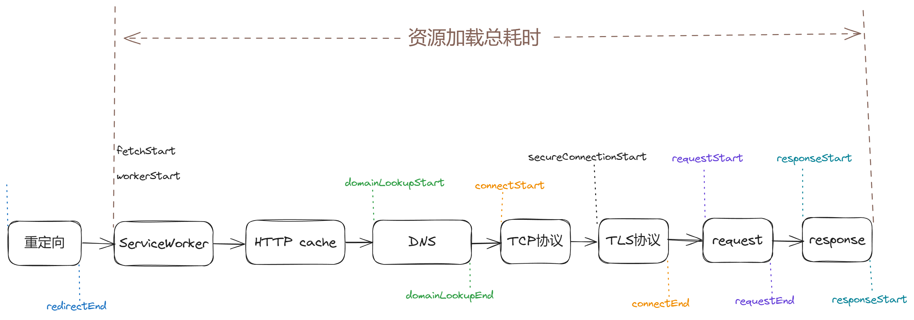

# Performance API
`web-vitals`库获取的用户体验数据可以满足用户的量化用户体验指标的需求，如果要做更特殊，更个性化的数据收集需求，Performance API可以派上用场。

Performance API 是一组在浏览器平台测量和收集数据性能的接口，它允许开发者访问页面加载，资源获取，用户交互，JavaScript执行等性能相关的数据。

## PerformanceEntry
浏览器基于Performance API获取的各类性能记录都是 `PerformanceEntry` 类的子类实例，最主要的是下面2类：

### PerformanceResourceTiming
这个API主要关注于 JS，CSS，Image 等各类资源加载相关数据，包括：
```json
{ 
  // 资源的url
  "name": "https://www.google-analytics.com/analytics.js", 
  "entryType": "resource", 
  "startTime": 508.5, 
  // 资源加载总耗时
  "duration": 4.399999618530273, 
  // 资源类型，常见的有document script link stylesheet img media font xhr fetch
  "initiatorType": "script", 
  "nextHopProtocol": "", 
  "renderBlockingStatus": "non-blocking", 
  "workerStart": 0, 
  "redirectStart": 0, 
  "redirectEnd": 0, 
  "fetchStart": 508.5, 
  // dns查询开始耗时
  "domainLookupStart": 0,
  // dns查询完成耗时
  "domainLookupEnd": 0,
  "connectStart": 0, 
  "secureConnectionStart": 0, 
  "connectEnd": 0, 
  // http请求开始耗时
  "requestStart": 0,
  // http结束耗时
  "responseStart": 0, 
  "firstInterimResponseStart": 0, 
  "responseEnd": 512.8999996185303, 
  // 传输体积（响应体大小 + 响应头大小）
  "transferSize": 0, 
  // 响应体体积 （未被压缩的大小，如Gzip）
  "encodedBodySize": 0, 
  // 响应体体积 （已被压缩的大小）
  "decodedBodySize": 0, 
  "responseStatus": 0, 
  "serverTiming": [] }
```
`PerformanceResourceTiming`几乎可以获取DevTool的Network网络面板中的能看到的所有数据。

在上面中，`requestStart`，`transferSize`，`connectStart`等许多属性的获取都有同源策略限制，如果响应域名不同源，需要在响应资源的响应头中加上`Timing-Allow-Origin: *`。

以下是这个方法的属性对应的流程图：


可以看到如果想要计算一个资源的加载总耗时，用`responseEnd`减去`fetchStart`得到。

同样的，如果想计算一条性能记录的Tcp握手耗时，可以用`connectEnd`得到`connectStart`得到。

### PerformanceEventTiming
这个主要关注交互事件的具体指标
```json
{ 
  "name": "pointerdown", 
  "entryType": "first-input", 
  "startTime": 11995.60000038147, 
  "duration": 0, 
  "processingStart": 11996.39999961853, 
  "processingEnd": 11996.60000038147,
  "cancelable": true 
}
```
这个指标主要关注两个点：
- **首次输入** `first-input`相关数据，这个是Web-Vitals库中的`First Input Delay FID`指标的数据来源
- **慢响应** 事件相关数据：click input mousedown 等各类**响应时间超过104ms**的输入时间。可以统计页面中响应比较慢，影响用户体验的事件处理逻辑

## 自定义性能记录创建
除了上述浏览器原生的性能记录功能之外，还可以通过`performance.mark`和`performance.measure`方法创建自定义的性能记录。

- `mark(strName, markOptions)`用于创建性能记录。其第一个参数是节点ID，类型为字符串，第二个参数中的`markOptions.detail`可用于记录任意自定义数据。
-  `measure(strName,measureOptions)`用于测量2个性能记录之间的时间差。第二个参数`measureOptions`可以指定任意自定义`.detail`以及，测量目标开始，结束性能记录ID字符串。

这两个方法，都会创建一个`PerformanceEntry`子类的实例，并保存当前运行环境的性能记录缓冲区中。

### performance.mark
```js
performance.mark("login-started", {
  detail: { href: location?.href },
});

performance.mark("login-finished", {
  detail: { loginType: 'email' },
});
```
上诉两行代码会在性能记录缓冲区中，添加2个性能记录，以便后面继续获取计算，其数据格式为：
```js
{
    detail: { href: '...' }
    name: "login-started",
    entryType: "mark",
    startTime: 4545338.199999809,
    duration: 0
}
```
`.mark()`方法是统一的标准化API，并且可以在任意模块的任意位置调用，不受源码模块化结构的影响。对比手动写逻辑代码来说，来实现记录开始，结束事件点要更规范，更好用。

### performance.measure
而`.measure()`方法则可以基于已经添加的2个性能记录，计算2个记录间隔的duration：
```js
performance.measure("login-duration", {
  detail: { userRegion: 'cn' },
  start: 'login-started',
  end: 'login-finished',
});
```
执行之后，会向性能记录缓冲区中添加下面格式的性能记录数据：
```js
{
    detail: { userRegion: '...' }
    name: "login-duration",
    entryType: "measure",
    startTime: 4545338.199999809,
    duration: 275118.69999980927
}
```
:::tip
NodeJS中也有这两个API，可以同来测量NodeJS服务器应用的响应耗时等指标
:::

## 获取性能记录
上面提到的记录都会记录在运行时的性能记录缓冲区中，一般用下面两种方法来获取：

### PerformanceObserver
`(new PerformanceObserver(observeCallbackFunc)).observe()`，其中`observeCallbackFunc`回调函数会在新的性能记录添加时触发，接收到2个参数`(list,observer)`

```js
// 1. 创建一个PerformanceObserver实例
const observer = new PerformanceObserver((list) => {
  const entries = list.getEntries();
  entries.forEach((entry) => {
    console.log(`资源名称: ${entry.name}`);
    console.log(`资源类型: ${entry.initiatorType}`);
    console.log(`资源加载时间: ${entry.duration}ms`);
  });
});

// 2. 指定要观察的性能条目类型（下文为全部类型）
const entryTypes = [       // 对应上文的性能记录子类：
    "resource",            // PerformanceResourceTiming
    "visibility-state",    // VisibilityStateEntry
    "mark",                // PerformanceMark
    "measure",             // PerformanceMeasure
    "event",
    "element",
    "first-input",
    "largest-contentful-paint",
    "layout-shift",
    "longtask",
    "navigation",
    "paint",
    "taskattribution",
];

// 3. 启动 PerformanceObserver 来观察指定类型的性能条目
observer.observe({ entryTypes });

// 4. 停止观察
observer.disconnect();
```
:::tip
调用`.observe()`前，已经触发的性能记录，并不会被监听到。
:::

### 立刻返回当前所有记录
这类方法具体指下面3个API：
- `performance.getEntries()`
- `performance.getEntriesByName(nameStr, typeStr)`
- `performance.getEntriesByType(typeStr)`

这三个方法，会立刻返回当前性能记录缓冲区中的所有性能记录
```js
performance.getEntries()    // PerformanceEntry: []

performance.getEntriesByName("login-started", "mark");     // PerformanceMark: []

performance.getEntriesByType("resource");    // PerformanceResourceTiming: []

```

## 示例
基于`PerfomanceEntry`，可以获取到资源加载各阶段的数据，从而建立资源加载耗时指标，用于量化和评估各类优化的效果。
```html
<!DOCTYPE html>
<html lang="en">
  <head>
    <meta charset="UTF-8" />
    <meta name="viewport" content="width=device-width, initial-scale=1.0" />
    <title>资源加载耗时DEMO</title>
    <link
      rel="prefetch"
      href="https://static.zhihu.com/heifetz/6116.216a26f4.7e059bd26c25b9e701c1.css"
    />
  </head>
  <body>
    <h1>
      <a href="https://juejin.cn/post/7274889579076108348">
      《资源资源资源》
      </a>
    </h1>
    
    <script>
      async function reportGauge(name, help, labels, value) {
        await fetch('http://localhost:4001/gauge-metric', {
          method: 'POST',
          headers: {
            'Content-Type': 'application/json',
          },
          body: JSON.stringify({
            name,
            help,
            labels,
            value,
          }),
        });
      }

      // https://developer.mozilla.org/en-US/docs/Web/API/PerformanceResourceTiming
      const ResourceTiming = {
        DNSLookupTime: ['domainLookupEnd', 'domainLookupStart'],
        TCPHandshakeTime: ['connectEnd', 'connectStart'], // 也适用于QUIC协议
        TLSNegotiationTime: ['requestStart', 'secureConnectionStart'],
        requestToResponseTime: ['responseEnd', 'requestStart'],
      };

      function getConnectionData(entry) {
        let data = {};
        Object.keys(ResourceTiming).forEach((name) => {
          const [end, start] = ResourceTiming[name];
          data[name] = entry[end] - entry[start];
        });
        return data;
      }

      function getCDNMetric() {
        // 获取resource类型
        const entries = performance.getEntriesByType('resource');
        entries.forEach((entry) => {
          const entryName = entry.name;
          // 计算出获取资源的duration
          const connectionData = getConnectionData(entry);
          console.log(
            `connectionData=${JSON.stringify(connectionData, null, 2)}`
          );
          // 发送给后端的数据收集
          Object.keys(connectionData).forEach((name) => {
            reportGauge(
              name,
              `frontend data of ${name}`,
              {
                entryName,
                id: Date.now(),
              },
              connectionData[name]
            );
          });
        });
      }

      setTimeout(() => {
        getCDNMetric();
      }, 3000);
    </script>
  </body>
</html> 

```