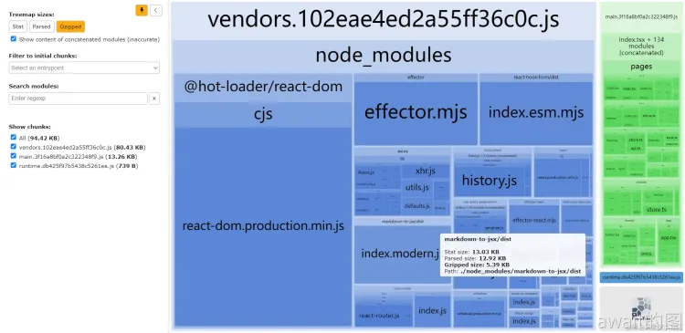

# Lazy Load
Lazy Load 是指将部分资源延迟加载，从而去优化页面渲染用户体验的一种手段。懒加载的优化目标可以是浏览器中的一切需要HTTP请求的资源。

举个例子，在Vue的官方文档中，就对渲染搜索框组件的JS代码模块进行了懒加载优化，这部分组件并分割为了一个独立的文件`VPAlgoliaSearchBox.d8791224.js`文件，并延迟到页面渲染后，用户点击搜索框时才加载。


## 模块懒加载核心原理
代码模块懒加载的实现核心基于2项原理：
- 代码模块化
- 动态导入语法`import()`

### 代码模块化
现代前端工程普遍都是基于Webpack，Rollup等工具的打包能力，实现源代码模块化，把源代码分割为多个独立的模块Module，对应独立的JS，CSS文件，可以很方便地隔离命名空间，封装代码，复用模块，管理依赖～

现在的前端主要模块化规范就是2类：
- ES Module：注意依赖于`import`和`export`
- Common JS Module：主要依赖于`require`和`module.exports`

### 构建工具 模块动态导入特性
Webpack这样的前端构建工具的[Dynamic Import()](https://webpack.js.org/guides/code-splitting/#dynamic-imports) 动态导入 的特性就是依赖于JS的懒加载，动态导入在ES模块化的基础上增加了`import()`这样的语法：
- 导入语句会返回一个`Promise`实例，模块加载成功之后会变为`fullfilled`状态，加载失败则为`failed`状态
- 在构建时，对应模块会被拆分为独立的区块`chunk`，生成独立的产物文件
- 在运行时，会在模块需要加载执行时，通过动态添加`script`标签，来触发下载并运行对应的产物文件

|     |普通写法|懒加载写法|
|------|------|------|
|代码示例|import LoginPage from '../pages/login'|const LoginPage = import('../pages/login')|

在Webpack中，还可以通过魔法注释来配置动态导入的方式，文件名等细节，详细的配置如下：
```js
const LoginPage = import(/* webpackChunkName:"login" */,'../pages/login')
```
使用`/* webpackChunkName:"login" */`可以指定产出文件的名称。那么如果为多个不同动态导入的模块，备注同一个 `webpackChunkName`，那么这些模块就会被合并为同一个区块，最终合并到同一个大包产物中，这个技巧可以用于把多个模块合并为一个产物文件。

## 确定懒加载目标
这里提供两种常用的懒加载优化思路

### 按路由
第一种思路是按照前端路由分析懒加载的目标。

常见的单页应用SPA前端项目就会基于前端路由，形成许多路由路径对应的页面组件，例如登陆页`/login`的对应的模块，源码主要写在`login.vue`文件中

那么用户访问时，一般只需要渲染1个路由，其余的路由暂时不需要加载运行，那么就可以对这些攒不运行的页面组件进行懒加载优化

以一般的项目为例，路由路径和对应页面组件有：
- `/login`:`'@/pages/login.vue'`
- `/registration`:`'@/pages/registration'`
- `/home:'@/pages/home'`
- `/article`:`'@/pages/article'`
:::tip
这些页面组件模块都可以进行懒加载优化，延迟加载其代码，推迟到组件需要渲染时再加载，从而减轻页面初始化时的性能负担
:::

### 按模块体积
这种思路一般按照**模块体积大小**来分析懒加载的目标，选择使用`webpack-bundle-analyzer-plugin`生成的可视化图表，来观察每个模块的体积，把较大的模块作为懒加载优化的目标。

其中大多数都是项目初始化的核心依赖模块，例如`react-dom`，`axios`，没有这些模块。前端页面也就无法完成渲染，所以强烈不建议进行懒加载优化处理～

但是`react-hook-form/dist/index.esm.mjs`、`mardown-to-jsx/dist/index.modern.js`这2个模块，则并非页面初始化渲染所必须的模块，可以进行懒加载优化。

### 添加懒加载逻辑
比如在Vue中，就可以使用自带的路由懒加载和异步组件来完成懒加载导入：
```jsx
// 1. vue-router 路由组件懒加载
// 文档：https://router.vuejs.org/guide/advanced/lazy-loading.html
const UserDetails = () => import('./views/UserDetails.vue')

const router = createRouter({
  // ...
  routes: [{ path: '/users/:id', component: UserDetails }],
})

// 2. Vue.js 组件懒加载
// 文档：https://vuejs.org/guide/components/async.html
<script setup>
import { defineAsyncComponent } from 'vue'

const AdminPage = defineAsyncComponent(() =>
  import('./components/AdminPageComponent.vue')
)
</script>

<template>
  <AdminPage />
</template>
```
## 懒加载的常见问题
### 遗留直接导入导致目标模块没有被拆分
第一类问题的表现是：修改为动态导入`import()`后不生效，打包构建的产物中，目标模块没有被拆分为独立文件。

这个问题常见的原因是目标模块有多处直接导入`（import * from 'module'）`，只改了部分目标模块的直接导入，仍然遗留了部分。

:::tip
解决方案可以先考虑全局搜索，再在目标模块中加入`debugger`，在开发环境运行后，根据调用栈来排查哪些组件有导入目标模块
:::


### 被其他代码拆分规则覆盖导致懒加载不生效
第二类问题的表现也是动态导入`import()`不生效，目标模块没有被拆分为独立文件。

但是原因却不同，一般是有其他代码拆分规则，例如Webpack配置的缓存组`splitChunk.cacheGroup`命中了动态导入模块，导致目标模块不能被拆分为独立区块`（chunk）`，也就不能产生独立的产物文件。

可行的解决方案是：检查`cacheGroups`配置，确认是否有缓存组的匹配规则（test属性）匹配到了目标模块。

如果有，将其`chunks`区块类型属性从`'all'`改为`'initial'`，表示这个`cacheGroups`只包含`initial`类型的模块，即直接导入的模块。动态导入的模块，将会被排除出`cacheGroups`，从而将目标模块拆分成独立的产物文件。

### 预期之外的非目标模块被懒加载处理
第三类问题的表现是预期之外的非优化目标模块却被打包进了拆分出的独立文件中。

可能的原因是多个模块之间导入、导出关系复杂，例如NPM包内部的依赖关系，非目标模块可能是目标模块依赖的依赖，从而被拆分到了独立产物文件。

通常来说，这种情况是符合预期的，因为非目标模块也算是目标模块依赖的一部分，被拆分出来不会对优化效果产生负面影响。

如果不希望非目标模块被拆分打包，可以考虑为这个模块，在其预期归属模块中，额外增加一处直接导入，从而避免被拆分到独立产物文件中