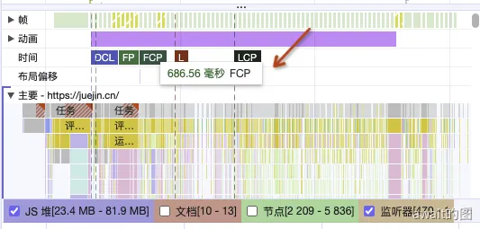
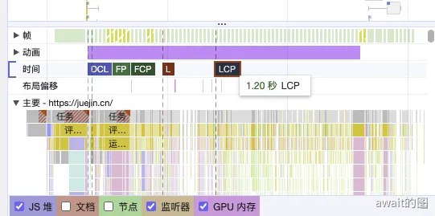
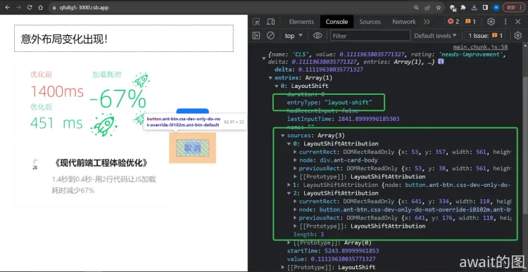

# 性能优化指标

性能优化只是**手段**，优化体验才是**目的**。

:::tip
改善用户体验和开发体验才是优化的根本目的。
:::

没有指标的前端的优化会存在一些问题：
- **目标不准确：** 把别人的优化手段生搬硬套到自己的项目，找不到自己的优化目标
- **缺乏量化指标：** 无法评估优化效果，拿不出客观、可量化的指标证明优化效果
- **没有改善用户的主观体验：** 优化效果对用户主观体验影响甚微，无法让用户直观地感受到
- **欠缺长效化机制：** 无法保证优化效果长期稳定、不出现衰退
- **忽视开发体验：** 没有认识到开发体验和用户体验的正相关性

## 为什么需要量化指标
没有量化指标的优化是没有说服力的，不了解优化目标的现状更无法实现优化。

在实施优化时，一个常常陷入的误区是不了解现状，缺乏量化优化效果的监控指标就开始优化。这样的方式往往导致自欺欺人的优化，自以为做了效果显著的改进优化，实际上并没有改善用户体验。

所以，为了能真正的改善用户体验，需要在开始优化前，就建立量化指标，一方面帮助透彻的理解优化目标的现状，另一方面，也可以用量化指标监控优化前后的变化，评估优化效果。

这就需要我们能把**主观**的用户体验或开发体验**量化为客观**的数据指标。

## 将主观的体验量化为客观指标
以前端页面的加载速度为例，同一个页面，在不同的地理位置，不同的硬件设备上，加载速度都会有不同的表现，给用户的主观体验更是因人而异。

所以要测量用户对页面的加载速度的主观体验，需要考虑的因素非常多，需要能抹平各种影响因素差异，稳定衡量用户体验的量化手段。

这里推荐使用开源库的`web-vitals`获取的页面渲染耗时，交互延迟等指标。

点击这个可查看👉👉[web-vitals](https://github.com/GoogleChrome/web-vitals)

## web-vitals指标
`web-vitals`是谷歌的 Chrome 维护团队于 2020 年开源的工具库，它基于统一的浏览器`Performance API`获取标准化的用户体验指标。

它主要测量了6项指标，分别是：
- 首次内容绘制 *First Content Paint* **FCP**
- 最大内容绘制 *Largest Contentful Paint* **LCP**
- 首次输入延迟 *First Input Delay* **FID**
- 交互到绘制延迟 *Interaction to Next Paint* **INP**
- 累积布局偏移 *Cumulative Layout Shift* **CLS**
- 第一字节事件 *Time to First Byte* **TTFB**

### FCP
FCP测量从页面开始加载到页面中任意部分内容（文本，图像，`svg`，`canvas`）完成渲染的时长。

其值为浮点数，单位是毫秒。FCP值越小表示该指标状况越好，页面渲染的初始内容渲染越快。

页面中率先出现的文本图像等视觉可见内容，直接决定了用户对页面加载速度的主观体验，所以这一指标选择测量这些内容的渲染耗时，从而量化用户的主观体验。

**注意，FCP测量的是任意部分DOM完成渲染的耗时，而非全部内容进行渲染完成，不等于`onLoad`事件。**



如上图所示，FCP指标的值为686.56ms

按照Chrome官方的推荐标准，FCP指标3个等级的评分分别为：
- 优：小于1.8s
- 待改进：大于1.8s且小于3s
- 差：大于3s

### LCP
LCP测量从页面开始加载到可视区域内**尺寸最大**的文字或图像渲染完成的耗时。

其值为浮点数，单位是毫秒。LCP值越小表示该指标状况越好、最大元素渲染越快。

按照Chrome官方的推荐标准，FCP指标3个等级的评分分别为：
- 优：小于2.5s
- 待改进：大于2.5s且小于4s
- 差：大于4s

### FID
FID 测量用户首次交互（点击、触摸）后到浏览器开始响应之间的时间间隔。

其值为浮点数，单位是毫秒。FID值越小表示该指标状况越好，用户首次与页面交互时，浏览器响应的延迟越小。

这一指标只关注页面中首次交互的原因是因为，首次交互时，页面往往处于尚未完全加载的状态，异步响应数据仍在等待响应、部分JS和CSS仍在执行和渲染的过程中，浏览器的主线程会短暂的处于忙碌状态，往往不能即时响应用户交互。

第一次交互的延迟长短往往决定了用户对网页流畅度的第一印象，所以这一指标的测量目标，也能量化用户的主观体验。

FCP指标三个等级的评分为：
- 优：小于100ms
- 待改进：大于100ms且小于300ms
- 差：大于300ms

### INP
INP测量用户在页面浏览过程中的所有交互（点击、键盘输入、触摸等）与浏览器渲染响应的整体延迟情况

其值为浮点数，单位是毫秒。INP值越小表示该指标状况越好，用户的各类交互响应延迟越小。

与FID只关注首次交互不同，INP会关注用户浏览网页全过程中的**所有**交互，所以web-vitals库中获取INP值的onINP(FCPReportCallback)方法，通常会在页面可视化状态变化或页面卸载时多次触发，综合统计一段时间内的多次交互，按特定算法，计算该时段内的INP指标值。

INP指标3个等级的评分分别为：
- 优：小于200ms
- 待改进：大于200ms且小于500ms
- 差：大于500ms

### 
CLS测量页面中所有**意外**布局变化的累计分值。

其值为浮点数，**无单位**， 值的大小表示意外布局变化的多少和影响范围的大小。

CLS值的计算类似INP，会统计一段时间内的所有意外布局变化，按特定算法，计算出分值。

所谓意外布局变化是指 DOM 元素在前后绘制的2帧之间，非用户交互引起DOM元素尺寸、位置的变化。



引入`web-vitals`库后调用`onCLS`API就能获取CLS的值，同时获取到对应的意外布局变化的具体来源，如下图中sources字段的2个对象就通过DOM元素引用，明确地告诉了引起布局变化的来源，以及变化前后的尺寸位置等详细数据`sources[i].currentRect, sources[i].previousRect`

### TTFB
TTFB测量前端页面（Document）的HTTP请求发送后，到接收到第一字节数据响应的耗时，通常包括重定向、DNS查询、服务器响应延迟等耗时。

其值为浮点数，单位是毫秒。值越小表示该项指标状况越好，页面HTTP响应的耗时越短，也就是页面的加载更快。

TTFB指标值的大小直接决定着页面初始内容渲染耗时的长短，往往和FCP、LCP指标有明显的相关关系，对用户体验有直接影响，所以web-viatals也将其当做了量化用户体验的指标之一。

除了可以通过`web-vitals`库的`onTTFBAPI`获取，也可以使用Chrome自带的DevTool Network 网络面板计算得出。

TTFB:
- 优：小于800ms
- 待改进：大于800ms且小于1800ms
- 差：大于1800ms

## 在项目中引入web-vitals
上面的6个指标都可以通过`web-vitals`库内置的API方便获取，将`web-vitals`库集成到用户访问的前端页面
这里通过vue封装为Hook:

```js
import { onFCP, onLCP, onFID, onTTFB, onINP, onCLS } from 'web-vitals';

export default function useWebvitals() {
  const printWebvitalsData = (data) => {
    console.log(data111);
  };

  const FCP = () => {
    onFCP(printWebvitalsData);
  };

  const LCP = () => {
    onLCP(printWebvitalsData);
  };

  const FID = () => {
    onFID(printWebvitalsData);
  };

  const TTFB = () => {
    onTTFB(printWebvitalsData);
  };

  const INP = () => {
    onINP(printWebvitalsData);
  };

  const CLS = () => {
    onCLS(printWebvitalsData);
  };
  return {
    FCP,
    FID,
    LCP,
    TTFB,
    INP,
    CLS
  };
}
```
启动项目就可以在页面中看到这些信息：


需要特别注意的是：
- `onFCP`,`onLCP`,`onTTFB` 均为在页面初始化时自动触发
- `onFID` 是在用户第一次与页面交互时触发
- `onCLS`，`onINP`则因为要测量页面的全生命周期，往往无固定触发时间点，在实践中通常会在交互停止一段时间后，或页面可视状态变化（例如切换标签页）后多次触发。