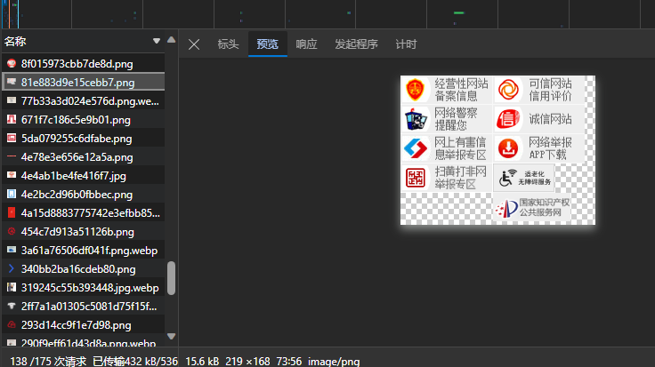

# 图片的优化
图片的网络优化可以说是前端性能优化的必不可少的环节。

就图片这一块，与其说是在做“优化”，更不如说是在做“权衡”，主要做的就是去压缩图片的体积或者一开始就选择体积较小的图片格式。但是这个操作一般都在以图片成像质量为代价的。因此主要任务就是尽可能地去寻求一个质量与性能之间的平衡点。

## 雪碧图
**雪碧图可以聚合多个图片请求为一个图片请求，从而间接实现了对请求的合并。**

雪碧图（CSS Sprites） —— 可以将小图片和背景图像合并到一张图片上，然后利用CSS的背景定位来显示其中的每一部分的技术

:::info MDN
CSS Sprites，被运用于众多使用大量小图标的网页应用上。它可取图像的一部分来使用，使得使用一个图像文件替代多个小文件称为可能。相较于一个小图标一个图像文件，单独一张图所需的HTTP请求更少，对内存和带宽更加友好。
:::

这里是一张京东的雪碧图：


可以看出每次加载图片，都是需要单独向服务器请求这个图片的对应的资源——往往意味着一次HTTP的请求开销，多个小图片被聚合为了一张图片之后，就只需要一次请求了

## Base64
**Base64本身是作为雪碧图的补充而存在的，Base64 是一种用于传输8Bit字节码的编码方式，通过对图片进行Base64编码，可以直接将编码结果写入到HTML或CSS，从而减少了HTTP请求的次数**

如果对某一张图片进行Base64编码，会得到这样一个字符串
```text
data:image/png;base64,iVBORw0KGgoAAAANSUhEUgAAAsQAAAEjCAYAAAA1/BckAAAAAXNSR0IArs4c6QAAIABJREFUeF7snQd4VVXThVcKSUglIfQaQHoXEAQsCIKiiA2xoGIvYBdUsIBdUbFhw0+KWJAioAKCgoL03nvvJYE00vP/a+OJl5Byb+ota38PD5/knL1n3n2SrDtn9oxXZmZmJjREQAREQAREQAREQAREwEMJeEkQe+jOy20REAEREAEREAEREAFDQIJYD4IIiIAIiIAIiIAIiIBHE5Ag9ujtl/MiIAIiIAIiIAIiIAISxHoGREAEREAEREAEREAEPJqABLFHb7....
```
:::tip
base64一般只针对于非常小的Logo
:::
Base64千万不要用于大图片中去，这是因为Base64编码之后，图片大小往往会膨胀为原文件的4/3（这是由Base64的编码原理决定的）。如果把大图也编码到HTML或CSS中，后者的体积也会明显增加，就算是减少了HTTP请求，也无法弥补庞大的体积所带来的性能开销。

因此Base64需要在正确的时机去使用：
- 图片的实际尺寸比较小 
- 图片无法以雪碧图的形式与其它小图结合
- 图片的更新频率比较低

比较好的方案就是利用webpack的`url-loader`去做基本的Base64转码，还可以结合文件大小，帮忙判断图片是否有必要进行Base64编码。
```js
module.exports = {
  module: {
    rules: [
      {
        test: /\.(png|jpg|gif)$/i,
        use: [
          {
            loader: 'url-loader',
            options: {
              limit: 8192,
            },
          },
        ],
      },
    ],
  },
};
```
## TinyPNG
这是一个在线无损压缩图片的网站，如果有需要放在项目中的图片，强烈建议使用这个来进行压缩之后再放入项目的资源文件中去。
[TinyPng](https://tinify.cn/)