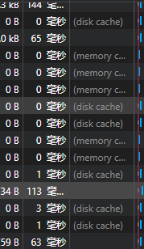

# 浏览器缓存优化
浏览器缓存可以减少必要的网络IO消耗，提高访问速度。浏览器缓存是一种操作简单，效果显著的前端性能优化手段。对于这个操作的必要性，Chrome给出了一个重要解释
:::tip 
通过网络获取内容速度缓慢且开销巨大。较大的响应需要在客户端与服务器之间多次往返通信，这会延迟浏览器获得和处理内容的时间，还会增加访问者的流量费用。因此，缓存并重复利用之前获取的资源能力成为性能优化的一个关键方面。
:::

不能将浏览器缓存简单地理解为“HTTP缓存”。但事实上，浏览器缓存机制有四个方面，它们按照获取资源时请求的优先级如下：
- Memory Cache
- Service Worker Cache
- HTTP Cache
- Push Cache


## HTTP缓存机制
HTTP缓存是日常开发中最为熟悉的一种缓存机制，分为**强缓存**和**协商缓存**。优先级较高的是强缓存，在命中强缓存失败的情况下，才会走协商缓存。

### 强缓存 expires 到 cache-control
强缓存利用http头中的Expires和Cache-Control两个字段来控制的。强缓存中，当请求再次发出时，浏览器会根据其中的expires和cache-control判断目标资源是否“命中”强缓存，若命中直接从缓存中获取资源，**不再与服务端发生通信**。

命中强缓存的情况下，返回的HTTP状态码为200

```text
Request Method: GET
Status Code: 200 (from disk cache)
```
实现强缓存，过去一直用的是`expires`

当服务器返回响应时，在Response Headers中将过期时间写入expires字段。
```text
cache-control:max-age=31536000
expires: Wed, 11 Seq 2019 16:12:18 GMT
```
expires是一个**绝对时间戳**，接下来如果试图再次向服务器请求资源，浏览器就会对比本地时间和expires时间戳，如果本地时间小于expires设定的过期时间，就直接去缓存中取出这个资源。由于时间戳是服务端去定义，而本地时间的取值又来自客户端，因此expires的工作机制对客户端和服务器端的一致性就有很高的要求，若服务端与客户端存在时差，就会出现意料之外的后果。

而Cache-Control中的`max-age`字段允许通过设定**相对时间长度**来达到同样的目的。在HTTP1.1标准中试图将缓存相关配置收敛进Cache-Control这样的背景下，`max-age`可以视作是对expires能力的补位/替换。对**向下兼容**的话，那么expires仍然是不可缺少的。
```text
cache-control: max-age=31536000
```
max-age是一个时间长度，在这个例子中，在31536000秒以内都是有效的。max-age机制下，资源过期判定不再受服务器时间戳限制。客户端会记录请求到资源的时间点，以此作为相对时间的起点，从而**确保参与计算的两个时间节点都来源于客户端，由此实现更加精准的判断。**

**Cache-Control 的 max-age 配置项相对于 expires 的优先级更高。当 Cache-Control 与 expires 同时出现时，以 Cache-Control 为准。**

### cache-control的应用
cache-control后面跟随的字段很多：
```text
cache-control: max-age=3600, s-maxage=31536000
```
**s-maxage 优先级高于max-age，两者同时出现时，有限考虑s-maxage。如果s-maxage未过期，则向代理服务器请求其缓存内容。**

在依赖各种代理的大型架构中，不得不考虑**代理服务器**的缓存问题。s-maxage就是用于表述代理服务器（例如CDN）上的缓存的有效时间的，并且只对public生效。

:::tip
s-maxage 仅仅在代理服务器上生效，客户端中一般只考虑max-age
:::
#### public 和 private
public 与 private 是针对资源是否能够被代理服务器缓存而存在的一组对立的概念。

为资源设置了 public，那么它既可以被浏览器缓存，也可以被代理服务器缓存；如果我们设置了 private，则该资源只能被浏览器缓存。**private 为默认值**。但多数情况下，public 并不需要我们手动设置。比如很多线上网站的cache-control是这样的：
```text
Response Headers
	access-control-allow-origin: *
	age: 21040
	cache-control: max-age=3600, s-maxage=31536000
	content-length: 13678
	content-type: image/jpeg
```
只要设置了s-maxage，就算是没有设置public也是无所谓的，因为s-maxage就代表了可以明确的进行缓存。

#### no-store 和 no-cahce
- no-cache 绕开了浏览器：为资源设置了 no-cache 后，每一次发起请求都不会再去询问浏览器的缓存情况，而是直接向服务端去确认该资源是否过期（协商缓存）。

- no-store 比较绝情，顾名思义就是不使用任何缓存策略。在 no-cache 的基础上，它连服务端的缓存确认也绕开了，只允许你直接向服务端发送请求、并下载完整的响应。

### 协商缓存 Last-Modified 到 Etag

协商缓存依赖于服务端与浏览器之间的通信

协商缓存机制下，浏览器需要向服务器去询问缓存的相关信息，从而判断是重新发送请求，下载资源还是直接从本地获取缓存的资源

:::info 304
如果服务端提示缓存资源没有改动（Not Modified），资源会**重定向**到浏览器缓存，**这种情况下网络对应的状态码是304**
:::

```text
Request Method:GET
Status Code:304 Not Modified
```

#### Last-Modified
Last-Modified 是一个时间戳，如果启用了协商缓存，它会在首次请求时随着 Response Headers 返回：
```text
Last-Modified: Fri, 27 Oct 2017 06:35:57 GMT
```
随后每次请求时，会带上一个 If-Modified-Since 的时间戳字段，它的值正是上一次 response 返回给它的 last-modified 值
```text
If-Modified-Since: Fri, 27 Oct 2017 06:35:57 GMT
```
服务器接收到这个时间戳后，会比对该时间戳和资源在服务器上的最后修改时间是否一致，从而判断资源是否发生了变化。如果发生了变化，就会返回一个完整的响应内容，并在 Response Headers 中添加新的 Last-Modified 值；否则，返回304 响应，Response Headers 不会再添加 Last-Modified 字段。

但Last-Modified 也存在一些弊端：
- 编辑了文件，但文件的内容没有改变。服务端并不清楚是否真正改变了文件，它仍然通过最后编辑时间进行判断。因此这个资源在再次被请求时，会被当做新资源，进而引发一次完整的响应——不该重新请求的时候，也会重新请求。
- 当修改文件的速度过快时（比如花了 100ms 完成了改动），由于 If-Modified-Since 只能检查到以秒为最小计量单位的时间差，所以它是感知不到这个改动的——该重新请求的时候，反而没有重新请求了

这个场景其实是指向了同一个Bug——服务器并没有正确感知到文件的变化，那么可以通过**Etag**来判断文件变化

#### Etag
Etag是由服务端为每个资源生成的唯一的**标识字符串**，这个标识字符串是基于文件内容来编码的。
```text
ETag: W/2a3b-1602480f456
```
那么下一次请求时，请求头里就会带上一个值相同，名为if-None-Match的字符串供服务端对比
```text
If-None-Match: W/"2a3b-1602480f459"
```
Etag 的生成过程需要服务器额外付出开销，会影响服务端的性能，这是它的弊端。因此启用 Etag 需要我们审时度势。正如我们刚刚所提到的——Etag 并不能替代 Last-Modified，它只能作为 Last-Modified 的补充和强化存在。

**Etag 在感知文件变化上比 Last-Modified 更加准确，优先级也更高。当 Etag 和 Last-Modified 同时存在时，以 Etag 为准。**

## HTTP决策指南
Chrome 官方给出了非常清晰权威的指南：


按照这个规矩来可以得到这样的流程：当资源内容不可复用时，直接为 Cache-Control 设置 no-store，拒绝一切形式的缓存；否则考虑是否每次都需要向服务器进行缓存有效确认，如果需要，那么设 Cache-Control 的值为 no-cache；否则考虑该资源是否可以被代理服务器缓存，根据其结果决定是设置为 private 还是 public；然后考虑该资源的过期时间，设置对应的 max-age 和 s-maxage 值；最后，配置协商缓存需要用到的 Etag、Last-Modified 等参数。

:::tip
一般来说，给HTML文档配置协商缓存；JS CSS 图片等资源配置强缓存。这个方案好处：当项目版本更新时，可以获取最新的页面；若版本未变化，可继续复用之前的缓存资源，既可以很好的利用浏览器缓存，又解决了页面版本更新的问题。
:::


## MemoryCache DiskCache
这两者都属于**强缓存**，分别区别于存储位置和读取速度上

MemoryCache，是指存在内存中的缓存。从优先级上来说，它是浏览器最先尝试去命中的一种缓存。从效率上来说，它是响应速度最快的一种缓存。

内存缓存是快的，也是“短命”的。它和渲染进程“生死相依”，当进程结束后，也就是 tab 关闭以后，内存里的数据也将不复存在。

哪些文件会被放入内存呢？

事实上，这个划分规则，一直以来是没有定论的。不过想想也可以理解，内存是有限的，很多时候需要先考虑即时呈现的内存余量，再根据具体的情况决定分配给内存和磁盘的资源量的比重——资源存放的位置具有一定的随机性。

虽然划分规则没有定论，但根据日常开发中观察的结果，包括我们开篇给大家展示的 Network 截图，我们至少可以总结出这样的规律：资源存不存内存，浏览器秉承的是“节约原则”。Base64 格式的图片，几乎永远可以被塞进 memory cache，这可以视作浏览器为节省渲染开销的“自保行为”；此外，体积不大的 JS、CSS 文件，也有较大地被写入内存的几率——相比之下，较大的 JS、CSS 文件就没有这个待遇了，内存资源是有限的，它们往往被直接甩进磁盘。

disk cache 表示缓存来自硬盘

memory cache 要比 disk cache 快的多得多！从磁盘访问可能需要5-20ms，而内存访问只需要100ns甚至更快。

- memory cache的特点：当前tab页关闭后，数据将不存在（资源被释放掉），再次打开相同的页面时，原来的 memory cache 会变成 disk cache。
- disk cache的特点：关闭tab页甚至关闭浏览器后，数据依然存在，下次打开依然是from disk cache

## Service Worker Cache
Service Worker 是一种独立于主线程之外的 Javascript 线程。它脱离于浏览器窗体，因此无法直接访问 DOM。这样独立的个性使得 Service Worker 的“个人行为”无法干扰页面的性能，这个“幕后工作者”可以帮我们实现离线缓存、消息推送和网络代理等功能。我们借助 Service worker 实现的离线缓存就称为 Service Worker Cache。
Service Worker 的生命周期包括 install、active、working 三个阶段。一旦 Service Worker 被 install，它将始终存在，只会在 active 与 working 之间切换，除非我们主动终止它。这是它可以用来实现离线存储的重要先决条件。