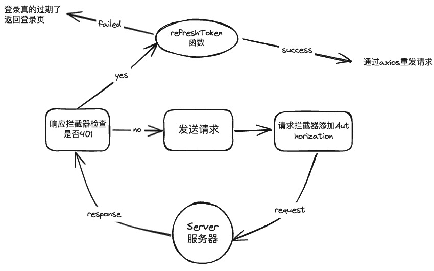

# 项目基本配置
## vite.config.js 配置
```js
import { defineConfig } from 'vite'
import vue from '@vitejs/plugin-vue'
import path from 'path'

// const baseTarget = 'http://192.168.0.161:9000/webapi/' // 测试环境 Env
// const baseTarget = 'https://nexsight.aqrose.com/webapi/' // 生产环境 Env
const baseTarget = 'http://192.168.0.165:80/webapi/' // 开发环境 Env
// const baseTarget = 'http://localhost:8000/' // 本地开发 Env
const authTarget = 'http://192.168.0.165'
const authProxys = [
  '/user/auth',
  '/user/static',
  '/usercenter',
  '/user/userinfo',
  '/user/sendVerifyCode'
]

const proxys = [
  '/galleries',
  '/solutions',
  '/tasks',
  '/task',
  '/infering_tasks',
  '/messages',
  '/reslimits',
  '/extra_info',
  '/last_task',
  '/oauth'
]

const mapProxys = {}
proxys.map(opt => {
  mapProxys[opt] = {
    target: baseTarget,
    changeOrigin: true
  }
})
authProxys.map(opt => {
  mapProxys[opt] = {
    target: authTarget,
    changeOrigin: true
  }
})

export default defineConfig(({ mode }) => {
  return {
    base: './',
    resolve: {
      alias: {
        '@': path.resolve(__dirname, './src')
      }
    },
    build: {
      manifest: true,
      rollupOptions: {
        output: {
          // 代码分割
          manualChunks: {
            lodash: ['lodash-es'],
            echarts: ['echarts'],
            'aq-ui': ['aq-ui'],
            aqlabelview: ['aqlabelview']
          }
        }
      }
    },
    server: {
      host: 'localhost',
      port: 8889,
      hotOnly: true,
      proxy: mapProxys
    },
    css: {
      preprocessorOptions: {
        less: {
          modifyVars: {
            hack: `true; @import (reference) "${path.resolve(
              'src/assets/css/component.less'
            )}";`
          },
          javascriptEnabled: true
        }
      }
    },
    plugins: [vue()],
  }
})
```
## 环境变量配置
vite的环境配置需要注意一些点，加载的环境变量会通过 `import.meta.env` 以字符串形式暴露给客户端源码。为了防止将一些环境变量泄漏到客户端，只有以 `VITE_` 为前缀的变量才会暴露出去。

开发环境`.env.development`

```
NODE_ENV = development

VITE_APP_BASEURL = ''

VITE_APP_PATH = './'
```
生产环境 `.env.production`
```
NODE_ENV = prodution

VITE_APP_BASEURL = '/webapi'

VITE_APP_PATH = '/'
```
## axios配置
axios里中的配置主要做了这么几件事
- 封装了一个刷新 `token` 请求`refreshToken`函数，它主要负责当出现状态码 `401` 时，说明 `token` 过期，这时需要请求一个专用于刷新 `token` 的接口，并在将请求到的新的 `token` 和 `refresh` 记录在会话存储中。
- axios请求拦截器，主要是为在请求发送前给请求头中的 `Authorization` 加上 `token`
- axios响应拦截器，负责捕获到 `401` 过期时，去调用一次 `refreshToken` ，然后从请求拦截器中的失败拦截器中获取到原请求，等待 `refreshToken` 函数存储了新的 `token` 和 `refresh` 后，通过axios再次发送新的原请求

```js
import axios from 'axios'
import { AqMessage } from 'aq-ui'
import { ToLogin } from './util.js'


const refreshToken = async () => {
    	return new Promise((resolve, reject) => {
      let refreshUrl = '/oauth/refresh-token'
      axios
        .post(refreshUrl, {
          refresh_token: localStorage.getItem('refresh')
        })
        .then(res => {
          if (res?.data?.code === 0) {
            localStorage.setItem('token', res.data?.data?.access_token)
            localStorage.setItem('refresh', res.data?.data?.refresh_token)
            resolve()
          } else {
            const msg = res.message || `刷新 Token 失败: ${res}`
            reject(new Error(msg))
          }
        })
        .catch(err => {
          reject(err)
        })
    })
  
}

axios.interceptors.request.use(
  function (config) {
    // navigator.onLine判断是否是正常网络通信状态
    if (!navigator.onLine) return // message.error('未连接网络，请先连接网络再试')
    // 根据环境变量加上前缀
    if (
      config.url.includes('user/userinfo') ||
      config.url.includes('user/users')
    ) {
      config.baseURL = ''
    } else {
      config.baseURL = import.meta.env.VITE_APP_BASEURL
    }
	
    if (!config.url.includes('ufileos.com')) {
      const token = localStorage.getItem('token')
      config.headers = {
        Authorization: token ? `Bearer ${token}` : ''
      }
    }
    return config
  },
  function (error) {
    return Promise.reject(error)
  }
)

axios.interceptors.response.use(
  function (response) {
    return response
  },
  async error => {
    if (error.response && error.response.status) {
      const originReq = error.config
      // 401说明token过期，需要拿到refresh-token去刷新
      if (error.response.status === 401) {
        const token = localStorage.getItem('token')
        const refresh = localStorage.getItem('refresh')
        if (refresh) {
          try {
            await refreshToken()
            // 添加请求头 并重发
            originReq.headers['Authorization'] = token ? `Bearer ${token}` : ''
            return new Promise(resolve =>
              setTimeout(() => resolve(axios(originReq)), 200)
            )
          } catch (err) {
            AqMessage.closeAll()
            ToLogin(location.origin)
          }
        } else {
            AqMessage.closeAll()
            ToLogin(location.origin)
        }
      }
      return Promise.reject(error)
    }
    return Promise.reject(error)
  }
)

export default axios
```

基本逻辑如下：


## 路由Router配置
路由都采用了异步组件加载的方式。

同时路由元信息中的`bread_value`和`bread_routes`是设计动态面包屑相关的必要值。

路由守卫中主要做了两个拦截行为：

- 防止用户直接在url输入工程下面的子路由跳进来***（为了避免一些错误发生，因为必须打开工程后获取很多工程的具体信息，但用户跳过了“打开工程”这一行为。）**
- 统一管理多页面操作的一些违规行为。

```js
import { createRouter, createWebHistory } from 'vue-router'
import NProgress from 'nprogress'
import { useSystemStore } from '@/store/system'
import { useProjectStore } from '@/store/project'
import { AqMessage, AqMessageBox, AqLoading } from 'aq-ui'
import { useModelStore } from '@/store/model'
NProgress.configure({ showSpinner: false })

/* 未存在当前工程的 [router name] 白名单集合 */
const findPaths = [
  'Overview',
  'DataManageImages',
  'DataManageImagesId',
  'Project',
  'ProjectCreate',
  'ProjectRecycle',
  'LoginRedirect',
  'UserCenter',
  '',
  'OperationDocument',
  'CompleteInfo'
]

const routes = [
  {
    path: '/overview',
    name: 'Overview',
    component: () => import('../views/Overview/index.vue'),
    meta: {
      title: '总览',
      bread_value: '开发进度',
      path_routes: ['/overview'],
      bread_routes: ['/overview']
    }
  },
  {
    path: '/data_manage/images',
    name: 'DataManageImages',
    component: () => import('../views/DataManage/index.vue'),
    meta: {
      title: '图库',
      bread_value: '图库',
      path_routes: ['/data_manage/images'],
      bread_routes: ['/data_manage/images']
    }
  },
  {
    path: '/data_manage/images/:id',
    name: 'DataManageImagesId',
    component: () => import('../views/DataManage/images.vue'),
    meta: {
      title: '',
      bread_value: '',
      path_routes: ['/data_manage/images'],
      bread_routes: ['/data_manage/images', '/data_manage/images/:id']
    }
  },
  {
    path: '/project',
    name: 'Project',
    component: () => import('../views/Project/index.vue'),
    meta: {
      title: '工程中心',
      bread_value: '工程中心',
      path_routes: ['/project'],
      bread_routes: ['/project']
    }
  },
  {
    path: '/project/:projectId',
    name: 'ProjectID',
    component: () => import('../views/Project/id.vue'),
    meta: {
      title: '工程',
      path_routes: ['/project', '/project/']
    }
  },
  {
    path: '/project/create',
    name: 'ProjectCreate',
    component: () => import('../views/Project/create.vue'),
    meta: {
      title: '新建工程',
      bread_value: '新建工程',
      path_routes: ['/project'],
      bread_routes: ['/project', '/project/create']
    }
  },
  {
    path: '/project/recycle',
    name: 'ProjectRecycle',
    component: () => import('../views/Project/recycle.vue'),
    meta: {
      title: '回收站',
      bread_value: '回收站',
      path_routes: ['/project'],
      bread_routes: ['/project', '/project/recycle']
    }
  },
  {
    path: '/project/preprocessing',
    name: 'Preprocessing',
    component: () => import('../views/Project/Preprocessing/index.vue'),
    meta: {
      title: '前置处理',
      bread_value: '前置处理',
      path_routes: ['/project', '/project/preprocessing'],
      bread_routes: ['/project/preprocessing']
    }
  },
  {
    path: '/project/image_annotation',
    name: 'ImageAnnotation',
    component: () => import('../views/Project/ImageAnnotation/index.vue'),
    meta: {
      title: '在线标注',
      bread_value: '在线标注',
      path_routes: ['/project', '/project/image_annotation'],
      bread_routes: ['/project/image_annotation']
    }
  },
  {
    path: '/project/model_generate',
    name: 'ModelGenerate',
    component: () => import('../views/Project/ModelGenerate/index.vue'),
    meta: {
      title: '模型生成',
      bread_value: '模型生成',
      path_routes: ['/project', '/project/model_generate'],
      bread_routes: ['/project/model_generate']
    },
    beforeEnter: (to, from, next) => {
      modelGenerateBeforeEnter(to, from, next)
    }
  },
  {
    path: '/project/model_evaluation',
    name: 'ModelEvaluation',
    component: () => import('../views/Project/ModelEvaluation/index.vue'),
    meta: {
      title: '模型评估',
      bread_value: '模型评估',
      path_routes: ['/project', '/project/model_evaluation'],
      bread_routes: ['/project/model_evaluation']
    }
  },
  {
    path: '/project/model_validate',
    name: 'ModelValidate',
    component: () => import('../views/Project/ModelValidate/index.vue'),
    meta: {
      title: '模型验证',
      bread_value: '模型验证',
      path_routes: ['/project', '/project/model_validate'],
      bread_routes: ['/project/model_validate']
    }
  },
  {
    path: '/project/model_validate/validate_result',
    name: 'ValidateResult',
    component: () =>
      import(
        '/src/views/Project/ModelValidate/components/ValidateResult/index.vue'
      ),
    meta: {
      title: '',
      bread_value: '默认',
      path_routes: ['/project', '/project/model_validate'],
      bread_routes: [
        '/project/model_validate',
        '/project/model_validate/validate_result'
      ]
    }
  },
  {
    path: '/project/project_deploy',
    name: 'ProjectDeploy',
    component: () => import('../views/Project/ProjectDeploy/index.vue'),
    meta: {
      title: '工程部署',
      bread_value: '工程部署',
      path_routes: ['/project', '/project/project_deploy'],
      bread_routes: ['/project/project_deploy']
    }
  },
  {
    path: '/operation_document',
    name: 'OperationDocument',
    component: () => import('../views/OperationDocument/index.vue'),
    meta: {
      title: '操作文档',
      noLayerSide: true,
      noLayerHeader: true,
      path_routes: ['/operation_document']
    }
  },
  {
    path: '/user_center',
    name: 'UserCenter',
    component: () => import('../views/UserCenter/index.vue'),
    meta: {
      noLayerSide: true,
      title: '用户中心',
      bread_value: '个人中心',
      bread_routes: ['/user_center']
    },
    children: [
      {
        path: 'complete_info',
        name: 'CompleteInfo',
        component: () => import('../views/UserCenter/completeInfo.vue'),
        meta: {
          hiddenFather: true,
          bread_value: '完善信息',
          bread_routes: ['/user_center', '/user_center/complete_info']
        }
      }
    ]
  },
  {
    path: '/login-redirect',
    name: 'LoginRedirect',
    component: () => import('../views/login-redirect.vue'),
    meta: {
      title: '转发中...',
      noLayerSide: true,
      noLayerHeader: true
    }
  },
  {
    path: '/project/task-management',
    name: 'TaskManagement',
    component: () => import('../views/Project/TaskManagement/index.vue'),
    meta: {
      title: '任务列表',
      bread_value: '任务列表',
      path_routes: ['/project'],
      bread_routes: ['/project', '/project/task-management']
    }
  },
  {
    path: '/:pathMatch(.*)',
    redirect: '/overview'
  }
]

const router = createRouter({
  history: createWebHistory(import.meta.env.BASE_URL), // https://vitejs.cn/guide/build.html#public-base-path
  routes
})

router.beforeEach(async (to, from, next) => {
  const systemStore = useSystemStore()

  // ModelValidate ValidateResult
  if (to.name === 'ModelValidate' && from.name === 'ValidateResult') {
    sessionStorage.setItem('dontgotovalidateres', 'true')
  } else {
    sessionStorage.setItem('dontgotovalidateres', 'false')
  }

  if (
    sessionStorage.getItem('isViewModules') &&
    sessionStorage.getItem('isViewModules') === 'y'
  ) {
    if (systemStore.AllSiderMenu[2].pre_children) {
      const item = systemStore.AllSiderMenu[2].pre_children
      systemStore.AllSiderMenu[2].children = item
      systemStore.dynamicSiderMenu = [...item]
      delete systemStore.AllSiderMenu[2].pre_children
    }
    const name = sessionStorage.getItem('project_title')
    const solutionID = sessionStorage.getItem('solution_id')
    systemStore.setCurProjectInfo(name, solutionID)
  } else {
    if (to.query?._m !== 'guide') {
      const isViewModules = sessionStorage.getItem('isViewModules')
      if (!isViewModules) {
        sessionStorage.setItem('isViewModules', 'y')
      }
    } else {
      /* 当没有选择某个工程时，手动进入到后续的路由中的处理 */
      if (!findPaths.includes(to.name)) {
        const screenLoading = AqLoading.service({
          fullscreen: true,
          text: ''
        })
        AqMessage({
          type: 'error',
          duration: 5000,
          message:
            '请先选择需要操作的工程项，再继续本次操作，即将为您跳转到工程页'
        })
        setTimeout(() => {
          screenLoading.close()
          next('/project')
          location.replace('/project')
        }, 5000)
      }
    }
  }
  NProgress.start()
  if (!to.name) {
    next('/overview')
    NProgress.done()
  } else {
    next()
    NProgress.done()
  }
  document.title = `${to.meta.title} - NexSight`
})

router.afterEach(async (to, from) => {
  NProgress.done()
  const systemStore = useSystemStore()
  const projectStore = useProjectStore()
  if (to.query?._m === 'guide') {
    if (sessionStorage.getItem('isViewCourse') === 'y') {
      systemStore.guideVisible = true
      systemStore.guideConfig = systemStore.guides_position[to.name]
    }
  } else {
    const solutionID = sessionStorage.getItem('solution_id')
    const isSolutionExistPath = [
      'ProjectID',
      'ImageAnnotation',
      'ModelGenerate',
      'ModelEvaluation',
      'ModelValidate',
      'ValidateResult',
      'ProjectDeploy'
    ]

    if (isSolutionExistPath.includes(to.name)) {
      await projectStore.getSolutionsDetail(solutionID).then(
        () => {},
        () => {
          router.replace('/project')
          AqMessage.error('工程已被删除，请刷新后重试')
          sessionStorage.removeItem('isViewModules')
          sessionStorage.removeItem('solution_id')
          if (systemStore.AllSiderMenu[2].children) {
            const item = systemStore.AllSiderMenu[2].children
            systemStore.AllSiderMenu[2].pre_children = item
            delete systemStore.AllSiderMenu[2].children
          }
        }
      )
    }
  }
  setTimeout(() => {
    const floatBox = document.getElementsByClassName('float-6587-dbvc')[0]
    if (floatBox) {
      document.body.removeChild(floatBox)
    }
  })
})

// 进入模型生成前必须检查是否标签满足条件
async function modelGenerateBeforeEnter(to, from, next) {
  const systemStore = useSystemStore()
  const moduleType = systemStore.cur_module_type
  if (from.fullPath === '/' || from.query?._m === 'guide') {
    next()
  } else if (to.fullPath === '/project/model_generate') {
    const solution_id = sessionStorage.getItem('solution_id')
    const module_id = sessionStorage.getItem('module_id')
    const modelStore = useModelStore()
    if (solution_id && module_id) {
      const markInfo = await modelStore.getModelMarkInfo(solution_id, module_id)
      const unqualifiedMarkTags = markInfo.data.tags.filter(
        markTag => markTag.marked_count < markTag.min_marked_num
      )
      if (unqualifiedMarkTags.length === 0 && moduleType !== 'ocr') {
        next()
      } else if (markInfo.data.marked_count >= 10 && moduleType === 'ocr') {
        next()
      } else {
        let markText = ''
        unqualifiedMarkTags.forEach(tag => {
          markText += ` “<span style="color:#2f3fe9">${tag.title}</span>” `
        })
        const ocrText =
          '至少需要10张已标注图片以开启训练，是否继续前往模型生成页？'
        const otherText = 
          `标签${markText}标注数量不足，
        每类标签图片数量至少需要10张以开启训练，
				是否继续前往模型生成页？`
        const markPrgressText = moduleType === 'ocr' ? ocrText : otherText
        AqMessageBox.confirm(markPrgressText, '标注进度', {
          confirmButtonText: '确认',
          cancelButtonText: '取消',
          dangerouslyUseHTMLString: true
        })
          .then(() => {
            next()
          })
          .catch(() => {})
      }
    }
  }
}

export default router

```