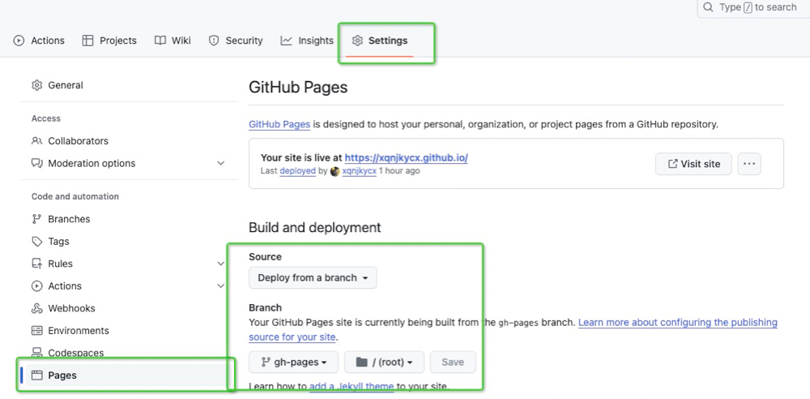

# 光速搭建个人博客
**使用VitePress + Github Pages 搭建个人博客网站，并实现自动构建和发布。**

你现在浏览的这个博客就是这样搭建的（其实没什么技术含量，我选择了最简单的方式😝，有👋就行）。

## 使用VitePress搭建博客工程
VitePress是一个静态网站生成器，内容使用Markdown语法，配置十分简单，同时附带了非常优美的默认主题，即使不需要写前端代码，也可以生成一个静态网站。底层使用`Vite`和`Vue3`，前端开发者可以方便的进行修改或定制。

[当然我更喜欢你去直接阅读VitePress的官方文档！](https://vitepress.dev/)

具体编写博客的规则都在文档里面，这里不会细讲，而是说一下如何搭建博客的大致框架～

::: tip 温馨小提示
一切都以官方文档为准哦😘😘
:::

## 安装VitePress
你最好有以下的一些准备
- Node.js版本必须在18及其以上
- VitePress CLI
- 一个支持Markdown语法的编辑器，这个我强推VSCode

ok😯，here we go!
```shell
npm add -D vitepress
```
紧接着
```shell
npx vitepress init
```
然后按照下面的方式进行选择
```shell
┌  Welcome to VitePress!
│
◇  Where should VitePress initialize the config?
│  ./docs
│
◇  Site title:
│  My Awesome Project
│
◇  Site description:
│  A VitePress Site
│
◆  Theme:
│  ● Default Theme (Out of the box, good-looking docs)
│  ○ Default Theme + Customization
│  ○ Custom Theme
└
```
基本的项目结构就有了，现在可以看到最后的文件结构是这样的⬇️⬇️
```
.
├─ docs
│  ├─ .vitepress
│  │  └─ config.js
│  ├─ api-examples.md
│  ├─ markdown-examples.md
│  └─ index.md
└─ package.json
```
进入package.json之后，就可以看到对应的脚本命令了，这里简陈述一下其作用：
```
# 安装依赖
pnpm install
# 开发模式启动
pnpm docs:dev
# 手动构建
pnpm docs:build
# 预览构建成果
pnpm docs:preview
```
## 基本的文档结构
每个人都应该会有自己的文档结构，这里我简单贴一下我的项目结构，仅供参考😊😊

```txt
jzplp.github.io
├─.github           # github配置(可选)
│  └─workflows      # 自动构建部署配置
├─components        # vue组件(可选)
├─docs              # 博客内容
│   ├─.vitepress    
│   │  ├─config.ts  # vitepress配置
│   │  ├─cache      # 缓存文件，可忽略提交
│   │  ├─dist       # 构建包，可忽略提交
│   │  └─theme      # 样式和主题
│   ├─index.md      # 博客首页
│   ├─some-docs     # 按照各种名称分类的博客
│   ├─any-docs
│   ├─...           # 更多博客目录
│   └─public        # 博客使用的静态资源
├─node_modules      # 依赖目录，可忽略提交
├─.gitignore        # git提交忽略配置
├─package.json      # node.js配置
└─README.md         # 工程说明
```


## 部署到github pages上
在GitHub上创建仓库，对于名称有特殊套要求，为`{{用户名}}.github.io`。例如我的用户名叫`await`，那么仓库名就应该为`await.github.io`

创建仓库后，直接将你创建好的博客工程上传到GitHub的仓库上。千万不要把`node_modules`传上去啊，所以需要在工程根目录下创建`.gitignore`，写入要忽略提交的文件，再进行上传。
```bash
node_modules
docs/.vitepress/cache
docs/.vitepress/dist
```
这里也要把构建后的`dist`目录的内容也忽略了，因为这个主分支`master`只用于存放源码，构建后的文档会在后续内容放在另外一个分支中。

```shell
git remote add "远程仓库地址"
git add .
git commit -m "创建博客工程" 
git push
```
:::warning 注意！
这里我很默认你已经无比懂git了
:::

就在刚才，其实我们只是上传了工程的源代码。对于打包构建好的结果，也需要进行上传，最后才能发布到博客网站上。你还需要执行下面这些命令⬇️
```shell
npm docs:build
cd docs/.vitepress/dist

git init
git add -A
git commit -m"给我狠狠地提交"
git push -f https://github.com/xqnjkycx/xqnjkycx.github.io.git master:gh-pages
```
**记得push的地址填你自己的github地址**

上面的命令就是干了这么两件事

- 构建了工程，生成了dist，并进入到dist目录
- 将dist目录中的内容上传到`gh-pages`分支中

OK，大的要来了，进入创建的GitHub仓库的配置，具体位置在`Setting -> Pages -> Build and deployment -> Source`。来源选择`Deploy from a branch`，既一个分支。

旋转刚刚上传上来的`gh-pages`分支，根目录，保存save！！



## 实现自动化部署
使用上面的描述方法，会发现每次写完博客之后，提交工程代码后，还需要手动👋构建，更新分支并发布。构建过程在本地电脑上。

但是使用GitHub Actions就能做到这一点，而且GitHub提供了服务器，所以可以把构建过程放到服务器来做。

首先创建配置文件，位置在`.github/workflows/deploy.yml`

```yml
# Sample workflow for building and deploying a VitePress site to GitHub Pages
#
name: Deploy VitePress site to Pages

on:
  # Runs on pushes targeting the `main` branch. Change this to `master` if you're
  # using the `master` branch as the default branch.
  push:
    branches: ["master"]

  # Allows you to run this workflow manually from the Actions tab
  workflow_dispatch:

# Sets permissions of the GITHUB_TOKEN to allow deployment to GitHub Pages
permissions:
  contents: read
  pages: write
  id-token: write

# Allow only one concurrent deployment, skipping runs queued between the run in-progress and latest queued.
# However, do NOT cancel in-progress runs as we want to allow these production deployments to complete.
concurrency:
  group: pages
  cancel-in-progress: false

jobs:
  # Build job
  build:
    runs-on: ubuntu-latest
    steps:
      - name: Checkout
        uses: actions/checkout@v3
        with:
          fetch-depth: 0 # Not needed if lastUpdated is not enabled
      # - uses: pnpm/action-setup@v2 # Uncomment this if you're using pnpm
      # - uses: oven-sh/setup-bun@v1 # Uncomment this if you're using Bun
      - name: Setup Node
        uses: actions/setup-node@v3
        with:
          node-version: 18
          cache: npm # or pnpm / yarn
      - name: Setup Pages
        uses: actions/configure-pages@v3
      - name: Install dependencies
        run: npm ci # or pnpm install / yarn install / bun install
      - name: Build with VitePress
        run:  npm run docs:build 
      - name: Upload artifact
        uses: actions/upload-pages-artifact@v2
        with:
          path: docs/.vitepress/dist

  # Deployment job
  deploy:
    environment:
      name: github-pages
      url: ${{ steps.deployment.outputs.page_url }}
    needs: build
    runs-on: ubuntu-latest
    name: Deploy
    steps:
      - name: Deploy to GitHub Pages
        id: deployment
        uses: actions/deploy-pages@v2
```
GitHub Actions的环境中提供了很多预置的配置和工具，例如Node.js，pnpm等等，我们直接使用即可。如果你的配置和文中上述流程一致，那么直接复制该文件内容到你的工程即可。之后上传到工程代码GitHub仓库中。如果想了解更多，可以参考[GitHub Actions文档](https://docs.github.com/zh/actions)以及其他人的配置。

最后记得回到老地方`Settings -> Pages -> Build and deployment -> Source`。将之前设置的`Deploy from a branch`，修改为`GitHub Actions`

做完操作后，每次写完博客，将工程代码push到Github仓库之后，GitHub会自动触发构建和发布流程，从而更新博客网站。

## 参考文章
- [使用VitePress和Github搭建个人博客网站，可以自动构建和发布](https://juejin.cn/post/7235513984555384892)

- [快速给个人网站集成评论功能](https://juejin.cn/post/7250834083046621241)