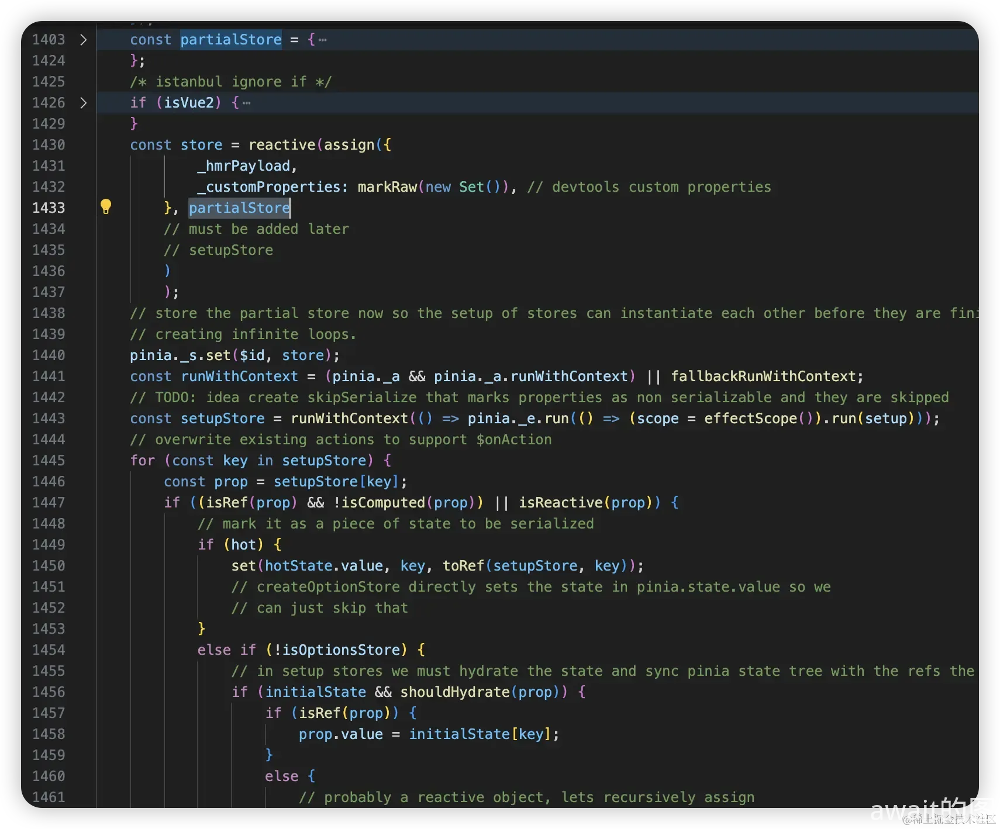
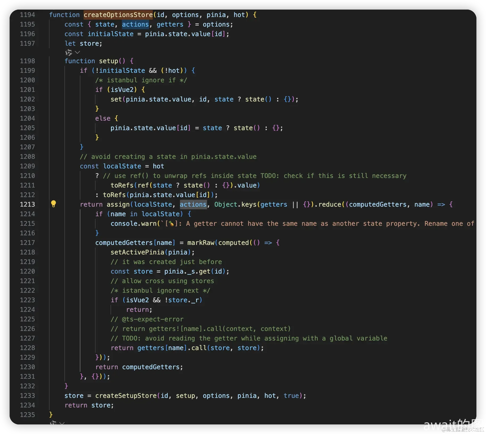

# Pinia
pinia是V3特别推荐的状态管理库

## Pinia是什么？
- pinia 是用来替代 vuex 的，pinia非常的小巧，并且同时支持`vue2`和`vue3`，同时`typescript`的支持也比较完备
- pinia 默认是支持多仓库的，由于`vuex`中只有一个仓库，导致所有的状态都放在了同一个`store`里。在pinia中，选择将所有的状态都模块化，根据id存放在`store`里，需要使用时就调用`useXxx`的方式调用
- `vuex`中的`mutation`和`action`和`module`这些`API`设计稍显冗余，其中`mutation`是更改状态的提交方法，`action`是提交`mutation`的方法，这样的设计有点奇怪，而`pinia`直接舍弃了`mutation`这一层，只有`action`层，所以用户只需要使用`action`即可

同时Pinia本身支持了选项式API和CompositionAPI的两种写法:

这是选项式写法
```js
// 这是选项式写法
import { defineStore } from 'pinia'

export const useCounterStore = defineStore('counterStore', {
  state: () => {
    return {
      counter: 0
    }
  },
  actions: {
    increment() {
      this.counter++
    }    
  },
  getters: {
    dobuleCount() {
      return this.counter * 2
    }
  }
})
```
这是CompositionAPI写法
```js
// 这是CompositionAPI写法
import { ref, computed } from 'vue'
import { defineStore } from '@/pinia'

export const useCounterStore2 = defineStore('counterStore2', () => {
  const counter = ref(0);
  function increment() {
    this.counter++
  }
  const dobuleCount = computed(() => {
    return counter.value * 2;
  })
  return { counter, increment, dobuleCount }
})
```
同时Pinia还有大量的API基本用法，比如：
- **$dispose** 可以让某个store停止响应
```js
import { useCounterStore } from "./stores/counter";
const store = useCounterStore();
store.$dispose();
```
- **$patch** 补丁操作，可以同时批量设置`store`的值，传入一个回调函数，回调函数接收一个`store`参数可以访问当前仓库所有的属性和方法
```js
import { useCounterStore } from "./stores/counter";
const store = useCounterStore();
store.$patch((store) => {
    store.counter = 1000;
});
```
- **$reset** 重置仓库数据，这个API只允许**选项式**构建的store
```js
import { useCounterStore } from "./stores/counter";
const store = useCounterStore();
store.$reset()
```
- **$subscribe** 设置一个回调函数，仓库所有状态被修改时执行这个回调函数，返回一个删除此回调的函数
```js
import { useCounterStore } from "./stores/counter";
const store = useCounterStore();
store.$subscribe((params, state) => {
    console.log("params",params);//修改的属性
    console.log("state",state);//修改后的数据
})
```
- **$onAction** 设置一个回调函数，每次调用操作时执行此回调函数，并且回调函数接收一个参数，参数包含所有操作信息
```js
import { useCounterStore } from "./stores/counter";
const store = useCounterStore();
store.$onAction(({name, store, args, after, onError}) => {
    after((result) => {
        // 修改后的结果
    })
    
    onError((error) => {
        // 执行错误
    })
})
```

## Pinia的实现
### 入口文件
首先可以知道，在创建Pinia时，会在Vue项目的`mian.js`中进行`CreatePinia`，然后通过`defineStore`去创建自己需要的仓库

那么可以新增两个入口，并把它们暴露出去
```js
// createPinia.js
export function createPinia() {
}
```
```js
// store.js
export function defineStore() {
}
```
```js
// index.js
import { createPinia } from "./createPinia.js";
import { defineStore } from './store';

export {
    createPinia,
    defineStore
}
```

## createPinia
在`vue`中，为了获取app实例，`createPinia`是通过插件形式来引进
```js
// createPinia.js
export function createPinia() {
    const pinia = {
        install(app) {
        }
    }
    return pinia;
}
```
Vue3下的Pinia的具体源码如下：
```js
/**
 * Creates a Pinia instance to be used by the application
 */
export function createPinia(): Pinia {
  const scope = effectScope(true)
  // NOTE: here we could check the window object for a state and directly set it
  // if there is anything like it with Vue 3 SSR
  const state = scope.run<Ref<Record<string, StateTree>>>(() =>
    ref<Record<string, StateTree>>({})
  )!

  let _p: Pinia['_p'] = []
  // plugins added before calling app.use(pinia)
  let toBeInstalled: PiniaPlugin[] = []

  const pinia: Pinia = markRaw({
    install(app: App) {
      // this allows calling useStore() outside of a component setup after
      // installing pinia's plugin
      setActivePinia(pinia)
      if (!isVue2) {
        pinia._a = app
        app.provide(piniaSymbol, pinia)
        app.config.globalProperties.$pinia = pinia
        /* istanbul ignore else */
        if (__USE_DEVTOOLS__ && IS_CLIENT) {
          registerPiniaDevtools(app, pinia)
        }
        toBeInstalled.forEach((plugin) => _p.push(plugin))
        toBeInstalled = []
      }
    },

    use(plugin) {
      if (!this._a && !isVue2) {
        toBeInstalled.push(plugin)
      } else {
        _p.push(plugin)
      }
      return this
    },

    _p,
    // it's actually undefined here
    // @ts-expect-error
    _a: null,
    _e: scope,
    _s: new Map<string, StoreGeneric>(),
    state,
  })

  // pinia devtools rely on dev only features so they cannot be forced unless
  // the dev build of Vue is used. Avoid old browsers like IE11.
  if (__USE_DEVTOOLS__ && typeof Proxy !== 'undefined') {
    pinia.use(devtoolsPlugin)
  }

  return pinia
}
```
- `pinia`中实例总是全局的，所以需要给`app`挂载全的`pinia`实例，于是可以看到这样的代码`app.config.globalProperties.$pinia = pinia`
- `_s`代表`pinia`支持多仓库，说明它的仓库的数据结构是一个Map，其中的内容是`{id1:store1,id2:store2}`这种形式
- `_e`是一个`effectScope`的`vue`API，它可以收集所有的**副作用函数**通过调用`stop`可以让所有的响应式数据停止响应
- 源码中的`state`是一个`ref`的响应式对象，其主要用于存储所有的`store`状态值

这里可以自己来手写模拟一段代码：
```js
// createPinia.js
import { effectScope, ref } from 'vue';
import { piniaSymbol } from './rootStore';

export function createPinia() {
    const scope = effectScope();
    const state = scope.run(() => ref({})); // 用于存储每个store的state方法
    const pinia = {
        _s: new Map(), // 用来存储所有的store实例，{storeName: store, storeName2: store2}
        _e: scope, // effectScope实例
        state, // 存储所有store的state状态值
        install(app) {
            // 注入依赖
            app.provide(piniaSymbol, pinia); // 让所有的store都能够拿到pinia实例
            app.config.globalProperties.$pinia = pinia;
        }
    }
    return pinia;
}
```
其中piniaSymbol是为了给Pinia做一个唯一的标识符，为了能让全局拿到Pinia，还使用了provide注入依赖，提供给全局使用

## defineStore
```ts
export function defineStore(
  // TODO: add proper types from above
  idOrOptions: any,
  setup?: any,
  setupOptions?: any
): StoreDefinition {
  let id: string
  let options:
    | DefineStoreOptions<
        string,
        StateTree,
        _GettersTree<StateTree>,
        _ActionsTree
      >
    | DefineSetupStoreOptions<
        string,
        StateTree,
        _GettersTree<StateTree>,
        _ActionsTree
      >

  const isSetupStore = typeof setup === 'function'
  if (typeof idOrOptions === 'string') {
    id = idOrOptions
    // the option store setup will contain the actual options in this case
    options = isSetupStore ? setupOptions : setup
  } else {
    options = idOrOptions
    id = idOrOptions.id

    if (__DEV__ && typeof id !== 'string') {
      throw new Error(
        `[🍍]: "defineStore()" must be passed a store id as its first argument.`
      )
    }
  }

  function useStore(pinia?: Pinia | null, hot?: StoreGeneric): StoreGeneric {
    const hasContext = hasInjectionContext()
    pinia =
      // in test mode, ignore the argument provided as we can always retrieve a
      // pinia instance with getActivePinia()
      (__TEST__ && activePinia && activePinia._testing ? null : pinia) ||
      (hasContext ? inject(piniaSymbol, null) : null)
    if (pinia) setActivePinia(pinia)

    if (__DEV__ && !activePinia) {
      throw new Error(
        `[🍍]: "getActivePinia()" was called but there was no active Pinia. Are you trying to use a store before calling "app.use(pinia)"?\n` +
          `See https://pinia.vuejs.org/core-concepts/outside-component-usage.html for help.\n` +
          `This will fail in production.`
      )
    }

    pinia = activePinia!

    if (!pinia._s.has(id)) {
      // creating the store registers it in `pinia._s`
      if (isSetupStore) {
        createSetupStore(id, setup, options, pinia)
      } else {
        createOptionsStore(id, options as any, pinia)
      }

      /* istanbul ignore else */
      if (__DEV__) {
        // @ts-expect-error: not the right inferred type
        useStore._pinia = pinia
      }
    }

    const store: StoreGeneric = pinia._s.get(id)!

    if (__DEV__ && hot) {
      const hotId = '__hot:' + id
      const newStore = isSetupStore
        ? createSetupStore(hotId, setup, options, pinia, true)
        : createOptionsStore(hotId, assign({}, options) as any, pinia, true)

      hot._hotUpdate(newStore)

      // cleanup the state properties and the store from the cache
      delete pinia.state.value[hotId]
      pinia._s.delete(hotId)
    }

    if (__DEV__ && IS_CLIENT) {
      const currentInstance = getCurrentInstance()
      // save stores in instances to access them devtools
      if (
        currentInstance &&
        currentInstance.proxy &&
        // avoid adding stores that are just built for hot module replacement
        !hot
      ) {
        const vm = currentInstance.proxy
        const cache = '_pStores' in vm ? vm._pStores! : (vm._pStores = {})
        cache[id] = store
      }
    }

    // StoreGeneric cannot be casted towards Store
    return store as any
  }

  useStore.$id = id

  return useStore
}
```
- `defineStore`有三个入参，分别是`idOrOptions`，`setup`，`setupOptions`，这也是上文中所说的`defineStore`的两种写法
- 从上面的源码`22`行看起，默认是有`id`和`options`选项，并且通过类型判断用户入参进行相关的处理
- 在这个`defineStore`的结尾把内部定义的`useStore`返回给了外界，用户就可以通过这个来访问自己定义的仓库了
- 并在源码`57`行，访问`pinia._s`中是否保存了某个`id`的`store`实例，如果没有就进行初始化，而且通过用户传进的类型来判断做`createSetupStore`和`createOptionsStore`

同理，可以手写下面这一段代码👇👇
```js
// store.js
export function defineStore(idOrOptions, setup) {
    let id, options;
    // 判断第二个参数是否为一个函数，如果是函数，则是compositionAPI,否则就是选项式
    const isSetupStore = typeof setup === 'function';
    // 如果第一个参数是string,那么它就是id
    if (typeof idOrOptions === 'string') {
        id = idOrOptions;
        options = setup;
    } else {
        id = idOrOptions.id;
        options = idOrOptions;
    }

    // 这个useStore方法返回store实例
    function useStore() {
        // 获取当前组件实例，拿到pinia实例
        const instance = getCurrentInstance();
        const pinia = instance && inject(piniaSymbol);
        // 判断是否初始化，如果pinia._s没有这个id，则设置一个
        if (!pinia._s.has(id)) {
            // 判断第二个参数是否是一个函数，如果是函数那么则是使用compositio形式
            if (isSetupStore) {
                createSetupStore(id, setup, pinia);
            } else {
                createOptionsStore(id, options, pinia);
            }
        }
        const store = pinia._s.get(id);
        return store;
    }
    return useStore;
}

```

### createSetupStore
这里只展示一部分`createSetupStore`源码的一部分

- 源码1403处，`partialStore`是`pinia`自带的方法和属性，`store`变量是将原属性和用户自定义的属性和方法进行合并
- 源码1440处，将`store`存储到`pinia._s`下，方便随时读取
- 源码1443处，将用户传入的`setup`通过`effectScope`包一层，实现数据响应性
- 源码1445处，循环用户传入的`setup`，因为用户传入的`setup`是散乱的，他和`options`不同，需要判断用户到底写的是`state`状态，还是方法，又或者它是一个`computed`属性，所需需要循环对这些进行处理
- 循环内容大致逻辑就是，将所有的状态存储到`pinia.state`中，将所有函数重新绑定`this`，因为如果用户将方法结构出来使用的话，`this`就会错误或丢失，例如`const {increament} = useCounterStore()`，这时调用`increment`时，`this`并不是指向`store`无法读取到值

同理可以模仿写一段代码
```js
// store.js
import { getCurrentInstance, inject, reactive, effectScope, computed, isRef, isReactive } from 'vue';
function isComputed(v) {
    return (isRef(v) && v.effect);
}
function createSetupStore(id, setup, pinia, isOptions) {
    let scope;
    const partialStore = reactive({});
    const initState = pinia.state.value[id];
    if (!initState) {
        pinia.state.value[id] = {};
    }
    const setupStore = pinia._e.run(() => {
        scope = effectScope();
        return scope.run(() => setup());
    });

    function warpAction(name, action) {
        return function () {
            let res = action.apply(partialStore, arguments);
            return res;
        }
    }
    for(let key in setupStore) {
        const prop = setupStore[key];
        if (typeof prop === 'function') {
            setupStore[key] = warpAction(key, prop);
        }
        if (!isOptions) {
            // 如果setup API 需要拿到状态存到全局的state中, computed也是ref，需要另外处理
            if ((isRef(prop) && !isComputed(prop)) || isReactive(prop)) {
                pinia.state.value[id][key] = prop;
            }
        }
    }
    pinia._s.set(id, partialStore);
    Object.assign(partialStore, setupStore);
    return partialStore;
}
```
### createOptionsStore
这里也只展示一部分`createOptionsStore`

- 源码1196行，初始化`pinia.state`的属性
- 源码1204行，执行用户传入的`state`方法将其存储到全局的`state`
- 源码1209行，获取用户定义的`state`属性，由于用户定义只是一个普通的值，并不具有响应式，所以需要`toRefs`让所有对象转换成响应式
- 源码1217行，处理用户定义的getter，用户定义时也是一个普通函数，所以要将其处理为`computed`
- 源码1228行，`.call`绑定的`this`一定要指向自己`store`
- 源码1233行，调用刚刚的`createSetupStore`方法，可以看到其实`options`和`composition`都是复用的一套逻辑，只是用户再使用`options`时，从新组装一个`setup`然后交给`createSetupStore`函数处理。

缩写一下下面的代码：
```js
// store.js
// 创建选项式的store
function createOptionsStore(id, options, pinia) {
    const { state, getters, actions } = options;

    function setup() {
        const localState = pinia.state.value[id] = state ? state() : {};
        return Object.assign(toRefs(ref(localState).value), actions, Object.keys(getters).reduce((memo, name) => {
            memo[name] = computed(() => {
                let store = pinia._s.get(id);
                return getters[name].call(store, store);
            })
            return memo;
        }, {}));
    }
    return createSetupStore(id, setup, pinia, true); 
}
```