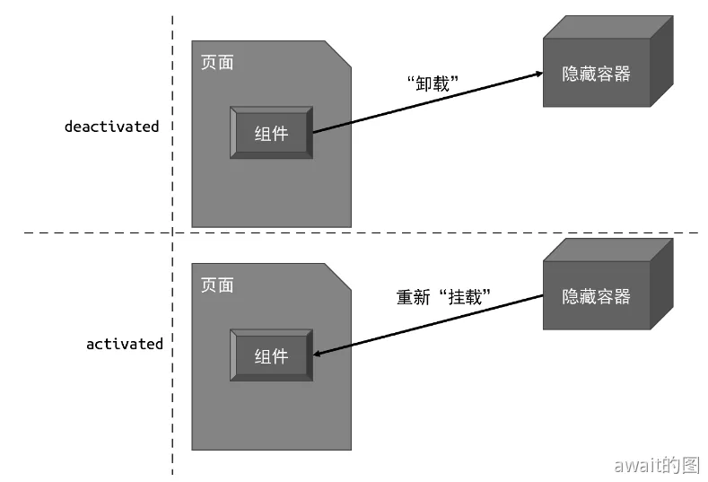

# KeepAlive 组件
Vue中的**Keep-Alive**组件可以避免一个组件被频繁地销毁/重建，假设页面中有一组`<Tab>`组件，如下所示：

```html
<template>
  <Tab v-if="currentTab === 1">...</Tab>
  <Tab v-if="currentTab === 2">...</Tab>
  <Tab v-if="currentTab === 3">...</Tab>
</template>
```
由于不同的变量名`currentTab`切换会导致不停的卸载重建组件，所以一般使用`Keep-Alive`组件来做缓存

```html
<template>
  <KeepAlive>
      <Tab v-if="currentTab === 1">...</Tab>
      <Tab v-if="currentTab === 2">...</Tab>
      <Tab v-if="currentTab === 3">...</Tab>
  </KeepAlive>
</template>
```
其实KeepAlive的本质就是做的缓存管理，再加上特殊的挂载/卸载逻辑。首先，KeepAlive 组件的实现需要渲染器层面的支持。

这是因为KeepAlive组件在卸载时其实不能真的去做卸载，而是将被KeepAlive包裹的组件从原容器搬运并缓存到另一个容器中，实现”假卸载“。当搬运到隐藏容器组件需要再次被”挂载“时，也不会真的去做挂载，而是把该组件从隐藏的容器中搬运出来再放到原容器。

这个“搬离”和“放回”，其实也对应了两种生命周期状态：`deactivated`和`activated`



一个基本的KeepAlive组件的实现其实并不复杂，主要还是核心：**当重新“挂载”组件时，不会被真的挂载，当“卸载”组件时，也不会真的卸载。**

一个最基本的 KeepAlive 组件实现起来还是非常简单并不复杂，如下所示：
```js
const KeepAlive = {
   // KeepAlive 组件独有的属性，用作标识
   __isKeepAlive: true,
   setup(props, { slots }) {
     // 创建一个缓存对象
     // key: vnode.type
     // value: vnode
     const cache = new Map()
     // 当前 KeepAlive 组件的实例
     const instance = currentInstance
     // 对于 KeepAlive 组件来说，它的实例上存在特殊的 keepAliveCtx 对象，该对象由渲染器注入
     // 该对象会暴露渲染器的一些内部方法，其中 move 函数用来将一段 DOM 移动到另一个容器中
     const { move, createElement } = instance.keepAliveCtx

     // 创建隐藏容器（重点！）
     const storageContainer = createElement('div')

     // KeepAlive 组件的实例上会被添加两个内部函数，分别是 _deActivate 和 _activate
     // 这两个函数会在渲染器中被调用
     instance._deActivate = (vnode) => {
       move(vnode, storageContainer)
     }
     instance._activate = (vnode, container, anchor) => {
       move(vnode, container, anchor)
     }

     return () => {
       // KeepAlive 的默认插槽就是要被 KeepAlive 的组件
       let rawVNode = slots.default()
       // 如果不是组件，直接渲染即可，因为非组件的虚拟节点无法被 KeepAlive
       if (typeof rawVNode.type !== 'object') {
         return rawVNode
       }

       // 在挂载时先获取缓存的组件 vnode
       const cachedVNode = cache.get(rawVNode.type)
       if (cachedVNode) {
         // 如果有缓存的内容，则说明不应该执行挂载，而应该执行激活
         // 继承组件实例
         rawVNode.component = cachedVNode.component
         // 在 vnode 上添加 keptAlive 属性，标记为 true，避免渲染器重新挂载它
         rawVNode.keptAlive = true
       } else {
         // 如果没有缓存，则将其添加到缓存中，这样下次激活组件时就不会执行新的挂载动作了
         cache.set(rawVNode.type, rawVNode)
       }

       // 在组件 vnode 上添加 shouldKeepAlive 属性，并标记为 true，避免渲染器真的将组件卸载
       rawVNode.shouldKeepAlive = true
       // 将 KeepAlive 组件的实例也添加到 vnode 上，以便在渲染器中访问
       rawVNode.keepAliveInstance = instance

       // 渲染组件 vnode
       return rawVNode
     }
   }
}
```

首先KeepAlive组件本身其实不回渲染额外的内容，它的渲染函数最终只返回需要被KeepAlive的组件，这个需要被KeepAlive的组件称为“内部组件”。这个内部组件通过插槽传递给KeepAlive组件内部，KeepAlive组件会对内部组件进行操作，主要是在内部组件的vnode对象上添加一些标记属性，以便于渲染器能够执行正确的挂载和卸载操作：
- `shouldKeepAlive`：该属性会被添加到“内部组件”的vnode对线上，渲染器在卸载“内部组件”时，可以检查这个属性得知“内部组件”需要被KeepAlive，所以不会卸载“内部组件”，而是去做搬运工作
- `keptAlive`：“内部组件”如果已经被缓存，那么会为其添加一个keptAlive标记，这样当“内部组件”需要重新渲染时，渲染器不会重新挂载它，而是将其激活。
- `keepAliveInstance`：“内部组件”的vnode对象会持有KeepAlive组件实例，并在上面挂载一些特殊属性

比如`keepAliveInstance`上存在两个“失活”和“激活”组件的两个函数：
```js
 const { move, createElement } = instance.keepAliveCtx

 // 失活的本质就是将组件所渲染的内容移动到临时容器中
 instance._deActivate = (vnode) => {
   move(vnode, storageContainer)
 }
 // 激活的本质就是将组件所渲染的内容移动到原来的容器中
 instance._activate = (vnode, container, anchor) => {
   move(vnode, container, anchor)
 }
```
对于缓存管理，可以看到**KeepAlive**会有这样的缓存逻辑：
- 如果缓存存在，则继承缓存中的组件实例，并将描述组件的vnode对象标记为keptAlive，这样渲染器就不会重新创建组件实例了
- 如果缓存不存在，则设置进缓存

:::tip
缓存当然是不能一直增加的，这会导致在极端情况下占领大量的内存：为了解决这个问题，本质上KeepAlive内部也使用了LRU缓存算法
:::