# 双端Diff
简单Diff算法利用虚拟节点的 key 属性，尽可能地复用DOM元素，并通过移动DOM的方式去完成更新，从而减少不断地创建和销毁DOM元素带来的性能开销。

但实际上简单Diff算法仍然存在很多缺陷

## 双端比较原理
简单Diff算法的问题在于，它对DOM的移动并不是最优的。

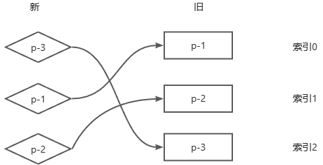

按照之前的Diff算法，则会发生两次DOM移动操作。

第一次移动会把p-1节点移动到p-3后面，第二次移动会把p-2节点移动到p-1后面。最终构成顺序 p-3 p-1 p-2。

但实际上，只需要在旧列表中直接将p-3节点移动到p-1节点之前即可，也就是一次DOM操作即可完成。

为了优化这个过程，就有了**双端Diff算法** , 这是一种同时对新旧两组子节点的端点进行比较的算法。

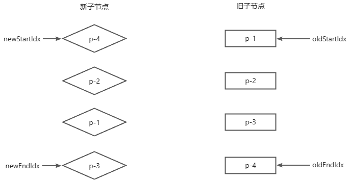

如果用代码来描述，大致如下：
```js
function patchKeyedChildren(n1, n2, container) {
  const oldChildren = n1.children
  const newChildren = n2.children
  // 四个索引值
  let oldStartIdx = 0
  let oldEndIdx = oldChildren.length - 1
  let newStartIdx = 0
  let newEndIdx = newChildren.length - 1
  // 四个索引指向四个虚拟节点
  let oldStartVNode = oldChildren[oldStartIdx]
  let oldEndVNode = oldChildren[oldEndIdx]
  let newStartVNode = newChildren[newStartIdx]
  let newEndVNode = newChildren[newEndIdx]
}
```
有了这些信息之后，即可开始双端比较

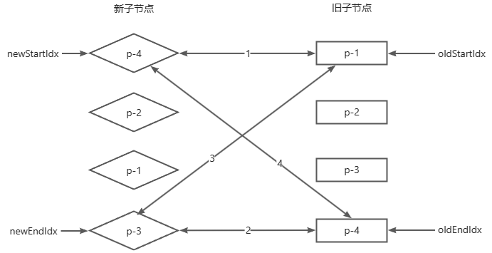

然后将会分为以下四个步骤：
- 比较旧的一组子节点中的第一个子节点p-1与新的一组子节点中的第一个子节点p-4，两者key值不同，不可复用，于是什么都不做
- 比较旧的一组子节点中的最后一个子节点p-4与新的一组子节点的最后一个子节点p-3，两者key值不同，不可复用，于是什么都不做
- 比较旧的一组子节点中的第一个子节点p-1与新的一组子节点中的最后一个子节点p-3，两者key值不同，不可复用，于是什么都不做
- 比较旧的一组子节点中的最后一个子节点p-4与新的一组子节点的第一个子节点p-4，两者key值相同，可以进行DOM复用

找到可复用的节点之后，接下来就是去移动DOM元素，比较细节的说是：**节点p-4原本是最后一个子节点，但在新的顺序中，它变成了第一个子节点，将索引oldEndIndx指向的虚拟节点所对应的真实DOM移动到索引oldStartIdx指向的虚拟节点所对应的真实DOM前面**。

并且需要循环比较，双端Diff的终止条件为 oldStartIdx <= oldEndIdx && newStartIdx <= newEndIdx

代码如下：
```js
function patchKeyedChildren(n1, n2, container) {
  const oldChildren = n1.children;
  const newChildren = n2.children;
  // 四个索引值
  let oldStartIdx = 0;
  let oldEndIdx = oldChildren.length - 1;
  let newStartIdx = 0;
  let newEndIdx = newChildren.length - 1;
  // 四个索引指向四个虚拟节点
  let oldStartVNode = oldChildren[oldStartIdx];
  let oldEndVNode = oldChildren[oldEndIdx];
  let newStartVNode = newChildren[newStartIdx];
  let newEndVNode = newChildren[newEndIdx];

  while(oldStartIdx <= oldEndIdx && newStartIdx <= newEndIdx){
    if (oldStartVNode.key === newStartVNode.key) {
      //....
    } else if (oldEndVNode.key === newEndVNode.key) {
      //....
    } else if (oldStartVNode.key === newEndVNode.key) {
      //....
    } else if (oldEndVNode.key === newStartVNode.key) {
      // 调用patch函数更新节点内容
      // 移动DOM oldEndVNode对应的真实DOM 移动到 oldStartVNode对应的真实DOM 前面
      // 移动DOM之后，移动索引指针
      oldEndVNode = oldChildren[--oldEndIdx];
      newStartVNode = newChildren[++newStartIdx];
    }
  }
}
```
经过上述代码执行之后，新旧两组子节点的状态如下:

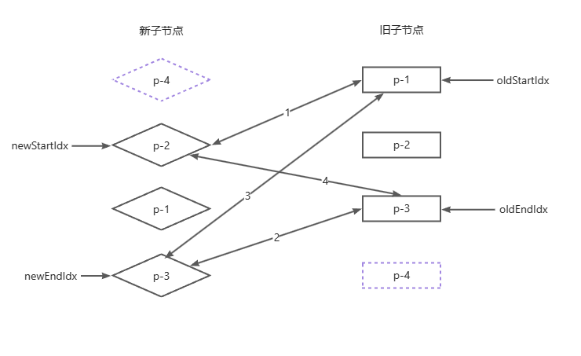

并且真实DOM节点的状态如下：

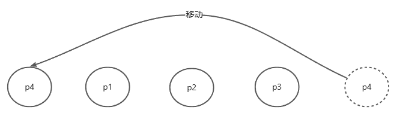

接下来继续按照上述的1234顺序来进行比较，当进行到第2步时，发现新子节点列表中newEndIdx指向的节点和oldEndIdx指向的节点的key相同，说明可以发生复用，发现p-3节点此时在真实DOM的位置和在新子节点列表的位置都是处于末尾，所以本质上不需要移动DOM操作，那么此时状态变为:

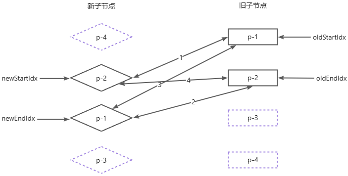

继续比较，走到第3步时，发现新旧子节点的都是p-1，key相同可以复用，在新子节点列表中p-1位于第三个节点，而在此时的真实DOM中p1位于第二个节点，所以需要发生移动

将oldStartIdx对应的真实DOM移动到oldEndIdx对应的真实DOM后面，此时的状态发生为

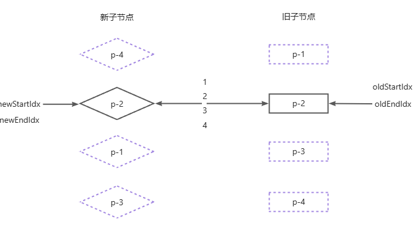

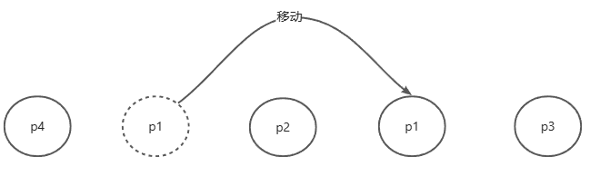

最后一步，比较p-2，不发生移动，此时新子节点列表对应的真实DOM顺序更新完毕，Diff算法也执行完毕了

:::tip
使用双端Diff算法最大的好处就在于可以减少简单Diff算法时的移动操作次数
:::

## 非理想状况下的处理
在上面的例子中，每次while循环中至少都会命中四个步骤中的其中一个，这是较为理想的情况。

假如出现了下面这种情况：

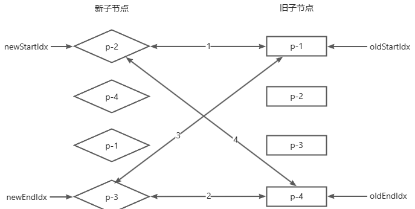

会发现经过1234步骤后，都对不上，节点均不可复用，而且索引也不发生变化，在原有代码中，此时进入了死循环中

对于这样的情况，只能通过增加额外的处理步骤来应对这种非理想的情况。

既然两个头部和尾部的四个节点中都没有可以复用的节点，可以尝试看看非头部和非尾部节点能否进行复用，具体的做法为 **拿新的一组子节点中的头部节点去旧的一组子节点中寻找**，代码如下:
```js
  while (oldStartIdx <= oldEndIdx && newStartIdx <= newEndIdx) {
    if (oldStartVNode.key === newStartVNode.key) {
      //....
    } else if (oldEndVNode.key === newEndVNode.key) {
      //....
    } else if (oldStartVNode.key === newEndVNode.key) {
      //....
    } else if (oldEndVNode.key === newStartVNode.key) {
      //....
    }else{
      // 遍历旧的一组子节点，试图寻找与 newStartVNode 拥有相同key值的节点
      // idxInOld 就是新的一组子节点的头部节点在旧的一组子节点中的索引
      const idxInOld = oldChildren.findIndex(
        node => node.key === newStartVNode.key
      )
    }
  }
```
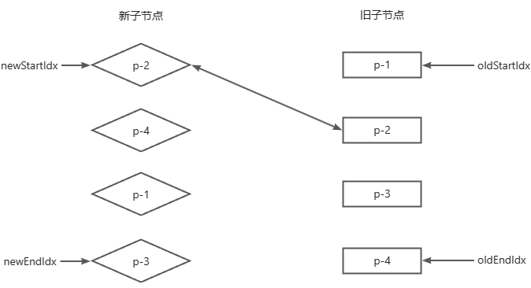

当拿到新的一组子节点的头部节点p-2去旧的一组子节点中查找时，会在索引为1的位置找到可复用的节点。这意味着，节点p-2原本不是头部节点，但在更新之后，它应该变成头部节点。所以需要将节点p-2对应的真实DOM节点移动到当前旧的一组子节点的头部节点p-1所对应的真实DOM节点之前。
```js
  while (oldStartIdx <= oldEndIdx && newStartIdx <= newEndIdx) {
    if (oldStartVNode.key === newStartVNode.key) {
      //....
    } else if (oldEndVNode.key === newEndVNode.key) {
      //....
    } else if (oldStartVNode.key === newEndVNode.key) {
      //....
    } else if (oldEndVNode.key === newStartVNode.key) {
      oldEndVNode = oldChildren[--oldEndIdx];
      newStartVNode = newChildren[++newStartIdx];
    } else {
      const idxInOld = oldChildren.findIndex(
        (node) => node.key === newStartVNode.key
      );
      // inxInOld 大于 0 ，说明找到了可复用的节点，并且需要将其对应的真实DOM移动到头部去
      if(idxInOld > 0){
        // idxInOld 位置对应的 vnode 就是需要移动的节点
        const vnodeToMove = oldChildren[idxInOld]
        // 更新节点内容
        // 移动DOM到 oldStartVNode 之前
        // 由于位置 idxInOld 处的节点所对应的真实DOM已经移动到了其他位置，因此将其设置为 undefined
        oldChildren[idxInOld] = undefined
        // 最后更新newStartIdx 到下一个位置
        newStartVNode = newChildren[++newStartIdx]
      }
    }
  }
```
经过这一步操作之后：

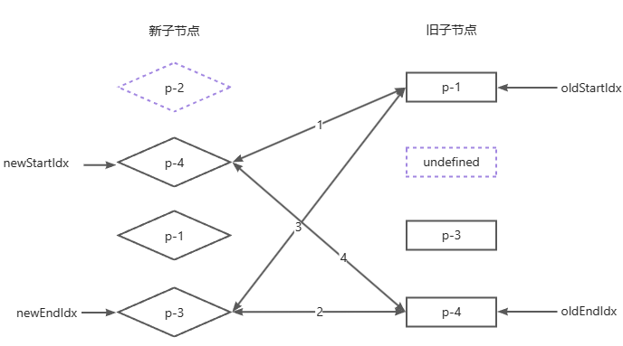

然后接着比较1234步，发现第4步时，p4可复用，对应的p-4真实DOM插入到p-2对应的真实DOM后面，则状态变为以下

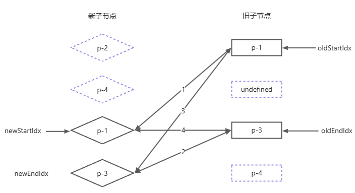

然后接着比较1234步，发现第1步时，p-1可复用，对应的p-1真实DOM插入到p-4对应的真实DOM后面，则状态变为以下

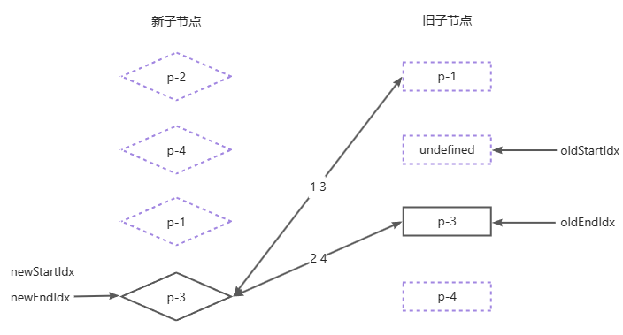

此时发现oldStartIdx指向了undefined，则说明这个节点已经被处理过了，因此不需要再进行处理了，直接跳过，对应的代码也需要修改为:
```js
  while (oldStartIdx <= oldEndIdx && newStartIdx <= newEndIdx) {
    // 增加两个分支 如果头部和尾部节点为undefined，则说明节点已经被处理过了，跳到下一个位置
    if(!oldStartVNode){
      oldStartVn
    }else if(!oldEndVNode){
    
    }
    else if (oldStartVNode.key === newStartVNode.key) {
      //....
    } else if (oldEndVNode.key === newEndVNode.key) {
      //....
    } else if (oldStartVNode.key === newEndVNode.key) {
      //....
    } else if (oldEndVNode.key === newStartVNode.key) {
      oldEndVNode = oldChildren[--oldEndIdx];
      newStartVNode = newChildren[++newStartIdx];
    } else {
      const idxInOld = oldChildren.findIndex(
        (node) => node.key === newStartVNode.key
      );
      if (idxInOld > 0) {
        // idxInOld 位置对应的 vnode 就是需要移动的节点
        const vnodeToMove = oldChildren[idxInOld];
        // 更新节点内容
        // 移动DOM到 oldStartVNode 之前
        // 由于位置 idxInOld 处的节点所对应的真实DOM已经移动到了其他位置，因此将其设置为 undefined
        oldChildren[idxInOld] = undefined;
        newStartVNode = newChildren[++newStartIdx];
      }
    }
  }
```
最后继续比较即可

## 添加新元素
上一节讲述了在非理想情况下，在一轮while循环中，可能不会命中四个步骤中的任何一步。这时会拿新的一组子节点的当前节点去旧的一组子节点中寻找可复用的节点，然而事实是并非每次都能找到旧子节点，如下：

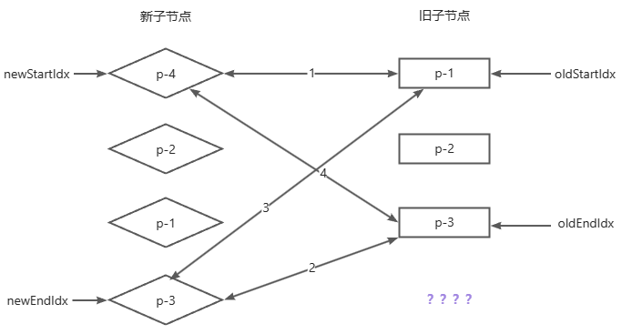

在这种情况下，走过一轮1234后，发现在四个步骤的比较都找不到可复用的节点。于是在新的一组子节点中的头部节点p-4去旧的一组子节点中寻找想吐key值的节点，然而在旧的一组子节点中根本就没有p-4节点，这就说明节点p-4是一个新增节点，应该将它挂载到正确的位置。
```js
      const idxInOld = oldChildren.findIndex(
        (node) => node.key === newStartVNode.key
      );
      if (idxInOld > 0) {
        // idxInOld 位置对应的 vnode 就是需要移动的节点
        const vnodeToMove = oldChildren[idxInOld];
        // 更新节点内容
        // 移动DOM到 oldStartVNode 之前
        // 由于位置 idxInOld 处的节点所对应的真实DOM已经移动到了其他位置，因此将其设置为 undefined
        oldChildren[idxInOld] = undefined;
      }else{
        // 将newStartVNode 作为新节点挂载到头部，使用oldStartVNode.el作为锚点
      }
      newStartVNode = newChildren[++newStartIdx];
```
但是会存在有一种情况，即旧子节点列表已经遍历完了，而新的字节点列表由于有新增节点，所以导致新增加节点被遗漏掉了，就像下图一样:

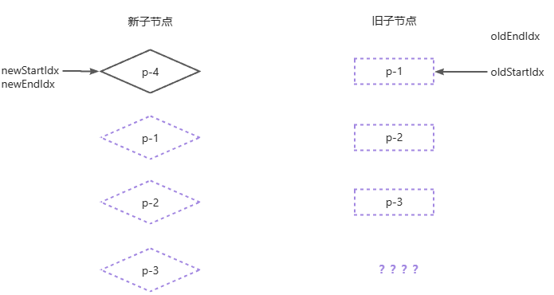

遇到这种情况时由于oldEndIdx的值小于oldStartIdx的值，满足while的循环条件，diff算法结束，但是新增节点p-4节点却被遗漏了，为了弥补这个缺陷，结果如下:

```js
  while (oldStartIdx <= oldEndIdx && newStartIdx <= newEndIdx) {
      // 省略这些代码
  }
  // 循环结束后检查索引值的情况
  if(oldEndIdx < oldStartIdx && newStartIdx <= newEndIdx){
    // 如果满足条件 则说明有新的子节点遗漏 需要挂载它们
    for(let i = newStartIdx ; i <= newEndIdx ;i++){
      // 挂载这些新节点
    }
  }
```
## 移除不存在的元素
显而易见，这种情况发生时，说明新子节点列表中有的节点在旧子节点列表中不存在:

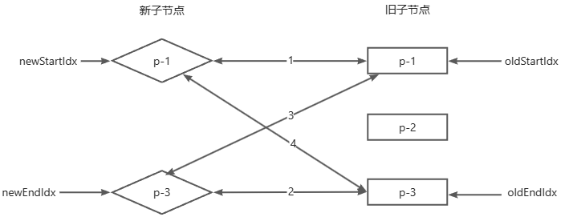

如果按照之前的diff算法进行的话，那么很清楚最后会变成下面的情况:

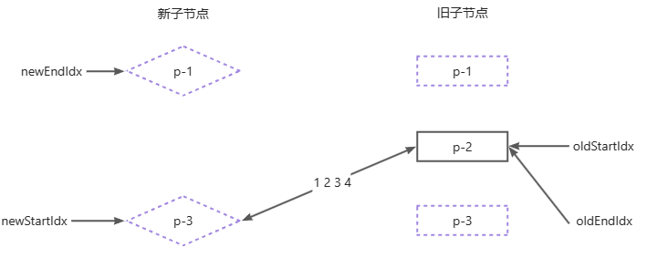

会发现变量newStartIdx的值大于变量newEndIdx的值，p-2被遗漏了，所以需要一些额外操作:

```js
  while (oldStartIdx <= oldEndIdx && newStartIdx <= newEndIdx) {
      // 省略这些代码
  }  
   // 循环结束后检查索引值的情况
  if (oldEndIdx < oldStartIdx && newStartIdx <= newEndIdx) {
    // 如果满足条件 则说明有新的子节点遗漏 需要挂载它们
    for (let i = newStartIdx; i <= newEndIdx; i++) {
      // 挂载这些新节点
    }
  }else if(newEndIdx <  oldStartIdx && oldStartIdx <= oldEndIdx){
    for(let i = oldStartIdx ; i < oldEndIdx ; i++){
      // 移除这些节点
    }
  }
```