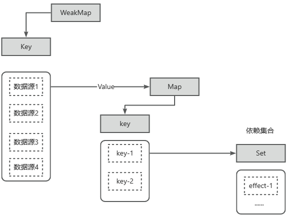

# 响应式系统设计
阅读优秀的框架代码设计，可以学习作者在设计代码上的优秀思路，了解作者在实现自己的思路时考虑到的各种情况，以及各种解决方案...

vue中的响应式系统设计是vue框架的核心之一，接下来这篇分享可以帮助大家仿照vue的实现思路去设计一个简单的响应式系统

## 响应式数据与副作用函数
副作用函数指的是一些会产生副作用的函数，如下代码所示：
```js
function effect(){
  document.body.innerText = 'hello vue3'
}
```
effect函数执行时，它会设置body下的文本内容，如果除了effect函数之外，存在其他函数正在设置或者读取文本内容时，effect函数的执行就直接或间接的影响到了其他函数的执行，也就是产生了副作用，副作用很容易产生。

例如修改一个全局变量就是副作用：
```js
let val = 1

function effect(){
  val = 2
}
```
什么是响应式数据？副作用函数effect会设置body下的文本内容，其值为obj.text，当obj.text的值发生变化时，希望effect会重新执行。

```js
const obj = {text : 'hello world'}
function effect(){
  document.body.innerText = obj.text
}
```
理想情况下，如果修改obj的text字段，副作用函数自动重新执行一次，那么数据源obj就可以被称为是响应式数据。但遗憾的是，现在的数据源obj是明显的“死”数据，不具有响应性。

## 响应式数据的基本实现
实现的基本思路在于：
- 当副作用函数 effect 执行时，会触发字段的obj.text的**读取**操作
- 当修改obj.text的值时，会触发字段obj.text的**设置**操作

为了使得数据具有响应性，就不得不去监听数据的“读”“写”操作，然后执行对应的副作用函数，在Vue2中，采用了`Object.defineProperty`函数来实现，但在最新的Vue3中，可以使用代理对象`Proxy`来实现：

```js
// 存放副作用函数的集合
const bucket = new Set()

// 数据源
const data = {text:'hello vue'}

// 利用proxy将数据进行代理
const dataProxy = new Proxy(data,{
  // 拦截读取操作 target指向数据源 key为数据源上的属性
  get(target, key){
    // 将副作用函数放进集合中
    bucket.add(effect)
    return target[key]
  },
  // 拦截写操作 newVal代表更改的新值
  set(target, key, newVal){
    // 设置属性值
    target[key] = newVal
    // 将副作用函数取出来进行执行
    bucket.forEach(fn => fn())
    // 修改成功之后返回true
    return true
  }
})

// 副作用函数
function effect(){
  document.body.innerText = dataProxy.text
}

// 执行副作用函数
effect()

// 5秒后自动修改
setTimeout(()=>{
  dataProxy.text = "hello reactive"
},5000)
```

## 开始设计响应式系统
在vue的真实实现中，存在一个函数用于专门来注册副作用函数，哪怕副作用函数是一个匿名函数，也可以被正确的收集到集合中

```js
// 全局副作用函数
let activeEffect

// 副作用函数捕获函数
function effectRegister(fn){
  activeEffect = fn
  // 执行后会触发一次读取操作
  fn()
}
```
在上述代码中有一个“亮点”，也就是在注册副作用函数时,副作用函数在赋值给全局变量的同时也被自动执行了一次，这次执行至关重要，因为执行副作用函数也就意味着数据源的读取操作被触发了，一旦触发了读取操作，那么就可以从全局变量activeEffect中取到对应的副作用函数，从而记录到集合中
:::tip
这就是怎么将副作用函数进行收集的！
:::

修改一下Proxy中的逻辑:
```js
const dataProxy = new Proxy(data,{
  get(target, key){
    // 将副作用函数放进集合中
    if(activeEffect) bucket.add(activeEffect)
    return target[key]
  },
  set(target, key, newVal){
    target[key] = newVal
    bucket.forEach(fn => fn())
    return true
  }
})
```
但是这样的设计会存在一个小bug，如果向数据源新增一个不存在的属性，依然会导致副作用函数执行

```js
// 副作用函数
function effect(){
  console.log('effect函数触发')
  document.body.innerText = dataProxy.text
}

// 注册副作用函数
effectRegister(effect)

setTimeout(()=>{
  dataProxy.noExist = 'noExist'
},2000)
```
为什么说增加一个不存在的属性导致副作用函数执行是错误的，因为理论上来说，副作用函数中**涉及**到的字段是obj的text字段，正确的逻辑是text的值改变 触发 副作用函数执行 ，而不是增加一个和副作用函数无关的属性 触发 副作用函数执行。

这个bug存在的根本原因在于手机副作用函数的集合`bucket`只和数据源产生了关系，**忽略了没有在副作用函数与被操作的数据源目标字段之间建立明确的联系**，要正确的触发副作用函数的执行，和如下的三个角色关系很大：
- 被操作的代理对象 obj
- 被操作的字段名 text
- 副作用函数 effectFn

那么这三者的关系可以说有这么几种：

- 多个副作用函数读取同一个对象的字段
```text
obj
 |___text
    	|___ effectFn1
      |___ effectFn2
      |___ ......
```

- 一个副作用函数读取了同一个对象的多个字段
```text
obj
 |___text1
    	|___effectFn1

 |___text2
    	|___effectFn1

 |___ ......
```
- 不同副作用函数读取了不同的对象的字段
```text
obj
 |___text1
    	|___effectFn1

 |___text2
    	|___effectFn2

 |___ ......
```
总体来说，这其实是一个树形结构，显然需要重新设计收集副作用函数的存储集合的数据结构：
```js
// 存放副作用函数的集合
const bucket = new WeakMap()

// 利用proxy将数据进行代理
const dataProxy = new Proxy(data,{
  // 拦截读取操作 target指向数据源 key为数据源上的属性
  get(target, key){
    // 没有activeEffect，就直接return出去
    if(!activeEffect) return target[key]
    // 根据 target 从集合中取出depsMap，这就是依赖dep，它是 key ---> effects
    let depsMap = bucket.get(target)
    // 如果不存在 depsMap ，那么就新建一个Map与target关联
    if(!depsMap) bucket.set(target,(depsMap = new Map()))
    // 获取字段对应的依赖列表
    let deps = depsMap.get(key)
    // 如果不存在依赖列表，那么就新建一个Set与key关联
    if(!deps) depsMap.set(key,(deps = new Set()))
    // 收集依赖
    deps.add(activeEffect)
    return target[key]
  },
  // 拦截写操作 newVal代表更改的新值
  set(target, key, newVal){
    // 设置属性值
    target[key] = newVal
    // 将副作用函数取出来进行执行
    const depsMap = bucket.get(target)
    if(!depsMap) return
    const deps = depsMap.get(key)
    deps && deps.forEach(fn => fn())
    // 修改成功之后返回true
    return true
  }
})
```
这次设计出的数据结构，分别使用了`WeakMap`，`Map`,`Set`

并且可以得到这么一个结构：WeakMap存储的是数据源对象，而对应的值是一个Map结构，而Map结构中存放的是key--->deps的关系，Map的键是数据源对象的key，Map的值是一个装载副作用函数的Set。如图所示：



这就是一个简单的响应式设计系统，最后对于这一块的代码做一步封装，将在get拦截函数里编写的把副作用函数收集到依赖集合的这部操作封装为一个`track`表示追踪，触发副作用函数重新执行的逻辑封装到`trigger`中，表示触发

最后的代码设计如下👇👇👇

```js
// 数据源
const data = {text:'hello vue'}

// 全局副作用函数
let activeEffect

// 副作用函数捕获函数
function effectRegister(fn){
  activeEffect = fn
  // 执行后会触发一次读取操作
  fn()
}

// 存放副作用函数的集合
const bucket = new WeakMap()

// 利用proxy将数据进行代理
const dataProxy = new Proxy(data,{
  // 拦截读取操作 target指向数据源 key为数据源上的属性
  get(target, key){
    track(target, key)
    return target[key]
  },
  // 拦截写操作 newVal代表更改的新值
  set(target, key, newVal){
    // 设置属性值
    target[key] = newVal
    trigger(target,key)
    // 修改成功之后返回true
    return true
  }
})

// track函数
function track(target, key){
      // 没有activeEffect，就直接return出去
    if(!activeEffect) return 
    // 根据 target 从集合中取出depsMap，这就是依赖dep，它是 key ---> effects
    let depsMap = bucket.get(target)
    // 如果不存在 depsMap ，那么就新建一个Map与target关联
    if(!depsMap) bucket.set(target,(depsMap = new Map()))
    // 获取字段对应的依赖列表
    let deps = depsMap.get(key)
    // 如果不存在依赖列表，那么就新建一个Set与key关联
    if(!deps) depsMap.set(key,(deps = new Set()))
    // 收集依赖
    deps.add(activeEffect)
}

// trigger函数
function trigger(target,key){
      // 将副作用函数取出来进行执行
    const depsMap = bucket.get(target)
    if(!depsMap) return
    const deps = depsMap.get(key)
    deps && deps.forEach(fn => fn())
}

// 副作用函数
function effect(){
  console.log('effect函数触发')
  document.body.innerText = dataProxy.text
}

// 注册副作用函数
effectRegister(effect)

// 5秒后自动修改
setTimeout(()=>{
  dataProxy.text = "hello reactive"
},5000)
```