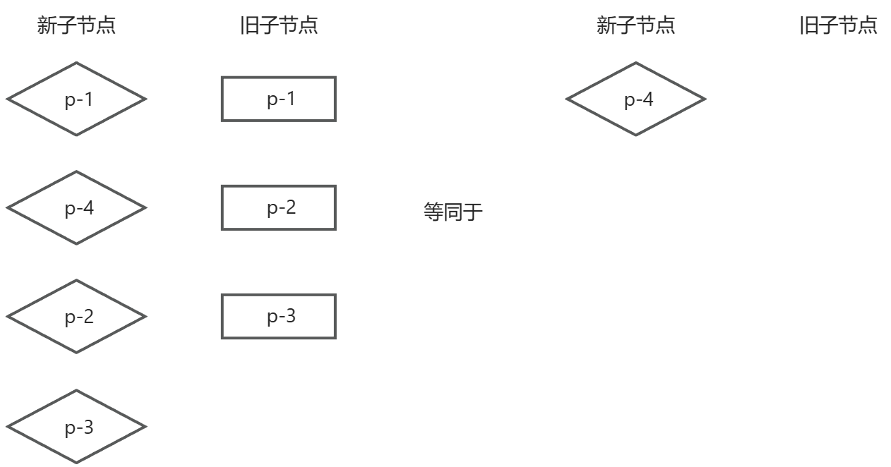
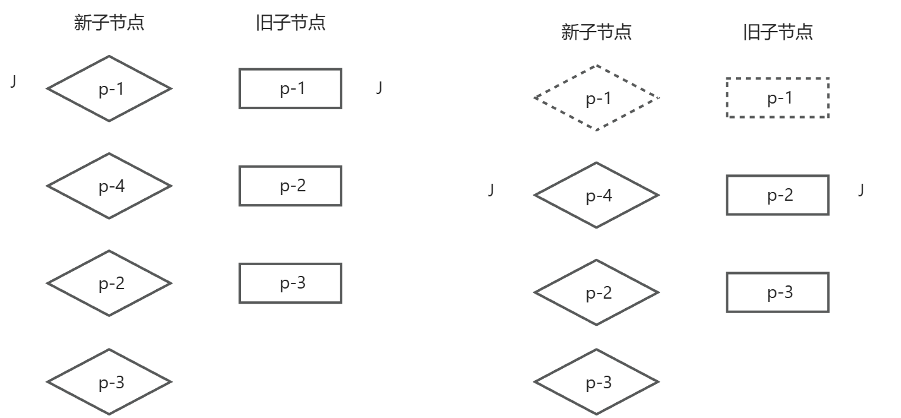
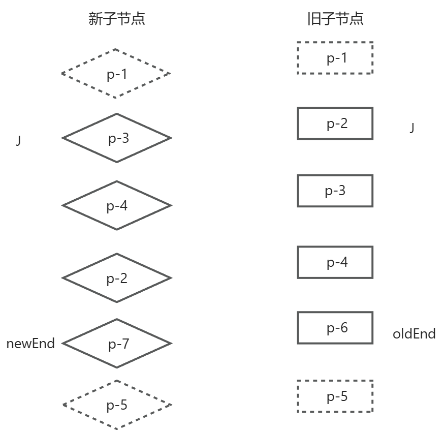
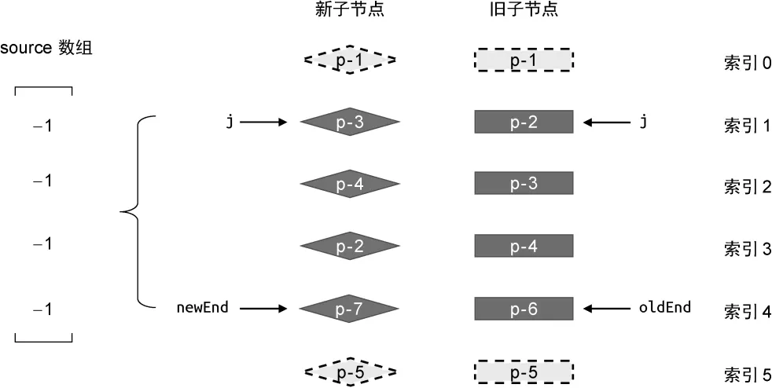
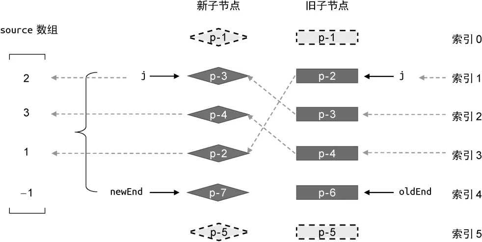
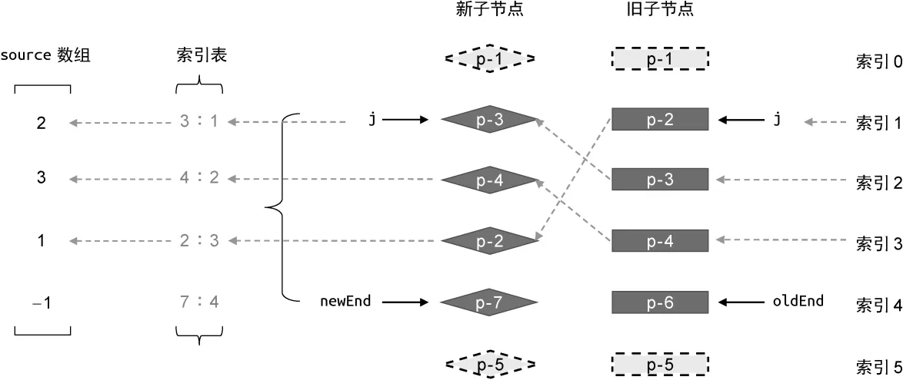
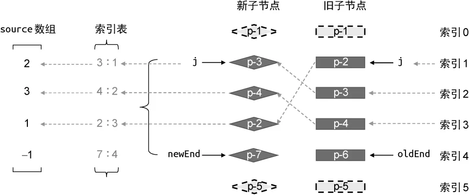

# 快速Diff
## 处理前置后置元素

不同于简单Diff算法和双端Diff算法，快速Diff算法包含预处理步骤，其实是借鉴了纯文本Diff算法的思路。

在纯文本Diff算法中，存在对两段文本进行预处理的过程。可以先对它们进行全等比较。

```js
if(text1 === text2) return
```
如果两段文本全等，那么就没必要进入核心Diff算法的步骤了。除此之外，预处理过程是还会处理两段文本相同的前缀和后缀，假设如下两端文本:
```text
TEXT1: I use vue for app development
TEXT2: I use react for app development

// 对于TEXT1和TEXT2中相同的内容，是不需要进行核心Diff的
// 真正需要Diff的文本是

TEXT1: vue
TEXT2: react
```
而快速Diff就可以借鉴这种类似的预处理步骤，比如下面的例子：

两组子节点具有相同的前置节点 p-1，以及相同的后置节点 p-2 和 p-3，那么真正需要做Diff的就只有 p-4 这个节点。



对于相同的前置节点和后置节点，由于它们在新旧两组子节点中的相对位置不变，所以是不需要先移动它们，但还是需要在它们之间进行打补丁更新。

对于前置节点，可以建立索引 j，其初始值为0，用于指向两组子节点的开头：**然后开启一个 while 循环，让索引 j 递增，直到遇到不相同的节点为止**

```js
function patchKeyedChildren(n1,n2,container){
  const newChildren = n2.children
  const oldChildren = n1.children
  // 索引 j 指向新旧两组子节点的开头，处理相同的前置节点
  let j = 0
  let oldVNode = oldChildren[j]
  let newVNode = newChildren[j]
  // while 循环向后遍历，直到遇到不同的 Key 值的节点为止
  while(oldVNode.key === newVNode.key){
      // 调用patch函数进行更新
      patch(oldVNode,newVNode,container)
      // 更新索引j，使其递增
      j++
      oldVNode = oldChildren[j]
      newVNode = newChildren[j]
  }
}
```


:::tip
然后再开启一个while循环，这个循环要求从后向前开始遍历，和处理前序节点的逻辑一样，不再过多赘述
:::

最后就只用处理那些不属于前置和后置的节点了，这些节点可能要么是新增的，那么就进行挂载，也有可能是就节点多余的，那么就要进行卸载。

## 一个更复杂的例子
假设现在新旧两组子节点的顺序如下：
- 旧的一组子节点：p-1，p-2，p-3，p-4，p-6，p-5
- 新的一组子节点：p-1，p-3，p-4，p-2，p-7，p-5

根据上面的逻辑，发现只有相同的前缀p-1和后缀p-5，那么经过预处理之后的变化如下：



经过这次预处理之后，无论是新的一组子节点，还是旧的一组子节点，都有部分节点未经过处理，接下来的任务就是：
- 判断是否有节点需要移动，以及应该如何移动
- 找出那些需要被添加和移除的节点
当相同的前置节点和后置节点都被处理完毕之后，索引 j 和 newEnd，还有 oldEnd 会不满足下面两个条件中的任何一个：
- j > oldEnd && j <= newEnd
- j > newEnd && j <= oldEnd
设计思路是这样的：维护一个数组source，它的长度等于新的一组子节点在经过预处理之后剩余未处理节点的数量，并且要求 source 中的每个初始值都是 -1。


```js
const count = newEnd - j + 1
const souce = new Array(count)
source.fill(-1)
```
**而这个source数组的真正用途在于去记录新的一组子节点中的节点在旧的一组子节点中的位置索引，并在后面计算出一个最长递增子序列，并且用于辅助DOM移动的操作。**



:::tip
找不到的节点就在source数组中标记为-1
:::
完成source数组的填充，也只需要两层for循环
```js
const count = newEnd - j + 1
const souce = new Array(count)
source.fill(-1)

// oldStart 和 newStart 分别为起始索引，即j

const oldStart = j
const newStart = j

// 遍历旧的一组子节点
for(let i = oldStart ; i <= oldEnd ; i++){
  const oldVNode = oldChidren[i]
  // 遍历新的一组子节点
  for(let k = newStart ; k <= newEnd ; k++){
    const newVNode = newChildren[k]
    // 找到拥有相同key值得可复用节点
    if(oldVNode.key === newVNode.key){
        // 调用 patch 进行更新
        patch(oldVNode, newVNode, container)
        // 更新source数组
        source[k - newStart] = i
    }
  }
}
```
当然开两个for循环属于是有点暴力了，并且在节点较多时可能会影响性能，为了解决这个问题，实际上可以为新的一组子节点遍历一次构建一张索引表，用来存储节点的key和节点索引位置之间的映射，如图：


那么可以先遍历一遍新子节点列表构成一张索引表，然后再遍历一遍旧子节点列表去查找对应的索引去更新Source数组，这样做的好处在于将时间复杂度降低为了On

快速填充的代码就如下：
```js
     const keyIndex = {}
15   for(let i = newStart; i <= newEnd; i++) {
16     keyIndex[newChildren[i].key] = i
17   }
18   // 遍历旧的一组子节点中剩余未处理的节点
19   for(let i = oldStart; i <= oldEnd; i++) {
20     oldVNode = oldChildren[i]
21     // 通过索引表快速找到新的一组子节点中具有相同 key 值的节点位置
22     const k = keyIndex[oldVNode.key]
23
24     if (typeof k !== 'undefined') {
25       newVNode = newChildren[k]
26       // 调用 patch 函数完成更新
27       patch(oldVNode, newVNode, container)
28       // 填充 source 数组
29       source[k - newStart] = i
30     } else {
31       // 没找到
32       unmount(oldVNode)
33     }
```
在上述流程执行完毕之后，source 数组已经完全填充完毕了，接下来需要思考的概念是如何判断节点是否需要移动，那么这个思路其实和简单Diff算法的思路类似，可以新增两个变量moved和pos。前者的初始值为false，代表是否需要移动节点，后者的初始值为0，代表遍历旧的一组子节点的过程中遇到的最大索引值 k。如果在遍历的过程遇到的索引值呈现出递增趋势，那么就不需要移动节点，反之就需要移动
```js
const count = newEnd - j + 1  // 新的一组子节点中剩余未处理节点的数量
08   const source = new Array(count)
09   source.fill(-1)
10
11   const oldStart = j
12   const newStart = j
13   // 新增两个变量，moved 和 pos
14   let moved = false
15   let pos = 0
16
17   const keyIndex = {}
18   for(let i = newStart; i <= newEnd; i++) {
19     keyIndex[newChildren[i].key] = i
20   }
21   for(let i = oldStart; i <= oldEnd; i++) {
22     oldVNode = oldChildren[i]
23     const k = keyIndex[oldVNode.key]
24
25     if (typeof k !== 'undefined') {
26       newVNode = newChildren[k]
27       patch(oldVNode, newVNode, container)
28       source[k - newStart] = i
29       // 判断节点是否需要移动
30       if (k < pos) {
31         moved = true
32       } else {
33         pos = k
34       }
35     } else {
36       unmount(oldVNode)
37     }
38   }
39 }
```
## 最长增长子序列
当知道一些节点需要被移动时，那么就要开始移动这些节点了。

那么可以根据source数组计算出一个最长的递增子序列，用于DOM操作，比如计算出的source数组为`[2,3,1,-1]`，那么这个数组的最长递增子序列的值为`[2,3]`，它的索引值就为`[0,1]`



可以看到这个最长递增子序列拥有一个非常重要的意义，那就是：**在新的一组子节点中，重新编号后索引值为0和1的这两个子节点在更新前后的相对顺序没有发生变化。**所以索引为0和1的新子节点是不需要进行移动的。