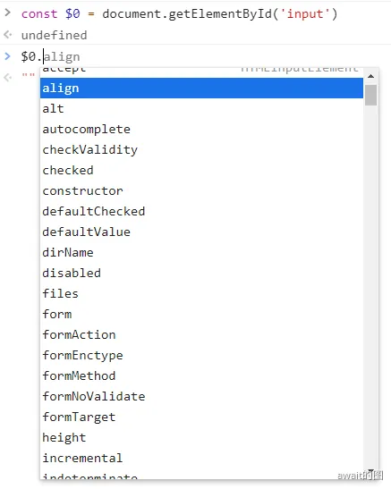

# 挂载与更新

## 挂载子节点和元素属性
假设现在存在这样的html结构
```js
    <div>
      <p>hello</p>
    </div>
```
它其实是可以被抽象为js结构
```js
  const vnode = {
    type:'div',
    children:[
      {
        type:'p',
        children:'hello'
      }
    ]
  }
```
为了完成子节点的渲染工作，把前文的自定义渲染器createRenderer中的mountElement进一步做完善，之前定义的mountElement只能完成单个节点的渲染，并且渲染内容也只能是文本节点，下面做一进步改进:
```js
  function patch(n1, n2, container) {
    if (!n1) {
      mountElement(n2, container);
    } else {
      // 旧节点存在时，新旧比较
    }
  }

  function mountElement(vnode, container) {
    const el = createElement(vnode.type);
    if (typeof vnode.children === "string") {
      setElementText(el, vnode.children);
    } else if (Array.isArray(vnode.children)) {
      // 如果children是一个数组，则遍历每一个字节点，并调用 patch 函数进行挂载
      vnode.children.forEach((c) => {
      // 此时null代表第一次挂载
        patch(null, child, el);
      });
    }
    insert(el, container);
  }
```
- 传递给 patch 函数的第一个参数为`null`。因为是挂载阶段，没有旧vnode，所以传递`null`即可。当patch函数执行时，就会递归调用`mountElement`函数完成挂载
- 传递给 patch 函数的第三个参数是挂载点。由于正在挂载的子元素是div标签的子节点，所以需要把刚刚创建的div元素作为挂载点。这样保证这些子节点挂载到正确位置

可以知道的是一个节点除了拥有自己的子节点之外，自身也有属性，这些属性往往是比较通用的，例如 *id、class之类的...*，当然也有一些属性是标签特有的，比如src属性，只有img和video等标签拥有，所以渲染一个元素的属性是比较复杂，这里暂时讨论基本的通用属性的处理，假定通过props字段来描述dom结构
```js
const vnode = {
  type: "div",
  props: {
    id: "foo",
  },
  children: [
    {
      type: "p",
      props: {
        id:'bar'
      },
      children: "hello",
    },
  ],
};
```
相当于给div标签和p标签分别定义了名为foo和bar的id。

同理，也需要更新一下mountElement函数
```js
  function mountElement(vnode, container) {
    const el = createElement(vnode.type);
    if (typeof vnode.children === "string") {
      setElementText(el, vnode.children);
    } else if (Array.isArray(vnode.children)) {
      vnode.children.forEach((c) => {
        patch(null, c, el);
      });
    }
    
    // 处理节点上的 属性
    if (vnode.props) {
      for (const key in vnode.props) {
        el.setAttribute(key, vnode.props[key]);
      }
    }
    insert(el, container);
  }
```
实际上，设置属性并未这么简单，因为尚未明确这么两个重要概念 **HTML Attributes** 和 **DOM Properties**

## HTML Atrributes 与 DOM Properties
理解 HA(HTML Attributes) 和 DP(DOM Properties) 的区别是非常重要的，这能有助于更好的设计虚拟节点

从最简单的input标签说起：
```html
<input id="my-input" type="text" value="hello" />
```
HA就是指定义在HTML标签上的属性*(id,type,value)*，当这个input被解析为成功dom元素之后，可以发现这个元素包含很多的属性



这些属性就被称为DP，很多HA在DOM对象上都有同名的DP对应，例如`id="my-input"`对应`el.id`，`type="text"`对应`el.type`，但不是每一个属性对应的都是同名：
- HA的class属性`class="foo"` 对应 DP的`className el`.className
- DP的textContent 没有对应的HA属性
同时，通过DP修改属性值时，HA的属性值不一定会发生变化，看这样的例子:
```js
const oInput = document.getElementById('my-input')
// ...
// 用户修改了输入框的值为bar
// ...

console.log(oInput.value) // 'bar' 
console.log(oInput.getAttribute('value')) // 'foo'
console.log(oInput.defaultValue) // 'foo'
```
这说明一个关系：**一个HA可能关联了多个DP , 就比如value = 'foo' 关联了 el.value 和 el.defaultValue 一样**

实际上，其实有一个墨守成规的原则：HA往往总是用于设置初始值，DP总是用于动态的去赋值

那么，就可以得到一条核心设计原则：**HA的作用是设置与之对应的DP的初始值**

## 正确地设置元素属性
一般来说，对于普通的HTML文件来说，浏览器解析HTML文件之后，会自动分析HA并设置对应的DP。但对于vue文件中的模板来说，将不会被解析，所以需要框架来做这一步操作，现在以一个button按钮来举例
```js
// <button disable>Button</button>
const button = {
  type:'button',
  props:{
    disabled:''
  },
  children:'button'
}
```
这里的disabled设置为了空字符串，如果只是简单粗暴的用setAttribute函数调用，则相当于
```js
el.setAttribute('disabled','')
```
这里的disabled设置为了空字符串，如果只是简单粗暴的用setAttribute函数调用，则相当于
```js
el.setAttribute('disabled','')
```
这么做确实没问题，界面上的按钮确实是被禁用了，但如果用户定义的js结构为
```js
const button = {
  type:'button',
  props:{
    disabled:false
  },
  children:'button'
}
```
则相当于
```js
el.setAttribute('disabled',false)
```
我们会发现，出问题了，页面上的按钮被禁用了。这是因为setAttribute设置的函数值总是会被字符串化，所以等价于
```js
el.setAttribute('disabled','false')
//el.disabled属性值只关心布尔类型
```
这显然违背了用户的原意，所以可以优先设置DP
```js
el.disabled = false
```
但是如果是最初的例子，则会变为
```js
el.disabled = ''
```
这样又出错了，disabled属性只关心布尔值，所以' '会被转换为 false，违背了用户想要禁用按钮的原意

这样就出现了矛盾，setAttribute和直接设置DP都不能同时满足两种情况，所以不得不进行特殊处理，修改mountElement代码如下：无论是使用setAttribute函数还是直接设置元素的DOM Properties，都存在缺陷。要彻底解决这个问题，必须做特殊处理，即优先设置元素的DOM Properties，但当值为空字符串时，需要手动将值矫正为true。

```js
  function mountElement(vnode, container) {
    const el = createElement(vnode.type);
    if (typeof vnode.children === "string") {
      setElementText(el, vnode.children);
    } else if (Array.isArray(vnode.children)) {
      vnode.children.forEach((c) => {
        patch(null, c, el);
      });
    }
    
    // 处理节点上的 属性
    if (vnode.props) {
      for (const key in vnode.props) {
        if (key in el) {
          const type = typeof el[key];
          const value = vnode.props[key];
          // 特殊处理
          if (type === "boolean" && value === "") {
            el[key] = true;
          } else {
            el[key] = value;
          }
        } else {
          // 如果HA的属性与DP上没有同名匹配，使用setAttribute设置属性
          el.setAttribute(key, vnode.props[key]);
        }
      }
    }
    insert(el, container);
  }
```
如代码所示，检查每一个vnode.props中的属性，查看是否存在对应的DOM Properties，如果存在优先设置DP。同时对布尔类型的DOM Properties做了值得矫正，即当要设置得值为空字符串时，将其矫正为布尔值true。如果vnode.props中的属性不具有对应的DOM Properties时，仍然使用setAttribute函数完成属性的设置

但是存在某种意外情况，有一些少数的DP属性是只读的，如以下代码
```html
<form id="form1"></form>
<input form="form1">
```
有时候input.from这个属性就是只读的，因此只能通过setAttribute函数去设置它，所以不得不再次修改mountElement的代码
```js
 
 function sholdSetAsProps(el,key,value){
    // 特殊处理
    if(key === 'form' && el.tagName === 'INPUT') return false
   //兜底
    return key in el
  }

  function mountElement(vnode, container) {
    const el = createElement(vnode.type);
    if (typeof vnode.children === "string") {
      setElementText(el, vnode.children);
    } else if (Array.isArray(vnode.children)) {
      vnode.children.forEach((c) => {
        patch(null, c, el);
      });
    }
    if (vnode.props) {
      for (const key in vnode.props) {
          const value = vnode.props[key];
          // 使用 shouldSetAsProps 函数判断是否作为 DP 来设置
          if(sholdSetAsProps(el,key,value)){
            const type = typeof el[key];
            if(type === 'boolean' && value === ''){
              el[key] = true
            }else{
              el[key] = value
            }
          }else {
          el.setAttribute(key, vnode.props[key]);
        }
      }
    }
    insert(el, container);
  }
```
这样就大功告成，当然特殊情况远远不止这些，只需要在后期迭代中不断完善，程序也会变得越来健壮。

最后，可以发现大量的属性设置和判断本质上也是DOM元素的操作，因此推荐把属性设置相关操作也提取到渲染器选项中，最终代码如下
```js

const broswerAPIs = {
  // createElement setElementText insert ...
  patchProps(el, key, oldValue, nextValue) {
    if (sholdSetAsProps(el, key, nextValue)) {
      const type = typeof el[key];
      if (type === "boolean" && nextValue === "") {
        el[key] = true;
      } else {
        el[key] = nextValue;
      }
    } else {
      el.setAttribute(key, nextValue);
    }
  },
};

// 工具函数 判断是否应该正确设为属性
function sholdSetAsProps(el, key, value) {
  if (key === "form" && el.tagName === "INPUT") return false;
  return key in el;
}

// 挂载元素函数
  function mountElement(vnode, container) {
    const el = createElement(vnode.type);
    if (typeof vnode.children === "string") {
      setElementText(el, vnode.children);
    } else if (Array.isArray(vnode.children)) {
      vnode.children.forEach((c) => {
        patch(null, c, el);
      });
    }
    if (vnode.props) {
      for (const key in vnode.props) {
        const nextValue = vnode.props[key];
        patchProps(el, key, null, nextValue);
      }
    }
    insert(el, container);
  }
```
## Class的处理
Vue对class的处理是做了强化的，因为在使用Vue时，常常可以看到这些使用方法
- 为class指定字符串
```html
/** 字符串形式的class **/
<p class="foo bar">hello class</p>
```
其对应的vnode为
```js
// 字符串形式
const vnode = {
  type:'p'
  props:{
    class:'foo bar'
  }
	children:'hello class'
}
```
- 为class指定对象
```html
// 对象形式的class
<p :class="{foo:true,bar:true}">hello class</p>
```
其对应的vnode为
```js
const vnode = {
  type:''
  props:{
    class:{foo:ture,bar:false}
  }
	children:'hello class'
}
```
- 为class指定数组
```html
<p :class="['foo',{bar:true}]">hello class</p>
```
对应的vnode为
```js
const vnode = {
  type:''
  props:{
    class:{'foo',{bar:true}}
  }
	children:'hello class'
}
```
不论class的值是什么形式，总得来说，最后应该统一设值为字符串形式。新增加一个函数，它可以将这几种类名方式进行归一化为字符串形式
```js
// class类归一化处理函数
function normalizeClass(classValue) {
  const normalizeClassValue = [];
  function formatString(value) {
    normalizeClassValue.push(value);
  }
  function formatObject(value) {
    for (let key in value) {
      if (value[key]) normalizeClassValue.push(key);
    }
  }
  function formatArray(value) {
    value.forEach((item) => {
      if (typeof item === "string") {
        formatString(item);
      } else if (
        Object.prototype.toString.call(item) === "[object Object]"
      ) {
        formatObject(item);
      }
    });
  }
  if (typeof classValue === "string") {
    formatString(classValue);
  } else if (
    Object.prototype.toString.call(classValue) === "[object Object]"
  ) {
    formatObject(classValue);
  } else if (Array.isArray(classValue)) {
    formatArray(classValue);
  }
  return normalizeClassValue.join(" ");
}
```
现在考虑得是，应该通过什么方式去设置class呢？现在浏览器提供了这么三种方式:
|设置class的方式|
|------|
|el.className|
|el.setAttribute|
|classList|

测试下来，el.className得表现性能是最好的，因此我们应该新增一个函数normalizeClass和修改mountElement函数

```js
  patchProps(el, key, oldValue, nextValue) {
    if(key === 'class'){
      // 如果key为class 归一化处理后设置
      el.className = normalizeClass(nextValue) || ''
    }else if (sholdSetAsProps(el, key, nextValue)) {
      const type = typeof el[key];
      if (type === "boolean" && nextValue === "") {
        el[key] = true;
      } else {
        el[key] = nextValue;
      }
    } else {
      el.setAttribute(key, nextValue);
    }
  }
```
大搞成功！

## 卸载操作
卸载操作发生在更新阶段，更新指的是，初次挂载完成之后，后续渲染会触发更新，如下:
```js
renderer.render(vnode,document.querySelector('#app'))
renderer.render(newVnode,document.querySelector('#app'))
```
更新有几种情况。当后续调用render函数渲染空内容null时，如下面的代码所示：
```js
renderer.render(vnode,document.querySelector('#app'))
renderer.render(null,document.querySelector('#app'))
```
首次挂载之后，后续渲染时如果传递了null作为新vnode,则意味着什么都不渲染，就需要卸载之前渲染的内容，可以看到之前的这一块的代码实现是如下这样写的
```js
  function render(vnode, container) {
    if (vnode) {
      patch(container._vnode, vnode, container);
    } else {
      if (container._vnode) {
        // 卸载, 清空容器
        container.innerHTML = "";
      }
    }
    container._vnode = vnode;
  }
```
这种清空容器方式，是非常简单暴力是不严谨，原因有三点:
- 容器的内容可能是由某个或多个组件渲染的，当卸载操作发生时，应该正确地调用这些组件的beforeUnmount、unmount等生命周期函数
- 即使内容不是由组件渲染的，有的元素存在自定义指令，应该在卸载操作发生时正确执行对应的指令钩子函数
- 使用innerHTML清空容器元素内容的另一个缺陷是，绑定在DOM元素上的事件处理函数不会被移除绑定

所以正确的卸载方式是，根据vnode对象获取与其相关联的真实DOM元素，然后使用原生DOM操作方法将该DOM元素移除，所以，还需要在vnode与真实DOM元素之间建立联系，修改mountElement函数
```js
    function mountElement(vnode, container) {
      // 在vnode初次挂载时 将vnode.el 与 真实DOM 关系在一起
      const el = vnode.el = document.createElement(vnode.type);

      // ....
    }
```
这样vnode与真实DOM元素之间就建立了联系，可以通过 vnode.el 获取到对应的 真实DOM元素。

这样就可以正确的卸载操作了
```js
  function render(vnode, container) {
    if (vnode) {
      patch(container._vnode, vnode, container);
    } else {
      if (container._vnode) {
        	unmount(container._vnode)
      }
    }
    container._vnode = vnode;
  }

function unmount(vnode){
  // 获取el的父元素
	const parent = vnode.el.parentNode
  // 移除元素
  if(parent) parent.removeChild(vnode.el)
}
```
并将卸载操作封装为一个名为unmount函数

## 区分Vnode的类型
在之前的elementMount函数中，空了一段更新内容没写，如下：
```js
function patch(n1, n2, container) {
    if (!n1) {
      mountElement(n2, container);
    } else {
        // 更新
    }
  }
```
patch函数中的n1和n2分别代表旧vnode和新vnode。如果旧vnode存在，则需要在新旧vnode之间更新。但在具体执行更新操作之前，必须保存新旧vnode所描述的内容相同，比如:
```js
// 旧vnode
const vnode = {
  type:'p'
}
// 新vnode
const vnode = {
  type:'input'
}
```
这个例子就是新旧vnode所描述的内容不同，即基本的type属性的值不同。这就不存在更新的意义了，正确的更新操作是，先将p元素卸载，再将input元素挂载到容器中，所以patch函数需要调整:
```js

  function patch(n1, n2, container) {
    // 如果n1存在 ， 则对比 n1 和 n2 的类型
    if(n1 && n1.type !== n2.type){
      // 如果新旧 vnode 的类型不同，则直接将旧vnode卸载
      unmount(n1)
      n1 = null
    }
  	// 挂载新元素
    if (!n1) {
      mountElement(n2, container);
    } else {
    	// 更新
    }
  }
```
先把n1给卸载了，再把新的n2给挂载上去

即使新旧vnode描述的内容相同，仍然需要进一步确认它们的类型是否相同。因为一个vnode的type属性可以用来描述普通标签，也可以描述组件，对于不同类型的vnode，更新处理的方式都不同
```js
  function patch(n1, n2, container) {
    if (n1 && n1.type !== n2.type) {
      unmount(n1);
      n1 = null;
    }
    // 代码运行到这里 证明n1和n2所描述的内容相同
    const { type } = n2;
    // 如果n2.type的值是字符串类型 则它描述的是普通标签元素
    if (typeof type === "string") {
      if (!n1) {
        mountElement(n2, container);
      } else {
        // 更新
        patchElement(n1,n2)
      }
    }
    else if(typeof type === 'object'){
      // 如果n2.type的值的类型是对象，则它描述的是组件
    }else if(type === 'xxx'){
      // 处理其他类型的vnode
    }
  }
```
在之前的描述中，一直假设vnode的类型是普通标签元素。但严谨的做法是根据node.type进一步确认具体类型，如果vnode.type值字符串类型，则描述的是普通标签元素，这时就可以调用mountElement或patchElement完成挂载和更新操作，如果vnode.type的值的类型是对象，说明这是一个组件，那么就需要特殊的更新组件的挂载和更新方法。

## 事件处理
这一块将描述如何在虚拟节点中描述事件，将事件添加到DOM元素上。

事件可以视作为一种特殊的属性，因此，以字符串on开头的属性都视作事件。
```js
const oldNode = {
  type: "p",
  props: {
    class: "foo bar",
    // 使用 onXxx 描述事件
    onClick: () => {
      alert("clicked");
    },
  },
  children: "hello oldNode",
};
```
只要检测到事件属性，就调用 addEventListener 函数来绑定事件即可:
```js
  patchProps(el, key, oldValue, nextValue) {
    if (/^on/.test(key)) {
      const fnName = key.slice(2).toLowerCase();
      el.addEventListener(fnName, nextValue);
    } else if (key === "class") {
      //...
    } else if (sholdSetAsProps(el, key, nextValue)) {
    	//...
    } else {
      //...
    }
  }
```
如果事件需要更新，按照一般的思路，需要先移除之前添加的事件处理函数，然后再将新的事件处理函数绑定到DOM元素上。但在vue中使用了一种更加巧妙的方式去实现这个事件更新: 先绑定一个伪造的事件处理函数invoker，然后把真正的事件处理函数设置为invoker.value属性的值。这样更新事件的时候，没必要每次都去解绑和绑定新事件，只需要简单的替换invoker.value的值即可:
```js
    if (/^on/.test(key)) {
      // 获取为该元素伪造的事件处理函数 invoker
      let invoker = el._evi;
      // onClick => click
      const fnName = key.slice(2).toLowerCase();
      if (nextValue) {
        if (!invoker) {
          //如果没有 invoker 则绑定一个伪造元素
          invoker = el._evi = (e) => {
            invoker.value(e);
          };
          // 真正的执行函数赋值给了 invoker.value
          invoker.value = nextValue;
          el.addEventListener(fnName, invoker);
        } else {
          // 如果已经存在invoker了，直接替换即可
          invoker.value = nextValue;
        }
      } else if (invoker) {
        el.removeEventListener(fnName, invoker);
      }
    } else if (key === "class") {
      //...
    } else if (sholdSetAsProps(el, key, nextValue)) {
      //...
    } else {
      //...
    }
```
上诉代码也就做了两件事:
- 先从el._vei中读取对应的invoker，如果invoker不存在，则将伪造的invoker作为事件处理函数，并将它缓存到el._evi属性中
-  把真正的事件处理函数赋值给invoker.value属性，然后把伪造的invoker函数作为事件处理函数绑定到元素上，事件触发时，实际上执行的是伪造的事件处理函数，在内部间接执行了真正的事件处理函数`invoker.value(e)`

除了在性能方面方面做了优化，实际上，伪造事件的处理函数的作用不止于此，还能**解决事件冒泡与事件更新之间相互影响的问题**。

目前这种实现方式，依然存在问题。现在将事件处理函数缓存在el._evi属性中，问题是，在同一时刻只能缓存一个事件处理函数。这意味着，会发生事件覆盖的问题。例如同时给元素绑定click和mouseover事件时，mouseover事件可以覆盖click事件

目前这种实现方式，依然存在问题。现在将事件处理函数缓存在el._evi属性中，问题是，在同一时刻只能缓存一个事件处理函数。这意味着，会发生事件覆盖的问题。例如同时给元素绑定click和mouseover事件时，mouseover事件可以覆盖click事件：

```js
      const invokers = el._evi || (el._evi = {});
      let invoker = invokers[key];
      const fnName = key.slice(2).toLowerCase();
      if (nextValue) {
        if (!invoker) {
          invoker = el._evi[key] = (e) => {
            invoker.value(e);
          };
          invoker.value = nextValue;
          el.addEventListener(fnName, invoker);
        } else {
          invoker.value = nextValue;
        }
      } else if (invoker) {
        el.removeEventListener(fnName, invoker);
      }         
```
另外，一个元素不仅可以绑定多种类型的事件，还可以绑定多个事件处理函数，那么描述多个事件的vnode模板也应该发生变化
```js
      const vnode = {
        type: "button",
        props: {
          id: "foo",
          disabled: false,
          class: ["btn-shape", "btn-background"],
          // onClick可以触发多个事件
          onClick: [
            () => {
              alert("按钮点击了一次！");
            },
            () => {
              alert("系统触发了一次！");
            },
          ],
          onMouseenter: () => {
            console.log("鼠标移入");
          },
        },
        children: "按钮",
      }
```
对应的绑定函数也应该发生变化：
```js
      let invoker = invokers[key];
      const fnName = key.slice(2).toLowerCase();
      if (nextValue) {
        if (!invoker) {
          invoker = el._evi[key] = (e) => {
            // 如果发现nextValue是一组函数队列，则将这些函数挨个进行执行
            if(Array.isArray(invoker.value)){
              invoker.value.forEach(f => f(e))
            }else{
              invoker.value(e);
            }
           
          };
          
          invoker.value = nextValue;
          el.addEventListener(fnName, nextValue);
        } else {
          invoker.value = nextValue;
        }
      } else if (invoker) {
        el.removeEventListener(fnName, invoker);
      }
```
## 事件冒泡与更新时机问题
假设现在有这么一个奇怪的例子：
```js
01 const { effect, ref } = VueReactivity
02
03 const bol = ref(false)
04
05 effect(() => {
06   // 创建 vnode
07   const vnode = {
08     type: 'div',
09     props: bol.value ? {
10       onClick: () => {
11         alert('父元素 clicked')
12       }
13     } : {},
14     children: [
15       {
16         type: 'p',
17         props: {
18           onClick: () => {
19             bol.value = true
20           }
21         },
22         children: 'text'
23       }
24     ]
25   }
26   // 渲染 vnode
27   renderer.render(vnode, document.querySelector('#app'))
28 })
```
详细观察`div`元素和`p`元素的特点：
- div元素：它的prop对象的值是由一个三元表达式决定的。在首次渲染时，由于`bol.value`值为false，所以它的值是一个空对象
- p元素：它一来就具有 click 点击事件，并且当点击它时，事件处理函数会将bol.value的值设置为true

**当首次渲染后，点击p元素，其实会触发父级div元素的click事件的事件处理函数执行**

这是因为：

当点击p元素时，绑定到它身上的click事件处理函数会执行，于是`bol.value`的值被改为`true`。由于`bol`是一个响应公式数据，所以当它的值发生变化时，会触发副作用函数重新执行。由于此时的`bol.value`已经变为true了，所以在更新阶段，渲染器会为父级元素绑定`click`事件处理函数。当更新完成之后，点击事件才从 `p` 元素冒泡到父级 `div` 元素。由于此时 `div` 元素已经绑定了 `click` 事件的处理函数。

为了可以处理这个问题，可以观察到一个问题：事件触发的时间其实要早于事件处理函数被绑定事件。这意味着**当一个事件触发时，目标元素上还没有绑定相关的事件处理函数，所以可以屏蔽所有绑定事件晚于事件触发事件的事件处理函数的执行**

```js
patchProps(el, key, prevValue, nextValue) {
02   if (/^on/.test(key)) {
03     const invokers = el._vei || (el._vei = {})
04     let invoker = invokers[key]
05     const name = key.slice(2).toLowerCase()
06     if (nextValue) {
07       if (!invoker) {
08         invoker = el._vei[key] = (e) => {
09           // e.timeStamp 是事件发生的时间
10           // 如果事件发生的时间早于事件处理函数绑定的时间，则不执行事件处理函数
11           if (e.timeStamp < invoker.attached) return
12           if (Array.isArray(invoker.value)) {
13             invoker.value.forEach(fn => fn(e))
14           } else {
15             invoker.value(e)
16           }
17         }
18         invoker.value = nextValue
19         // 添加 invoker.attached 属性，存储事件处理函数被绑定的时间
20         invoker.attached = performance.now()
21         el.addEventListener(name, invoker)
22       } else {
23         invoker.value = nextValue
24       }
25     } else if (invoker) {
26       el.removeEventListener(name, invoker)
27     }
28   } else if (key === 'class') {
29     // 省略部分代码
30   } else if (shouldSetAsProps(el, key, nextValue)) {
31     // 省略部分代码
32   } else {
33     // 省略部分代码
34   }
35 }
```

## 更新子节点
回顾之前的子节点是如何挂载上的：
```js
    function mountElement(vnode, container) {
      const el = (vnode.el = document.createElement(vnode.type));

      if (typeof vnode.children === "string") {
        el.innerText = vnode.children;
      } else if (Array.isArray(vnode.children)) {
        vnode.children.forEach((child) => {
          patch(null, child, el);
        });
      }

    	if(node.props){
        for(const key in vnode.props){
          patch(el,key,null,vnode.props[key])
        }
      }
      
      insert(el, container)
    }
```
在挂载子节点，需要区分其类型:
- 如果vnode.children是字符串，则说明元素具有文本子节点
- 如果vnode.children是数组，则说明元素具有多个子节点
对于一个元素来说，它的子节点无非以下三种情况:
- 没有子节点，vnode.children为null
- 具有文本子节点，此时vnode.children的值为字符串
- 其他情况，无论单个元素子节点，还是多个子节点(元素和文本组合)，都通过数组来表示

例如这样的代码：

用js抽象表示如下：
```js
vnode1 = {
  type:'div',
  children:null
}

vnode2 = {
  type:'div',
  children:'some text'
}

vnode3 = {
  type:'div',
  children:[
    {type:'p'},
    'Some Text'
  ]
}
```
此时，在子节点更新这一情况上，就会出现以下这几种情况:


落实到代码上，实际并不需要完全覆盖这些情况

```js
    // 更新元素
    function patchElement(n1, n2) {
      const el = (n2.el = n1.el);
      const oldProps = n1.props;
      const newProps = n2.props;
      // 第一步更新props
      for (const key in newProps) {
        if (newProps[key] != oldProps[key]) {
          // 更新发生变化的属性...
        }
      }
      for (const key in oldProps) {
        if (!(key in newProps)) {
          // 去掉没有的属性...
        }
      }
      // 第二步更新children
      patchChildren(n1, n2, el);
    }
```
如同上述代码所示，更新子节点是对一个元素进行更新的最后一步操作。将其操作都封装到patchElement函数中，并将新旧vnode以及当前正在被更新的DOM元素el作为参数传递给它。
```js
  // 更新子节点
  function patchChildren(n1,n2,container){
    // 判断新子节点的类型是否是文本节点
    if(typeof n2.children === 'string'){
      if(Array.isArray(n1.children)){
        n1.children.forEach(c => unmount(c))
      }
      setElementText(container,n2.children)
    }else if(Array.isArray(n2.children)){
      if(Array.isArray(n1.children)){
        // 这里涉及核心 Diff 算法
      }else{
        setElementText(container,'')
        n2.children.forEach(c => patch(null,c,container))
      }
    }else{
      // 如果n1是一组节点，则将旧节点的字节点全部卸载
      if(Array.isArray(n1.children)){
        n1.children.forEach(c => unmount(c))
      }else if(typeof n1.children === 'string'){
        setElementText(container,'')
      }
    }
  }
```
在上面的代码第11行，没有给出具体的代码，这是因为将涉及到后面的核心算法**Diff**

## 文本节点和注释节点
在前文中，用vnode.type来描述元素的名称，它是一个字符串类型的值

下面讨论如何用虚拟DOM描述更多类型的真实DOM。其中比较常见的两种类型文本节点和注释节点，如:
```html
<div>
  <!--注释节点-->
  文本节点
</div>
```
前文规定，如果node.type的值是字符串类型，则代表它描述的是普通标签，但注释节点和文本节点却不同于普通标签节点，它们不具有标签名称，所以需要人为创建一些唯一标识，并将其作为注释节点和文本节点的type属性值:
```js
const Text = Symbol()
const Comment = Symbol()
const textVnode = {
  // 描述文本节点
  type:Text,
  children:'我是文本节点'
}
const commentVnode = {
  // 描述注释节点
  type:Comment,
  children:'我是注释节点'
}
```
patch的部分逻辑为下
```js
const Text = Symbol();
const Comment = Symbol();

if (typeof type === "string") {
      if (!n1) {
        mountElement(n2, container);
      } else {
        // 更新
      }
    } else if (typeof type === "object") {
      // 如果n2.type的值的类型是对象，则它描述的是组件
    } else if (type === Text) {
      // 处理Text文本节点
      // 如果新的vnode的类型是Text，则说明该vnode描述的是文本节点
      if(!n1){
        const el = n2.el = document.createTextNode(n2.children)
        container.appendChild(el)
      }else{
        const el = n2.el = n1.el
        if(n2.children !== n1.children){
          el.nodeValue = n2.children
        }
      }
    }
```
注释节点的处理方案和文本节点的处理大同小异，不再详细阐述

## Fragment
注释节点的处理方案和文本节点的处理大同小异，不再详细阐述
```html
<template>
  <li>1</li>
  <li>2</li>
  <li>3</li>
</template>
```
前文规定，如果node.type的值是字符串类型，则代表它描述的是普通标签，但注释节点和文本节点却不同于普通标签节点，它们不具有标签名称，所以需要人为创建一些唯一标识，并将其作为注释节点和文本节点的type属性值
```js
const Text = Symbol()
const Comment = Symbol()
const textVnode = {
  // 描述文本节点
  type:Text,
  children:'我是文本节点'
}
const commentVnode = {
  // 描述注释节点
  type:Comment,
  children:'我是注释节点'
}
```
patch的部分逻辑如下：
```js
const Text = Symbol();
const Comment = Symbol();

if (typeof type === "string") {
      if (!n1) {
        mountElement(n2, container);
      } else {
        // 更新
      }
    } else if (typeof type === "object") {
      // 如果n2.type的值的类型是对象，则它描述的是组件
    } else if (type === Text) {
      // 处理Text文本节点
      // 如果新的vnode的类型是Text，则说明该vnode描述的是文本节点
      if(!n1){
        const el = n2.el = document.createTextNode(n2.children)
        container.appendChild(el)
      }else{
        const el = n2.el = n1.el
        if(n2.children !== n1.children){
          el.nodeValue = n2.children
        }
      }
    }
```
注释节点的处理方案和文本节点的处理大同小异，不再详细阐述

## Fragment
Fragment是vue3中新增加的一个vnode类型，在vue2中是无法实现下面这样的组件模板的
```html
<template>
  <li>1</li>
  <li>2</li>
  <li>3</li>
</template>
```
因为在vue2中，组件的模板是不允许存在多个根节点的，但是Vue3通过Fragment虚拟节点去描述
```js
const Fragment = Symbol()
const vnode = {
  type:Fragment,
  children:[
    {type:'li',children:'text 1'},
    {type:'li',children:'text 2'},
    {type:'li',children:'text 3'}
  ]
}
```
对于Fragment类型的vnode来说，它的children存储的内容就是模板中的所有根节点。**从本质上来说，渲染Fragment与渲染普通元素的区别在于，Fragment本身没有任何内容，只需要渲染其子节点即可，同理，当卸载Fragment组件时，由于Fragment组件并不会渲染任何的真实DOM，所以只需要遍历它的children数组，并将其的子节点逐个卸载即可。**