# 模板编译器
## Vue编译器
编译器本质上只是一段程序，它的作用在于将“一种语言A”翻译成“一种语言B”。其中，语言A叫作源代码，语言B叫做目标代码。将源代码翻译为目标代码这一过程就统称为编译，标准的编译过程通常包含：词法分析，语法分析，语义分析，中间代码生成，优化，目标代码生成等步骤。

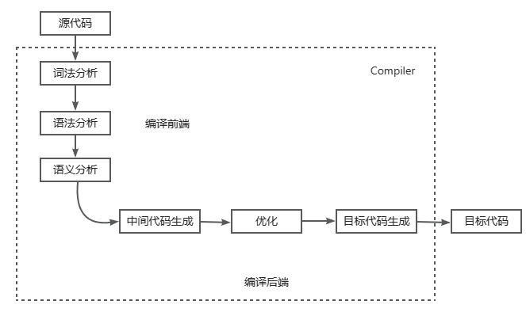

实际上，整个编译过程被分为了编译前端和编译后段两个板块，对于像Vue.js这样的特定场景模板编译器来说，源代码，源代码就是组件模版，而目标代码是能够在浏览器平台上运行的JavaScript代码，或其他拥有JavaScript运行时平台的代码。

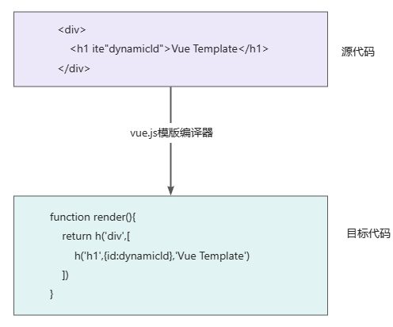

Vue模版编译器的目标代码就是渲染函数。详情而言，vue模版编译器会首先对模版进行词法分析和语法分析，得到模版AST。接着，将模版AST转换成JavaScript AST。最后根据JavaScript AST生成  javascript 代码，即渲染函数代码，如下图所展示

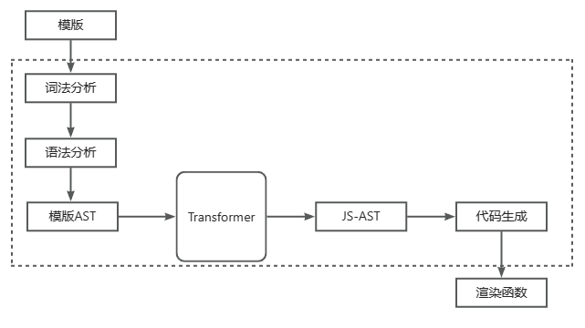

模版抽象语法树，顾名思义就是用来描述模版的抽象语法树，假设有这样的模版:

```html
<div>
  <h1 v-if="ok">Vue Template</h1>
 </div>
```
这段模板会编译为如下的AST
```js
const ast = {
  type:'Root',
  children:[
    {
      type:'Element',
      tag:'div',
      children:[
        {
          type:'Element',
          tag:'h1',
          props:[
            {
              type:'Directive',
              name:'if',
              exp:{
                type:'Expression',
                content:'ok'
              }
            }
          ]
        }
      ]
    }
  ]
}
```
AST其实就是一个具有层级结构的对象。模版AST具有与模版同构的嵌套结构，每一棵AST都有一个逻辑上的根节点，其类型为Root。模版中真正的根节点则作为Root节点的children存在，如果上诉的AST，可以的得出以下结论:
- 不同类型的节点上通过节点的type属性进行区分
- 标签节点的子节点存储在children数组中
- 标签节点的属性节点和指令节点会存储在props数组中
- 不同类型的节点会使用不同的对象属性进行描述。例如指令节点拥有 name 属性，用于表达指令的名称，而表达式节点拥有content属性，用来描述表达式的内容

可以通过封装一个parse函数来完成对模版的词法分析和语法分析来得到模版AST，用代码来表示即为：
```js
const template = `
	<div>
    <h1 v-if="ok">Vue Template</h1>
  </div>
`

const templateAST = parse(template)
```
 有了模版AST后，就可以进行语义分析，语义分析主要也是这些方面:
 - 检查v-else 指令是否存在相符得v-if
 - 分析属性值是否是静态的，是否为常量
 - 分析属性值是否是静态的，是否为常量
 - ......

 再得到模板AST之后，还需要将模板AST转换为JavaScript AST。因为Vue模板编译器的最终目的还是去生成渲染函数，而渲染函数本质上是JavaScript代码

 接下来就可以封装 transform 函数来完成模板AST到 JavaScript AST 的转换工作

 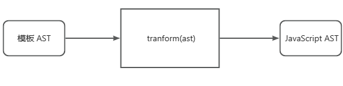

 这也可以用代码来简述：
 ```js
 const templateAST = parse(template)
 const jsAST = transform(templateAST)
 ```

 有了JavaScript AST 之后，就可以根据它生成渲染函数了，这里引入`generate`函数，它能将渲染函数的代码以字符串形式返回，并存储再code 常量中去
 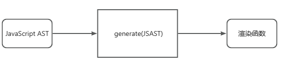
 ```js
 const jsAST = transform(templateAST)
 const code = generate(jsAST)
 ```
 总结一下，Vue.js模版编译器的基本结构和工作流程，其主要构成由：
 - 用来将模版字符串解析为模版AST的解析器（parser）
 - 用来将模版 AST 转换为 JavaScript AST 的转换器（transformer）
 - 用来根据 JavaScript AST 生成渲染函数代码的生成器（generator）

 ## Parser 实现原理
 Parser的入参是字符串模版，解析器会将住个读取字符串模版中的字符，并且根据一定的规则将整个字符串切割为一个个Token（词法记号）。

 对于这样的模板
 ```html
 <p>Vue</p>
 ```
 Parser 会将其切割为三个 Token:
 - 开始标签：`<p>`
 - 文本节点：`<Vue>`
 - 结束标签：`</p>`

 ### 有限状态机
 Parser依靠一种**有限状态机**来进行切割，所谓的“有限状态”，指的是有限个状态，而状态机会通过挨个读取字符的输入，在不同的状态之间迁移，其过程如下所示：
 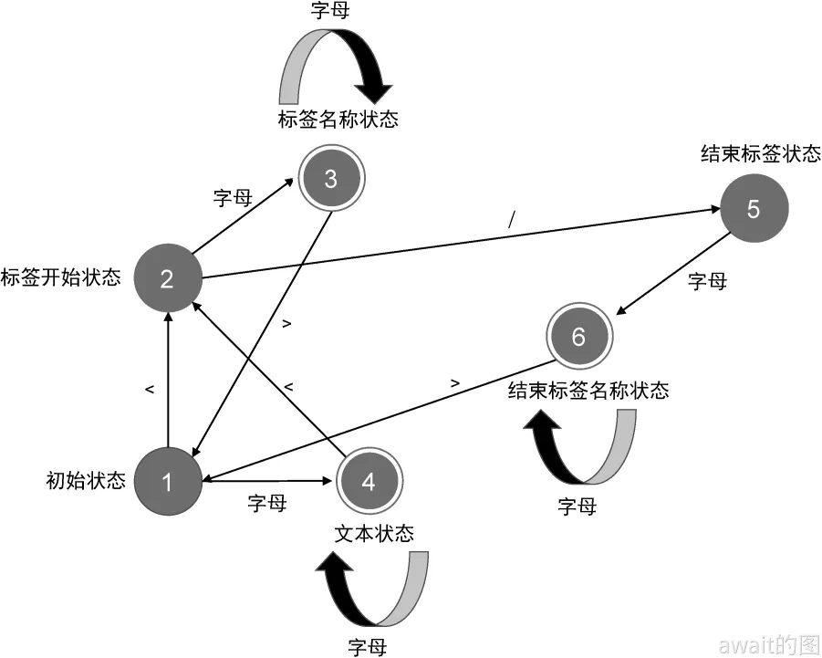

 按照有限状态自动机的迁移过程，其实可以很容易编写对应的代码，有限状态机可以完成对模版的**标记化（tokenized）**，最终会得到一系列的Token。
 ```js
  // 定义状态机的状态
 const State = {
   initial: 1,    // 初始状态
   tagOpen: 2,    // 标签开始状态
   tagName: 3,    // 标签名称状态
   text: 4,       // 文本状态
   tagEnd: 5,     // 结束标签状态
   tagEndName: 6  // 结束标签名称状态
 }
 // 一个辅助函数，用于判断是否是字母
 function isAlpha(char) {
   return char >= 'a' && char <= 'z' || char >= 'A' && char <= 'Z'
 }

 // 接收模板字符串作为参数，并将模板切割为 Token 返回
 function tokenize(str) {
   let currentState = State.initial // 状态机的当前状态：初始状态
   const chars = [] // 用于缓存字符
   const tokens = [] // 并作为函数的返回值返回
   // 使用 while 循环开启自动机，只要模板字符串没有被消费尽，自动机就会一直运行
   while(str) {
     const char = str[0]
     switch (currentState) { // switch 语句匹配当前状态
       case State.initial: // 状态机当前处于初始状态
         if (char === '<') { // 遇到字符 <
           currentState = State.tagOpen // 1. 状态机切换到标签开始状态
           str = str.slice(1) // 2. 消费字符 <
         } else if (isAlpha(char)) { // 1. 遇到字母，切换到文本状态
           currentState = State.text // 2. 将当前字母缓存到 chars 数组
           chars.push(char)
           str = str.slice(1) 
         }
         break
       case State.tagOpen: // 状态机当前处于标签开始状态
         if (isAlpha(char)) { 
           currentState = State.tagName // 遇到字母，切换到标签名称状态
           chars.push(char) // 将当前字符缓存到 chars 数组
           str = str.slice(1) 
         } else if (char === '/') {
           currentState = State.tagEnd // 遇到字符 /，切换到结束标签状态
           str = str.slice(1)  
         }
         break
       case State.tagName: // 状态机当前处于标签名称状态
         if (isAlpha(char)) { // 遇到字母，由于当前处于标签名称状态，所以不需要切换状态，
           chars.push(char) 
           str = str.slice(1) 
         } else if (char === '>') {
           currentState = State.initial // 遇到字符 >，切换到初始状态
           // 同时创建一个标签 Token，并添加到 tokens 数组中
           // 注意，此时 chars 数组中缓存的字符就是标签名称
           tokens.push({
             type: 'tag',
             name: chars.join('')
           })
           chars.length = 0 /
           str = str.slice(1)
         }
         break
       case State.text: // 状态机当前处于文本状态
         if (isAlpha(char)) {
           chars.push(char) 
           str = str.slice(1) 
         } else if (char === '<') {
           currentState = State.tagOpen // 遇到字符 <，切换到标签开始状态
           // 2. 从 文本状态 --> 标签开始状态，此时应该创建文本 Token，并添加到 tokens 数组
           // 注意，此时 chars 数组中的字符就是文本内容
           tokens.push({
             type: 'text',
             content: chars.join('')
           })
           chars.length = 0
           str = str.slice(1)
         }
         break
       case State.tagEnd: // 状态机当前处于标签结束状态
         if (isAlpha(char)) {
           currentState = State.tagEndName // 遇到字母，切换到结束标签名称状态
           chars.push(char)
           str = str.slice(1)
         }
         break
       // 状态机当前处于结束标签名称状态
       case State.tagEndName:
         if (isAlpha(char)) {
           chars.push(char) // 遇到字母，不需要切换状态，但需要将当前字符缓存到 chars 数组
           str = str.slice(1) // 消费当前字符
         } else if (char === '>') {
           currentState = State.initial // 遇到字符 >，切换到初始状态
           // 2. 从 结束标签名称状态 --> 初始状态，应该保存结束标签名称 Token
           // 注意，此时 chars 数组中缓存的内容就是标签名称
           tokens.push({
             type: 'tagEnd',
             name: chars.join('')
           })
           chars.length = 0
           str = str.slice(1)
         }
         break
     }
   }

   // 最后，返回 tokens
   return tokens
 }
 ```
 总而言之，经过Parser之后，可以得到三个Token
 ```js
 const tokens = tokenize(`<p>Vue</p>`)
 // [
  // { type: 'tag', name: 'p' },        // 开始标签
 //  { type: 'text', content: 'Vue' },  // 文本节点
 //  { type: 'tagEnd', name: 'p' }      // 结束标签
 //]
 ```
 :::tip
 状态机的工作原理就是协助模版编译器将模版字符串切割为一个个Token的过程，进而可以构建一颗AST，当然上诉的代码非常粗糙，可以通过正则表达式做进一步的精简 tokenize 函数的代码。**虽然说，正则表达式的本质就是有限状态机～**
 :::

 有了tokens之后，就可以做构造模版AST了

 ### 栈构造模板AST
 Vue中的模版构造AST是一件比较容易的事，因为HTML作为一种标记语言，他的格式非常固定，标签之间相互嵌套，本身就是一种树型结构。比如：
 ```html
 <div><p>Vue</p><p>Template</p></div>
 ```
 它对应的模板AST为：
 ```js
  const ast = {
     type: 'Root', // AST 的逻辑根节点
       children: [
         { // 模板的 div 根节点
             type: 'Element',
               tag: 'div',
               children: [ // div 节点的第一个子节点 p
                 {
                     type: 'Element',
                       tag: 'p', // p 节点的文本节点
                     children: [
                         {
                         type: 'Text',
                           content: 'Vue'
                       }
                 ]
               }, // div 节点的第二个子节点 p
         {
             type: 'Element',
               tag: 'p', // p 节点的文本节点
             children: [
                 {
                 type: 'Text',
                   content: 'Template'
               }
           ]
         }
       ]
     }
   ]
 }
 ```
 由于AST在结构上和模版其实是“同构”的，同样具有树形结构

 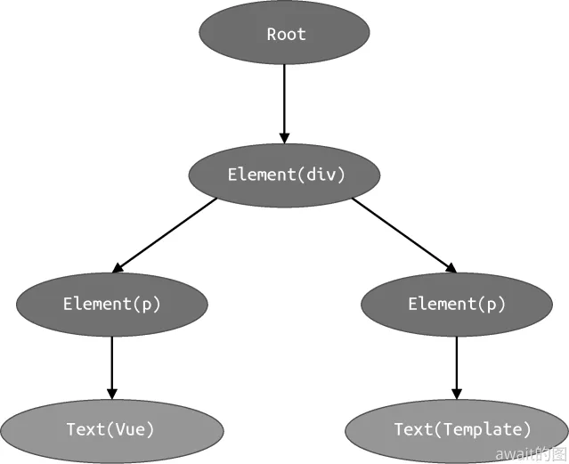

 由于AST是树型结构，而`tokens`结果树扁平的数值，所以需要使用tokens列表去构建一个AST。

 本质上来说就是对Token列表进行扫描的过程，在这个过程中会维护一个 elementStack，这个栈将用于维护元素间的父子关系，每次遇到一个开始标签节点，就构造一个 Element 类型的 AST 节点，并将其压入到栈中。每当遇到一个结束标签节点，就将当前栈顶的节点弹出。这样，栈顶的节点将始终充当副节点的角色，扫描过程中遇到的所有节点，都会作为当前栈顶节点的子节点，并添加到栈顶节点的 children 属性下。

 其步骤如下顺序所示：

 - 左侧为Token列表，从上到下的顺序扫描，中间为栈Stack，右侧为AST树，可以看到最初都只有一个Root
 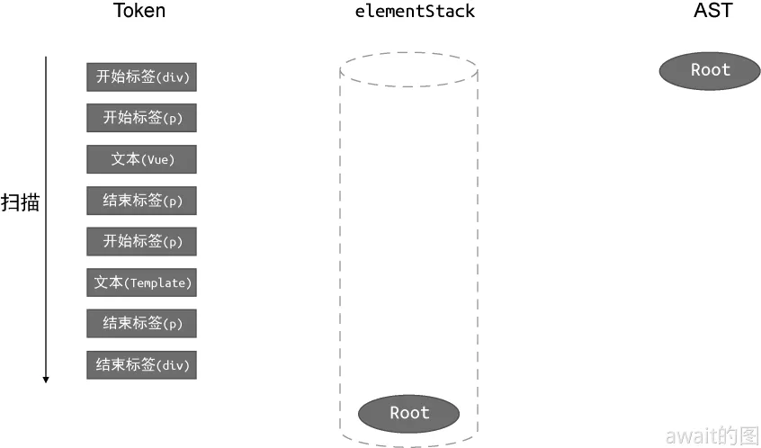
 - 当前扫描到的Token是一个开始标签节点，因此创建一个类型为 Element 的 AST 节点，然后将该节点作为栈顶节点的子节点，并将新建的Element节点作为Root根节点的子节点添加到AST中去
 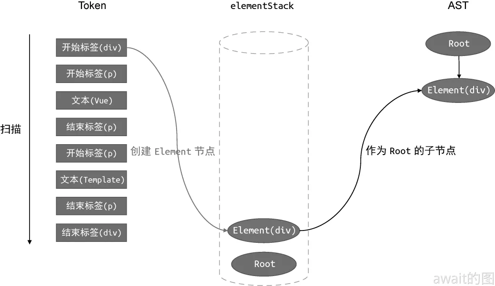
 - 接下来继续扫描到了一个开始标签节点，于是可以再创建一个类型为 Element 的 AST 节点，然后将该节点作为当前栈顶节点的子节点，所以需要将 Element(p) 节点作为 Element(div) 节点的子节点添加到AST中
 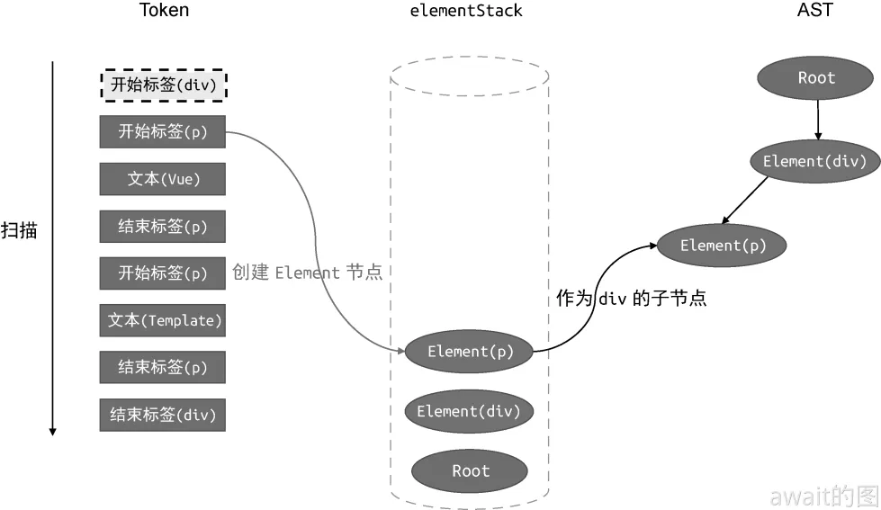
 - 扫描到的第三个Token是一个文本节点，该节点作为当前栈顶节点的子节点。由于当前栈顶节点为Element(p)节点，所以需要将新建的Text(p)节点作为Element(p)节点的子节点添加到AST中
 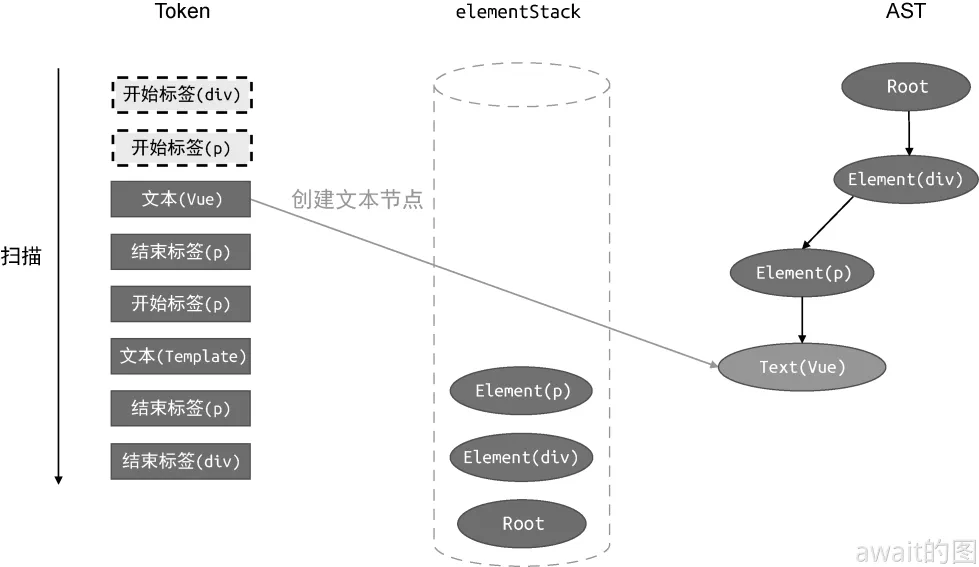
 - 接下来，由于遇到了结束标签，那么进行弹出操作
 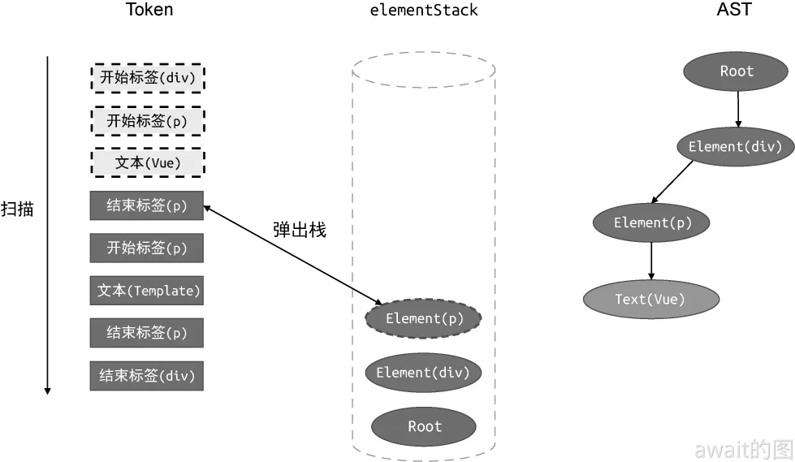
 - 然后，新的p开始标签，新建元素，并且进栈
 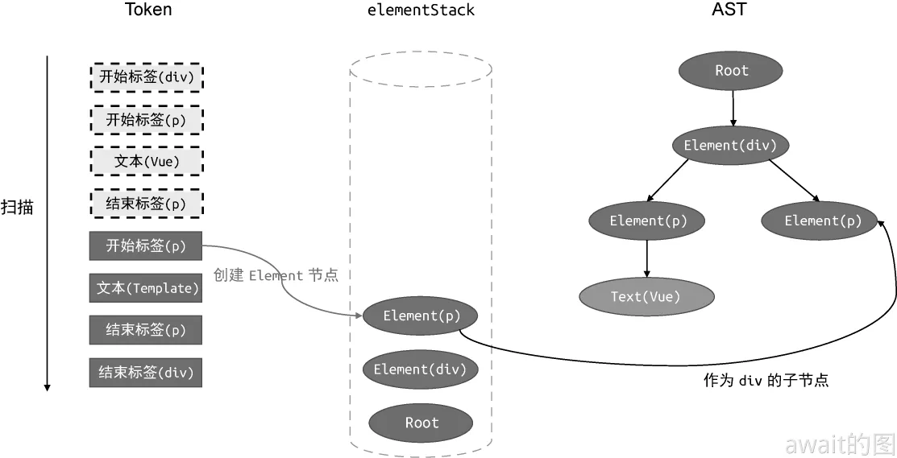
 - 接下来同理，不多解释
 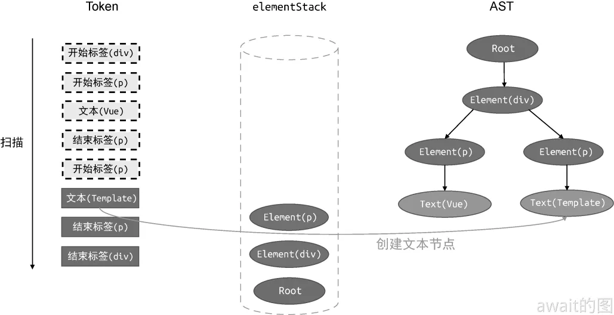
 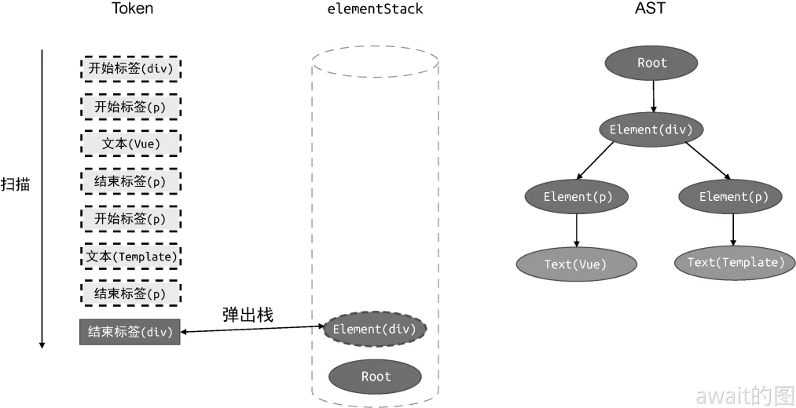
 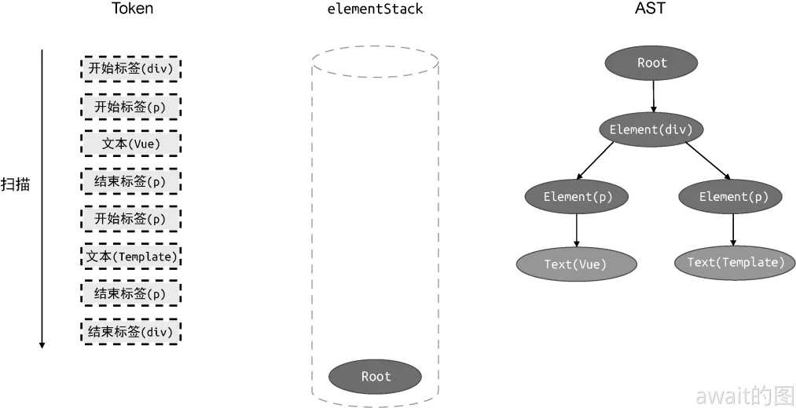

 在所有的Token扫描完毕之后，一颗AST也就构建完成了，其具体代码也如下所示：
 ```js
  // parse 函数接收模板作为参数
 function parse(str) {
   // 首先对模板进行标记化，得到 tokens
   const tokens = tokenize(str)
   // 创建 Root 根节点
   const root = {
     type: 'Root',
     children: []
   }
   // 创建 elementStack 栈，起初只有 Root 根节点
   const elementStack = [root]

   // 开启一个 while 循环扫描 tokens，直到所有 Token 都被扫描完毕为止
   while (tokens.length) {
     // 获取当前栈顶节点作为父节点 parent
     const parent = elementStack[elementStack.length - 1]
     // 当前扫描的 Token
     const t = tokens[0]
     switch (t.type) {
       case 'tag':
         // 如果当前 Token 是开始标签，则创建 Element 类型的 AST 节点
         const elementNode = {
           type: 'Element',
           tag: t.name,
           children: []
        }
         // 将其添加到父级节点的 children 中
         parent.children.push(elementNode)
         // 将当前节点压入栈
         elementStack.push(elementNode)
         break
       case 'text':
         // 如果当前 Token 是文本，则创建 Text 类型的 AST 节点
         const textNode = {
           type: 'Text',
           content: t.content
         }
         // 将其添加到父节点的 children 中
         parent.children.push(textNode)
         break
       case 'tagEnd':
         // 遇到结束标签，将栈顶节点弹出
         elementStack.pop()
         break
     }
     // 消费已经扫描过的 token
     tokens.shift()
   }

   // 最后返回 AST
   return root
 }
 ```
 :::tip
 必须说明的是，这样的实现其实还是存在诸多的问题，这是简单的示例，比如暂时还没有能力处理自闭合标签
 :::

 ## Transformer
 transform 函数用于完成AST的转换工作

 ### 深度遍历访问
 为了能够访问到AST的每一个节点，这样才能有机会去针对特定节点进行修改，替换和删除等操作，由于AST是树形结构，所以可以先编写一个深度优先的遍历算法，从而实现对AST中节点的访问。
 ```js
  function traverseNode(ast) {
   // 当前节点，ast 本身就是 Root 节点
   const currentNode = ast
   // 如果有子节点，则递归地调用 traverseNode 函数进行遍历
   const children = currentNode.children
   if (children) {
     for (let i = 0; i < children.length; i++) {
       traverseNode(children[i])
     }
   }
 }
 ```
 有了访问节点的能力，那么自然而然是可以实现对节点进行转换的功能，然后对tranverseNode进行一波扩展：
 ```js
  // 接收第二个参数 context
 function traverseNode(ast, context) {
   const currentNode = ast

   // context.nodeTransforms 是一个数组，其中每一个元素都是一个函数
   const transforms = context.nodeTransforms
   for (let i = 0; i < transforms.length; i++) {
     // 将当前节点 currentNode 和 context 都传递给 nodeTransforms 中注册的回调函数
     transforms[i](currentNode, context)
   }

   const children = currentNode.children
   if (children) {
     for (let i = 0; i < children.length; i++) {
       traverseNode(children[i], context)
     }
   }
 }
 ```
 对于`traverseNode`函数，这里扩展第二个参数，然后将回调函数都存储在`context`中的`nodeTransforms`中去，然后遍历该数组，并逐个调用注册在其中的回调函数，并把当前节点`currentNode`和`context`传入进去:

 具体用法如下：
 ```js
  function transform(ast) {
   // 在 transform 函数内创建 context 对象
   const context = {
     // 注册 nodeTransforms 数组
     nodeTransforms: [
       transformElement, // transformElement 函数用来转换标签节点
       transformText     // transformText 函数用来转换文本节点
     ]
   }
   traverseNode(ast, context)
   console.log(dump(ast))
 }

 function transformElement(node) {
   if (node.type === 'Element' && node.tag === 'p') {
     node.tag = 'h1'
   }
 }

 function transformText(node) {
   if (node.type === 'Text') {
     node.content = node.content.repeat(2)
   }
 }
 ```
 :::tip
 上述代码中的Context代表着上下文，其实可以把Context看作程序在某个范围内的“全局变量”，实际上Context本身是一种很具象的东西，并依赖于它的具体使用场景比如：
- 在编写Vue应用时，通过 provide/inject 的能力，向一整棵树提供数据，这些数据可以看成上下文
- 在编写Koa时，中间件函数接收的context参数也是一种上下文对象，所有中间件都可以通过context来访问相同的数据
换句话说，上下文对象其实就是程序在某个范围内的全局变量
 :::

 ### 转换函数设计
 所以，通过这样的设计，这里的context可以看作AST转换函数过程中的上下文数据，所有AST转换函数都可以通过context来共享数据。上下文对象中通常会维护程序的当前状态，在这个例子中：可以记录当前访问的节点，当前节点的父节点等等信息
 ```js
  function transform(ast) {
   const context = {
     currentNode: null, // 增加 currentNode，用来存储当前正在转换的节点
     childIndex: 0, // 增加 childIndex，用来存储当前节点在父节点的 children 中的位置索引
     parent: null, // 增加 parent，用来存储当前转换节点的父节点
     nodeTransforms: [
       transformElement,
       transformText
     ]
   }

   traverseNode(ast, context)
   console.log(dump(ast))
 }

 function traverseNode(ast, context) {
   // 设置当前转换的节点信息 context.currentNode
   context.currentNode = ast

   const transforms = context.nodeTransforms
   for (let i = 0; i < transforms.length; i++) {
     transforms[i](context.currentNode, context)
   }

   const children = context.currentNode.children
   if (children) {
     for (let i = 0; i < children.length; i++) {
       // 递归地调用 traverseNode 转换子节点之前，将当前节点设置为父节点
       context.parent = context.currentNode
       // 设置位置索引
       context.childIndex = i
       // 递归地调用时，将 context 透传
       traverseNode(children[i], context)
     }
   }
 }
 ```
 有了这样的上下文，那么就可以在里面去设计一些通用的节点操作方法了，比如 **节点替换**，在对AST进行转换的时候可能需要把某些节点替换为其他类型的节点，那么就可以在Context环境下设计一个`replaceNode`方法，该函数接受新的AST节点作为参数，并使用新节点替换当前正在转换的节点：

 ```js

   const context = {
     currentNode: null,
     parent: null,
     // 用于替换节点的函数，接收新节点作为参数
     replaceNode(node) {
       // 为了替换节点，我们需要修改 AST
       // 找到当前节点在父节点的 children 中的位置：context.childIndex
       // 然后使用新节点替换即可
       context.parent.children[context.childIndex] = node
       // 由于当前节点已经被新节点替换掉了，因此我们需要将 currentNode 更新为新节点
       context.currentNode = node
     },
     nodeTransforms: [
       transformElement,
       transformText
     ]
   }


 ```
 又比如说 **移除节点**
 ```js
    const context = {
     currentNode: null,
     parent: null,
     replaceNode(node) {
       context.parent.children[context.childIndex] = node
       context.currentNode = node
     },
     // 移除节点
     removeNode(){
        if(context.parent){
          context.parent.children.splice(context.childIndex,1)
          context.currentNode = null
        }
     },
     nodeTransforms: [
       transformElement,
       transformText
     ]
   }
 ```
 ### 执行流方案设计
 另外，在转换AST节点的过程中，往往是需要根据其子节点的情况来决定如何对当前的节点去进行转换，这一般要求父节点的转换操作必须等待其所有子节点全部转换完毕后再执行，目前的这种深度遍历的方式还暂不支持，因为这是一种从根节点开始，一直顺序执行的工作流：
 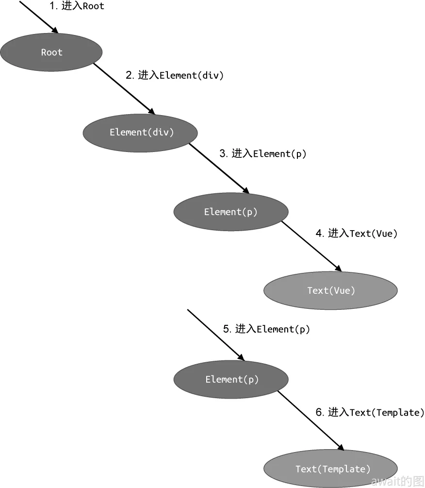

 实际上，目前情况可能更希望有一种类似于“事件冒泡”这样的处理机制，对于节点的访问分为两个阶段，即进入阶段和退出阶段。当转换函数处于进入阶段时，会先进入父节点，再进入子节点，而当转换函数处于退出阶段时，则会先退出子节点，再退出父节点，类似于这样⬇️⬇️
 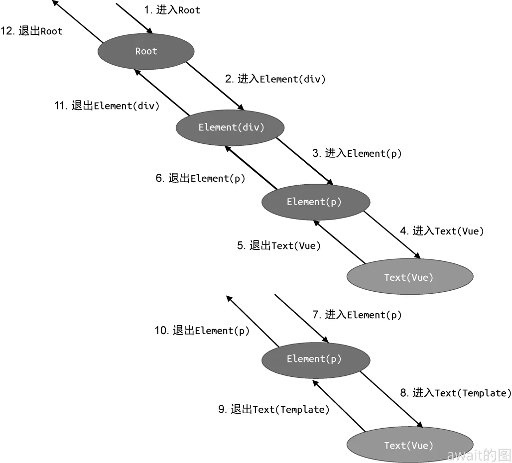

 重新去扩展设计`traverseNode`函数如下：
 ```js
  function traverseNode(ast, context) {
   context.currentNode = ast
   // 1. 增加退出阶段的回调函数数组
   const exitFns = []
   const transforms = context.nodeTransforms
   for (let i = 0; i < transforms.length; i++) {
     // 2. 转换函数可以返回另外一个函数，该函数即作为退出阶段的回调函数
     const onExit = transforms[i](context.currentNode, context)
     if (onExit) {
       // 将退出阶段的回调函数添加到 exitFns 数组中
       exitFns.push(onExit)
     }
     if (!context.currentNode) return
   }

   const children = context.currentNode.children
   if (children) {
     for (let i = 0; i < children.length; i++) {
       context.parent = context.currentNode
       context.childIndex = i
       traverseNode(children[i], context)
     }
   }

   // 在节点处理的最后阶段执行缓存到 exitFns 中的回调函数
   // 注意，这里我们要反序执行
   let i = exitFns.length
   while (i--) {
     exitFns[i]()
   }
 }
 ```

 在上文中，准备一个数组`exitFns`，用于存储由转换函数返回的回调函数，在`traverseNode`的最后阶段，执行倒序执行这些缓存在exitFns数组中的回调函数，这样就能保证在**退出阶段的回调函数执行时，当前访问的节点的子节点全部已经被处理过了**。有了这种设计方案之后，在编写转换函数时，只需要将退出阶段的转换逻辑写在转换函数的回调中就可以了，从而保证了对当前访问的节点进行转换之前，其子节点一定都被去全部处理完毕了。
 ```js
  function transformElement(node, context) {
   // 进入节点

   // 返回一个会在退出节点时执行的回调函数
   return () => {
     // 在这里编写退出节点的逻辑，当这里的代码运行时，当前转换节点的子节点一定处理完毕了
   }
 }
 ```
 ### JavaScript AST
 要将模版AST转换为 JavaScript AST 的最终目的在于 **需要将模版编译为渲染函数，而渲染函数就是依靠JavaScript代码来描述的**

 比如这个模板
 ```html
 <div><p>Vue</p><p>Template</p></div>
 ```
 与之等价的渲染函数应该为：
 ```js
 function render() {
     return h('div', [
         h('p', 'Vue'),
         h('p', 'Template')
       ])
   }
 ```
 对于一个函数来讲，它的基本构成在于：
 - id：函数名称，它是一个标识符 Identifier
 - params：函数的参数，它是一个数组
 - body：函数体，由于函数体可以包含多个语句，因此它也是一个数组

 可以设计一个描述函数的节点：
 ```js
  const FunctionDeclNode = {
   type: 'FunctionDecl' // 代表该节点是函数声明
   // 函数的名称是一个标识符，标识符本身也是一个节点
   id: {
     type: 'Identifier',
     name: 'render' // name 用来存储标识符的名称，在这里它就是渲染函数的名称 render
   },
   params: [], // 参数，目前渲染函数还不需要参数，所以这里是一个空数组
   // 渲染函数的函数体只有一个语句，即 return 语句
   body: [
     {
       type: 'ReturnStatement',
       return: null // 暂时留空，在后续讲解中补全
     }
   ]
 }
 ```
 如上面的代码所示，使用一个对象来描述一个 JavaScript AST 节点。每个节点都具有 type 字段，该字段用来代表节点的类型。对于函数声明语句来说，它的类型是 FunctionDecl。

 接着，使用 id 字段来存储函数的名称。函数的名称应该是一个合法的标识符，因此 id 字段本身也是一个类型为 Identifier 的节点。当然，我们在设计 JavaScript AST 的时候，可以根据实际需要进行调整。

 例如，完全可以将 id 字段设计为一个字符串类型的值。这样做虽然不完全符合 JavaScript 的语义，但是能够满足我们的需求。

 对于函数的参数，使用 params 数组来存储。目前设计的渲染函数还不需要参数，因此暂时设为空数组。

 最后，使用 body 字段来描述函数的函数体。一个函数的函数体内可以存在多个语句，所以我们使用一个数组来描述它。该数组内的每个元素都对应一条语句，对于渲染函数来说，目前它只有一个返回语句，所以使用一个类型为 ReturnStatement 的节点来描述该返回语句。

 对于h函数的返回值，实际上是虚拟Dom节点，这里可以使用 CallExpression 类型的节点来描述函数调用语句

 ```js
 const CallExp = {
   type: 'CallExpression',
   // 被调用函数的名称，它是一个标识符
   callee: {
     type: 'Identifier',
     name: 'h'
   },
   // 参数
   arguments: []
 }
 ```

 类型`CallExpression`的节点拥有两个属性：
 - callee：用来描述被调用函数的名称，它本身上是一个标识符节点
 - arguments：被调用函数的形式参数，多个参数的话用数组来描述

 观察h函数，可以发现h函数的第一个参数是字符串字面量，可以用类型为**StringLiteral**节点来描述，而第二个参数是一个数组，可以用类型**ArrayExpression**节点来描述
 ```js
  const Str = {
   type: 'StringLiteral',
   value: 'div'
 }
 ```
 ```js
  const Arr = {
   type: 'ArrayExpression',
   // 数组中的元素
   elements: []
 }
 ```
 使用上述的 **CallExpression**，**StringLiteral**，**ArrayExpression** 等节点来填充渲染函数的返回值，最终得到的结果如下：

 ```js
  const FunctionDeclNode = {
   type: 'FunctionDecl' // 代表该节点是函数声明
   // 函数的名称是一个标识符，标识符本身也是一个节点
   id: {
     type: 'Identifier',
     name: 'render' // name 用来存储标识符的名称，在这里它就是渲染函数的名称 render
   },
   params: [], // 参数，目前渲染函数还不需要参数，所以这里是一个空数组
   // 渲染函数的函数体只有一个语句，即 return 语句
   body: [
     {
       type: 'ReturnStatement',
       // 最外层的 h 函数调用
       return: {
         type: 'CallExpression',
         callee: { type: 'Identifier', name: 'h' },
         arguments: [
           // 第一个参数是字符串字面量 'div'
           {
             type: 'StringLiteral',
             value: 'div'
           },
           // 第二个参数是一个数组
           {
             type: 'ArrayExpression',
             elements: [
               // 数组的第一个元素是 h 函数的调用
               {
                 type: 'CallExpression',
                 callee: { type: 'Identifier', name: 'h' },
                 arguments: [
                   // 该 h 函数调用的第一个参数是字符串字面量
                   { type: 'StringLiteral', value: 'p' },
                   // 第二个参数也是一个字符串字面量
                   { type: 'StringLiteral', value: 'Vue' },
                 ]
               },
               // 数组的第二个元素也是 h 函数的调用
               {
                 type: 'CallExpression',
                 callee: { type: 'Identifier', name: 'h' },
                 arguments: [
                   // 该 h 函数调用的第一个参数是字符串字面量
                   { type: 'StringLiteral', value: 'p' },
                   // 第二个参数也是一个字符串字面量
                   { type: 'StringLiteral', value: 'Template' },
                 ]
               }
             ]
           }
         ]
       }
     }
   ]
 }
 ```
 这一大段 JavaScript AST 代码，就是对渲染函数代码的完整描述，同时可以设计一些辅助函数，如下所示，可以更好的编写转换代码

 ```js
  // 用来创建 StringLiteral 节点
 function createStringLiteral(value) {
   return {
     type: 'StringLiteral',
     value
   }
 }
 // 用来创建 Identifier 节点
 function createIdentifier(name) {
   return {
     type: 'Identifier',
     name
   }
 }
 // 用来创建 ArrayExpression 节点
 function createArrayExpression(elements) {
   return {
     type: 'ArrayExpression',
     elements
   }
 }
 // 用来创建 CallExpression 节点
 function createCallExpression(callee, arguments) {
   return {
     type: 'CallExpression',
     callee: createIdentifier(callee),
     arguments
   }
 }
 ```
 为了把模版AST转换为JavaScript AST，同样还需要两个转换函数：transformElement 和 transformText，它们分别用于处理标签节点和文本节点：

 ```js
  // 转换文本节点
 function transformText(node) {
   // 如果不是文本节点，则什么都不做
   if (node.type !== 'Text') {
     return
   }
   // 文本节点对应的 JavaScript AST 节点其实就是一个字符串字面量，
   // 因此只需要使用 node.content 创建一个 StringLiteral 类型的节点即可
   // 最后将文本节点对应的 JavaScript AST 节点添加到 node.jsNode 属性下
   node.jsNode = createStringLiteral(node.content)
 }

 // 转换标签节点
 function transformElement(node) {
   // 将转换代码编写在退出阶段的回调函数中，
   // 这样可以保证该标签节点的子节点全部被处理完毕
   return () => {
     // 如果被转换的节点不是元素节点，则什么都不做
     if (node.type !== 'Element') {
       return
     }

     // 1. 创建 h 函数调用语句,
     // h 函数调用的第一个参数是标签名称，因此我们以 node.tag 来创建一个字符串字面量节点
     // 作为第一个参数
     const callExp = createCallExpression('h', [
       createStringLiteral(node.tag)
     ])
     // 2. 处理 h 函数调用的参数
     node.children.length === 1
       // 如果当前标签节点只有一个子节点，则直接使用子节点的 jsNode 作为参数
       ? callExp.arguments.push(node.children[0].jsNode)
       // 如果当前标签节点有多个子节点，则创建一个 ArrayExpression 节点作为参数
       : callExp.arguments.push(
         // 数组的每个元素都是子节点的 jsNode
         createArrayExpression(node.children.map(c => c.jsNode))
       )
     // 3. 将当前标签节点对应的 JavaScript AST 添加到 jsNode 属性下
     node.jsNode = callExp
   }
 }
 ```
 上面设计的两个函数即可完成标签节点和文本节点的转换，即把模版转换成h函数的调用。但是转换后得到的AST只是用于描述渲染函数 render 的返回值的，所以最后一步需要做的是就补全 JavaScript AST，即把用来描述render函数本身的函数声明语句节点附加到 JavaScript AST中
 ```js
  function transformRoot(node) {
   // 将逻辑编写在退出阶段的回调函数中，保证子节点全部被处理完毕
   return () => {
     // 如果不是根节点，则什么都不做
     if (node.type !== 'Root') {
       return
     }
     // node 是根节点，根节点的第一个子节点就是模板的根节点，
     // 当然，这里我们暂时不考虑模板存在多个根节点的情况
     const vnodeJSAST = node.children[0].jsNode
     // 创建 render 函数的声明语句节点，将 vnodeJSAST 作为 render 函数体的返回语句
     node.jsNode = {
       type: 'FunctionDecl',
       id: { type: 'Identifier', name: 'render' },
       params: [],
       body: [
         {
           type: 'ReturnStatement',
           return: vnodeJSAST
         }
       ]
     }
   }
 }
 ```

 ## Generator
 最后的一步就是使用generator函数来完成代码的生产任务：

 ```js
  function compile(template) {
   // 模板 AST
   const ast = parse(template)
   // 将模板 AST 转换为 JavaScript AST
   transform(ast)
   // 代码生成
   const code = generate(ast.jsNode)

   return code
 }
 ```
 代码生成的本质就是做字符串的拼接，需要为不同的AST节点编写对应的代码生成函数，为了使得代码更具有可读性，一般会考虑对生成的代码做缩进和换行等等工作
 ```js
  const ast = parse(`<div><p>Vue</p><p>Template</p></div>`)
 transform(ast)
 const code = generate(ast.jsNode)
 ```
 最终得到的代码字符串如下：
 ```js
  function render () {
   return h('div', [h('p', 'Vue'), h('p', 'Template')])
 }
 ```