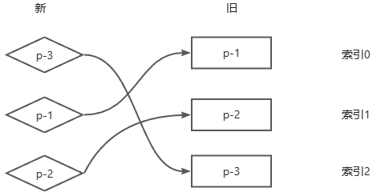
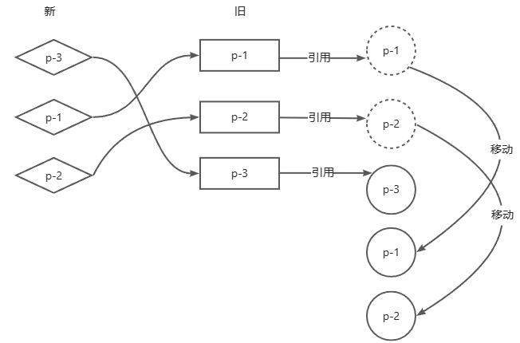

# 简单Diff
这篇知识分享介绍渲染器的核心Diff算法，当新旧vnode的子节点都是一组节点时，不能简单暴力的清空真实dom然后重新渲染，而是找到变化点以最小的性能开销完成更新操作。

## 减少DOM操作的性能开销
卸载全部旧子节点，挂载全部新子节点，这么做确实能够完成更新，但是由于没有复用任何DOM元素，则会产生极大的性能开销，看下面的一个例子
```js
// 新旧节点替换
      const oldVnode = {
        type: "div",
        chidren:[
          {type:'p',chidren:"1"},
          {type:'p',chidren:"2"},
          {type:'p',chidren:"3"}
        ]
      };

      const newVnode = {
        type: "div",
        chidren:[
          {type:'p',chidren:"4"},
          {type:'p',chidren:"5"},
          {type:'p',chidren:"6"}
        ]
      };
```
如果采用暴力做法，则需要完成:
- 卸载所有旧子节点，3次DOM操作
- 挂载所有新子节点，3次DOM操作
然而最理想的更新方式为：直接更新这个p标签的文本节点内容，总共只需要三次DOM操作：
```js
  function patchChildren(n1, n2, container) {
    if (typeof n2.children === "string") {
      	//...
    } else if (Array.isArray(n2.children)) {
      if (Array.isArray(n1.children)) {
        const newChildren = n2.children
        const oldChildren = n1.children
        for(let i = 0 ; i < oldChildren.length ;i++){
          patch(oldChildren[i],newChildren[i])
        }
      } else {
      	// ...
      }
    } else {
      // ...
    }
  }
```
上述代码的局限性是很大的，我们假设了新的一组子节点数量和旧的一组子节点数量相同，还存在下面这两种意外情况：
- 如果新的一组子节点数量变少了，则进行卸载操作


- 如果新的一组子节点数量变多了，则进行新增操作


所以，在新旧两组子节点更新时，不能总是遍历旧的一边或新的一边，而是遍历较短的那一组，接着对比新旧两组子节点的长度，如果新的一组子节点更长，则说明新子节点需要挂载，反之就是旧子节点需要卸载，新增一个`diff`函数,代码逻辑如下:
```js
// ...

		function patchChildren(n1, n2, container) {
        // ...
        if (Array.isArray(n1.chidren)) {
          //...
          if (Array.isArray(n2.chidren)) {
            	diff(n2.children,n1.children)
          }
        }
      }

  	// diff 函数
  	function diff(newChildren, oldChildren) {
      const newLen = newChildren.length;
      const oldLen = oldChildren.length;
      const commonLen = Math.min(newLen, oldLen);
      for (let i = 0; i < commonLen; i++) {
        patch(oldChildren[i], newChildren[i]);
      }
      // 新增
      if (newLen > oldLen) {
        for (let i = commonLen; i < newLen; i++) {
          patch(null, newChildren[i], container);
        }
      } 
      // 卸载
      else if (oldLen > newLen) {
        unmount(oldChildren[i]);
      }
  }
// ...
```

## DOM复用 与 key
假设现在有这样的新旧节点列表如下：
```js
      const oldVnode = {
        type: "div",
        chidren:[
          {type:'p',chidren:"1"},
          {type:'div',chidren:"2"},
          {type:'span',chidren:"3"}
        ]
      };

      const newVnode = {
        type: "div",
        chidren:[
          {type:'span',chidren:"3"},
          {type:'p',chidren:"1"},
          {type:'div',chidren:"2"}
        ]
      };
```
这种顺序的差异，只需要移动Dom元素完成更新即可，但是问题来了，如何判断新子节点和旧的子节点中有相同的节点进行对应呢？换句话说，我怎么知道旧节点的第一个子节点和新节点的第二个子节点是同一节点呢？

那么这就需要给节点进行**打标识** ，也就是key，key属性就好比是节点的身份证号，只要两个节点的type和key是相同的，就可以认为这两个节点上相同的，那么即可进行DOM复用

```js
      const oldVnode = {
        type: "div",
        chidren:[
          {type:'p',chidren:"1",key:"a"},
          {type:'div',chidren:"2",key:"b"},
          {type:'span',chidren:"3",key:"c"}
        ]
      };

      const newVnode = {
        type: "div",
        chidren:[
          {type:'span',chidren:"3",key:"c"},
          {type:'p',chidren:"1",key:"a"},
          {type:'div',chidren:"2",key:"b"}
        ]
      };
```

**由于key的存在，可以清楚两个新旧节点的映射关系**

另外，DOM复用不意味着就不对该节点进行更新了，这是意味着更新时可以复用DOM元素，省去了一些元素的创建删除操作，比如下面的例子:

```js
const oldVnode = {type:'p',key:1,children:'text1'}
const newVnode = {type:'p',key:1,children:'text2'}
```
发现新的虚拟节点虽然和旧的虚拟节点是同一个节点，但是内容却发生了变化，也就不可避免的需要进行更新
```js
  function diff(newChildren, oldChildren,container) {
    for(let i = 0 ; i < newChildren.length ; i++){
      const newVnode = newChildren[i]
      for(let j = 0 ; j < oldChildren.length ; j++){
        const oldVnode = oldChildren[j]
        if(newVnode.key === oldVnode.key){
          patch(oldVnode,newVnode,container)
          break
        }
      }
    }
  }
```
## 找到需要移动的元素
如果新旧两个节点的节点顺序不变，就不需要进行额外的移动操作


查找算法如下：

- 取新节点列表的p-1，尝试在旧节点列表中找到相同key对应的旧p-1，发现找到了，并且该节点位于旧节点列表的索引为0
- 取新节点列表的p-2，尝试在旧节点列表中找到相同key对应的旧p-2，发现找到了，并且该节点位于旧节点列表的索引为1
- 取新节点列表的p-3，尝试在旧节点列表中找到相同key对应的旧p-3，发现找到了，并且该节点位于旧节点列表的索引为2

在这个过程中，每一次都会去寻找可复用的节点，都会去记录可复用节点在旧的一组子节点中的位置索引。如果把这些位置索引按照先后顺序排列，可以得到一个 0 1 2的递增序列，则不需要移动任何节点


如果新旧节点列表中，节点的位置顺序不一样，则需要进行更新

算法如下：
- 取新的一组子节点中的第一个子节点p-3，发现key为3。在旧节点列表中找到key为3的节点索引为2
- 取新的一组子节点中的第二个子节点p-1，发现key为1。在旧节点列表中找到key为1的节点索引为0。发现，**索引的递增顺序被完全打破了，说明节点p-1排在旧节点p-3前面，但在新的节点列表中，它排在p-3后面，说明p-1对应的真实DOM需要进行移动了**
- 取新的一组子节点中的第三个子节点p-2，发现key为2。在旧节点列表中找到key为2的节点索引为1。发现，**节点p-2在旧节点列表中排在节点p-3之前，但在新的chilren中，它排在节点p-3后面。因此，节点p-2对应的真实DOM也需要移动。**

在上面的例子中，得出了p-1,p-2需要移动的结论，这是因为它们在旧节点列表中的索引要小于节点p-3在旧节点列表中的索引，如果按照先后顺序记录在寻找节点过程中所遇到的位置索引，将会得到序列2,0,1。这个序列不具有递增的趋势。

对于节点p-3在旧节点列表中的索引可以特殊定义为：**在旧节点列表中寻找具有相同key值节点的过程中，遇到的最大索引值。**凡是在后续寻找中的过程中，存在索引值比当前遇到的最大索引值还要小的节点，则意味该节点需要移动。

对于节点p-3在旧节点列表中的索引可以特殊定义为：**在旧节点列表中寻找具有相同key值节点的过程中，遇到的最大索引值。**凡是在后续寻找中的过程中，存在索引值比当前遇到的最大索引值还要小的节点，则意味该节点需要移动。

```js
  function diff(newChildren, oldChildren, container) {
    // 用来存储寻找过程中遇到的最大索引
    let lastIndex = 0
    for (let i = 0; i < newChildren.length; i++) {
      const newVnode = newChildren[i];
      for (let j = 0; j < oldChildren.length; j++) {
        const oldVnode = oldChildren[j];
        if (newVnode.key === oldVnode.key) {
          patch(oldVnode, newVnode, container);
          if(j < lastIndex){
            // 如果当前找到的节点在旧children中的索引 小于 最大索引值 lastIndex
            // 说明该节点对应的真实DOM需要移动
          }else{
            // 如果当前找到的节点在旧 children 中索引不小于最大索引值，则更新lastIndex
            lastIndex = j
          }
          break;
        }
      }
    }
  }
```

## 正确移动元素
当确认了哪些节点需要移动后，就应该去正确移动虚拟节点对应的真实DOM，如何知道当前的节点对应的真实DOM,在本篇之前的 patch函数详解 中有介绍，这里取一小段进行回顾。

对于一个虚拟节点vnode，在vnode挂载到页面上时添加一个el属性来引用真实的DOM即可
```js
// vnode找到对应的真实dom
    function mountElement(vnode, container) {
      // 将vnode.el 与 真实DOM 关系在一起
      const el = vnode.el = document.createElement(vnode.type);

      // ....
    }
```
除了挂载阶段之外，在节点更新的时候也需要进行真实DOM的引用
```js
    function patchElement(n1,n2){
      // 新的vnode也引用了真实dom
      const el = n2.el = n1.el
    }
```
继续沿用之前的案例:


更新的步骤如下：
- 第一步：取新的一组子节点中的第一个节点p-3，它的key为3，尝试在旧的一组子节点中找到具有相同key值的可复用节点。发现能够找到，并且该节点在旧的一组子节点中索引为2。此时变量lastIndex的值为0，索引2不小于0，所以节点p-3对应的真实DOM不需要移动，但需要更新lastIndex的值为2
- 第二步，取新的一组子节点中的第二个节点p-1，它的key为1，尝试在旧的一组子节点中找到具有相同key值的可复用节点。发现能够找到，并且该节点在旧的一组子节点中的索引为0。此时lastIndex的值为2，索引0小于2，所以节点p-1对应的真实DOM需要移动

到了这一步，就需要去移动真实DOM了，需要具体移动到哪儿？可以知道，**新的children的顺序其实就是更新后真实DOM节点应有的顺序**。所以节点p-1在新的children中的位置就代表了真实DOM更新后的位置。由于节点p-1在新children中排到节点p-3后面，**所以应该把节点p-1所对应的真实DOM移动到节点p-3所对应的真实DOM后面**


- 对应的，第三步也是，取新的一组子节点中的第二个节点p-2，它的key为2，尝试在旧的一组子节点中找到具有相同key值的可复用节点。发现能够找到，并且该节点在旧的一组子节点中的索引为1。此时lastIndex的值为2，索引1小于2，所以节点p-2对应的真实DOM需要移动


接着就是代码实现

```js
  function diff(newChildren, oldChildren, container) {
    let lastIndex = 0;
    for (let i = 0; i < newChildren.length; i++) {
      const newVnode = newChildren[i];
      for (let j = 0; j < oldChildren.length; j++) {
        const oldVnode = oldChildren[j];
        if (newVnode.key === oldVnode.key) {
          patch(oldVnode, newVnode, container);
          if (j < lastIndex) {
            // newVnode 对应的真实Dom需要移动
            // 先获取 newVnode 前一个vnode
            const prevVNode = newChildren[i - 1];
            // 如果 prevVNode 不存在，则说明当前 newVNode 是第一个节点，不需要进行移动
            if (prevVNode) {
              // 将newVNode对应的真实DOM移动到prevVNode 所对应真实DOM后面
              // 获取 prevNode 所对应真实DOM的下一个兄弟节点，并作为锚点
              const anchor = prevVNode.el.nextSibling;
              insert(newVnode.el, container, anchor);
            }
          } else {
            lastIndex = j;
          }
          break;
        }
      }
    }
  }
```
其中insert方法的实现如下:
```js
insert(el,parent,anchor = null){
  parent.insertBefore(el,anchor)
}
```
## 添加新的元素
现在讨论新增节点的情况：

在新的一组子节点中，多出来一个节点p-4，它的key值为4，该节点在旧的一组子节点不存在，因此将其视为新增节点，对于新增的节点，更新时应该去正确地将其挂载:

- 找到新增节点
- 将新增节点挂载到正确的位置

假设通过之前的Diff算法，现在已经走到了p-4节点，它的key值为4，尝试在旧的一组子节点中寻找可复用的节点。由于在旧的一组子节点中，没有key值为4的节点，因此渲染器会把节点p-4看作新增节点并挂载它。但是如何将其挂载到正确的位置，由于节点p-4出现在节点p-1后面，所以应该把节点p-4挂载到节点p-1所对应的真实DOM后面

所以此时真实DOM的顺序为p-2 p-3 p-1 p-4，其中p-4是刚刚挂载出来的:

代码实现如下：
```js
  function diff(newChildren, oldChildren, container) {
    let lastIndex = 0;
    for (let i = 0; i < newChildren.length; i++) {
      const newVnode = newChildren[i];
      // 在第一层循环中定义变量 find ，代表是否在旧的一组子节点中找到了可复用的节点
      // 初始值为 false ，代表没有找到
      let find = false;
      for (let j = 0; j < oldChildren.length; j++) {
        const oldVnode = oldChildren[j];
        if (newVnode.key === oldVnode.key) {
        	// 一旦找到则置为true
          find = true;
          patch(oldVnode, newVnode, container);
          if (j < lastIndex) {
            const prevVNode = newChildren[i - 1];
            if (prevVNode) {
              const anchor = prevVNode.el.nextSibling;
              insert(newVnode.el, container, anchor);
            }
          } else {
            lastIndex = j;
          }
          break;
        }
      }
      // 说明当前newVNode没有在旧的一组子节点中找到可复用的节点
      // 当前的newVNode 是新增节点 需要挂载
      if(!find){
        // 为了将节点挂载到正确位置，需要先获取锚点元素
        // 首先获取当前newVNode的前一个vnode节点
        const prevVNode = newChildren[i-1]
        let anchor = null
        if(prevVNode){
          // 如果有前一个vnode节点，则使用它的下一个兄弟节点作为锚点元素
          anchor = prevVNode.el.nextSibling
        }else{
          // 如果没有前一个vnode节点，说明挂载的新节点是一个子节点
          // 需要使用容器元素的首个节点作为锚点
          anchor = container.firstChild
        }
        patch(null,newVnode,container,anchor)
      }
    }
  }
```
首先在外层循环中定义了名为find的变量，它代表渲染器能否在旧的一组子节点中找到可复用的节点，变量find的初始值false，一旦寻找到可复用的节点，则设置find为true。如果内层循环结束后，变量find的值仍为false，则说明当前newVNode是一个全新的节点，需要挂载它。为了将节点挂载到正确的位置，需要先找到锚点元素：找到newVNode的前一个虚拟节点，即prevNode，如果存在，则使用它对应的真实DOM的下一个兄弟节点作为锚点元素，如果不存在，则说明即将挂载的newVNode节点是容器元素的第一个子节点，此时应该使用容器元素的container.firstChild作为锚点元素，进行挂载。

## 移除不存在的元素
在更新节点时，不仅会遇到新增元素，还会遇到元素被删除的情况。

如果依照之前Diff算法走下来，到结束时会发现实际上旧节点依然存在，所以还需要一步额外的操作来删除遗留的节点，思路很简单，当基本的更新结束时，还需要便利一遍旧的一组子节点，然后去新的一组子节点中寻找具有相同key值的节点，如果找不到，这说明应该删除该节点，如下所示:
```js
  function diff(newChildren, oldChildren, container) {
    let lastIndex = 0;
    for (let i = 0; i < newChildren.length; i++) {
      const newVnode = newChildren[i];
      let find = false;
      for (let j = 0; j < oldChildren.length; j++) {
        const oldVnode = oldChildren[j];
        if (newVnode.key === oldVnode.key) {
          find = true;
          patch(oldVnode, newVnode, container);
          if (j < lastIndex) {
            const prevVNode = newChildren[i - 1];
            if (prevVNode) {
              const anchor = prevVNode.el.nextSibling;
              insert(newVnode.el, container, anchor);
            }
          } else {
            lastIndex = j;
          }
          break;
        }
      }
      if (!find) {
        const prevVNode = newChildren[i - 1];
        let anchor = null;
        if (prevVNode) {
          anchor = prevVNode.el.nextSibling;
        } else {
          anchor = container.firstChild;
        }
        patch(null, newVnode, container, anchor);
      }
    }
    // 上一步的更新操作完成后，遍历一次旧子节点
    for(let i = 0 ; i<oldChildren.length;i++){
      const oldVNode = oldChildren[i]
      // 拿旧子节点oldVNode去新的一组子节点中寻找具有相同key值的节点
      const has = newChildren.find(
        vnode => vnode.key === oldVNode.key
      )
      if(!has){
        // 如果没有找到，直接卸载
        unmount(oldVNode)
      }
    }
  }
```