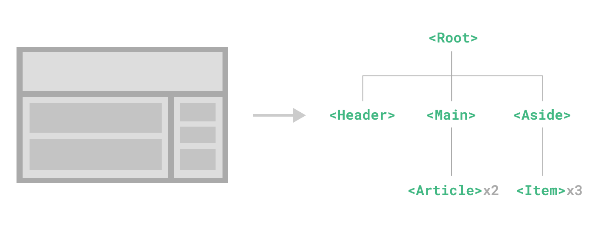
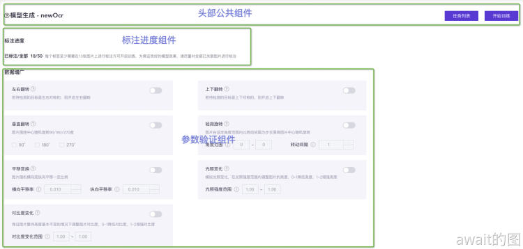

# 如何写好组件和hooks?
## 概述
一个组件中的结构实际上是可以抽象分为这么几个部分：
- 组件视图，组件中用于描述视觉效果的部分，比如react的jsx或者vue的template代码
- 组件交互逻辑，比如组件的生命周期，按钮交互事件
- 业务逻辑，比如获取任务列表，获取用户信息，获取工程信息等与组件几乎无关的业务代码

如果一个组件写得过于庞大或复杂，内部可能包含了多个视图，每个视图之间存在交互。同时又可能包含了多个业务逻辑，多个业务的函数和变量杂乱无章地到处放置，在阅读后续维护的时候要在代码之间反反复复的横跳。

## 组件应该怎么拆
组件的拆分往往有一个误区，只要有复用的时候才去拆分组件，强烈不赞同这样的做法。Vue中的组件其实可以和函数来进行类别，当去创建一个函数的时候，其创建理由实际上不是因为这个函数负责的逻辑一定会发生复用，这是因为函数不仅有代码复用的功能，其实还具有一定的描述性质和代码封闭性质。当使用一个函数的时候，不必去关注函数的实现细节，读到函数的名字就能通晓函数的作用。

组件其实也是同理，也可以具有分割封闭代码的作用。可以按照当前的结构或者功能，业务来将组件拆分为功能清晰单一，与外部耦合程度低的组件。如果一个组件内部干了太多事情，或者依赖了过多的外部状态，那么就一定不是一个容易维护的组件了。


当然，为了保持组件功能单一，不一定要把组件拆分的非常细，决定是否需要拆分组件的关键点在于复杂度。如果一个页面特别简单，那么不进行拆分也是可以的，有时候拆分得过于细反而不利于维护。

如何判断一个组件是否复杂，其实也不好给出一个机械式的答案，建议对于页面级别大组件代码在500～800行以内，小组件控制在300行以内。

实际上拆分组件可以依靠一些以下的原则：
- 拆分的组件要尽量保持功能单一。组件内部的代码只和这个组件功能有关，就如同函数的单一职责一样。
- 组件要保持较低的耦合度，不要与组件外部产生过度的交互，比如内部组件不要过度依赖外部变量，父子组件之间的交互，数据流动尽量简化，如果出现读懂一个组件要时不时的切到父组件上查看逻辑，就说明这个组件的设计有一定的问题
- 组件名准确描述这个组件的功能。就如同函数，可以不让人关心组件细节，就能明白组件大概的作用。当一个组件起名比较困难时，往往有可能是这个组件的功能并不单一，需要继续细分。

在NexSight中的模型生成页面就是一个非常正面的案例：


在这个页面中可以发现，它主要负责用户进行参数调整和开启模型训练，参数验证组件中含有大量的表单验证逻辑，验证逻辑只和表单有关，和模型生成实际上是无关的，那么就可以将表单和验证逻辑封装到一个组件中去，这样在`ModelGenerate`页面级组件中就只用关心训练相关逻辑，代码行数在600行左右。

```html
<template>
  <!-- 视图代码... -->
<template/>
<script setup>
  // 轻微旋转 角度范围 小值
  const checkAngleRangeMin = (rule, value, cb) => {}

  // 轻微旋转 角度范围 大值
  const checkAngleRangeMax = (rule, value, cb) => {}

  // 轻微旋转 转动间隔
  const checkAngleStep = (rule, value, cb) => {}

  // ...
</script>
```

## 组织好拆分的组件文件
拆分的组件应该放在正确的地方，NextSight现在就存在不合适的处理方案——将所有组件都放在名为`components`的文件夹内，最后使得这个文件夹特别臃肿。其实更好的做法将相关联的代码最好聚合在一起。

为了让相关联的代码聚合在一起，可以把页面搞成文件夹形式，在文件夹内部存放与当前文件相关的组成部分，并将表示页面的组件命名为index放在文件夹下。再将该文件夹下创建`components`目录，将组成页面的其他组件放在里面。

如果一个页面的某个组成部分很复杂，内部还需要拆分为更细的多个组件，那么就把这个组成部分也做成文件夹。

最后就是组件复用的问题，如果一个组件被多个地方复用，就把它单独提取出来，放在需要复用它的组件们公共的上层级上。参考原则如下：

- 如果只是被页面内的组件复用，就放在页面文件夹下
- 如果只是当前业务下的不同页面复用，就放在当前业务模块的文件夹下
- 如果散落在各个页面间，就可以放在最顶层的`components`文件夹中

```text
homePage // 存放当前页面的文件夹
    |-- components // 存放当前页面组件的文件夹
        |-- componentA // 存放当前页面的组成部分A的文件夹
            |-- index.vue // 组件A
            |-- AChild1.vue // 组件a的组成部分1
            |-- AChild2.vue // 组件a的组成部分2
            |-- ACommon.vue // 只在componentA内部复用的组件
        |-- ComponentB.vue // 当前页面的组成部分B
        |-- Common.vue // 组件A和组件B里复用的组件
    |-- index.vue // 当前页面
```
## 如何抽离好的hooks?
在抽离hooks的时候，我们不仅应该沿用一般函数的思维，如功能单一，耦合度低等等，还需要强调注意组件中的逻辑可分为两种：组件交互逻辑与业务逻辑。

业务逻辑的例子：

在NexSight中，打开某个工程下的页面都需要从`sessionStorage`里面读取工程的`solution_id``,module_id`，由于人员代码风格不同往往在不同页面中出现不同的写法：
```js
// a.vue
const state = reactive({
	result:{
  	module_id : "",
  	solution_id: ""
  }
})

state.result.module_id = sessionStorage.getItem("module_id")
state.result.solution_id = sessionStorage.getItem("solution_id")
```
```js
//b.vue
const solutionId = sessionStorage.getItem("solution_id")
const moduleId = sessionStorage.getItem("module_id")
```
这样的问题正是因为页面间不同的公共逻辑没有进行统一的抽离，导致代码风格不同，使用方式不同，常常会出现在文件中写到某处时需要用到`solution_id`和`module_id`时，要往上翻去查看这一页的变量如何命名的，其实这样的业务逻辑就可以通过组合式函数去抽离:
```js
export default function useProjectSession() {
  // 从sessionStorage内取出 solution_id module_id
  function readSolutionModule() {
    const solution_id = sessionStorage.getItem('solution_id')
    const module_id = sessionStorage.getItem('module_id')
    return { solution_id, module_id }
  }

  return {
    readSolutionModule
  }
}
```
然后可以这样使用：
```js
import useProjectSession from '@/hooks/projectSession'

const {readSolitionModule} = useProjectSession()

const {solution_id , module_id} = readSolitionModule()
```
一个包含查询用户信息，修改用户信息，修改密码等功能的hooks可以这样写，然后封装交互逻辑：
```js
// 用户模块交互逻辑hooks
const useUserControl = () => {
    // 组合用户hook
    const { userInfo, getUserInfo, changeUserInfo, checkRepeatPass, changePassword } = useUser();
    // 数据查询loading状态
    const loading = ref(false);
    // 错误提示弹窗的状态
    const errorModalState = reactive({
        visible: false, // 弹窗显示/隐藏
        errorText: '',  // 弹窗文案
    });
    
    // 修改密码表单提交
    const onChangePassword = ({ oldPass, newPass ) => {
        // 判断两次密码是否一致
        if (checkRepeatPass(oldPass, newPass)) {
            changePassword();
        } else {
            errorModalState.visible = true;
            errorModalState.text = '两次输入的密码不一致，请修改'
        }
    };
    
    // 初始化数据
    const initData = () => {
        getUserInfo();
    }
    // 初始化数据，react使用useEffect
    onMounted(initData);
    return {
        // 用户数据
        userInfo,
        // 修改密码
        onChangePassword,
        // 修改用户信息
        onChangeUserInfo: changeUserInfo,
    }
}
```
如果能封装出更多的hooks之后，就会发现很多代码被聚合到单独的各个文件中，这样减少了单一文件中的代码体积量，正因为不同的业务和功能封装在一个个的hook中，彼此不干扰，业务结构变得更加容易区分和理解，有助于项目的可维护性和可读性提升非常大。

其实这样去写，也比较符合Vue3提出的`Composition API`，vue2的写法就是导致本来相同功能的代码被分散到了不同的地方，而在V3中封装成一个个hooks，相关联的代码就容易被聚合在一起，与其他功能区分开来

## 总结
- hooks和components的主要主旨是为了更好的复用代码，但除了复用外，也可以用于复杂逻辑和复杂结构的情况下用于拆分代码来组织成可读性更高的代码结构，如果逻辑本身不复杂，不拆分也能看懂，就可以不新建hooks和components，总之要考虑代码的可读性和可维护性。
- 极端的想法，如果极致抽离hook的话，就可以不用全局的状态管理了。
- 功能保持单一，逻辑视图分离，就近维护原则，多处共同向上聚合