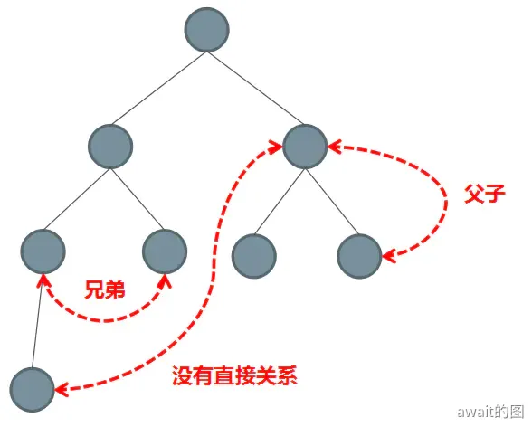

# 组件间通信

组件之间的通信可以分为以下几类
- 父子之间组件通信
- 兄弟之间组件通信
- 祖孙组件与后代组件之间通信
- 非关系组件之间通信



## 组件间通信方案
- props 传递
- emit 触发自定义事件
- ref 与 expose
- 依赖注入
- eventBus
- pinia

## props传递
适用于父组件 传递数据信息 给子组件：
```js
// 子组件中定义props
const props = defineProps({  
 name:String
 age:{    
   type:Number,  
   defaule:18,    
   require:true 
 }  
})  

// 父组件中传递
<Children name="jack" age=18 />
```

## emit
适用于 子组件 通过调用 父组件 的自定义方法来传递数据信息
```js
// 子组件中定义emit
const emit = defineEmit(['cartAdd'])
emit('cartAdd',1)

// 父组件中 自定义方法
<Children @add="cartAdd(params)" />  
```

## ref 与 expose
适用于 父组件 需要调用 子组件 的方法或访问属性
```js
// 子组件调用 暴露方法
defineExpose({
  getBreadcrumbData
})

// 父组件通过 ref 获取子组件实例 调用暴露出来的 方法
<Children ref="childrenRef"/>
childrenRef.value.getBreadcrumbData()
```

## 依赖注入
```js
// 祖先组件
provide(){  
    return {  
        foo:'foo'  
    }  
}  

// 子代组件
inject:['foo'] // 获取到祖先组件传递过来的值  
```

## EventBus
- 自己手写
```js
export default class EventBus {
  constructor() {
    this.events = {}
  }
  emit(eventName, data) {
    if (this.events[eventName]) {
      this.events[eventName].forEach(fn => {
        fn(data)
      })
    }
  }
  on(eventName, fn) {
    this.events[eventName] = this.events[eventName] || []
    this.events[eventName].push(fn)
  }
  off(eventName, fn) {
    if (this.events[eventName]) {
      for (let i = 0; i < this.events[eventName].length; i++) {
        if (this.events[eventName][i] === fn) {
          this.events[eventName].splice(i, 1)
          break
        }
      }
    }
  }
}

```
在`main.js`中导入并通过`provide`进行全局提供
```js
import EventBus from './utils/eventBus'
const $bus = new EventBus()
app.provide('$bus', $bus)
```
在其他组件中使用
```js
const eventBus = inject('$bus')
eventBus.emit('changeLayerHeaderUserName', res.data.nickName)
```

- 官方mitt
```js
npm install --save mitt
```
在`main.js`中挂载到全局上
```js
import mitt from 'mitt'

const app = createApp(App)

// vue3.x的全局实例，要挂载在config.globalProperties上
app.config.globalProperties.$EventBus = new mitt()
```

## Pinia
[pinia官方文档](https://pinia.web3doc.top/)