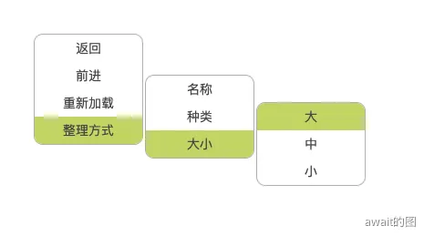

# 递归组件
递归组件，顾名思义，就是自己的内部实现又调用自己的组件。往往出现动态的多层级数据结构来构成组件时，就可以考虑设计递归组件了，直接看例子

## 递归组件设计多层级菜单
假设现在的菜单结构如下：
```js
const menu = [
  { name: "返回" },
  { name: "前进" },
  { name: "重新加载" },
  {
    name: "整理方式",
    children: [
      { name: "名称" },
      { name: "种类" },
      {
        name: "大小",
        children: [{ name: "大" }, { name: "中" }, { name: "小" }],
      },
    ],
  },
];
```
children属性就意味着需要创建一个子级菜单，接下来设计组件
```vue
<template>
  <div class="menu">
    <div class="menu-item" v-for="menuItem in menuData" :key="menuItem.name">
      {{ menuItem.name }}
      <div v-if="menuItem.children">
        <!-- 如果数据中存在children，那么在Menu组件中调用Menu组件，形成递归 -->
        <!-- 如果不是Vue setup语法糖 就要通过name显式声明这个组件名称 才能在组件中使用组件 -->
        <Menu
          :menuData="menuItem.children"
          :positionObject="positionObject(menuItem.name)"
          :level="props.level + 1"
          ></Menu>
      </div>
    </div>
  </div>
</template>

<script setup>
  import { computed, ref } from "vue";
  const props = defineProps({
    // menuData 菜单的数据结构
    menuData: {
      type: Array,
      default: [],
    },
    // 本次菜单生成的位置
    positionObject: {
      type: Object,
      default: {
        x: 0,
        y: 0,
      },
    },
    // 当前菜单属于什么层级
    level: {
      type: Number,
      default: 1,
    },
  });

  const positionX = ref(props.positionObject.x + "px");
  const positionY = ref(props.positionObject.y + "px");

  // 新的位置信息 通过计算的出
  const positionObject = computed(() => {
    return (name) => {
      let itemIndex = 0;
      for (let i = 0; i < props.menuData.length; i++) {
        if (props.menuData[i].name === name) {
          itemIndex = i;
          break;
        }
      }
      return {
        x: 122 * props.level + 40,
        y: parseInt(positionY.value) + itemIndex * 15,
      };
    };
  });
</script>

<style scoped lang="less">
  .menu {
    position: fixed;
    top: v-bind(positionY); // v-bind 动态修改css值
    left: v-bind(positionX);
    width: 120px;
    border: 1px solid #bdbdbd;
    border-radius: 10px;
    text-align: center;
    overflow: hidden;
    .menu-item {
      padding: 5px 0px;
      cursor: pointer;
      &:hover {
        background-color: #d4e157;
      }
    }
  }
</style>
```
在App.vue中引入这个组件，并且正确初始化
```vue
<template>
  <div>
    <Menu
      :menuData="menuData"
      :positionObject="positionObject"
      :level="1"
    ></Menu>
  </div>
</template>

<script setup>
import Menu from "./components/menu.vue";

const menuData = [
  { name: "返回" },
  { name: "前进" },
  { name: "重新加载" },
  {
    name: "整理方式",
    children: [
      { name: "名称" },
      { name: "种类" },
      {
        name: "大小",
        children: [{ name: "大" }, { name: "中" }, { name: "小" }],
      },
    ],
  },
];

const positionObject = {
  x: 40,
  y: 40,
};
</script>
```
实现效果如下：


:::tip
对于一些公共状态，如果每个递归组件都需要去维护这个公共状态，可以通过provide和inject去注入依赖
:::