# UV才是真神

UV你可以理解为是屏幕上的一类坐标，特称`UV坐标`

## UV坐标
从最基本的`Shader`主体开始吧😄

在Shader中，一个变量的值基本都是分布在`[0.,1.]`之间的，而现在的输入坐标的值远远地超过了它，那怎么办呢？我们需要将它给“归一化”，也就是将值缩小到`[0.,1.]`之间。

```glsl
void mainImage(out vec4 fragColor,in vec2 fragCoord){
    // iResolution.xy是坐标画布
    vec2 uv=fragCoord/iResolution.xy;
    fragColor=vec4(uv.x,uv.y,0,1);
}
```
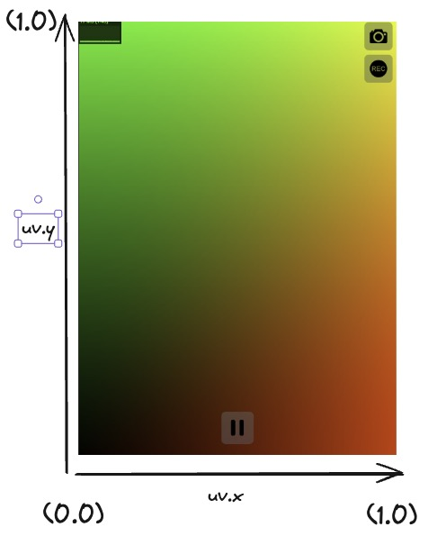

从整体上可以看到一个混合渐变的图案。这是因为左下角原点是黑色，值是`(0,0)`，右下角是红色，值是`(1,0)`，左上角是绿色，值是`(0,1)`，右上角是黄色，值是`(1,1)`，中间的所有值在`(0,0)`到`(1,1)`这 2 个区间分布。从整体上看，我们得到了一个有多种颜色的渐变图案。

这就是所谓的`uv`坐标，**代表了图像（这里指画布）上所有像素的归一化后的坐标位置，其中`U`代表水平方向，`V`代表垂直方向。**

## 绘圆
先说一下绘制圆形的总体思路：**先计算`UV`坐标上的点到原点的距离，然后根据这些距离的值来设定对应的颜色**

为了计算`UV`上点到原点的距离，我们可以用`GLSL`的内置函数——`length`函数来实现。

:::tip 关于原点
上面说过，因为左下角是原点，所以如果绘制圆最后只能得到一个只有右上方的圆。所以应该通过计算将原点移到中间：`uv=(uv-.5)*2`。
:::

这里解释一下为什么是`(uv-.5)*2`，这是因为我们直接移动的不是原点，而是原点所在的画布！你可以理解为移动的是**相机镜头**，也就是原点所在的视口，如下示意图：

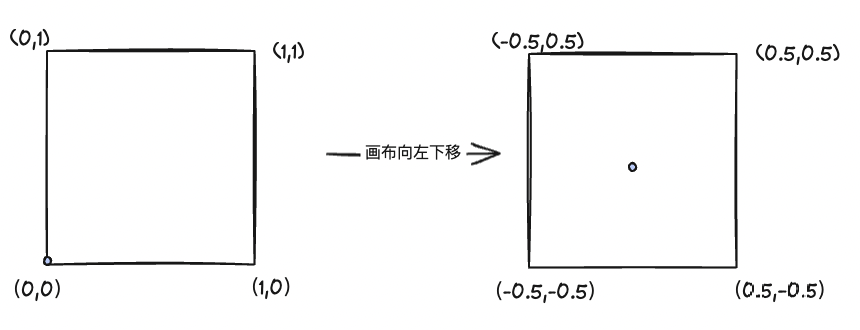

由于需要归一化，操作的点可能在`0.5`之外，所以最后`*2`,将画布缩小

```glsl
void mainImage(out vec4 fragColor,in vec2 fragCoord){
    vec2 uv=fragCoord/iResolution.xy;
    uv=(uv-.5)*2.;
    float d=length(uv);
    fragColor=vec4(vec3(d),1.);
}
```
在这里实际上会获得一个扩散的椭圆
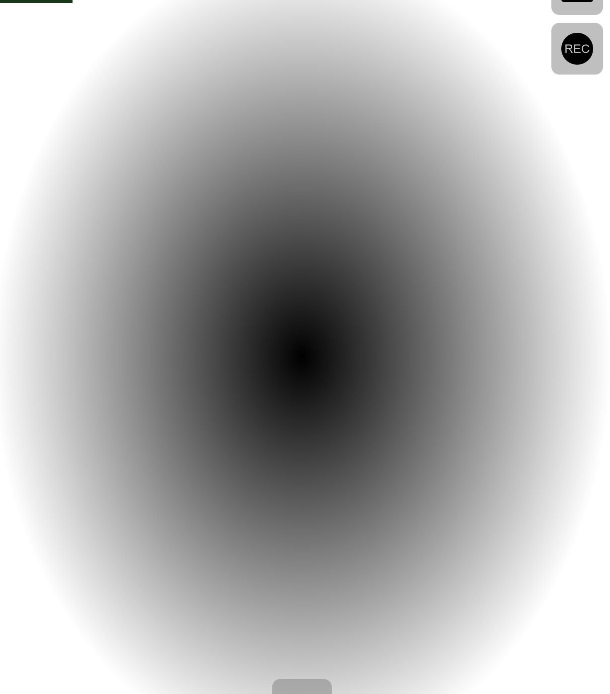

这是因为视图的长边和短边不一致，做法就是计算一下画布的比例，然后赋值给`UV`坐标即可,注意是用长边除以短边，我这里y是长边,x是短边

```
uv.y*=iResolution.y/iResolution.x;
```
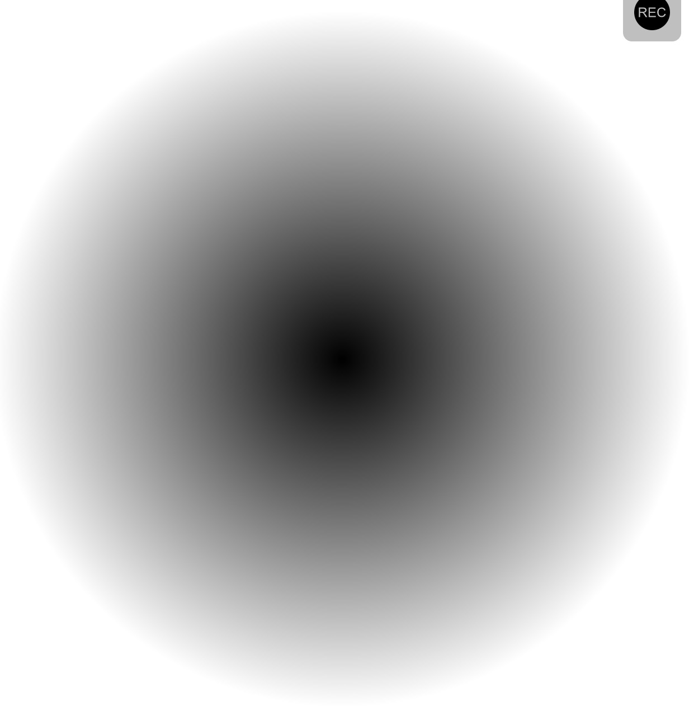

仔细观察上图，分析值的分布情况：中点的值是`(0,0)`，颜色是纯黑色，然而，从中间点开始向四周辐射这些区域时，它们的值开始大于0，就已经不再是纯黑色了。
:::tip 关于shader的冷知识
在`Shader`中，值的显示范围只会是`[0,1]`之间，也就是说，小于`0`的负数实际显示的是`0`,大于`1`的数实际显示的值是`1`。
:::
所以要想制造黑色，就可以通过计算出一片负数的区域。

思路如下：给距离`d`减去一个`0.5`，就可以得到一个半径为`0.5`的圆。大于`0`的取`1`，小于`0`的取`0`即可～，直接上代码

```glsl
void mainImage(out vec4 fragColor,in vec2 fragCoord){
    vec2 uv=fragCoord/iResolution.xy;
    uv=(uv-.5)*2.;
    uv.y*=iResolution.y/iResolution.x;
    float d=length(uv);
    d=d-.5;
    float color = 0.;
    if(d>0.){
        color = 1.;
    }else{
        color = 0.;
    }
    fragColor=vec4(vec3(color),1.);
}
```
然而，在Shader编写中，应该尽量避免去使用`if`语句，这是因为`GPU`是并行处理结果的，而`if`语句会让处理器进行分支切换这一操作，处理多个分支会降低并行处理的性能。

所以在这里可以通过一个`GLSL`内置的`step`函数去替代...

`step(edge,x)`函数又被称为**阶梯函数**，当输入值`x`大于`edge`值时返回`1`，反之返回`0`

```glsl
void mainImage(out vec4 fragColor,in vec2 fragCoord){
    vec2 uv=fragCoord/iResolution.xy;
    uv=(uv-.5)*2.;
    uv.y*=iResolution.y/iResolution.x;
    float d=length(uv);
    d=d-.5;
    float color=step(0.,d);
    fragColor=vec4(vec3(color),1.);
}
```
最后得到的圆如下

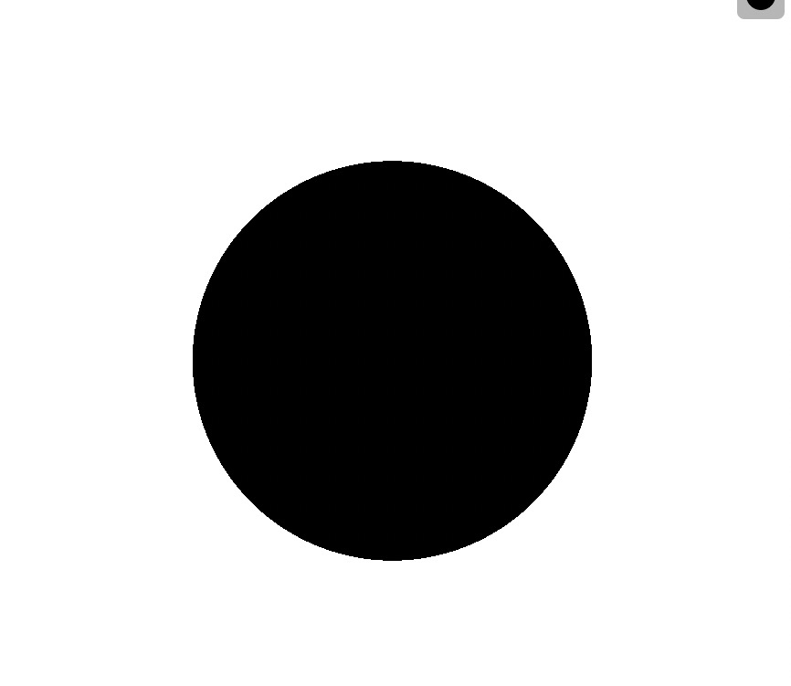

画出来的图像会发现有锯齿，这是因为`step`函数在`edge`发生了跳变**（0突然变成1）**，如果使用平滑过渡`smoothstep`函数就可以得到一个平滑的圆边界。

`smoothstep(edge1,edge2,x)`函数，当x不在`[edge1,edge2]`的区间时，小于`edge1`返回`0`，大于`edge2`返回`1`，如果在区间内，就是平滑的过渡值。

修改代码为，可以得到图片

```glsl
float color = smoothstep(0,0.02,d);
```
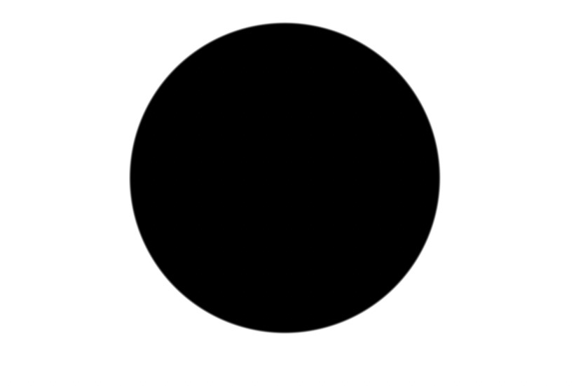

## 绘制一个光球
如果对`d`取倒数会怎么样？假如`float color = .25/d;`，可以得到一个反比例函数，如果离圆心越远，得到的值越趋于`.0`那么就会越黑，如果在`0.25`以内就为`1`了，也就会越亮。
这样就可以得到一个光球

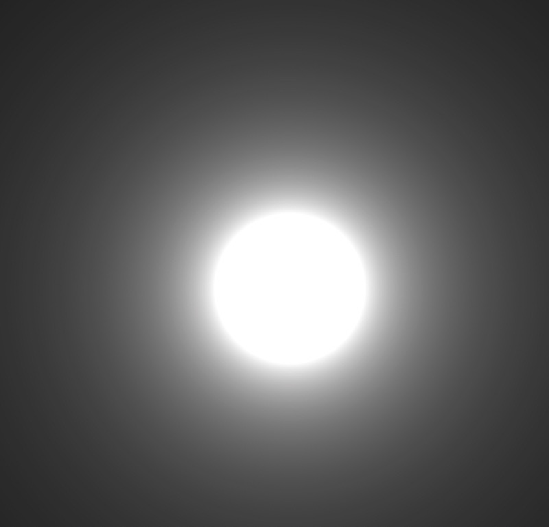

## SDF函数
在绘制圆形时，通过`smoothstep`绘制了一个比较平滑的圆
```glsl
float d=length(uv);
d-=.5;
```
如果可以的话，其实可以将其封装为一个函数，叫做`sdfCircle`
```glsl
float sdCircle(vec2 p,float r)
{
    return length(p)-r;
}

void mainImage(out vec4 fragColor,in vec2 fragCoord){
    vec2 uv=fragCoord/iResolution.xy;
    ...
    float d=sdCircle(uv,.5);
    ...
}
```
**`SDF`**，中文翻译为“**距离符号函数**”，它用于描述一个函数：它将空间里面的一个位置作为输入，并返回该位置到给定形状的距离，它的前面还有一个“符号”，这是因为在形状外的距离为正数+，在形状内的距离为负数-，边界处恰好为0。

:::info sdf大神！
图形学大神Inigo Quilez(简称iq)的博客上把常用的`2D`图像的`SDF`函数都列了出来，[点击我查阅😯](https://iquilezles.org/articles/distfunctions2d/)
:::

比如这就是个矩形的sdf函数！
```glsl
float sdBox(in vec2 p,in vec2 b)
{
    vec2 d=abs(p)-b;
    return length(max(d,0.))+min(max(d.x,d.y),0.);
}

void mainImage(out vec4 fragColor,in vec2 fragCoord){
    vec2 uv=fragCoord/iResolution.xy;
    uv=(uv-.5)*2.;
    uv.x*=iResolution.x/iResolution.y;

    float d=sdBox(uv,vec2(.6,.3));
    float c=smoothstep(0.,.02,d);
    fragColor=vec4(vec3(c),1.);
}
```
这就画出了一个长为`0.6`，宽为`0.3`的长方形。

比如这个是三角形的sdf函数
```glsl
float sdEquilateralTriangle(in vec2 p,in float r)
{
    const float k=sqrt(3.);
    p.x=abs(p.x)-r;
    p.y=p.y+r/k;
    if(p.x+k*p.y>0.)p=vec2(p.x-k*p.y,-k*p.x-p.y)/2.;
    p.x-=clamp(p.x,-2.*r,0.);
    return-length(p)*sign(p.y);
}
```
这里就不贴图啦，直接粘代码可以查看😁

## UV变换
基于这个长方形，我们可以做一些变换！
:::tip UV变换的小提示
记住这个2个点：
1.再次提示，移动的坐标其实是移动的画布视口（相机镜头）。
2.UV变换的代码需要写到SDF函数之前
:::

### 平移
```glsl
uv.x+=.2;
uv.y+=.4;
```
相当于视口向右移动`0.2`，向上移动`0.4`，所以矩形出现在左下方。

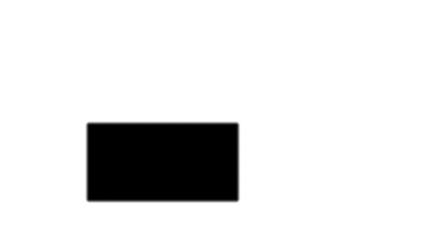

### 缩放
```glsl
uv *= vec2(2.,2.);
```
相当于放大的是视口大小，所以矩形会变小，就好像相机镜头向上抬了2倍的距离。
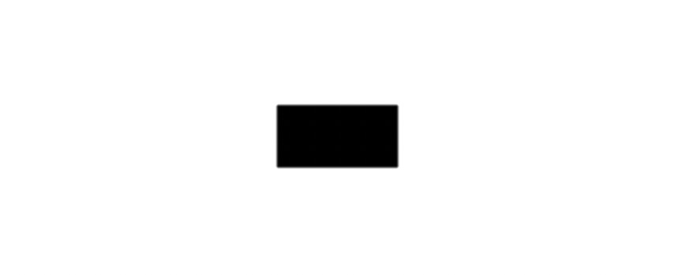

### 翻转
由于矩形是对称的图案，所以这里使用三角形的sdf函数进行演示

```glsl
float sdEquilateralTriangle(in vec2 p,in float r)
{
    const float k=sqrt(3.);
    p.x=abs(p.x)-r;
    p.y=p.y+r/k;
    if(p.x+k*p.y>0.)p=vec2(p.x-k*p.y,-k*p.x-p.y)/2.;
    p.x-=clamp(p.x,-2.*r,0.);
    return-length(p)*sign(p.y);
}

void mainImage(out vec4 fragColor,in vec2 fragCoord){
    vec2 uv=fragCoord/iResolution.xy;
    uv=(uv-.5)*2.;
    uv.x*=iResolution.x/iResolution.y;
    uv*=vec2(2.,2.);
    float d=sdEquilateralTriangle(uv,.3);
    float c=smoothstep(0.,.02,d);
    fragColor=vec4(vec3(c),1.);
}
```
如果按`x`轴翻转，给uv的`y`坐标乘`-1`即可。
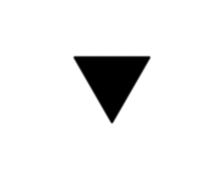

### 旋转
旋转操作实际上会更加复杂一样，这里封装好了现成的函数库[glsl-rotate](https://github.com/dmnsgn/glsl-rotate)可以直接使用，下面截取一段`2D`旋转相关的代码
```glsl
mat2 rotation2d(float angle){
    float s=sin(angle);
    float c=cos(angle);

    return mat2(
        c,-s,
        s,c
    );
}

vec2 rotate(vec2 v,float angle){
    return rotation2d(angle)*v;
}
```
因为旋转和角度有关，如果懂一点三角函数就可以知道，还需要一个`PI`，所以还需要设置一个`const float PI=3.14159265358;`，然后尝试让三角形进行一个顺时针旋转`90deg`
```
uv=rotate(uv,PI/2.);
```
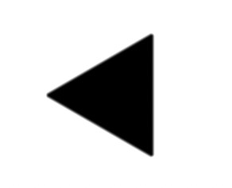

### 重复
像实现重复，就需要使用到一个新的内置函数`fract`，它的作用是获取一个数的小数部分。
比如`fract(114.514)`，返回的值就是`0.514`。

它之所以能实现重复就在于比如`(+1.3, +1.3)`,`(-1.3, +1.3)`,`(-1.3, -1.3)`,`(+1.3, -1.3)`这四个处在不同象限的点，通过`fract`函数都被处理成了一个点坐标`(0.3,0.3)`

比如下面的这段代码
```glsl
void mainImage(out vec4 fragColor,in vec2 fragCoord){
    vec2 uv=fragCoord/iResolution.xy;
    
    uv=fract(uv*vec2(2.,2.));
    
    uv=(uv-.5)*2.;
    uv.x*=iResolution.x/iResolution.y;
    uv*=vec2(2.,2.);
    
    float d=sdEquilateralTriangle(uv,.5);
    float c=smoothstep(0.,.02,d);
    fragColor=vec4(vec3(c),1.);
}


```
最后实现的效果如下
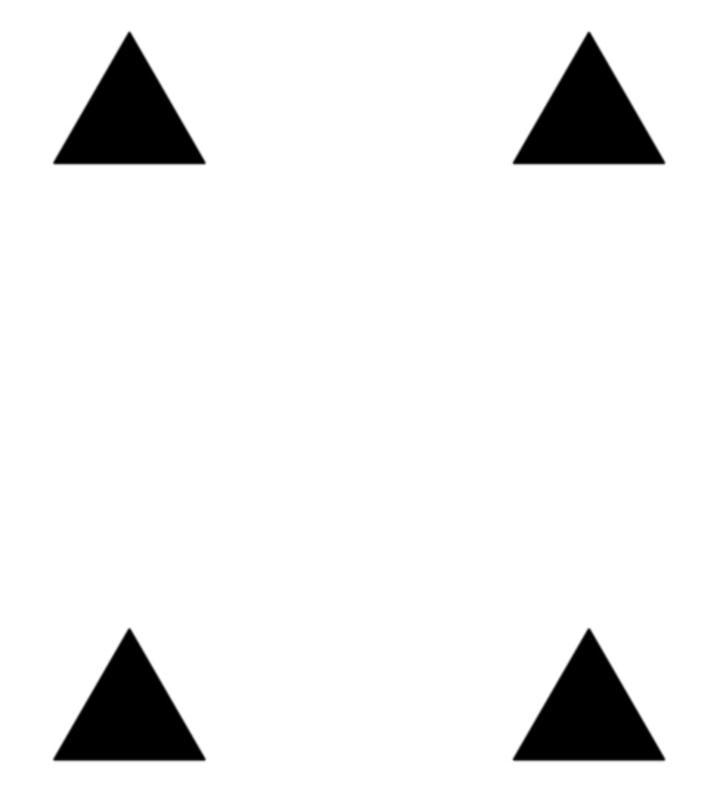

### 镜像
`abs`内置函数可以获取一个数的绝对值从而实现镜像，使用`uv.y=abs(uv.y)`实现关于x轴对称镜像，使用`uv.x=abs(uv.x)`实现关于y轴对称镜像。

代码如下：
```glsl
void mainImage(out vec4 fragColor,in vec2 fragCoord){
    vec2 uv=fragCoord/iResolution.xy;
    uv=(uv-.5)*2.;

    uv.y=abs(uv.y);
    
    uv.x*=iResolution.x/iResolution.y;
    uv*=vec2(2.,2.);
    
    float d=sdEquilateralTriangle(uv,.5);
    float c=smoothstep(0.,.02,d);
    fragColor=vec4(vec3(c),1.);
}
```
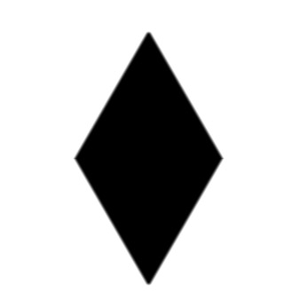

## SDF图形变换
除了UV以外，`SDF`本身的形状也是可以改变的，这些形变函数在`iq`的博客上也有提供，可以直接复制粘贴过来。

下面只给出一些代码和说明，不给具体图例，效果自己可以粘去看一下~

```glsl
float opRound(in float d,in float r)
{
    return d-r;
}
// 圆角
d = opRound(d,.1)


float opOnion(in float d,in float r)
{
    return abs(d)-r;
}
// 镂空
d = opOnion(d,.1)

```

## SDF 布尔运算
`SDF`函数本身能绘制出很多形状，但数量也是有限的，比如说你想画个星形，可以用这个形状所对应的函数sdStar来实现，但是如果要画一个笑脸的形状就比较困难了。但是只要把几个圆形和一条弯曲的曲线组合在一起，也能画出笑脸。

这就需要使用到`SDF`的三种运算方式：并`(Union)`，交`(Intersection)`，差`(Subtraction)`。

这三个函数我这边直接列举出来先：
```glsl
float opUnion(float d1,float d2)
{
    return min(d1,d2);
}

float opIntersection(float d1,float d2)
{
    return max(d1,d2);
}

float opSubtraction(float d1,float d2)
{
    return max(-d1,d2);
}

```