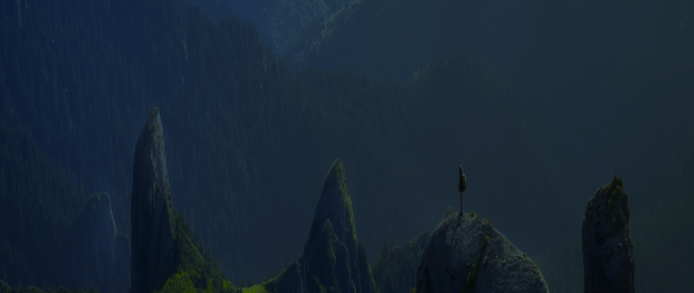
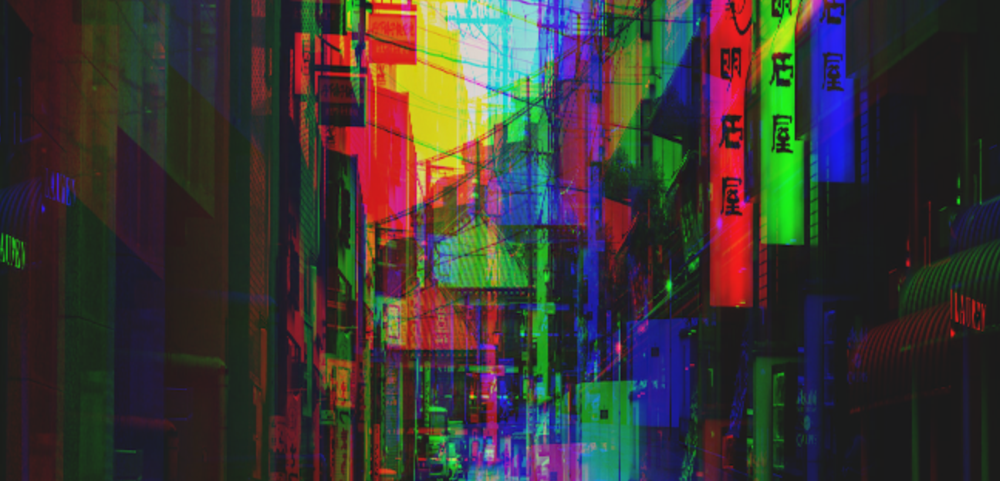
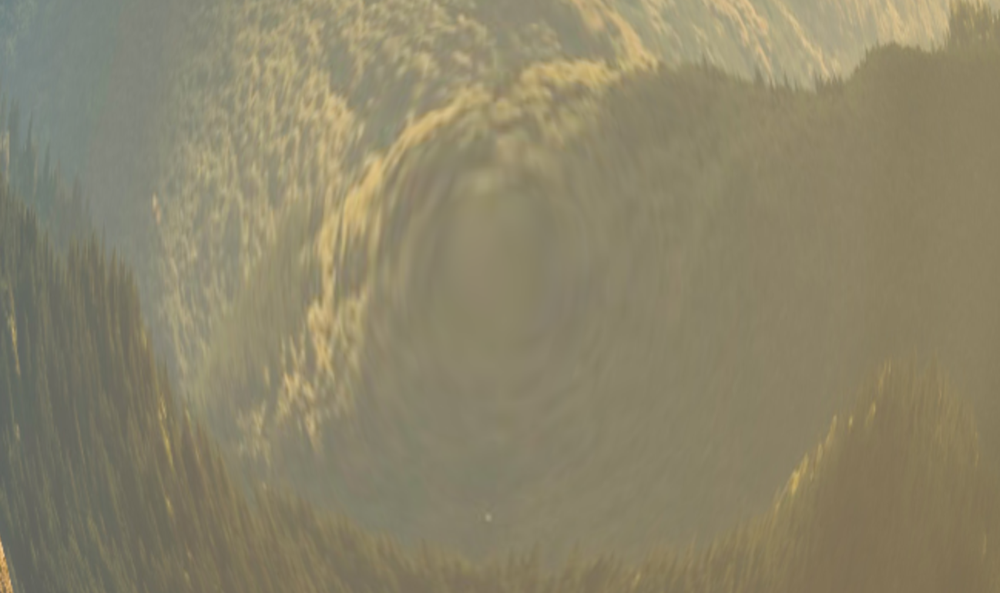
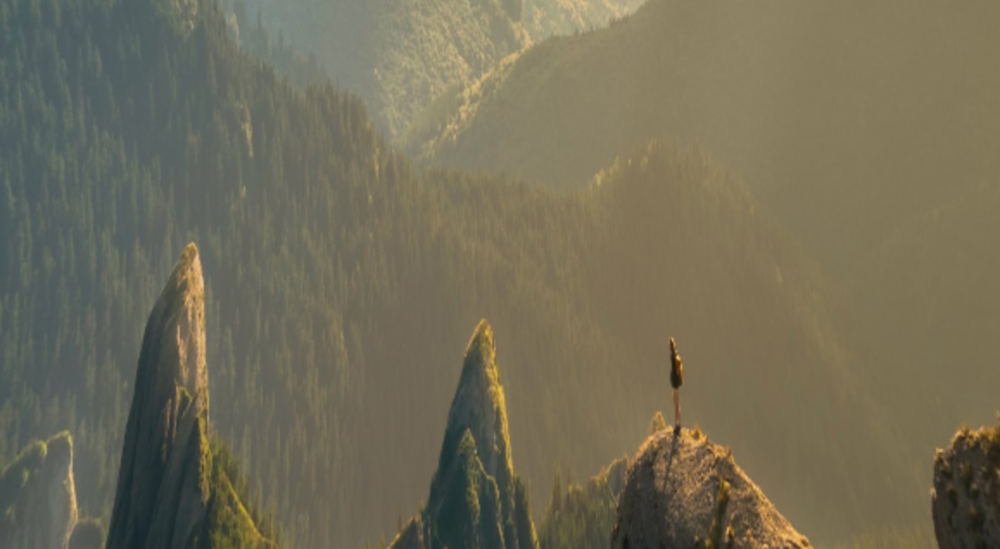
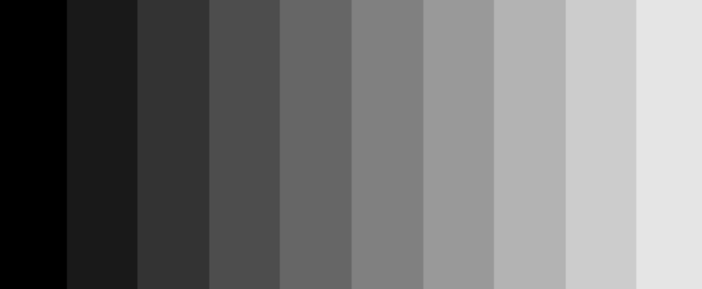
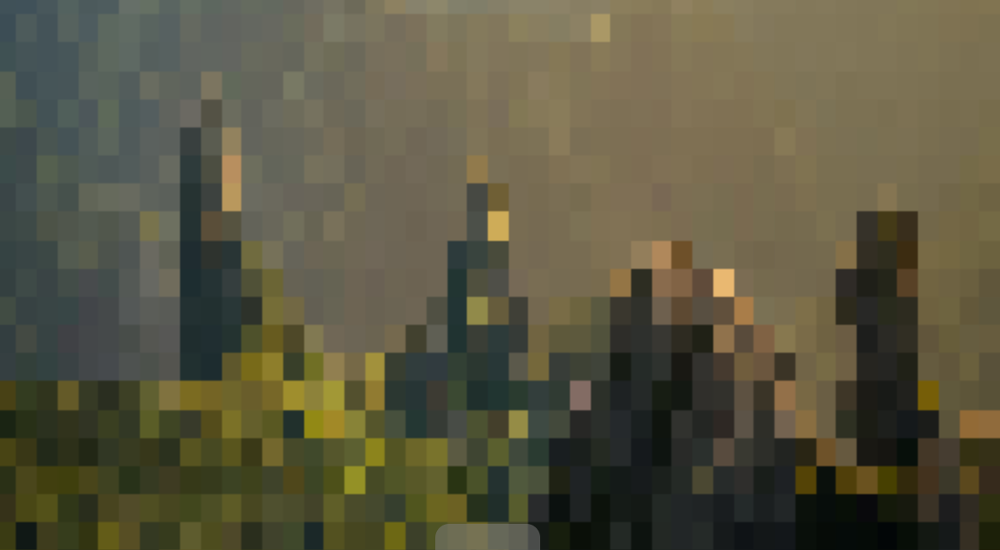
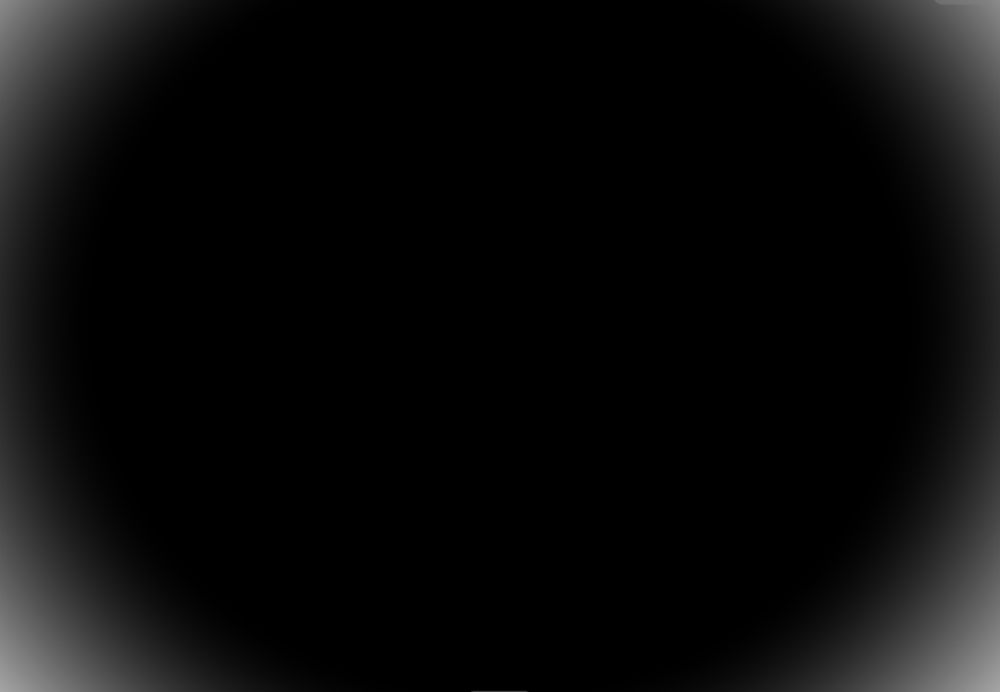
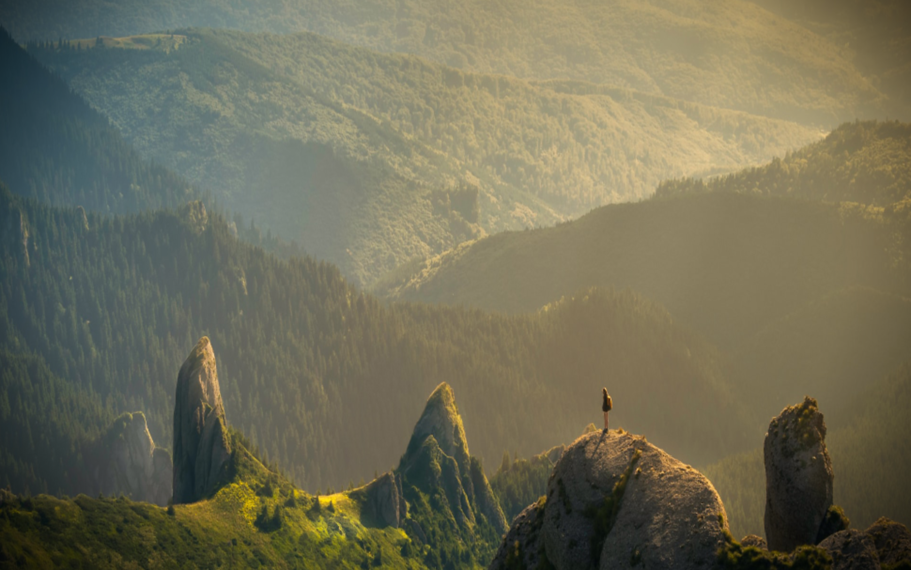

# 后期滤镜
**后期滤镜**，是在图像渲染之后，对其进一步的处理。用更加简单的说法就是“滤镜”。

如果有了解过`CSS`的小伙伴应该知道`filter`这个属性，里面有各种各样的滤镜，包括模糊，亮度，对比度，灰度，反转等。

和`CSS`不同的是，在Shader的世界中，并没有任何内置的滤镜函数可以使用，要实现那些滤镜效果，只能亲自动手去写出来。而且Shader能实现的滤镜效果比`CSS`滤镜，`SVG`滤镜，`Canvas`滤镜等要多得多。

## 启动模版
同样，新建一个`.glsl`文件，写下如下代码：
```glsl
#iChannel0 "https://s2.loli.net/2023/09/10/QozT59R6KsYmb3q.jpg"

void mainImage(out vec4 fragColor,in vec2 fragCoord){
    vec2 uv = fragCoord / iResolution.xy;
    vec3 tex = texture(iChannel0,uv).xyz;
    fragColor = vec4(tex,1.);
}
```
会发现渲染了一张图，和之前的文章**随机与噪声**的图一摸一样。

## 染色
实现的第一个简单滤镜，其实现也非常简单，直接给输出结果乘上要染上的颜色值即可。
```glsl
#iChannel0"https://s2.loli.net/2023/09/10/QozT59R6KsYmb3q.jpg"

void mainImage(out vec4 fragColor,in vec2 fragCoord){
    vec2 uv=fragCoord/iResolution.xy;
    vec3 tex=texture(iChannel0,uv).xyz;
    vec3 col=tex;
    vec3 tintColor=vec3(.220,.380,.651);
    col*=tintColor;
    fragColor=vec4(col,1.);
}
```

可以看出这是一个偏夜间的滤镜。

## RGB位移
利用rgb位移，可以做出类似抖音的`logo`：


抖音`logo`的中间是一个白色的音符，并且白色音符的两侧有青色和红色的投影，这2个投影其实是一种色调偏移效果的体现。

实现这种效果可以通过`RGB`的位移滤镜实现，将画面的3个颜色分量`R`,`G`,`B`进行一定的偏移，从而产生一种色差的效果。


也可以使用随机函数来进行改变图片滤镜：
```glsl
#iChannel0"https://s2.loli.net/2023/09/10/63quVIA9xZLksDc.jpg"

highp float random(vec2 co)
{
    highp float a=12.9898;
    highp float b=78.233;
    highp float c=43758.5453;
    highp float dt=dot(co.xy,vec2(a,b));
    highp float sn=mod(dt,3.14);
    return fract(sin(sn)*c);
}

void mainImage(out vec4 fragColor,in vec2 fragCoord){
    vec2 uv=fragCoord/iResolution.xy;
    vec2 rUv=uv;
    vec2 gUv=uv;
    vec2 bUv=uv;

    float noise = random(uv)*.5 + .5;
    vec2 offset = .05*vec2(cos(noise),sin(noise));
    
    rUv+=offset;
    bUv-=offset;
    
    vec4 rTex=texture(iChannel0,rUv);
    vec4 gTex=texture(iChannel0,gUv);
    vec4 bTex=texture(iChannel0,bUv);
    
    vec4 col=vec4(rTex.r,gTex.g,bTex.b,gTex.a);
    fragColor=col;
}
```
复制这段代码，可以得到一个微妙的，带噪点的`RGB`唯一滤镜的效果。

## 膨胀
在Shader中，可以通过代码来实现膨胀效果，创建膨胀函数`bulge`。
```
vec2 bulge(vec2 p){
    return p;
}
```
在主函数`mainImage`中应用膨胀函数`bulge`。
```glsl
void mainImage(out vec4 fragColor,in vec2 fragCoord){
    vec2 uv=fragCoord/iResolution.xy;
    uv=bulge(uv);
    vec3 tex=texture(iChannel0,uv).xyz;
    fragColor=vec4(tex,1.);
}
```
接下来开始编写膨胀函数`bulge`。用`length`函数计算uv上每个点到原点的距离，与uv相乘。
```glsl
void mainImage(out vec4 fragColor,in vec2 fragCoord){
    vec2 uv=fragCoord/iResolution.xy;
    uv=bulge(uv);
    float d=length(uv);
    uv*=d;
    vec3 tex=texture(iChannel0,uv).xyz;
    fragColor=vec4(tex,1.);
}
```
可以发现，膨胀的位置不对，这是因为膨胀的圆心不在画布的正中心
```glsl
vec2 center = vec2(.5);
```

可以在调用`length`函数之前，先给uv减去这个中点，然后调用后再加回去
```glsl
uv -= center;

float d = length(p);
p*=d;

p+=center;
```


可以看出这是向外膨胀，实际上也可以实现向内坍缩的效果。只需要给uv乘上距离的倒数即可
```
void mainImage(out vec4 fragColor,in vec2 fragCoord){
    vec2 uv=fragCoord/iResolution.xy;
    uv=bulge(uv);
    vec2 center=vec2(.5);
    uv-=center;
    // 向内坍缩
    float d=length(uv);
    float dPow=pow(d,2.);
    float dRev = 1./(dPow+1.);
    uv*=dRev;
    uv+=center;
    vec3 tex=texture(iChannel0,uv).xyz;
    fragColor=vec4(tex,1.);
}
```


如此就可以实现内凹的效果

## 像素化
像素化类似于能将图片，视频等媒体的特定区域变成一坨方块，起到遮挡敏感信息的作用。

在Shader中，有一个新的内置函数`floor`，这个函数的作用在于向下取整，比如
`floor(114.514)`就等于`114.`。

直接输出uv坐标
```glsl
void mainImage(out vec4 fragColor,in vec2 fragCoord){
    vec2 uv=fragCoord/iResolution.xy;
    float c = uv.x;
    c = floor(c*10.)/10.;
    fragColor = vec4(vec3(c),1.);
}
```
可以得到这样的背景图

当`x`坐标于`(0.,0.09)`时，`x*10`的值域为`(0.,0.9)`，而`floor`函数向下取整，因此`floor(x*10)`的值是`0`，除以`10`后还是`0`；但当`x`坐标位于`0.1`时，`x*10`就变成了`1`，向下取整的结果就从`0`变成了`1`，除以`10`后就变成了`0.1`；后面的范围的值会以步长`0.1`递增，公式总体是阶梯的形状。

理解这个公式含义之后，先对原先的纹理采样。
```glsl
    vec2 uv=fragCoord/iResolution.xy;
    vec3 tex=texture(iChannel0,uv).xyz;
    fragColor=vec4(tex,1.);
```
在采样之前，定义好像素化的大小`size`（这里取50*50），也就是上文中的`10`，对uv的`xy`轴分别应用`floor`函数。
```glsl
void mainImage(out vec4 fragColor,in vec2 fragCoord){
    vec2 uv=fragCoord/iResolution.xy;
    vec2 size=vec2(50.,50.);
    uv.x=floor(uv.x*size.x)/size.x;
    uv.y=floor(uv.y*size.y)/size.y;
    vec3 tex=texture(iChannel0,uv).xyz;
    fragColor=vec4(tex,1.);
}
```
最后可以得到一张像素化的照片，有点我的世界的感觉了😁


## 晕影
有的时候可以得到一张滤镜，照片的四周有一层淡淡的阴影，会感觉非常酷，这是摄影学的一个专业名称 ———— “晕影”。

为了更好的实现这个效果，将画面变为纯白色

```glsl
vec3 col=vec3(1.);

fragColor=vec4(col,1.);
```
接着创建一个圆形渐变，而且这个效果需要拉伸覆盖至整个画面，因此无需进行画布比例的修正。
```glsl
void mainImage(out vec4 fragColor,in vec2 fragCoord){
    vec2 uv = fragCoord / iResolution.xy;
    vec3 col = vec3(1.);

    vec2 p = uv;
    p -= .5;
    float d = length(p);
    col = vec3(d);

    fragColor = vec4(col,1.);
}
```
看到径向渐变后，注释掉`col=vec3(d);`,用`smoothstep`函数来将这个渐变“拉伸”到画面的四个边界，而且2个边界值的差稍微大点，能营造一种模糊的效果。

```glsl
float c = smoothstep(.4,.8,d);
col = vec3(c);
```

接下来的一步非常关键：将渐变反转过来，就可以得到四周遮罩了。
```glsl
float c=smoothstep(.8,.4,d);
```
最后就可以得到这样一个晕影滤镜的效果：
