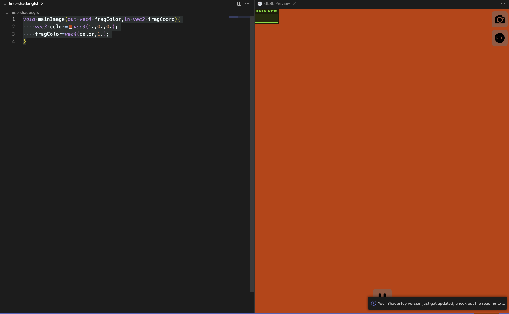
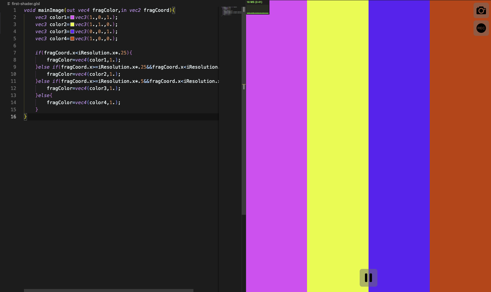

# 相信Shader！
在正式入门Shader之前，请先准备好以下的几类工具！

## Shader开发环境集成
Shader的开发环境主要有 2 种：网站和编辑器。选哪一种其实都可以，但我个人偏向于用编辑器进行开发。

网站编辑器：[shader的网站编辑器](https://www.shadertoy.com/) 😅需要翻墙哦～

我反正使用的是VsCode，因为需要额外安装一些插件来辅助Shader的开发。

- Shader 语言支持
保证我们的Shader文件的代码需要有完整的高亮支持。在插件商场中搜索[Shader languages support for VS Code](https://marketplace.visualstudio.com/items?itemName=slevesque.shader)
- Shader 实时预览
这个可以保证能够实时预览Shader的渲染结果。插件商场中搜索[Shader Toy](https://marketplace.visualstudio.com/items?itemName=stevensona.shader-toy)
- HTML 实时预览
在后面笔记里，我们将会把Shader代码直接作为字符串写入html文件，因此需要一个能直接预览html文件渲染结果的插件。[Live Preview](https://marketplace.visualstudio.com/items?itemName=ms-vscode.live-server)

OK，这三个就是最重要的了，还有一些可选的插件，可以自己去插件商场中进行检索安装～😘

---

## 实现第一个Shader
创建一个文件名为`first-shader.glsl`文件。

编写Shader主体。

```glsl
void mainImage(out vec4 fragColor,in vec2 fragCoord){
    
}
```
其中，`fragColor`是一个四维向量，它代表了画布中点的颜色。而`fragCoord`是一个二维变量，它代表了画布中的点的坐标。

:::tip 小提示
从这篇笔记到《顶点着色器》笔记之前，都是在Shadertoy的环境下进行的，主函数main需写成mainImage，输出颜色gl_FragColor需写成fragColor，输入坐标gl_FragCoord需写成fragCoord，顶点着色器时会改变写法。
:::

OK，现在直接向屏幕随便输出一个红色
```glsl
void mainImage(out vec4 fragColor,in vec2 fragCoord){
    vec3 color = vec3(1.,0.,0.);
    fragColor = vec4(color,1.);   
}
```
这里定义了一个名为`color`的 3 维变量，要将它的值设置为红色，红色的`RGB`颜色值为`(255,0,0)`，在GLSL中，我们需要先将颜色原先的值进行归一化操作（除以`255`）后才能将它正确地输出，因此将红色的值归一化后我们就得到了`(1,0,0)`这个值，将它转换为 3 维变量`vec3(1.,0.,0.)`赋给`color`变量。最后我们给输出颜色`fragColor`赋值一个 4 维变量，前 3 维就是`color`这个颜色变量，最后一维是透明度，由于纯红色并不透明，直接将其设为 1 即可。

按下`Ctrl+Shift+P`，输入`Shader Toy: Show GLSL Preview`，点击即可预览我们的结果，如果一切顺利的话，你应该能看到画面是一片红色。



现在来尝试一次性输出四种变量颜色
```glsl
vec3 color1=vec3(1.,0.,1.);
vec3 color2=vec3(1.,1.,0.);
vec3 color3=vec3(0.,0.,1.);
vec3 color4=vec3(1.,0.,0.);
```
这里我们就要用到`fragCoord`变量了，它代表了输入的像素坐标，有 2 个维度`xy`，它们的大小取决于画面本身的大小。假设我们画面当前的大小为`1536x864`，那么每一个像素的`fragCoord`的x坐标值将会分布在`(0,1536)`之间，y坐标值则分布在`(0,864)`之间。

在当前的Shader开发环境内，还有个内置的变量`iResolution`，代表了画面整体的大小，使用它时一般会取它的xy维度。

```glsl
if(fragCoord.x<iResolution.x*.25){
    fragColor=vec4(color1,1.);
}else if(fragCoord.x>=iResolution.x*.25&&fragCoord.x<iResolution.x*.5){
    fragColor=vec4(color2,1.);
}else if(fragCoord.x>=iResolution.x*.5&&fragCoord.x<iResolution.x*.75){
    fragColor=vec4(color3,1.);
}else{
    fragColor=vec4(color4,1.);
}
```


大功告成！🌹这就是Shader的一个核心：**根据像素的坐标来计算出对应的颜色！**